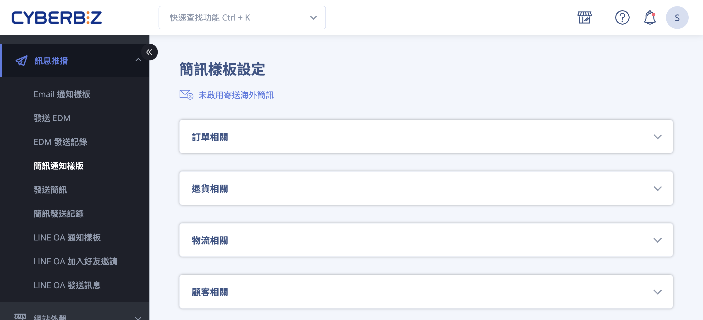
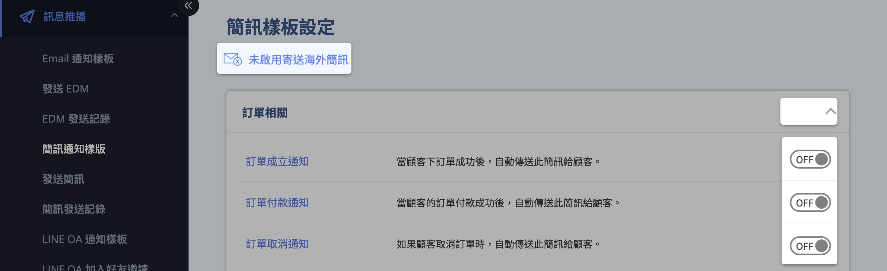
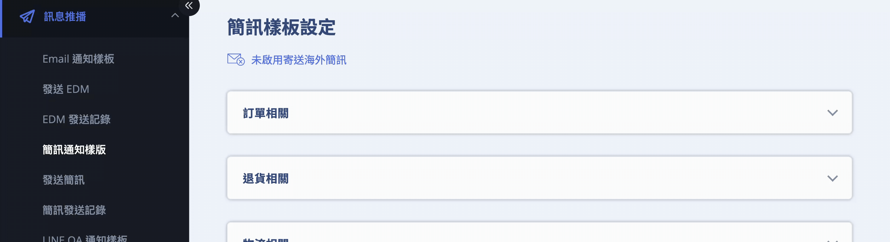

# 設定與管理簡訊通知樣板

設定與管理簡訊通知樣板，包含樣板編輯規則、計費機制、阻擋風險與實際應用情境。
{ .subtitle }

{ .hero-page }

## 簡訊通知樣板說明

**簡訊通知樣板管理** 功能允許商家在特定情境下（如訂單成立、貨物到店或會員註冊），自動發送預設的簡訊通知給顧客，以提升服務效率與顧客體驗。

!!! warning "預防簡訊阻擋（過濾機制）"

	為避免被電信商判定為廣告或釣魚訊息而遭攔截（遭攔截仍會扣費），樣板內容應 **避免使用以下關鍵字**：

	- 「LINE」、「加賴」、「連結」、「點擊連結」、「股票」、「領取」、「點擊領取」等字眼。

以下為簡訊通知樣板的詳細操作說明與管理教學：

## 進入路徑與介面概觀

- **後台路徑**：進入管理後台，點選 **訊息推播 > 簡訊通知樣板**。

- **介面功能介紹**：

	- **樣板分類**：系統將簡訊依情境分為訂單相關、退貨相關、物流相關、顧客相關、訊息相關、POS 相關、定期訂單、電子票券及其他。

	- **開關功能**：每個樣板右側皆有 **ON/OFF 開關**，商家可自行決定是否啟用該項提醒。

	- **海外簡訊服務**：點擊 **寄送海外簡訊** 功能選項可開啟或關閉發送至國外門號的功能（費用較高，每封扣除 **5 點 CYBER 幣**）。

!!! info "實際可操作的信件分類與樣板會因 方案 或 功能設定 而異。"

## 修改簡訊內容步驟

1. 在列表中點擊想要修改的 **簡訊標題** 進入編輯頁面。

2. **內容編輯注意事項**：

	- **系統參數限制**：內文中含有 **{{ }}** 的標籤（如 `{{shop_name}}`、`{{order_number}}`）會自動代入系統資料，**請勿隨意更動其拼法或格式**，可能導致簡訊無法發送。

	- **符號限制**：編輯內文時請 **勿使用 emoji 表情符號** 或其他特殊符號，以免顯示異常。

3. 編輯完成後，點擊 **儲存** 即可立即套用。

## 簡訊計費與字數規範

- **字數上限**：國內簡訊每封文字上限為 **70 個字**（包含空白、換行、標點符號及網址）。

- **分封計費**：若內容超過 70 字，系統會自動拆分為多封寄送，並按封數累計扣費。

- **點數扣除**：國內簡訊發送一封扣除 **1 點 CYBER 幣**。

- **儲值需求**：除了 PLUS版 / 企業版 用戶外，一般版 商家須預先至「**儲值中心**」存入 CYBER 幣；若點數不足，簡訊將無法發送。

## 重要應用情境舉例

- **貨物到店通知**：當超商取貨訂單轉為「已到店」時，系統會自動發送簡訊。

	- **7-11**：到店第 1 天及第 4 天發送。

	- **全家**：到店第 1 天及第 3 天發送。
	
	- **黑貓快速到店**：到店第 1 天。

	!!! info "支援物流清單"
		本功能支援以下物流渠道之到店通知：
	
		- **綠界科技**：7-11 / 全家 (FamilyMart)。
	    
		- **CYBERBIZ 串接 (B2C/C2C)**：7-11、全家、萊爾富 (Hi-Life)。
	    
		- **低溫/冷凍物流**：全家冷凍、萊爾富冷凍、黑貓快速到店（常溫/冷藏/冷凍）。
		
- **未付款提醒**：可設定在顧客下單後特定天數發送簡訊提醒，若顧客已完成付款則自動停止提醒。

- **帳號啟用通知**：若商家開啟手機驗證，會員註冊時會收到包含驗證連結的簡訊。

## 常見問題

??? quote "為什麼我的簡訊內容不長，卻被扣了兩封的費用" 
	簡訊計費是以 **70 個字** 為單位。請注意，系統代入的參數（如 `{{order_number}}`）在實際發送時會替換為真實編號，若該編號較長導致總字數超過 70 字（含空白與網址），系統將自動拆分為兩封發送並加倍扣費。

??? quote "顧客反應沒有收到「貨物到店」簡訊，該如何排查"

	1. **檢查餘額**：確認後台「儲值中心」的 CYBER 幣是否充足。
	2. **檢查物流狀態**：僅當物流狀態轉為「已到店」時才會觸發；若為跨境或非支援物流則不適用。
	3. **確認內容標籤**：檢查樣板是否誤用了 emoji 或毀損了 `{{ }}` 參數格式。
	4. **阻擋機制**：顧客手機是否安裝過濾軟體（如 Whoscall），或內容是否包含「LINE」、「連結」等關鍵字而被電信商攔截。
  
??? quote "我可以針對國外顧客發送簡訊嗎" 
	可以。您需要進入簡訊樣板介面，開啟 **寄送海外簡訊** 功能。需注意海外簡訊費率較高，每封將扣除 **5 點 CYBER 幣**。

??? quote "修改簡訊樣板後，已經產生的訂單會適用新樣板嗎" 
	會的。簡訊通知是在「觸發條件達成（如狀態更動）」的當下，抓取當前最新的樣板內容進行發送。因此儲存變更後，後續發出的通知皆會套用新內容。