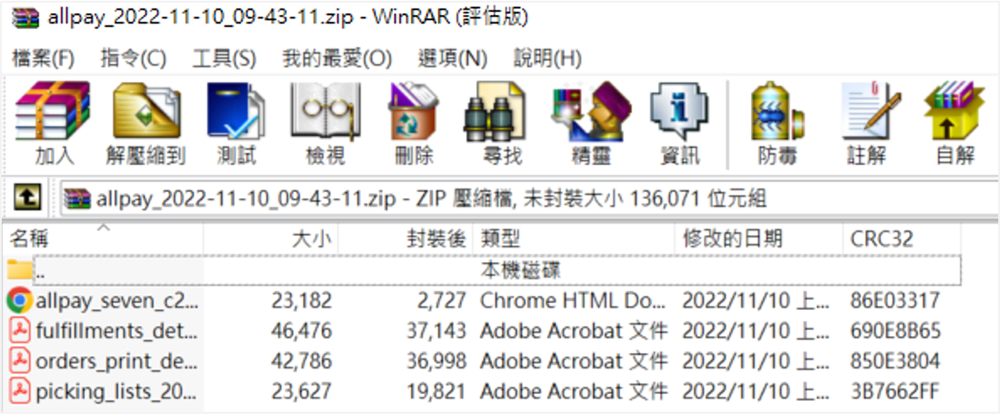

<!-- { .hero-page } -->

## 訂單出貨介紹 { #intro-fulfillment }

出貨是訂單成立、確認收款後的核心環節。在訂單列表，您可以勾選訂單後一次完成「產生託運單」與「更新配送狀態」兩件事，大幅縮短逐筆處理的時間。

依照配送方式不同，出貨主要分為三大類：

- **系統串接物流：** 黑貓、超商取貨、宅配通、新竹物流、順豐等，由系統自動向物流商取號並產生託運單。
- **自訂物流：** 您自行配送或與合作貨運出貨，手動標示出貨並填寫託運單號。
- **倉儲出貨：** 已串接[智慧倉儲(峰潮)](../../../wms/){ title="hide:" }的訂單，由倉庫端負責揀貨與出貨。

無論勾選一筆或多筆，新版訂單列表的出貨入口都相同，差別只在於您一次處理的訂單數量。

---

## 頁面功能總覽 { #overview-fulfillment }

| 出貨入口 | 位置 | 用途 |
| :-- | :-- | :-- |
| 單筆 / 批次出貨 | 訂單列表的「更多操作」 | 勾選訂單後選擇物流，產生託運單並將配送狀態改為「已出貨」 |
| 大量匯入自訂物流託運單號 | 訂單列表上方工具 | 以 Excel 一次匯入自訂物流的託運單號 |
| 逐項 / 部分出貨 | 訂單詳情頁的「出貨」區塊 | 同一筆訂單先寄出部分有現貨的商品 |

---

## 使用前提與限制 { #prerequisites-fulfillment }

正式出貨前，請先確認以下準備事項：

- [x] **Cyber幣 餘額：** 系統串接物流的運費由系統代收，出貨前請確認餘額充足[^billing]。
- [x] **寄件人地址：** 至「管理中心/一般設定」設定「公司物流地址」，否則產出的託運單寄件人資訊將不完整。
- [x] **印表機與耗材：** 建議使用雷射印表機，並備妥 A4 紙與託運單 / 超商標籤貼紙，以確保條碼清晰可判讀。

部分物流與出貨功能屬於加值或方案內建功能，是否可用會依您的方案而定：

??? plan "出貨相關功能與方案"
    | 功能 | 開通方案 |
    | :-- | :-- |
    | 宅配通託運單 | 多數付費方案皆內建 |
    | 順豐海外 / LINEX 跨境物流 | 企業版與跨境方案 |
    | 運費對帳單(對帳中心) | PLUS版、企業版等較高階方案 |
    | 超商託運單熱感印 | PLUS版、企業版 |

    實際開通內容請以您的方案為準。

[^billing]: 一般版於下載託運單時即時預扣 Cyber幣；具備對帳中心的方案(PLUS版、企業版)則改為列入對帳單，於帳期結算。

---

## 計費規則 { #pricing-fulfillment }

系統串接物流(黑貓、超商取貨、宅配通、新竹物流、順豐等)的運費由系統代收，自訂物流則由您與物流商自行結算，不經過系統。

在出貨視窗中，您可以查看 **「運費收費表」** 了解各材積的費率。實際收取的金額會依您出貨給物流商的材積而定，並非固定金額。

- **一般版：** 下載託運單時即時預扣 Cyber幣。
- **具備對帳中心的方案：** 運費列入對帳單，於帳期結算，出貨當下不扣款。

<!--各物流商的費率明細，可參考 [黑貓託運單規格與費用對照表](../../payments-and-logistics/references/tcat-delivery-rate-card.md){ title="黑貓宅配託運單規格與費用對照表" data-preview }。-->

---

## 操作步驟 { #operate-fulfillment }

新版訂單列表的出貨統一從訂單列表勾選訂單後操作。 **勾選一筆即為單筆出貨，勾選多筆即為批次出貨**，兩者流程相同。

!!! tip "技巧"
    批次出貨時，建議一次只勾選 **相同配送方式** 的訂單(例如全部為黑貓，或全部為 7-11)，系統才能用同一個動作完成整批出貨。

### 系統串接物流出貨 { #operate-fulfillment-carrier }

系統串接物流會自動向物流商取號並產生託運單。以下以黑貓為例，其他物流商(超商、宅配通、新竹物流、順豐等)操作方式基本相同：

1. **進入訂單列表：** 前往後台「訂單」>「所有訂單」。
2. **勾選訂單：** 在列表勾選欲出貨的訂單。
3. **選擇出貨動作：** 點擊上方 **「更多操作」**，選擇 **「下載黑貓託運單並將貨態改為『已出貨』」**。
4. **確認運費標準：** 在彈出視窗選擇運費計算標準，可查看 **「運費收費表」**，確認後點擊確認下載。
5. **下載並列印託運單：** 系統在背景產生 **託運單壓縮檔（ZIP）** 並自動下載，該批訂單的配送狀態同步更新為「已出貨」。解壓縮後即可列印託運單與明細（詳見 [託運單壓縮檔內容](#operate-fulfillment-zip)）。

<div class="grid cards" markdown>

- :lucide-cat: [**黑貓宅配**](../home-delivery/tcat-home-delivery.md){ title="使用黑貓宅配出貨" }
- :lucide-bird: [**宅配通**](../home-delivery/pelican-shipping.md){ title="使用宅配通出貨" }
- :lucide-truck: [**新竹物流**](../home-delivery/hct-shipping.md){ title="使用新竹物流出貨" }
- :lucide-box: [**順豐速運**](../home-delivery/sf-express-shipping.md){ title="使用順豐出貨" }

</div>

---

### 超商出貨 { #operate-fulfillment-cvs }

超商取貨屬於系統串接物流，出貨流程與[系統串接物流出貨](#operate-fulfillment-carrier)相同：勾選訂單 >「更多操作」> 選擇對應的超商出貨動作 > 產生託運單壓縮檔並將配送狀態改為「已出貨」。

<div class="grid cards" markdown>

- :lucide-store: [**超商 C2C 出貨教學**](../cvs-shipping/cvs-c2c-shipping.md){ title="操作超商店到店 C2C 出貨" }
- :lucide-factory: [**B2C 大宗寄倉**](../cvs-shipping/cvs-b2c-bulk-shipping.md){ title="使用超商大宗寄倉（B2C）出貨" }
- :lucide-snowflake: [**全家冷凍店到店**](../cvs-shipping/family-mart-frozen-c2c.md){ title="操作全家冷凍店到店 C2C 出貨" }

</div>

!!! tip "批次出貨請勾選同一種超商類型"
    超商的 B2C、C2C、冷鏈是不同的出貨動作。批次出貨時，請一次只勾選 **同一家超商、同一種類型** 的訂單（例如全部為「7-11 取貨付款」），系統才能用同一個動作完成整批出貨。

---

### 自訂物流出貨 { #operate-fulfillment-custom }

若使用未與系統串接的物流(自行配送或合作貨運)，改用自訂物流標示出貨：

1. **勾選訂單：** 在訂單列表勾選要出貨的訂單。
2. **開啟出貨視窗：** 點擊 **「更多操作」**，選擇自訂物流的出貨選項。
3. **選擇貨運公司：** 在 **「請選擇貨運公司」** 選單挑選物流商。
4. **確認出貨：** 可勾選 **「發送郵件通知顧客」**，確認後該訂單配送狀態轉為「已出貨」。

<div class="grid cards" markdown>

- :lucide-truck: [**自訂物流出貨教學**](../home-delivery/custom-logistic-shipping.md){ title="如何使用自訂物流出貨" }

</div>

訂單量大時，建議改用下方的「大量匯入自訂物流託運單號」一次帶入單號。

---

### 大量匯入自訂物流託運單號 { #operate-fulfillment-import }

有大量自訂物流訂單時，可用 Excel 一次匯入託運單號：

1. **開啟匯入工具：** 在訂單列表上方開啟 **「大量匯入自訂物流託運單號」**。
2. **下載並填寫範本：** 下載 Excel 範本，填入訂單編號、託運單號與物流商。
3. **上傳檔案：** 上傳後，匯入成功的訂單配送狀態會自動轉為「已出貨」並發信通知消費者[^import-partial]。

<div class="grid cards" markdown>

- :lucide-file-spreadsheet: [**大量匯入自訂物流單號教學**](../home-delivery/custom-logistic-shipping.md#excel-bulk-import){ title="如何使用自訂物流出貨" }

</div>

[^import-partial]: 大量匯入僅支援整筆全部出貨，不支援部分出貨。

---

### 逐項與部分出貨 { #operate-fulfillment-partial }

若一筆訂單只想先寄出部分有現貨的商品，需在訂單詳情頁的「出貨」區塊逐項勾選，而非在列表批次出貨。詳細流程請見 [訂單部分出貨](../home-delivery/partial-shipment.md){ title="設定訂單部分出貨" }。

---

## 託運單壓縮檔 { #operate-fulfillment-zip }

系統串接物流的託運單並非單一 PDF，而是由系統在背景產生後， **打包成一個壓縮檔（ZIP）自動下載**。壓縮檔會以物流商命名（例如黑貓為 `ezcat`、7-11 為 `seven`、全家為 `family`），方便您一次取得整批出貨所需的文件。

解壓縮後，檔案內通常包含：

| 文件 | 用途 |
| :-- | :-- |
| 託運單 | 黏貼於包裹的物流標籤 / 條碼 |
| 出貨明細 | 隨包裹附上的出貨內容清單 |
| 揀貨單 | 倉庫揀貨備貨用 |
| 訂單明細 | 該批訂單的明細列印檔 |


??? example "壓縮檔內容範例"
    { title="託運單壓縮檔內容" }

!!! info "為什麼是壓縮檔"
    批次出貨可能一次涵蓋多筆訂單與多份文件，系統統一打包成 ZIP，避免逐筆、逐份分開下載。下載完成後請先解壓縮，再列印所需的託運單與明細。

<!---

!!! tip "改用 Email 收取壓縮檔"
    若批次數量較大或不便當下下載，部分情境支援將託運單壓縮檔以附件（`託運單.zip`）寄送到指定信箱，您可改從信件中取得。

-->

!!! tip "**黑貓專屬：** 下載黑貓託運單壓縮檔的同時，系統會一併送出 **[叫車（司機收件）](../home-delivery/tcat-auto-call-driver.md){ title="自動呼叫黑貓司機取件" }** 需求，您不需另外手動叫車[^tcat-call-driver]。"

[^tcat-call-driver]: 此功能需 **專業PLUS / 進階 PLUS / 高手 PLUS / 企業** 方案，並向 CYBERBIZ 客服申請開通。

---

## 重要規範與限制 { #specs-fulfillment }

- **下載即標示已出貨：** 一旦下載系統串接物流的託運單，該批訂單的配送狀態會立即轉為「已出貨」，請確認商品已備妥再操作。
- **下載過程請勿離開頁面：** 託運單下載中若關閉或離開訂單頁面，會中斷下載，部分訂單仍可能已變更為「已出貨」而需要補印。
- **補印託運單：** 已出貨的訂單可在「更多操作」選擇 **「補印託運單」** 重新下載託運單 PDF。
- **離島超商與危險物品：** 配送商品到離島超商時，須遵守相關危險物品空運管理辦法。

---

## 後續操作 { #next-steps-fulfillment }

<div class="grid cards" markdown>

- :lucide-package-open:{ .lg }  
  [__訂單部分出貨__](../home-delivery/partial-shipment.md){ title="設定訂單部分出貨" }  
  同一筆訂單先寄出有現貨的商品，剩餘的稍後再出。

- :lucide-list-checks:{ .lg }  
  [__配送狀態對照表__](../references/fulfillment-statuses.md){ title="配送狀態對照表" data-preview }  
  了解每個配送狀態代表的意義與出現時機。

- :lucide-receipt:{ .lg }  
  [__黑貓託運單費率__](../../payments-and-logistics/references/tcat-delivery-rate-card.md){ title="黑貓宅配託運單規格與費用對照表" data-preview }  
  查詢黑貓各材積的運費規格與費用。

</div>

---

## 常見問題 { #faq-fulfillment }

??? quote "下載沒反應 / 無法下載託運單"
    [](){ #faq-fulfillment-download-failed }
    若視窗出現「發生異常，無法產生 PDF 檔」或下載沒有反應，可依序檢查：

    - 確認瀏覽器未封鎖彈出視窗與檔案下載
    - 下載過程中請勿關閉或離開訂單頁面
    - 稍候片刻後再重新操作一次

??? quote "下載下來是壓縮檔，裡面有哪些文件"
    [](){ #faq-fulfillment-zip-contents }
    系統串接物流的託運單會打包成 ZIP 壓縮檔，內含託運單、出貨明細、揀貨單與訂單明細。請先解壓縮，再列印需要的文件。詳見 [託運單壓縮檔內容](#operate-fulfillment-zip)。

??? quote "出貨後顧客會收到通知嗎"
    [](){ #faq-fulfillment-notify }
    自訂物流出貨時可勾選「發送郵件通知顧客」；以大量匯入方式出貨時，系統會在匯入成功後自動發信通知消費者。詳細可參考 [設定與管理 Email 通知樣板](../../notifications/manage-email-templates.md){ title="設定與管理 Email 通知樣板" }。

??? quote "運費怎麼計算？在哪裡查看"
    [](){ #faq-fulfillment-shipping-fee }
    出貨視窗中的「運費收費表」會列出各材積的費率。實際金額依出貨材積而定；一般版即時預扣 Cyber幣，具備對帳中心的方案則列入對帳單結算。

??? quote "已經下載過託運單，還能再列印嗎"
    [](){ #faq-fulfillment-redownload }
    可以。在「更多操作」選擇「補印託運單」，即可重新下載該訂單的託運單 PDF（詳見 [補印與加印託運單](../../payments-and-logistics/reprint-waybills.md){ title="補印與加印託運單" }）。

??? quote "訂單出貨後發生異常，可以重新出貨嗎"
    [](){ #faq-fulfillment-reship }
    無法重新出貨。若配送途中發生異常，除了 **超商門市關轉** 可修改配送門市外（見下一則），其餘情況只能請顧客重新下單。

??? quote "超商出貨後遇到「門市關轉」，怎麼處理"
    [](){ #faq-fulfillment-store-closed }
    依超商不同處理方式不同（詳見 [超商 C2C 門市關轉說明](../cvs-shipping/cvs-c2c-shipping.md#門市關轉){ title="操作超商店到店 C2C 出貨" }）：

    - **7-11：** 可在期限內（依超商規定，通常為關轉後兩天內、且上午 10：30 前）至後台 **重新選擇退回門市** 並 **上傳通知 7-11**。
    - **全家 / 萊爾富：** 直接走退貨流程，包裹退回物流總倉後，再退到店家填寫的退貨地址。

    !!! note "提醒"
        7-11 的可處理時間窗（兩天內 / 10:30 前）為超商營運規則，實際期限請以物流商最新公告為準。

??? quote "同一位顧客有多筆訂單，可以合併出貨嗎"
    [](){ #faq-fulfillment-merge }
    依是否串接智慧倉儲(峰潮)而定：

    - **已串接智慧倉儲(峰潮)：** 不支援合併出貨。
    - **未串接：** 可手動操作合併， **僅限宅配且已收款的訂單**。

    以同一顧客的 A、B 兩張宅配訂單為例：

    1. **訂單 A** 依正常宅配出貨流程進行，揀貨時將 **訂單 B 的商品一起放入** 寄出。
    2. **訂單 B** 改以 **「自訂物流」** 標示出貨（實際不另外寄件，僅讓訂單狀態同步更新為已出貨）。

??? quote "顧客要自取商品（不經物流），要怎麼出貨"
    [](){ #faq-fulfillment-self-pickup }
    請改用 **「自訂物流」** 出貨流程。託運單號欄位可隨意填寫（系統不會追蹤自訂物流的貨態），配送狀態轉為 **「已出貨」** 即為最終貨態，並會列入對帳。詳見 [如何使用自訂物流出貨](../home-delivery/custom-logistic-shipping.md){ title="如何使用自訂物流出貨" }。

## 參考資料 { #reference-fulfillment }

- [配送狀態對照表](../references/fulfillment-statuses.md){ title="配送狀態對照表" }
- [超商物流部分出貨支援對照表](../references/cvs-partial-shipping-support.md){ title="超商物流部分出貨支援對照表" }
- [黑貓託運單規格與費用對照表](../../payments-and-logistics/references/tcat-delivery-rate-card.md){ title="黑貓宅配託運單規格與費用對照表" }
<!---
<!---

## 訂單出貨流程說明

訂單出貨流程分為「[單筆訂單處理](#單筆訂單出貨流程)」與「[多筆訂單批次處理](#批次訂單出貨流程)」，商家可依據物流方式（如[宅配](#宅配物流)、[超商](#超商取貨)或[自訂物流](#自訂物流)）進行操作。

### 訂單出貨流程總覽

```mermaid

graph LR
    %% Node Definitions
    Start([下單]) --&gt; Unpaid{訂單狀態:<br> 未結案}

    %% Payment Flow
    Unpaid --&gt; Notify[發送<br>付款通知]
    Notify --&gt; CheckPayment{是否<br>完成付款?}

    %% Branching Logic
    CheckPayment -- No --&gt; Cancel([取消訂單])
    CheckPayment -- Yes --&gt; Print[文件列印<br>1. 訂單明細<br/>2. 托運單<br/>3. 出貨明細<br/>4. 揀貨單]

    %% Fulfillment Section
    subgraph Fulfillment [訂單處理與出貨流程]
        Print --&gt; Batch[訂單<br>批次處理]
        Batch --&gt; Courier[聯繫<br>宅配業者/<br>貨運]
        Courier --&gt; Dispatch[倉庫<br>出貨]
    end

    %% Closing
    Dispatch --&gt; Success{無異常？}
    Success -- Yes --&gt; Delivery[顧客<br>收件]
    Delivery --&gt; Close([訂單結案<br>發送紅利<br>/分潤])

    %% Styling
    style Start fill:#f97316
    style Delivery fill:#f97316
    style CheckPayment fill:#fff
    style Success fill:#fff

```

### 訂單處理與出貨流程

#### 宅配訂單出貨流程

1. 聯繫與整備

	- **聯繫站所：** 請致電在地配送站所（[黑貓宅急便](https://www.t-cat.com.tw/) / [台灣宅配通](https://www.e-can.com.tw/)）。

	- **申請三模單：** 告知客服人員您的 **「宅配客代編號」**，要求提供 **電腦列印專用三模單**。

    > **注意：** 嚴禁使用手寫託運單。客代編號請參閱系統產出之託運單明細。

2. 系統儲值與發票設定

	- **帳戶儲值：** 
		- **一般版商家**：須先於後台「儲值中心」存入 Cyber 幣，系統產單時會扣除預估運費。
		- **PLUS版 / 企業版 商家**：無須預先儲值，系統會於每期對帳單中收取該期使用的費用。
	- **發票設定：** 若需開立公司統編，請務必於儲值前完成設定。
    > **路徑：** `帳號與方案` > `帳號設定` > `發票類型` > `會員載具 (公司)`。

3. 執行出貨

	- **單據列印：** 於系統後台勾選訂單，列印託運單並黏貼於包裹外箱。

	- **預約取件：** 聯繫站所預約司機取件（每日截止時間依各站所規定為準）。

#### 超取出貨流程

1. **資金整備：** 於系統後台完成 **Cyber 幣** 儲值。 
2. **單據列印：** 產生並列印 **C2C 託運單**。 
3. **門市寄件：** 將託運單黏貼於包裹後，至指定便利商店辦理寄貨。 
> _建議使用：_ 系統提供專用標籤貼紙，可提升列印速度與黏貼品質。

### 注意事項與貨態辨識

- **託運單時效：** 託運單產出後應儘速寄出，通常建議於 **5 日內** 完成，若超過 14 日未使用單號將會失效。

- **物流提示文字：** 訂單更改為「已出貨」後，系統會根據物流商回傳的進度，在訂單明細顯示補充文字：

	- **已出貨 (待物流收件)：** 已印單但物流尚未攬收或未回傳貨態。
	- **已出貨 (配送中)：** 物流商已收到包裹並正式進入配送階段。

- **不可修改資訊：** 一旦訂單狀態更改為「已出貨」，系統將**無法修改收貨地址與聯絡資訊**。

- **補印與加印：** 若託運單檔案遺失，可於產出後 **5 日內** 操作「補印」；若一箱裝不下需分兩箱寄送，則需使用「加印」功能。

## 出貨前置準備

- [x] **設備與資材：** 準備雷射印表機、A4 紙或物流專用標籤貼紙（如黑貓三模單）、出貨紙箱及封箱膠帶。

- [x] **費用確認：** 

	- **一般版 商家：** 需預先於後台「儲值中心」存入 Cyber 幣，系統在產出託運單時會預扣運費。

	- **PLUS版 / 企業版 商家：** 無須預先儲值，系統會於每期對帳單中收取該期使用的 Cyber 幣。

- [x] **後台資訊**：務必先至「管理中心」>「一般設定」填寫完整的「公司物流地址」，否則將導致寄件人資訊不完整而無法產單。

## 單筆訂單出貨流程

適用於訂單量較少或需要處理 **部分出貨** 的情境。

1. **進入訂單：** 前往後台「訂單」>「所有訂單」，點選欲處理的訂單編號進入明細頁。

2. **確認收款：** 檢查付款狀態是否為「已收到款項」或「貨到付款」。

3. **選擇出貨方式：**

	- 在右側出貨欄位勾選欲出貨商品。
	- 商家可選擇「**全部出貨**」或「**部分出貨**」。
	- 選擇物流方式（如黑貓、宅配通或自訂出貨）並設定運費級距。

4. **確認出貨：** 點擊「確認出貨」，系統會自動產生一組託運單號，並跳出壓縮檔下載視窗。

5. **下載文件：** 壓縮檔內含 **託運單、出貨明細、訂單明細及揀貨訂單** 四份 PDF 檔案。


## 批次訂單出貨流程

適用於大量相同配送方式的訂單，可提升作業效率。

1. **篩選訂單：** 先[使用篩選器](order-management-interface.md#檢視群組篩選器模組){ title="訂單管理介面說明" }  選取「相同配送方式」且配送狀態為「未出貨」或「準備出貨」的訂單。

2. **勾選與操作：**

	- 勾選欲批次處理的訂單（**建議單次處理不超過 20 筆**，以免取號失敗）。
	- 點選右上方「選擇操作」>「下載 XX 託運單並更改為已出貨」。

3. **確認條件：** 選擇統一的運費計算標準（如宅配尺寸），勾選同意條款後點選確認。

4. **產出壓縮檔：** 系統會合併所有選中訂單的託運單與清單，產出單一壓縮檔供下載列印。


## 訂單出貨壓縮檔說明

當商家執行「出貨」動作後，系統將自動產生一個包含所有必要作業文件的壓縮檔（.zip），內含：


- **託運單**：黏貼於包裹外箱。支援超商或宅配通路，供收貨與物流人員掃描條碼。

	??? note "托運單範例"

		=== "B2C 托運單"
			
		=== "C2C 托運單"
		=== "宅配托運單"

- **出貨明細**：放置於包裹內部。供收件人核對購買品項與數量。

	??? note "出貨明細範例"
		

- **揀貨單**：倉庫作業使用。彙整所有訂單之商品需求，方便出貨人員一次性集中揀取所需商品。

	??? note "揀貨單範例"
		

- **訂單明細**：行政備查。記錄該筆交易的完整原始資訊，包含金額與顧客備註。

	??? note "訂單明細範例"
		


## 各類物流寄件方式說明


### 宅配物流（黑貓、宅配通、新竹物流）

- 下載託運單後，需自行聯繫物流商預約取件（如黑貓 02-412-8888）。

- 使用新版訂單列表時，部分物流支援勾選「**自動呼叫司機**」功能。

<div class="grid cards" markdown>

-   :lucide-cat:{ .lg .middle } __黑貓__

    ---

    - [__黑貓宅配__](../home-delivery/tcat-home-delivery.md){ title="使用黑貓宅配出貨" }
    - [__黑貓快速到店__](../tcat-quick-store/tcat-quick-store-shipping.md){ title="使用黑貓快速到店出貨" }

-   :lucide-bird:{ .lg .middle } __宅配通__

    ---

    - [__宅配通出貨__](../home-delivery/pelican-shipping.md){ title="使用宅配通出貨" }
    - [__設定宅配通託運單__](../../payments-and-logistics/setup-pelican-waybill.md){ title="設定宅配通託運單" }

-   :lucide-truck:{ .lg } __新竹物流__

    ---

    - [__新竹物流出貨__](../home-delivery/hct-shipping.md){ title="使用新竹物流出貨" }
    - [__設定新竹物流託運單__](../../payments-and-logistics/setup-hct-waybill.md){ title="設定新竹物流託運單" }

-   :lucide-truck:{ .lg } __順豐__

    ---

    - [__順豐出貨__](../home-delivery/sf-express-shipping.md){ title="使用順豐出貨" }
    - [__設定順豐託運單__](../../payments-and-logistics/setup-sf-express-waybill.md){ title="設定順豐託運單" }

</div>


### 超商取貨

- **超商取貨 (C2C 店到店)**：商家將包裹貼上託運單後，於 **5 日內** 送至鄰近超商門市交寄，，或持代碼至門市機台（ibon/FamiPort）列印並交寄。

- **超商取貨 (B2C 大宗寄倉)**：商家需自行聯繫貨運，將整箱貨件送至超商指定的「物流中心」（如 7-11 的大智通、全家的日翊）。


<div class="grid cards" markdown>

- :lucide-store:{ .lg } [__超商取貨 (C2C 店到店)__](../cvs-shipping/cvs-c2c-shipping.md){ title="操作超商店到店 C2C 出貨" }
- :lucide-factory:{ .lg } [__超商取貨 (B2C 大宗寄倉)__](操作超商大宗寄倉 B2C 出貨.md)
- :lucide-snowflake:{ .lg } [__全家冷凍店到店__](../cvs-shipping/family-mart-frozen-c2c.md){ title="操作全家冷凍店到店 C2C 出貨" }

</div>

### 自訂物流

商家使用非系統串接的貨運。系統僅將狀態改為「已出貨」，不提供託運單下載，商家需 **自行回填快遞單號** 供會員查詢。


---


- **宅配物流：**

	- **預約取件：** 下載託運單後，需自行撥打電話聯絡物流商（黑貓 02-412-8888 / 宅配通 02-6618-1818）到府收貨。
	- **自動呼叫司機：** 若使用黑貓串接物流，可在操作出貨時勾選「自動呼叫黑貓司機取件」，系統會代為通知。
	- **自訂物流：** 商家使用非串接的物流商。系統**僅修改狀態為「已出貨」，不提供託運單下載**，商家需手動回填快遞單號供會員查詢。


## 相關操作


<div class="grid cards" markdown>

- :lucide-file-clock:{ .lg }   
  [__訂單自動結案__](auto-close-order-settings)     
  設定天數，透過系統批次機制自動將符合條件的訂單更新為已結案。

- :lucide-link:{ .lg }     
  [__付款連結__](provide-payment-link)  
  提供訂單尚未付款的顧客，專屬的付款連結完成後續結帳。

</div>

## 常見問題

-->
