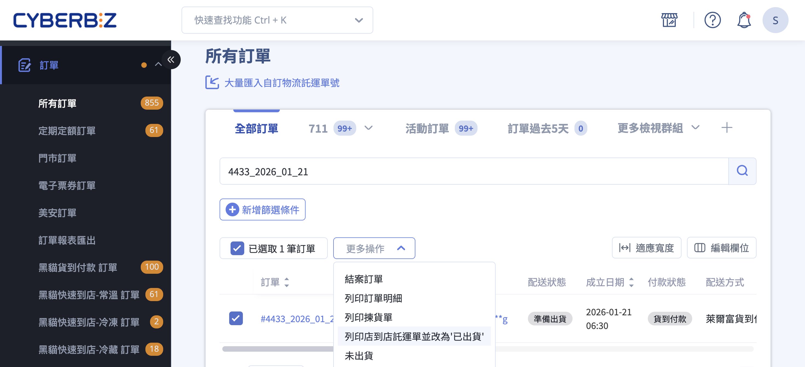
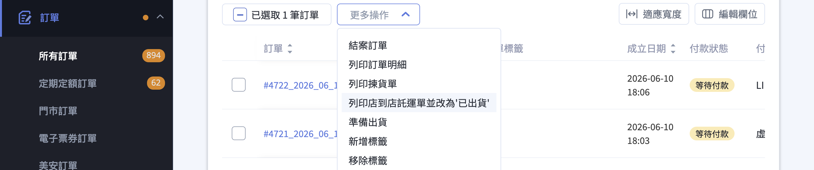
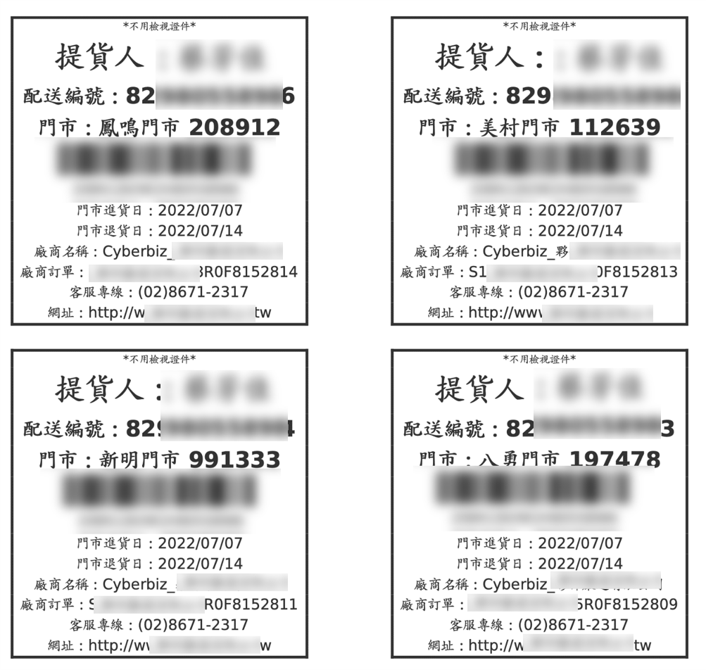
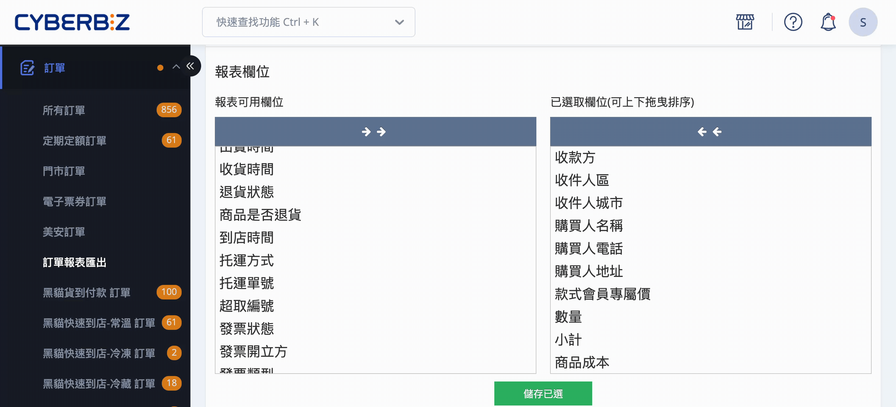
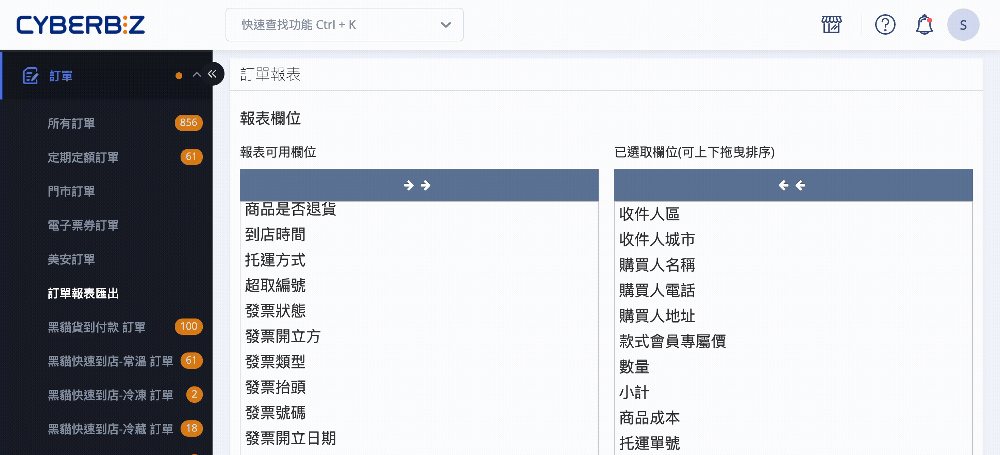
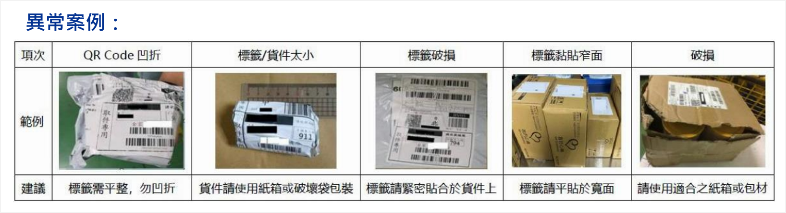

{ title="C2C下載託運單" .hero-page }

## 超商店到店出貨說明 { #intro-cvs-c2c }

超商店到店（C2C）是「便利商店寄至便利商店」的出貨方式，商家於門市交寄包裹，消費者再到指定門市取貨。目前支援的超商物流服務包括：

- **7-ELEVEN（交貨便）**
- **全家（店到店）**
- **萊爾富（超商取貨）**

消費者可選擇 **取貨不付款**（結帳時先付款）或 **取貨付款（COD，貨到付款）**（門市取貨時才付款）兩種收款方式。

## 使用前提與限制 { #prerequisites-cvs-c2c }

出貨前請先確認下列前提皆已完成設定：

- [x] **公司寄件人姓名與手機**：請於後台設定正確的寄件人真實姓名與手機；若消費者逾期未取退貨，門市人員須核對寄件人身分證件才可領回包裹。
- [x] **儲值 Cyber幣（一般版）**：一般版商家列印託運單前，請先至「管理中心 > 儲值中心」[儲值 Cyber幣](../../website-management/points-deposits.md#operate-cyber-coin-deposit)，餘額不足將無法列印；PLUS版 / 企業版無需手動儲值，系統依每期對帳單收取。
- [x] **開通 CYBERBIZ PAYMENTS（使用貨到付款時）**：超商「貨到付款」收款功能僅限已開通 CYBERBIZ PAYMENTS 的商家使用，開通條件見下方說明。

??? plan "超商「貨到付款」開通條件"
    超商店到店的 **貨到付款（COD）** 收款功能，僅限已開通 **CYBERBIZ PAYMENTS** 的商家使用。開通後，系統會自動為 7-ELEVEN、全家等超商店到店配送方式建立「貨到付款」收款選項，消費者於門市取貨時付款。

    ??? info-clean "什麼是 CYBERBIZ PAYMENTS"
        **CYBERBIZ PAYMENTS** 是 CYBERBIZ 一站整合的金物流服務，提供各項金流代收代付服務，讓消費者快速、安全地完成付款，特色包括：

        - **超低交易手續費**
        - **一站整合金物流串接**
        - **PCI DSS 資安認證**

        各方案的開通方式不同：

        - **PLUS版 / 企業版**：方案已整合 CYBERBIZ PAYMENTS，可直接使用超商貨到付款。
        - **一般版**：需自行至管理後台申請開通 CYBERBIZ PAYMENTS，並完成個人戶風險評估表，待審核通過後啟用。

---

## 操作步驟 { #operate-cvs-c2c }

### 步驟一：確認出貨條件 { #operate-cvs-c2c-check }

依消費者選擇的收款方式，確認訂單狀態符合出貨條件：

- **取貨不付款（先付款）**：訂單的付款狀態必須顯示為「**已收到款項**」才可操作出貨。
- **取貨付款（COD）**：訂單配送狀態顯示為「**貨到付款**」時即可操作[^cod-plan]。

[^cod-plan]: 貨到付款（COD）功能僅限開通 CYBERBIZ PAYMENTS 的商家使用，開通條件請見 [使用前提與限制](#prerequisites-cvs-c2c)。

---

### 步驟二：後台取號與下載託運單 { #operate-cvs-c2c-download }

1. 登入 CYBERBIZ 管理後台，前往 **訂單 > 所有訂單**。
2. 勾選相同配送方式（如萊爾富貨到付款）的訂單。
3. 點選右上方 **更多操作** > **下載店到店託運單並更改為已出貨**。單次建議最多勾選 **20 筆**，避免超商端取號失敗。

    !!! warning "配送狀態一旦為「已出貨」，則無法修改收貨資訊以及任何訂單狀態。"

4. 系統將生成託運單壓縮檔（ZIP），內含託運單、出貨明細、訂單明細與揀貨單。檔案說明請見 [託運單壓縮檔內容](../basics/order-fulfillment-flow.md#operate-fulfillment-zip){ data-preview }。

    ??? example-clean "託運單壓縮檔內容"
        

    !!! warning "壓縮檔若無法下載，請檢查瀏覽器是否阻擋彈跳視窗。"



---

### 步驟三：列印與貼單 { #operate-cvs-c2c-print }

!!! tip "建議使用雷射印表機，較不影響標籤判讀。"

!!! warning "7-ELEVEN 託運單廠商名稱特殊符號處理"
	7-ELEVEN 託運單上的廠商名稱若帶有特殊符號，將會導致訂單建立失敗，系統會自動將特殊符號轉為「_」以利訂單建立（交易則不受此影響）。若因特殊符號導致買家無法順利取件，包裹將由宅配退回並向商家收取退件運費。

#### 一般列印

- 使用 A4 紙或標籤貼紙，一頁最多 4 筆（2X2 格式）。
- [市售 A4 尺寸標籤貼紙範例 :lucide-external-link:](https://shopee.tw/%E3%80%90A4%E3%80%91A4%E7%A9%BA%E7%99%BD%E8%B2%BC%E7%B4%99-2%C3%972-%E8%B2%BC%E7%B4%99-A6%E8%87%AA%E9%BB%8F%E6%A8%99%E7%B1%A4%E8%B2%BC%E7%B4%99-A4%E6%A8%A1%E9%80%A0%E8%B2%BC%E7%B4%99-%E9%9B%BB%E8%85%A6%E6%A8%99%E7%B1%A4%E8%B2%BC%E7%B4%99-%E5%8F%AF%E9%9B%B7%E5%B0%84-%E5%99%B4%E5%A2%A8-1%E5%8C%85100%E5%BC%B5-10%E5%8C%85%E5%85%8D%E9%81%8B-i.24728499.2550119685)，僅供參考。

??? example-clean "圖示範例"
    

---

#### 熱感列印 <small>A6</small>

- 支援 7-ELEVEN 與全家 C2C，僅可使用「新版訂單列表」下載。瞭解 [如何熱感列印超商托運單](thermal-print-cvs-waybill.md){ title="熱感列印超商托運單" }。

!!! plan "熱感列印功能僅限 PLUS版 與 企業版 的商家使用。"


---

#### 超商列印

- 可至門市多媒體機台（ibon / FamiPort）列印服務單。
- 需記下託運單號（交貨便代碼）。

=== "ibon"

    1. **查詢托運單號**

        - 登入 CYBERBIZ 管理後台，前往 **訂單 > 訂單報表匯出**。
        - 點擊 **托運單號** 將其加入已選取欄位。
        - 點擊 **儲存** 套用變更，並匯出。
        - 打開匯出的檔案，可在 **托運單號** 欄位查詢到相關商品的托運單號（交貨便代碼）。

        

    2. **ibon 機台操作**

        - 點選 ibon 首頁 **服務** > **交貨便** > **寄件**。
        - 選擇「自行輸入」交貨便代碼。
        - 確認寄件者與取件者資料。

    3. **列印單據**：確認資料後，等待機台列印出繳費單（小白單）。

    4. **寄出包裹**

        - 憑單據至櫃檯領取「交貨便塑膠套袋」，將單據放入並貼在包裹上。
        - 若為賣貨便賣家，多筆訂單可使用 APP 批次產生 QR Code 進行快速列印。

    !!! info "注意事項"

        - 取號後需在四天內至 7-11 寄出，逾期訂單會取消。

=== "FamiPort"

    1. **查詢超取編號**

        - 登入 CYBERBIZ 管理後台，前往 **訂單 > 訂單報表匯出**。
        - 點擊 **超取編號** 將其加入已選取欄位。
        - 點擊 **儲存** 套用變更，並匯出。
        - 打開匯出的檔案，可在 **超取編號** 欄位查詢到相關商品的寄件單號。

        

    2. **操作 FamiPort 機台**

        - 點選首頁 **服務/寄件 > 店到店 > 全家平台寄件 > 寄件**。
        - 輸入平台提供的「寄件代碼/編號」。
        - 輸入訂單金額：貨到付款時超商有代收費用，需輸入訂單金額；貨到不付款為純取貨，超商無代收費用，訂單金額輸入 0。
        - 輸入「寄件人手機末三碼」驗證。
        - 確認寄件資訊無誤後，按下「確認」並列印繳費單。

    3. **繳費與貼單**：持「小白單」與包裹至櫃檯，完成繳費並將托運單黏貼於包裹上。

    !!! info "建議事項"

        - 確認寄件人與收件人資訊（地址 / 姓名）無誤，避免列印後無法修改。
        - 列印出的標籤請貼在包裹最顯眼處。

---

### 步驟四：前往門市寄件 { #operate-cvs-c2c-dropoff }

商家當日寄件，若該店物流車當日尚未取件，則通常消費者可於後天（寄件日 +2 天）取貨。部分門市除外，查看 [7-11 排外門市名單 :lucide-external-link:](https://www.7-11.com.tw/form/store.pdf)，全家不限。

!!! info "寄件時效"
	下載託運單並更改為已出貨後，需依各超商規定期限內完成交寄：
	
	- **7-ELEVEN**：5 日內
	- **全家**：6 日內
	- **萊爾富**：7 日內
	
	逾期該筆託運單將由系統自動刪除，**無法再寄送**。若欲再次出貨，需代客下單或請消費者重新下單。

---

### 步驟五：到店簡訊通知 { #operate-cvs-c2c-notify }

- 商品抵達門市後，CYBERBIZ 貨態轉為「已到店」，將發出取貨通知簡訊給「消費者」。
- CYBERBIZ 取貨通知簡訊：

    - 7-11 / 到店第一天、第四天各發一封。
    - 全家 / 到店第一天、第三天各發一封。
    - 萊爾富 / 到店第一天、第三天各發一封。

- 若消費者未前往取貨，商品退回原寄件店時，會發簡訊通知「寄件者」。

!!! note "超商貨態查詢系統"

    - 7-11 貨態查詢[連結 :lucide-external-link:](https://eservice.7-11.com.tw/e-tracking/search.aspx)。
    - 全家貨態查詢[連結 :lucide-external-link:](https://fmec.famiport.com.tw/FP_Entrance/QueryBox)。
    - 萊爾富貨態查詢[連結 :lucide-external-link:](https://www.hilife.com.tw/serviceInfo_search.aspx)。

---

## 重要規範與限制 { #specs-cvs-c2c }

!!! info "7-ELEVEN 與全家提供官方寄件流程及包材販售服務，請參考官方網站說明。"

### 尺寸與重量 { #specs-cvs-c2c-size }

- 包裹三邊總和 ≤ 105cm，最長邊 ≤ 45cm。
- 重量限制：一般 ≤ 5kg；7-ELEVEN C2C ≤ 10kg。
- 超過限制時，結帳頁面將自動隱藏超商選項。

---

### 包裝規範 { #specs-cvs-c2c-packaging }

- 商品須完整包裝，不可裸露。
- 禁用 PP 袋、束繩或保麗龍包裝。
- 條碼標籤須平貼於寬面，**不可凹折或縮放**，避免掃描失敗。
- 易碎品請勿交寄，破損將由商家自行負責；若因該商品導致其他商家商品受損、沾汙，亦由商家負擔全部賠償責任。



---

### 禁止托運商品 { #specs-cvs-c2c-prohibited }

- 危險或違禁物品（槍械、炸藥、刀具、有毒物）
- 現金、票據、貴重金屬、珠寶、古董
- 信用卡、提款卡、證件類
- 活體動植物、寵物
- 血液、尿液、檢體
- 易碎或 3C 產品（電腦、手機、相機）
- 榴槤、鹹魚等特殊氣味物品

---

## 異常情境處理 { #operate-cvs-c2c-exception }

### 消費者逾期未取 { #operate-cvs-c2c-exception-overdue }

- 包裹將退回原寄件門市，商家無需額外費用。
- 系統會發送簡訊通知寄件人領回。
- 領回時需出示寄件人身分證件，**公司寄件人姓名務必正確**。
- 若 7 日內未領回，包裹送至物流中心，並以「**宅配到付**」寄回商家地址。

!!! note-clean "顧客未取件處理流程"

    ```mermaid
    graph LR
      A[1. 初始保留<br>消費者未取貨 7 天] --> B;
      B[2. 啟動退回物流<br>包裹轉送至<br>原寄件門市<br>（1-3 天）] --> C;
      C[3. 商家取件<br>前往<br>原寄件門市<br>領回包裹] --> D;
      D[4. 領回期限<br>執行] --> E;
      E{商家<br>是否於期限內<br>領回？};
      E -- 是 --> F(流程結束<br>包裹<br>已領回)
      E -- 否 --> G(包裹銷毀)

      style E fill:#fff

    ```

---

### 門市關轉 <small>閉店</small> { #operate-cvs-c2c-exception-store-closed }

- **7-11**：CYBERBIZ 系統發送通知信，需於收到通知信件的 2 日內聯繫消費者，並前往後台搜尋到該筆訂單，於訂單詳情頁重新選擇 7-11 門市。
- **全家**：CYBERBIZ 系統發送通知信，需於收到通知信件的 6 日內聯繫消費者，並前往後台搜尋到該筆訂單，於訂單詳情頁重新選擇全家門市。
- **萊爾富**：CYBERBIZ 系統發送通知信，需於收到通知信件的 2 日內聯繫消費者，並前往後台搜尋到該筆訂單，於訂單詳情頁重新選擇萊爾富門市。

---

### 部分出貨 { #operate-cvs-c2c-exception-partial }

- 若訂單需分批出貨，**第二次出貨無法再使用超商配送**，需改以宅配方式。
- 貨到付款訂單，消費者於收到第一筆包裹時須支付 **整筆訂單全額**。

---

## 相關操作 { #next-steps-cvs-c2c }

<div class="grid cards" markdown>

- :lucide-printer:{ .lg }  
  [__超商熱感列印__](thermal-print-cvs-waybill.md){ title="熱感列印超商托運單" }  
  使用熱感列印，列印超商托運單。

- :lucide-snowflake:{ .lg }  
  [__全家冷凍店到店__](family-mart-frozen-c2c){ title="操作全家冷凍店到店 C2C 出貨" }  
  設定商品的配送物流條件，限制特定物流方式於結帳流程中的顯示與使用。

</div>

## 常見問題 { #faq-cvs-c2c }

??? quote "我的訂單沒有「超商貨到付款」選項，怎麼開通？"
    [](){ #faq-cvs-c2c-cod-enable }
    超商店到店的貨到付款收款功能，需先開通 **CYBERBIZ PAYMENTS** 金流服務：

    - **PLUS版 / 企業版**：方案已整合，無需另外申請。
    - **一般版**：請至管理後台申請開通 CYBERBIZ PAYMENTS，並完成個人戶風險評估表，審核通過後即會自動為超商店到店配送方式新增「貨到付款」收款選項。

??? quote "消費者逾期未取，包裹會怎麼處理？"
    [](){ #faq-cvs-c2c-overdue }
    若消費者未在指定時間內取件，系統會自動處理包裹流程：

    1. 包裹退回原寄件門市，商家無需額外支付費用。
    2. 系統會發簡訊通知寄件人領回。
    3. 領回時需出示寄件人身分證件，**公司寄件人姓名務必正確**。
    4. 若 7 日內未領回，包裹將送至 大智通 / 日翊 / 萊爾富 物流中心，再以「宅配到付」寄回商家。
    5. 「宅配到付」的地址為 EC 後台 > 一般設定 > [公司物流地址](../../website-management/setup-store-basic-info.md#operate-general-preferences-return-address){ title="設定網站基本資訊" }，請務必設定並填寫完整。

??? quote "若訂單需分批出貨，可以繼續使用超商配送嗎？"
    [](){ #faq-cvs-c2c-partial }
    若訂單需分批出貨，需要注意超商配送的限制：

    - 第二次出貨無法再使用超商配送，必須改用宅配寄送。
    - 貨到付款訂單，消費者必須在收到第一批包裹時支付 **整筆訂單全額**。

??? quote "列印託運單失敗怎麼辦？"
    [](){ #faq-cvs-c2c-print-failed }
    若遇到列印託運單失敗，請依照以下方式檢查與處理：

    1. 確認瀏覽器是否阻擋彈跳視窗。
    2. 一般版商家請確認帳戶是否已儲值 Cyber幣。
    3. 若仍無法下載或列印，可嘗試更換瀏覽器，或聯繫客服協助。

    !!! tip "建議使用 Chrome 或 Edge 最新版本，通常能減少列印問題。"

## 參考資料 { #reference-cvs-c2c }

- [7-11 貨態查詢 :lucide-external-link:](https://eservice.7-11.com.tw/e-tracking/search.aspx)
- [全家貨態查詢 :lucide-external-link:](https://fmec.famiport.com.tw/FP_Entrance/QueryBox)
- [萊爾富貨態查詢 :lucide-external-link:](https://www.hilife.com.tw/serviceInfo_search.aspx)
- [7-11 排外門市名單 :lucide-external-link:](https://www.7-11.com.tw/form/store.pdf)

