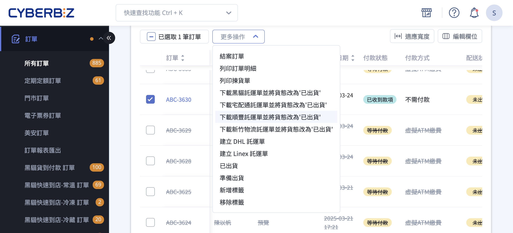
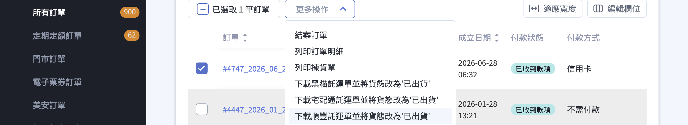
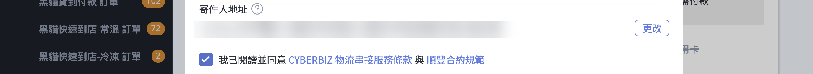

{ title="下載順豐託運單" .hero-page }

## 順豐出貨說明 { #intro-sf }

在 CYBERBIZ 後台，您可以直接針對配送方式為「順豐」的訂單，批次或單筆下載 **順豐託運單** 並同步將訂單貨態改為「已出貨」，系統會與順豐 即時取號，免去手寫單與另行登入順豐系統的步驟。

下載後得到的 ZIP 壓縮檔內含可直接黏貼於包裹上的託運單，海外件還會額外附上 **商業發票** 供出口報關使用。

## 使用前提與限制 { #prerequisites-sf }

### 開通條件 { #prerequisites-sf-plan }

| 開通功能 | 用途 | 適用方案 |
| :-- | :-- | :-- |
| 順豐託運單 | 國內(台灣本島)順豐出貨 | 一般版以上方案皆可使用 |
| 順豐海外宅配 | 寄送至海外(中港澳及其他支援國家) | 僅 **企業版** 及 Pro / Business |

---

### 必要前置設定 { #prerequisites-sf-config }

第一次使用順豐託運單前，請先完成以下設定，缺一項都會導致託運單無法順利產生或寄件人資訊不完整：

- [x] **順豐寄件人地址**：至「金物流」>「[順豐託運單](../../payments-and-logistics/setup-sf-express-waybill-v2.md#configure-sf-waybill-sender){ title="設定順豐託運單" }」設定寄件人地址，若無設定則會導致出貨時出現「寄件人資訊不完整」的通知。
- [x] **公司統一編號**：至「一般設定」>「[公司聯絡資訊](../../website-management/setup-store-basic-info.md#operate-general-preferences-company-info){ title="設定網站基本資訊" }」輸入統編。**寄送海外件時為必填欄位[^1]**。
- [x] **順豐寄件人資訊**(選用)：若您希望託運單上的寄件人聯絡電話與「公司聯絡資訊」不同，可在 **順豐託運單設定頁** 另行指定寄件人姓名與電話。詳情參考 [設定順豐託運單寄件人資訊](../../payments-and-logistics/setup-sf-express-waybill-v2.md#configure-sf-waybill-sender){ title="順豐設定" data-preview }。

[^1]: 缺少統編將無法產生海外託運單。

---

### 配送範圍 { #prerequisites-sf-coverage }

* **國內**：僅支援 **台灣本島**。系統會依收件地址自動判斷，**離島地區(澎湖、金門、馬祖、綠島、蘭嶼等)無法產生託運單**，需改用其他配送方式。
* **海外**：已開通「[順豐海外宅配](../../payments-and-logistics/sf-express-overseas-logistics.md){ title="順豐海外物流" }」者可寄送至中國、香港、澳門及其他順豐支援國家。系統會依收件國家自動切換為英文託運單。

---

### 付款狀態限制 { #prerequisites-sf-payment }

* 訂單付款狀態須為 **「已付款」** 或 **「貨到付款」(順豐貨到付款專用)**。
* **一般順豐託運單不支援貨到付款**，若需貨到付款流程，須另行開通「順豐貨到付款」功能並於訂單建立時即選用 **順豐貨到付款** 配送方式。

## 操作步驟 { #operate-sf }

### 批次下載順豐託運單 { #operate-sf-bulk-shipping }

一次處理多筆順豐訂單，同時列印託運單並將貨態更新為「已出貨」。

1. **進入訂單列表**：前往後台「訂單」>「所有訂單」。
2. **勾選訂單**：在列表中勾選欲出貨的訂單，**所有勾選的訂單配送方式都必須是順豐[^2]**。
3. **選擇操作**：點擊列表上方的 **「選擇操作」** 下拉，選擇 **「下載順豐託運單並將貨態改為『已出貨』」**。

    { title="下載順豐託運單"}

4. **設定下載條件**：系統開啟「下載順豐託運單」視窗，依序確認
    * **訂單清單**：顯示本次勾選的訂單編號與配送方式，確認無誤後再繼續。
    * **配送商品尺寸與費用**：視窗中會顯示一張價目表，列出各規格對應的 Cyber 幣費用供參考[^3]。
    - **預估 Cyber 幣**：一般版[^4] 商家會在視窗中看到本次預扣的 Cyber 幣、目前帳戶餘額，以及「儲值」按鈕。
    * **寄件人地址**：預設帶入該物流上一次使用的寄件地址（首次帶入 [順豐設定](../../payments-and-logistics/setup-sf-express-waybill-v2.md#configure-sf-waybill-sender){ title="設定順豐託運單" } 中的地址），如需更改可於視窗內點擊 **「更改」** 按鈕編輯[^6]。

    { title="下載順豐託運單彈窗"}

5. **閱讀注意事項**：視窗會列出出貨提醒[^5]，請務必確認後再進行下一步。
6. **同意條款**：勾選 **「我已閱讀並同意 CYBERBIZ 物流串接服務條款 與 順豐合約規範」**(預設已勾選)，確認按鈕方會啟用。
7. **點擊「下載」**：系統會呼叫順豐依勾選的訂單數量逐筆取得託運單號，並下載一份 ZIP [壓縮檔](#reference-sf-bulk-shipping-files)。
8. **檢視出貨結果**：下載完成後，訂單列表中對應訂單的貨態會自動更新為 **「[已出貨(待物流收件)](shipping-status-tooltip.md#shipping-status-text-type){ title="出貨狀態物流提示文字說明" data-preview }」**，並在訂單詳情頁記錄託運單號。

[^2]: 否則系統會擋下並提示「訂單 X 無法支援順豐託運單」。
[^3]: 實際扣抵的尺寸由系統依訂單品項的材積自動判定，不需手動選擇。
[^4]: PLUS版 / 企業版不會顯示此區塊，費用直接列入對帳單，不需在印單前確認餘額。
[^5]: 超尺寸建議拆箱、託運單失效規則、繁盛期加收、消費者拒收費用、特殊地點規定。
[^6]: 修改後會同步更新該物流頁面地址，不同物流間及公司物流地址互不影響。

---

### 壓縮檔內含文件 { #reference-sf-bulk-shipping-files }

成功下載後，ZIP 內會包含以下文件：

| 文件 | 用途 | 是否列印 |
| :-- | :-- | :-- |
| 託運單 - 寄件資料 | 黏貼於包裹外部，順豐司機掃描使用 | **必須列印** |
| 出貨明細 | 供商家內部對單與裝箱參考 | 選擇性列印 |
| 訂單明細 | 可隨包裹寄出，讓顧客核對品項 | 選擇性列印 |
| 揀貨訂單 | 供倉庫人員揀貨使用 | 選擇性列印 |
| 商業發票(僅海外件) | 報關用，英文版 | **海外件必須列印** |

!!! info "提示"
     建議使用 **雷射印表機** 列印託運單，避免條碼因噴墨暈染或熱感紙褪色導致順豐系統無法辨識，需要重新加印。

---

### 部分出貨 { #operate-sf-partial-shipping }

當一筆訂單只有部分商品可先寄出時，可進入該筆 **訂單詳情頁**，於「出貨」區塊勾選本次要出貨的商品後，在「選擇出貨方式」下拉中選擇 **「順豐託運單」**，點擊「確認出貨」即可。

* 順豐部分出貨 **僅支援一般訂單**，**不支援順豐貨到付款**(分箱寄送會讓代收款分散在多張託運單，結帳對帳會錯亂)。
* 若需貨到付款分箱，請改用 [加印託運單](../../payments-and-logistics/setup-sf-express-waybill-v2.md#operate-sf-waybill-reprint){ title="加印託運單" data-preview } 功能於同一張訂單產生多組單號。

部分出貨的完整流程(各物流共用)請參考 [訂單部分出貨](partial-shipment-v2.md){ title="設定訂單部分出貨" }。

---

### 預約司機取件 { #operate-sf-driver-pickup }

下載託運單後，請主動聯繫順豐安排收件：

* **預約專線**：**412-8830**(手機請加撥 02 > **02-412-8830**)。
* **告知司機**：已使用 **CYBERBIZ 系統串接產出的託運單**，**不需要客代**，司機到場直接掃單即可。
* 司機完成收件後，後台對應訂單的貨態會自動更新為 **「已出貨(配送中)」**；後續送達顧客時則更新為 **「已出貨(已送達)」**。

## 重要規範與限制 { #specs-sf }

### 託運單失效與退費 { #specs-sf-expiration }

下載託運單後即扣除 Cyber 幣(或列入帳單)，**14 天內** 未實際寄件者，系統會依順豐回傳的貨態自動判定為「客戶已取消寄件」，單號狀態改為 **「取消寄件」**，並將原本扣除的 Cyber 幣全額退回帳戶(對帳單方案則該筆不會列入帳單)。

* 退款時機 **依順豐系統回傳貨態為準**，並非剛好滿 14 天即立即退回。
* 退款入帳時，後台「CYBER 幣異動紀錄」會註記 **「訂單 XXX，順豐單號 XXX 超過兩週未寄件，補回 X Cyber 幣」**。

---

### 包裹尺寸建議 { #specs-sf-size }

* 單一包裹建議 **不超過 170 cm**(長 + 寬 + 高)。超過 170 cm 的包裹各站所司機 **有不收取的可能**，建議拆分包裹寄送。

---

### 消費者拒收 { #specs-sf-reject }

若消費者拒收包裹，順豐將於 **退回店家時當面跟店家收取退件運費**，該筆退件運費 **不會** 從 Cyber 幣扣除或併入對帳單，需現場付現給司機。

---

### 必須使用系統產出的託運單 { #specs-sf-no-handwritten }

* **請勿手寫託運單**。手寫單無法被 CYBERBIZ 系統追蹤，訂單貨態不會自動更新，且順豐系統也無法回傳即時運送狀態。
* 已下載的託運單若不慎遺失，可至「金物流」>「順豐託運單」搜尋對應訂單，於該筆紀錄旁重新下載，**不需要再扣一次 Cyber 幣**。

## 後續操作 { #next-steps-sf }

- :lucide-printer:{ .lg }   
  [__加印託運單(一單多包)__](../../payments-and-logistics/setup-sf-express-waybill-v2.md#operate-sf-waybill-reprint){ title="加印託運單" }  
  若商品超過單一包裹材積限制(建議超過 170 cm 拆箱)或貨到付款訂單需要分箱寄送，可使用「加印託運單」。

<!-- - :lucide-refresh-ccw:{ .lg }     
  [__補印託運單(遺失重印)__](../../payments-and-logistics/reprint-waybills.md){ title="補印與加印託運單" }  
  託運單檔案遺失或印壞時，可使用 **「補印託運單」** 重新下載。補印 **不會** 再次扣費。 -->

## 常見問題 { #faq-sf }

??? quote "為什麼選擇「下載順豐託運單」時系統提示『訂單 X 無法支援順豐託運單』？"
    { #faq-sf-unsupported-order }

    請依序檢查：

    * 訂單的 **配送方式** 是否為「順豐」或「順豐貨到付款」，其他物流無法用順豐託運單處理。
    * 訂單的 **付款狀態** 是否為「已付款」或「貨到付款」，等待付款的訂單無法出貨。
    * 訂單的 **配送地址** 是否為台灣本島，離島地區會被擋下。

??? quote "Cyber 幣不足時無法列印，但我是 PLUS / 企業版，為什麼還是被擋？"
    { #faq-sf-points-insufficient }

    PLUS / 企業版方案的順豐運費 **列入對帳單**，不會在印單時即時扣 Cyber 幣，理論上不應出現「餘額不足」的提示。若您看到此提示，請聯繫業務窗口確認 **方案類型是否正確** 或檢查 **功能設定是否同步**。

??? quote "可以一次出貨海外件和國內件嗎？"
    { #faq-sf-mixed-shipment }

    建議 **分批處理**。海外件與國內件在「請選擇費用」下拉的可選尺寸不同，系統會依勾選的訂單收件地址自動帶出對應的尺寸選項，混合勾選時可能無法找到共通的尺寸，造成操作不便。

??? quote "下載的託運單可以印在 A4 紙上嗎？還是要用特殊貼紙？"
    { #faq-sf-paper-type }

    順豐託運單為系統產出的 PDF / PNG 檔，**沒有指定貼紙規格**，可使用一般 A4 紙列印後以膠帶黏貼，或使用 A6 標籤貼紙皆可。建議使用 **雷射印表機** 以避免條碼模糊。

??? quote "拒收訂單的退件運費要怎麼處理？"
    { #faq-sf-reject-fee }

    順豐將包裹退回店家時，司機會 **當面跟店家收取退件運費**，以 **現金** 支付，該費用 **不會** 由 Cyber 幣扣抵或併入對帳單。建議事先準備現金備用，並與顧客溝通退貨退款流程。

??? quote "海外訂單為什麼一定要填統一編號？"
    { #faq-sf-vat-required }

    海外件需要報關，**寄件人公司必須提供統一編號** 作為出口商認證資料，缺少統編時系統會直接擋下並提示「順豐海外出口件，網站功能設定 > 一般設置 > 公司聯絡資訊中的統一編號必填」。

??? quote "下載託運單後想取消，可以自行刪除嗎？"
    { #faq-sf-cancel-waybill }

    商家後台 **無法自行取消** 已產生的順豐單號。若印錯尺寸、選錯訂單或不再需要出貨，只需 **不要將包裹交給順豐司機**，等待 14 天後系統會自動判定為「客戶已取消寄件」並退回 Cyber 幣 / 不列入帳單。

??? quote "包裹超過 170 cm 該怎麼辦？"
    { #faq-sf-oversize }

     若包裹超過 170 cm，各順豐站所司機 **有不收取的可能**，建議拆分成兩個包裹寄送，拆分後分別為各包裹產生託運單即可。如需一單多包，可使用 [加印託運單](../../payments-and-logistics/setup-sf-express-waybill-v2.md#operate-sf-waybill-reprint){ title="加印託運單" data-preview } 功能。

??? quote "如何重新下載已遺失的託運單？"
    { #faq-sf-redownload }

     託運單檔案若不慎遺失，可至後台「金物流」>「順豐託運單」搜尋對應訂單，於該筆紀錄旁點擊重新下載，**不需要再扣一次 Cyber 幣**。補印的完整說明請參考 [補印託運單](../../payments-and-logistics/setup-sf-express-waybill-v2.md#operate-sf-waybill-reprint){ title="加印託運單" }。

