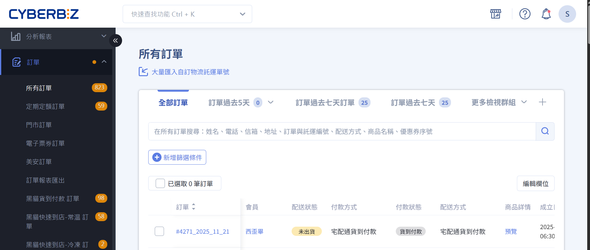

# 訂單

{ .hero-page }

## 開始使用

- [訂單介面教學](訂單管理介面說明.md){ data-preview }  
- [訂單出貨流程](訂單出貨流程.md){ data-preview }  

## 訂單管理

	    

-   :lucide-list: __訂單列表__

	---
	
	- [查看所有訂單](查看訂單.md)  
	- [依狀態篩選訂單](訂單篩選.md)  
	- [批次更新訂單狀態](批次更新訂單.md)  

-   :lucide-file-clock:{ .lg .middle } __自動結案__

    ---

    - [官網一般訂單](設定訂單自動結案)   
    - [電子票券訂單](../e-ticket/電子票券設定指南#票券分潤與自動結案設定) 
    - [POS 門市訂單](../../pos/orders/設定 POS 訂單自動結案)  

-   :fontawesome-brands-markdown:{ .lg .middle } __It's just Markdown__

    ---

    Focus on your content and generate a responsive and searchable static site

    [:octicons-arrow-right-24: Reference](#)

-   :fontawesome-brands-markdown:{ .lg .middle } __It's just Markdown__

### 自動結案

- :lucide-file-check:{ .lg }   
  [__官網訂單自動結案__](設定訂單自動結案)     
  讓符合條件的一般商品訂單自動轉為已結案狀態。

- :lucide-ticket-check:{ .lg }     
  [__票券訂單自動結案__](../e-ticket/電子票券設定指南#票券分潤與自動結案設定)  
  設定電子票券訂單自動結案。

- :lucide-file-clock:{ .lg }   
  [__POS 訂單自動結案__](../pos/orders/設定 POS 訂單自動結案)     
  設定 POS 訂單自動結案。

## 訂單付款

-   :lucide-bell-ring:{ .lg .middle } __未付款處理__

    ---

    - [__付款連結__](提供顧客付款連結.md){ data-preview }     
    - [__未付款提醒__](設定未付款提醒.md){ data-preview }  

-   :fontawesome-brands-markdown:{ .lg .middle } __It's just Markdown__

    ---

    Focus on your content and generate a responsive and searchable static site

    [:octicons-arrow-right-24: Reference](#)

-   :material-format-font:{ .lg .middle } __Made to measure__

    ---

    Change the colors, fonts, language, icons, logo and more with a few lines

    [:octicons-arrow-right-24: Customization](#)

- :lucide-link:{ .lg }   
  [__付款連結__](提供顧客付款連結.md){ data-preview }       
  主動提供未付款訂單的顧客，專屬付款連結。

- :lucide-bell:{ .lg }     
  [__未付款提醒__](設定未付款提醒.md){ data-preview }    
  設定以天數為間隔的付款提醒通知。

## 訂單出貨

### 不同物流出貨方式

-   :lucide-truck:{ .lg .middle } __宅配物流__

    ---

    - [黑貓]()
    - [宅配通]()
    - [新竹物流]()
    - [順豐宅配]()

-   :lucide-store:{ .lg .middle } __超商取貨__

    ---

    - [店到店 C2C]()
    - [大宗寄倉 B2C]()
    - [全家冷凍店到店 C2C](操作全家冷凍店到店 C2C 出貨.md){ data-preview }  

-   :lucide-hand:{ .lg .middle } __自訂物流__

    ---

    - [大量匯入託運單號](操作自訂物流出貨#大量匯入自訂物流託運單號)

---

=== "訂單管理"

	

	
	-   :lucide-list-check: __訂單列表__
	    
	    ---
	    

	    
	    [查看所有訂單](查看訂單.md)  
	    [依狀態篩選訂單](訂單篩選.md)  
	    [批次更新訂單狀態](批次更新訂單.md)  
	    
	    

	
	-   :lucide-pen-tool: __訂單編輯__
	    
	    ---
	    

	    
	    [修改訂單資訊](修改訂單資訊.md)  
	    [取消訂單流程](取消訂單.md)  
	    [退貨與退款管理](退貨退款.md)  
	    
	    

	
	-   :lucide-printer: __訂單列印__
	    
	    ---
	    

	    
	    [列印出貨單](列印出貨單.md)  
	    [列印發票與收據](列印發票.md)  
	    
	    

	
	

=== "物流配送"

	

	
	-   :lucide-truck: __配送方式__
	    
	    ---
	    

	    
	    [設定宅配物流](宅配物流設定.md)  
	    [設定超商取貨](超商取貨設定.md)  
	    [宅配貨到付款設定](宅配貨到付款.md)  
	    
	    

	
	-   :lucide-map-pin: __物流綁定__
	    
	    ---
	    

	    
	    [綁定商品與物流](綁定商品物流.md)  
	    [設定配送限制與排除](配送限制排除.md)  
	    
	    

	
	-   :lucide-clock: __配送追蹤__
	    
	    ---
	    

	    
	    [查看物流狀態](物流追蹤.md)  
	    [訂單配送進度通知](配送進度通知.md)  
	    
	    

	
	

=== "訂單自動化"

	

	
	-   :lucide-repeat: __自動出貨規則__
	    
	    ---
	    

	    
	    [設定自動出貨流程](自動出貨設定.md)  
	    [自動庫存扣除規則](自動庫存扣除.md)  
	    
	    

	
	-   :lucide-bell: __異常提醒__
	    
	    ---
	    

	    
	    [庫存不足提醒](庫存不足提醒.md)  
	    [配送延遲通知](配送延遲通知.md)  
	    
	    

	
	

=== "報表與分析"

	

	
	-   :lucide-bar-chart: __訂單報表__
	    
	    ---
	    

	    
	    [訂單統計報表](訂單報表.md)  
	    [退貨與退款分析](退貨退款分析.md)  
	    
	    

	
	-   :lucide-trending-up: __物流成效__
	    
	    ---
	    

	    
	    [配送效率分析](配送效率分析.md)  
	    [顧客滿意度追蹤](顧客滿意度追蹤.md)  
	    
	    

	
	

=== "系統與權限"

	

	
	-   :lucide-key: __權限管理__
	    
	    ---
	    

	    
	    [設定訂單管理人員權限](訂單人員權限.md)  
	    [控制物流編輯與查看權限](物流權限設定.md)  
	    
	    

	
	-   :lucide-shield-check: __安全管理__
	    
	    ---
	    

	    
	    [訂單資料備份與恢復](訂單資料備份.md)  
	    [異常操作審核流程](異常操作審核.md)  
	    
	    

	
	

