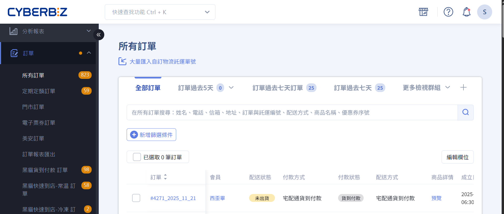

# 訂單

{ .hero-page }

## 快速上手

- :lucide-layout-dashboard:{ .lg }  
  [__介面總覽__](order-management-interface.md){ title="訂單管理介面說明" }  
  認識訂單列表介面、狀態標籤與各項操作按鈕。

- :lucide-truck:{ .lg }  
  [__訂單出貨流程__](訂單出貨流程.md){ title="訂單出貨流程" }  
  了解從訂單成立到完成出貨的完整流程。

- :lucide-search:{ .lg }  
  [__搜尋與篩選__](search-filter-orders.md){ title="如何搜尋與篩選訂單" }  
  使用關鍵字搜尋、條件篩選與檢視群組快速找到訂單。

## 訂單異動

- :lucide-pencil:{ .lg }  
  [__編輯訂單__](edit-order-content.md){ title="編輯訂單內容" }  
  修改訂單商品、款式數量，或新增自訂項目與折扣。

- :lucide-x-circle:{ .lg }  
  [__取消訂單__](cancel-order.md){ title="如何取消訂單" }  
  手動取消、前台取消與系統逾時自動取消三種方式。

- :lucide-repeat:{ .lg }  
  [__再次購買__](repurchase-order.md){ title="使用再次購買功能" }  
  讓顧客快速將歷史訂單商品重新加入購物車。

- :lucide-undo-2:{ .lg }  
  [__調整為未出貨__](revert-to-unshipped.md){ title="如何將訂單從準備出貨調整回未出貨狀態" }  
  將準備出貨的訂單退回未出貨狀態。

## 選擇出貨方式

### 宅配物流

- :lucide-truck:{ .lg }  
  [__黑貓宅配出貨__](tcat-home-delivery.md){ title="使用黑貓宅配出貨" }  
  批次下載黑貓託運單，扣抵運費並更新出貨狀態。

- :lucide-truck:{ .lg }  
  [__宅配通出貨__](pelican-shipping.md){ title="使用宅配通出貨" }  
  批次下載宅配通託運單，支援單件與部分出貨。

- :lucide-globe:{ .lg }  
  [__順豐出貨__](sf-express-shipping.md){ title="使用順豐出貨" }  
  支援國內配送與跨境出貨，即時取得託運單號。

- :lucide-box:{ .lg }  
  [__新竹物流出貨__](hct-shipping.md){ title="使用新竹物流出貨" }  
  批次下載新竹物流託運單並更新出貨狀態。

- :lucide-package:{ .lg }  
  [__自訂物流出貨__](custom-logistic-shipping.md){ title="如何使用自訂物流出貨" }  
  三種自訂物流出貨方式：批次標記、Excel 匯入與手動出貨。

### 超商物流

- :lucide-warehouse:{ .lg }  
  [__大宗寄倉 B2C__](cvs-b2c-bulk-shipping.md){ title="使用超商大宗寄倉（B2C）出貨" }  
  商品集中送至物流中心，再分配至各超商門市。

- :lucide-store:{ .lg }  
  [__超商店到店 C2C__](cvs-c2c-shipping.md){ title="操作超商店到店 C2C 出貨" }  
  包裝後至超商門市寄送至顧客指定門市取貨。

- :lucide-snowflake:{ .lg }  
  [__全家冷凍店到店 C2C__](family-mart-frozen-c2c.md){ title="操作全家冷凍店到店 C2C 出貨" }  
  冷凍商品的全家 C2C 店到店出貨流程與注意事項。

### 快速到店

- :lucide-zap:{ .lg }  
  [__黑貓快速到店出貨__](tcat-quick-store-shipping.md){ title="使用黑貓快速到店出貨" }  
  批次下載黑貓快速到店託運單並完成出貨。

## 出貨設定

- :lucide-package-check:{ .lg }  
  [__部分出貨（宅配）__](partial-shipment-settings.md){ title="設定訂單部分出貨" }  
  將訂單部分商品先行出貨的流程與注意事項。

- :lucide-package-check:{ .lg }  
  [__超商部分出貨__](cvs-partial-shipment.md){ title="處理超商訂單部分出貨" }  
  超商訂單部分出貨的處理方式與物流支援對照。

- :lucide-file-text:{ .lg }  
  [__出貨明細設定__](shipping-detail-print.md){ title="設定與列印出貨明細" }  
  自訂出貨明細樣板，批次下載出貨文件。

- :lucide-printer:{ .lg }  
  [__熱感列印超商托運單__](thermal-print-cvs-waybill.md){ title="熱感列印超商托運單" }  
  使用熱感應印表機列印 A6 尺寸的超商托運單。

- :lucide-phone-call:{ .lg }  
  [__黑貓自動呼叫司機__](tcat-auto-call-driver.md){ title="自動呼叫黑貓司機取件" }  
  批次下載託運單時自動通知黑貓司機到府取件。

- :lucide-info:{ .lg }  
  [__出貨提示文字__](shipping-status-tooltip.md){ title="出貨狀態物流提示文字說明" }  
  了解系統如何根據物流追蹤資料顯示已出貨提示。

## 付款與結案

- :lucide-credit-card:{ .lg }  
  [__黑貓快速到店付款__](tcat-express-payment-settings.md){ title="設定黑貓快速到店付款方式" }  
  設定快速到店的貨到付款與不付款選項。

- :lucide-link:{ .lg }  
  [__提供付款連結__](provide-payment-link.md){ title="提供顧客付款連結" }  
  產生專屬付款連結，讓顧客補完成線上付款。

- :lucide-barcode:{ .lg }  
  [__超商條碼付款__](cvs-barcode-payment.md){ title="使用超商條碼完成付款" }  
  啟用超商條碼付款功能，顧客可至超商繳費。

- :lucide-printer:{ .lg }  
  [__訂單明細設定__](order-detail-print.md){ title="設定與列印訂單明細" }  
  自訂訂單明細顯示欄位，列印或下載 PDF。

- :lucide-file-check:{ .lg }  
  [__自動結案__](auto-close-order-settings.md){ title="設定訂單自動結案" }  
  依物流狀態與天數自動將訂單結案，觸發紅利與分潤。

- :lucide-check-circle:{ .lg }  
  [__手動結案__](manual-order-close.md){ title="如何手動結案訂單" }  
  單筆或批次手動關閉訂單。

- :lucide-bell:{ .lg }  
  [__未付款提醒__](unpaid-reminder-settings.md){ title="設定未付款提醒" }  
  設定自動發送 Email、SMS 與 LINE 的未付款提醒。

## 退貨與退款

- :lucide-undo-2:{ .lg }  
  [__訂單退貨流程__](訂單退貨流程.md){ title="訂單退貨流程" }  
  管理逆物流與退貨審查的完整流程。

- :lucide-dollar-sign:{ .lg }  
  [__訂單退款流程__](訂單退款流程.md){ title="訂單退款流程" }  
  自動退刷與手動退款的完整流程。

- :lucide-credit-card:{ .lg }  
  [__第三方支付人工退款__](第三方支付訂單人工退款.md){ title="第三方支付訂單人工退款" }  
  LINE Pay、街口支付等第三方金流的手動退款流程。

- :lucide-rotate-ccw:{ .lg }  
  [__會員退貨申請功能__](會員退貨申請功能.md){ title="會員退貨申請功能" }  
  開啟前台退貨申請功能，設定可退貨天數與條件。

- :lucide-calendar-x:{ .lg }  
  [__超過退貨期限__](overdue-return-handling.md){ title="處理超過退貨期限的訂單" }  
  為已超過退貨期限的訂單手動開啟退貨流程。

- :lucide-package-x:{ .lg }  
  [__超商逾期未取__](cvs-unclaimed-order.md){ title="處理超商訂單逾期未取" }  
  超商訂單逾期未取的退款條件與處理流程。

- :lucide-arrow-left-to-line:{ .lg }  
  [__超商退貨便 C2B__](cvs-c2b-return.md){ title="操作超商退貨便 C2B" }  
  操作 7-11 C2B 退貨便，讓顧客透過超商退回商品。

- :lucide-arrow-left:{ .lg }  
  [__7-11 C2C 退貨便__](7-11-c2c-return.md){ title="使用 7-11 C2C 退貨便" }  
  啟用 7-11 C2C 退貨便服務，發送退貨代碼給顧客。

- :lucide-clock:{ .lg }  
  [__黑貓快速到店逾期__](tcat-quick-store-overdue.md){ title="黑貓快速到店逾期說明" }  
  逾期未取的判定天數與退貨運費計算機制。

## 跨境電商

- :lucide-globe:{ .lg }  
  [__跨境電商退貨流程__](跨境電商退貨流程.md){ title="跨境電商退貨流程" }  
  跨境訂單的逆物流與退貨審查流程。

- :lucide-globe:{ .lg }  
  [__跨境電商退款流程__](跨境電商退款流程.md){ title="跨境電商退款流程" }  
  跨境訂單的自動與手動退款流程。

## 訂單報表

- :lucide-file-spreadsheet:{ .lg }  
  [__匯出訂單報表__](export-order-report.md){ title="匯出訂單報表" }  
  匯出 Excel 訂單報表，進行資料分析與對帳。

- :lucide-calendar:{ .lg }  
  [__匯出定期預估報表__](export-subscription-forecast.md){ title="匯出定期定額子訂單預測報表" }  
  匯出定期定額訂單的預測報表，掌握出貨排程。

