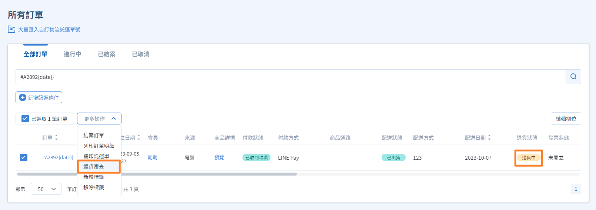
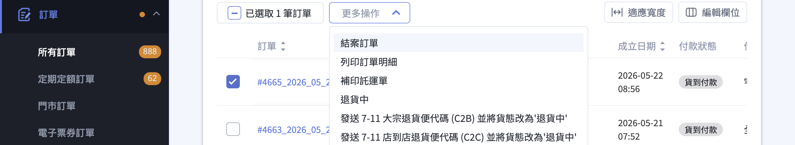
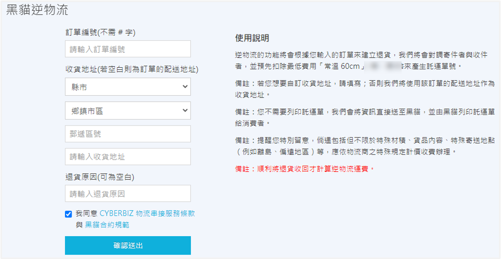
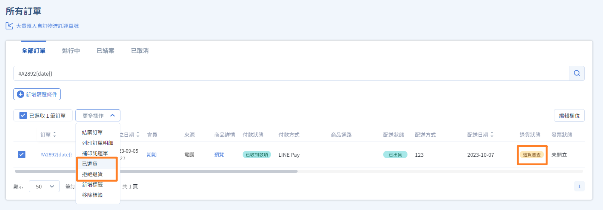
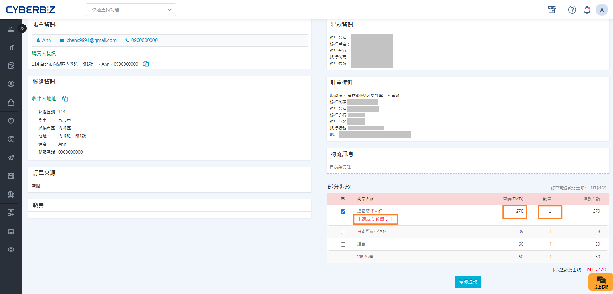

# 訂單退貨流程

當會員提出退貨申請或商家需手動啟動退貨程序時，您可以透過後台進行「逆物流安排」與「退貨審核」。
{ .subtitle }

## 使用須知

- **次數限制**：每筆訂單僅接受 **一次** 退貨退款申請。若已完成部分退貨，該訂單剩餘商品無法再次申請。
- **紅利與優惠券**：
    - 系統 **不會自動歸還** 訂單中使用的點數/券。

        !!! info "退貨相關紅利設定"
            **PLUS 版與企業版** 可前往 **金物流 > 結帳頁 & 物流設定**，於 [**訂單取消退貨相關紅利設定**](../payments-and-logistics/payments/order-settings.md#operate-order-settings-return-bonus){ data-preview }，手動設定紅利的返還政策。

    - 訂單 **已結案** 後執行退貨退款， **不會自動扣除** 該訂單消費產生的點數回饋。若需更動，請至 **會員明細頁** 手動調整。
- **分潤機制**：只要訂單曾達到 **已結案** 狀態，即會計算分潤；後續退貨 **不會影響** 已產生的分潤紀錄。
- **串倉訂單退貨**：使用 CYBERBIZ 電商倉儲者，退貨流程請參閱 [退貨與派車](../../wms/returns-and-vehicle-dispatch.md)。

## 步驟 1：啟動退貨與安排逆物流

依據退貨發起方，訂單列表中的 **退貨狀態** 會有不同顯示：

- **會員申請**：自動顯示為 `退貨申請`。
    - 若想開啟前台消費者申請退貨功能，請參閱 [會員退貨申請功能](member-return-request-feature.md)。
- **商家發起**：初始顯示為 `不須退貨`。

### 1. 手動切換狀態

手動切換切換狀態，代表已收到包裹進入驗收階段。

1. 前往 **訂單 > 所有訂單**。
2. 勾選指定訂單，點選 **退貨中** > **退貨審查**。

### 2. 安排逆物流寄回

- 出貨物流與逆物流獨立運作，兩者 **不需綁定相同物流商**。

    > 例如：原訂單使用宅配出貨，退貨時仍可安排超商退貨便（C2B）寄回。

- 逆物流收回退貨後，訂單 **退貨狀態** 會切換為 **退貨審查**。

=== "超商 7-11 退貨 (C2B)"
    
    1. 前往 **訂單 > 所有訂單**。
    2. 勾選指定訂單，點選 **發送7-11 大宗退貨便代碼(C2B)並將貨態改為退貨中**，系統將簡訊發送代碼給會員。

    !!! warning "超商退貨服務啟用限制"
        - **適用版本**：高手 PLUS、企業版。
        - **適用物流**：僅支援已啟用 **超商 B2C** 之站台；使用超商 C2C 服務則不適用。
    
    

    

    - :lucide-dollar-sign:{ .lg }   
      [__操作超商退貨便 C2B__](returns-refunds/cvs-c2b-return.md)       
      設定 7-11 退貨便運費、發送代碼與寄件流程。

    

=== "超商 7-11 退貨(C2C)"

    1. 前往 **訂單 > 所有訂單**。
    2. 勾選指定訂單，點選 **發送7-11 店到店退貨店代碼(C2C)並將貨態改為退貨中**，系統將簡訊發送代碼給會員。

    

    

    - :lucide-dollar-sign:{ .lg }   
      [__操作超商退貨便 C2C__](returns-refunds/7-11-c2c-return.md)       
      開通 7-11 C2C 退貨、設定收件與發送代碼。

    

=== "宅配逆物流"

    1. 前往 **金物流 > XX 託運單**。
      > 請依據使用的物流（黑貓、宅配通）選擇對應介面（黑貓託運單、宅配通託運單）。
    2. 輸入訂單編號，產出逆物流單號。

    

    

    - :lucide-dollar-sign:{ .lg }   
      [__建立黑貓逆物流__](../payments-and-logistics/setup-print-tcat-waybill-v2.md#ezcat-shipping-note-reverse)       
      設定黑貓寄件資訊、加印單號與建立逆物流。

    - :lucide-dollar-sign:{ .lg }   
      [__建立宅配通逆物流__](../payments-and-logistics/setup-pelican-waybill-v2.md#operate-pelican-shipping-reverse)       
      設定宅配通寄件資訊、加印單號與建立逆物流。

    - :lucide-dollar-sign:{ .lg }   
      [__建立新竹物流逆物流__](../payments-and-logistics/setup-hct-waybill-v2.md#operate-hct-setup-reverse)       
      設定新竹寄件資訊、加印單號與建立逆物流。

    

## 步驟 2：執行退貨審查

收到包裹並檢查品項無誤後，請依據情況選擇審查結論。

=== "全部退貨"

    適用於整筆訂單品項皆需退回。

    1. 前往 **訂單 > 所有訂單**。
    2. 勾選指定訂單，點選 **退貨審查** > **已退貨**。

        

    3. 訂單若由 CYBERBIZ 人工退款，請依照顧客提供的退款資料填寫 **人工退款資料**。

        { .small-image }

    4. 狀態更動後，請接續進行 [退款操作](order-refund-process.md)。

    

=== "部分退貨"

    適用於僅退回訂單內部分商品。

    1. 前往 **訂單 > 所有訂單**。
    2. 勾選指定訂單，點選 **退貨審查** 後，進入訂單明細頁。
    3. 找到 **部分退款** 區塊，勾選核准退回的商品與輸入退款數量。

        

    4. 輸入 **退款金額**（系統會代入原價總計，商家可手動調整）。
    5. 訂單若由 CYBERBIZ 人工退款，請依照顧客提供的退款資料填寫 **人工退款資料**。

        { .small-image }

    6. 點擊 **確認**，`退貨狀態`將更新為 `部分退貨`。

        { .small-image }

    7. 狀態更動後，請接續進行 [退款操作](order-refund-process.md)。

        { .small-image }

    !!! warning "注意事項"
        - 分期付款訂單無法使用部分退貨 (退款)功能。
        - 消費者當日付款，隔日才能操作部分退貨。
        - 每筆訂單僅接受一次部分退貨申請。

    

=== "拒絕退貨"

    適用於商品毀損、超出期限等不符退貨標準的情況。

    1. 前往 **訂單 > 所有訂單**。
    2. 勾選指定訂單，點選 **退貨審查** > **拒絕退貨**。
    3. 流程至此結束。

    

## 常見問題

??? quote "為什麼使用了逆物流，訂單狀態會自動變更？"
    若使用系統整合的逆物流，當會員將包裹交給物流人員後，系統接收到物流訊號，會自動將狀態從 `退貨中` 更新為 `退貨審查`，方便商家追蹤進度。

??? quote "如果退貨審核點錯了，可以重來嗎？"
    由於每筆訂單僅能執行一次退貨流程，一旦狀態變更為 **退貨中**，系統便視為流程結束。建議在點擊前務必確認核實。

---

## 後續步驟

- :lucide-dollar-sign:{ .lg }   
  [__執行金流退款操作__](order-refund-process.md)       
  了解如何針對不同金流管道完成最後的撥款或退刷動作。

- :lucide-clipboard-check:{ .lg }     
  [__管理超商逾期未取__](../orders/returns-refunds/cvs-unclaimed-order.md)  
  針對物流未取件造成的自動退貨，了解對應的對帳流程。

