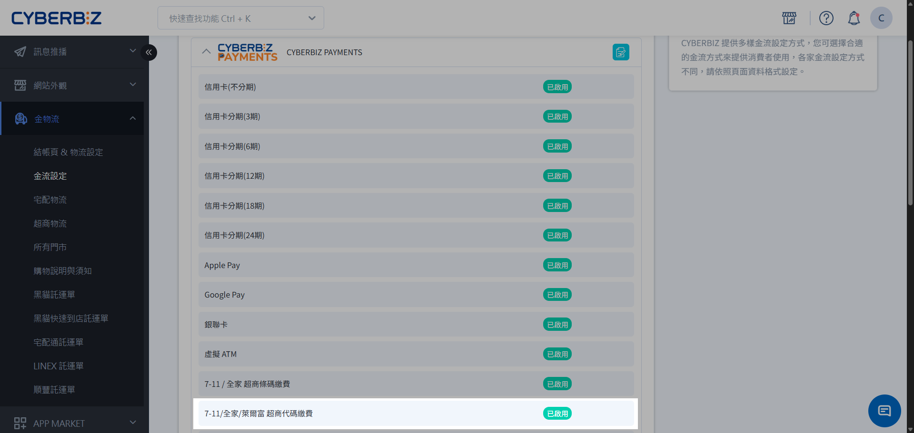
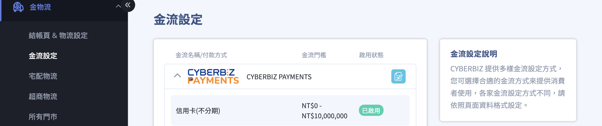
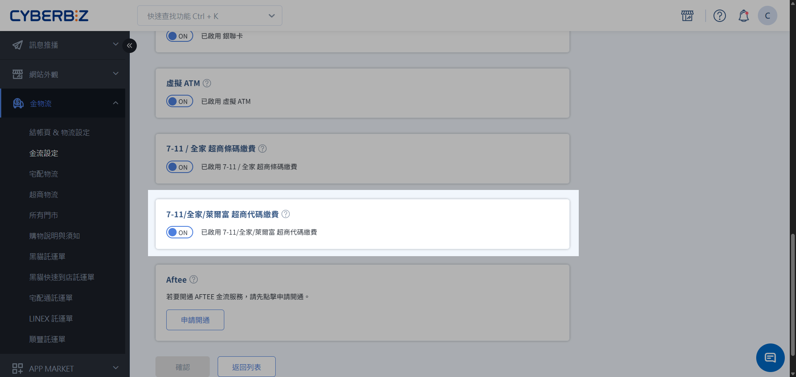
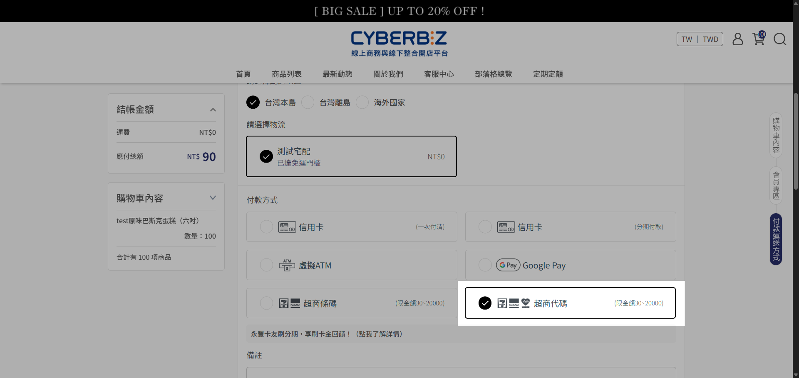
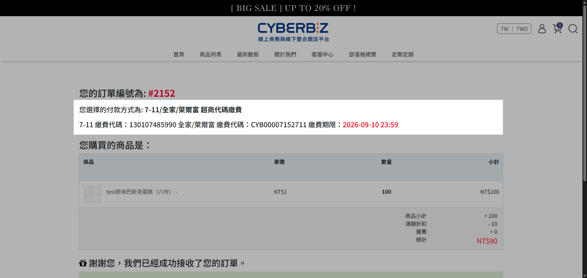
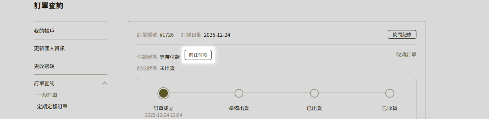

{ title="超商代碼繳費設定" .hero-page }

## 超商代碼付款說明

**超商代碼繳費** 讓顧客在官網下單後取得一組繳費代碼，前往指定便利商店的多媒體機台列印繳費單（小白單），再至櫃檯完成付款。

## 使用須知

- **單筆交易金額上限**：20,000 元
- **繳款期限**： 7 天；逾期後可重新取號
- **支援超商**：7-11、全家、萊爾富

## 啟用超商代碼繳費

商家可透過 CYBERBIZ PAYMENTS 開啟此功能，讓消費者在結帳時選擇超商代碼並至門市繳費。

### 步驟 1：編輯 CYBERBIZ PAYMENTS 金流設定

1.  登入 CYBERBIZ 管理後台，前往 **金物流 > 金流設定**。
2.  在金流設定列表中，找到 **CYBERBIZ PAYMENTS** 選項。
3.  點擊右側的 **編輯** :lucide-file-pen: 按鈕進入設定頁面。

{ title="編輯CYBERBIZ PAYMENTS" .screenshot }

---

### 步驟 2：開啟超商代碼繳費功能

1.  在 CYBERBIZ PAYMENTS 設定頁面中，找到 **超商代碼繳費** 選項。
2.  將開關切換至 **開啟** 狀態。

{ title="編輯CYBERBIZ PAYMENTS" .screenshot }

---

### 步驟 3：儲存設定

1.  確認開啟後，點擊頁面下方的 **確認** 按鈕。
2.  系統顯示儲存成功訊息後，可在金流設定列表中確認完成功能開啟。

!!! warning "重要提醒"
    - 開啟超商條碼繳費功能後，請確認您同時有搭配支援的物流方式（如超商取貨），消費者才能在結帳時正常選擇此付款方式。
    - 若商家有設定「[訂單自動取消](../../payments-and-logistics/payments/order-settings.md#operate-order-settings-auto-cancel){ title="訂單相關設定" }」的天數限制，一旦超過時限，條碼將會失效且無法進行繳費。
    - 若商家 [手動取消訂單](../basics/cancel-order/#orders-cancel-merchant)，超商代碼不會自動失效，顧客仍可在效期內繳費。繳費後，訂單會重新成立，商家可繼續出貨或辦理退款。

## 取得超商代碼的步驟 <small>顧客端</small>

顧客在下單過程中與下單後，可以透過以下管道取得繳費代碼：

1.  **結帳頁面選擇**：在官網結帳時，於付款方式中選擇 **超商代碼** 並送出訂單。

    { title="付款方式-超商代碼" }

2.  **訂單成立頁面**：完成下單後，頁面會直接顯示繳費代碼。請記下代碼，或保留此頁面至門市操作。

    { title="取得超商條碼" }

3.  **訂單查詢頁面**：若下單時未立即繳費，可登入官網會員進入 **訂單查詢**，點擊該筆訂單的 **前往付款**，系統會引導回訂單成立頁並顯示代碼。

    { title="前往付款" }

4.  **Email 通知信**：若商家有[開啟新訂單通知](../../notifications/manage-email-templates.md){ title="設定與管理 Email 通知樣板" }，顧客可以在收到的訂單成立 Email 中，點擊 **前往付款** 按鈕來取得代碼。

    { title="訂單成立Email-前往付款" }

## 便利商店現場繳費方式 <small>顧客端</small>

取得代碼後，請前往支援的超商，在多媒體機台輸入代碼、列印繳費單，再持單至櫃檯繳費。各超商機台操作請見下列說明：

- :lucide-monitor:{ .lg }  
  [__7-11 ibon__ :lucide-external-link:](https://doc.mail2000.com.tw/news/0808/7-11.html){ target="_blank" }  
  於 ibon 輸入繳費代碼、列印繳費單，再持單至櫃檯繳費。

- :lucide-monitor:{ .lg }  
  [__全家 FamiPort__ :lucide-external-link:](https://www.famiport.com.tw/Web_Famiport/page/fp_operating.aspx?MN=4&CN=1122){ target="_blank" }  
  於 FamiPort 選擇代碼繳費、列印繳款單，再持單至櫃檯繳費。

- :lucide-monitor:{ .lg }  
  [__萊爾富 Life-ET__ :lucide-external-link:](https://www.newebpay.com/info/site_description/hilife_embedded){ target="_blank" }  
  於 Life-ET 選擇代碼輸入繳費、列印繳費單，再持單至櫃檯繳費。

## 後續操作

- :lucide-clock:{ .lg }  
  [__設定訂單自動取消規則__](../../payments-and-logistics/payments/order-settings.md#operate-order-settings-auto-cancel){ title="訂單相關設定" }  
  於「金物流 > 結帳頁 & 物流設定」中設定未付款訂單的自動取消天數，對齊超商代碼繳款截止時間。

- :lucide-bell:{ .lg }  
  [__設定未付款提醒__](unpaid-reminder-settings.md){ title="設定未付款提醒" }  
  開啟未付款訂單的 Email 自動提醒功能，提高顧客完成付款的比率。

