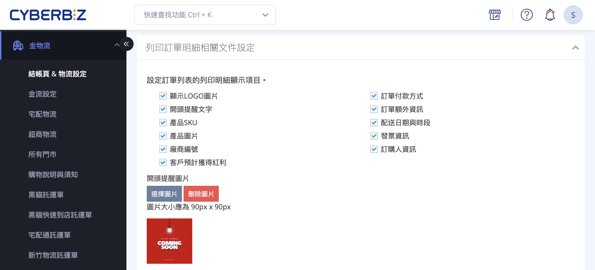
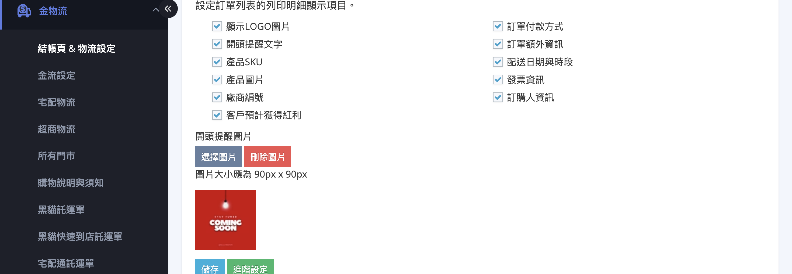
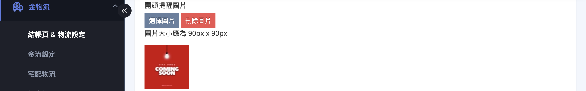
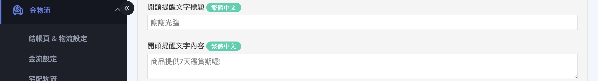
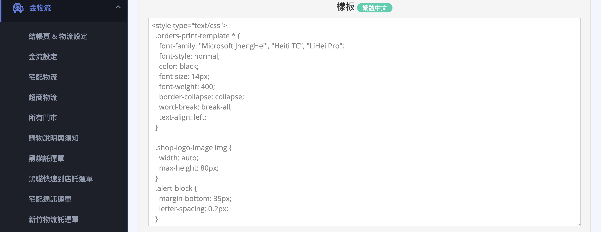
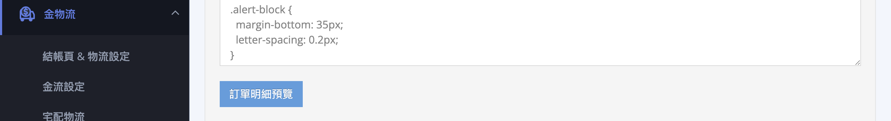
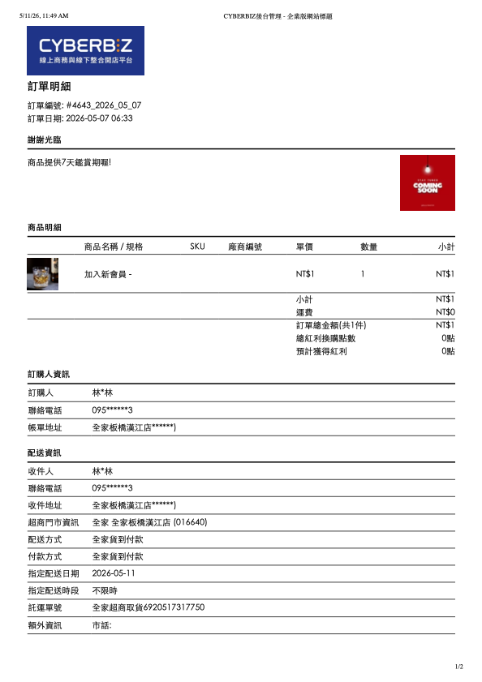
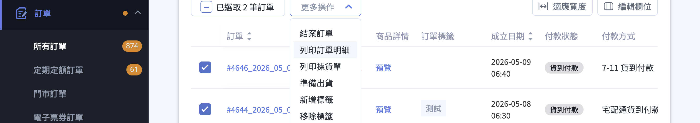

{ title="列印訂單明細設定" .hero-page }

## 訂單明細說明

「訂單明細」是您在出貨時隨包裹提供給顧客的書面文件，內容通常包含商品明細、訂購人資訊、付款方式與訂單金額。

本篇說明如何在後台：

- 自訂訂單明細的顯示內容
- 套用列印模板
- 啟用訂單明細列印個資遮罩
- 從訂單列表列印或下載 PDF

如需設定提供給內部出貨人員使用的「出貨明細」，請參考另一篇文件：[設定與列印出貨明細](shipping-detail-print.md){ title="設定與列印出貨明細" }。

??? info "出貨明細與訂單明細差異"

    系統將明細分為兩種用途，您可以分別設定其內容以符合需求：

    *   **訂單明細 (顧客)**：通常包含完整的商品內容、單價、金額與配送方式。
    *   **出貨明細 (員工)**：主要提供給倉儲或出貨人員，通常僅包含商品數量與配送地址，**不含訂單金額**，以精簡資訊並節省成本。

## 操作步驟

### 訂單明細內容設定 { #orders-print }

#### 1. 進入訂單明細列印設定 { #orders-print-activate }

於後台側邊選單依版本進入以下路徑：

- 新版選單：**金物流** > **結帳頁 & 物流設定** > 找到 **「列印訂單明細相關文件設定」**
- 舊版選單：**線上購物設定** > **購物車與金流** > 找到 **「列印訂單明細相關文件設定」**

---

#### 2. 勾選要呈現的項目 { #orders-print-configure }

面板提供多個勾選項目，可依營運需求自由組合（預設皆未勾選）。[完整欄位說明](#orders-print-fields){ data-preview }

{ title="訂單明細列印設定" }

??? example "常見組合範例"

    - **B2C 一般網購**
      勾選：顯示 LOGO 圖片、產品 SKU、產品圖片、訂單付款方式、訂購人資訊、發票資訊

    - **批發 / 大量出貨**
      勾選：產品 SKU、廠商編號、訂單額外資訊（略過產品圖片以節省紙張）

    - **重視品牌體驗**
      勾選：顯示 LOGO 圖片、開頭提醒文字、產品圖片、客戶預計獲得紅利

---

#### 3. 設定開頭提醒文字與圖片 <small>選用</small>

當您勾選 **「開頭提醒文字」** 後，需於 [步驟五](#orders-print-advanced-settings-alert-text) 的進階設定頁填入「標題」與「內容」，否則將無法儲存。

!!! example "適用情境"

    - **購物須知**：退換貨期限、客服聯絡方式
    - **感謝訊息**：回購折扣碼、社群帳號邀請

**開頭提醒圖片**

您可於主面板下方上傳圖片：

1. 點選 **「選擇圖片」** 上傳檔案
2. 建議圖片尺寸為 **90px × 90px**
3. 適合放置：
    - 公司 LOGO
    - 官網 QR Code
    - LINE 官方帳號 QR Code
4. 如需移除，點選 **「刪除圖片」**

{ title="訂單明細-開頭圖片-設定" }

!!! tip "快速建立 QR Code"

    - 您可透過 [Chrome 瀏覽器建立 QR Code :lucide-external-link:](https://support.google.com/chrome/answer/10051760?hl=zh-Hant&co=GENIE.Platform%3DDesktop#zippy=%2Cshare-pages-with-a-qr-code%2C%E9%80%8F%E9%81%8E-qr-code-%E5%88%86%E4%BA%AB%E7%B6%B2%E9%A0%81)。
    - 也可使用各種線上 QR Code 產生器建立圖片，建議尺寸為 **90px × 90px**，以避免列印時模糊或變形。

---

#### 4. 儲存設定

於設定區塊底部點選 **「儲存」** 完成基本設定。

!!! info "儲存範圍"

    此按鈕僅儲存：勾選項目 與 提醒圖片。提醒文字內容與樣板樣式需於進階設定頁另外儲存。

---

#### 5. 進階設定 { #orders-print-advanced-settings }

於設定區塊底部點選 **「進階設定」**，進入 **「編輯列印訂單明細樣板」** 頁面。

{ title="訂單明細設定-進階設定" }

您可於此頁：[編輯提醒文字](#orders-print-advanced-settings-alert-text)、[自訂樣板](#orders-print-template)、[預覽列印效果](#orders-print-preview)、[回復預設樣板](#orders-print-templates-revert)。

---

##### 編輯開頭提醒文字 { #orders-print-advanced-settings-alert-text }

若步驟二有勾選「開頭提醒文字」，此頁會出現：

- **開頭提醒文字標題**
- **開頭提醒文字內容**

兩欄皆為必填。

{ title="訂單明細進階設定-提醒文字" }

---

##### 自訂樣板 { #orders-print-template }

「樣板」區塊為 Liquid 程式碼，可調整：

- 排版
- 字型大小
- 邊距
- CSS 樣式

一般情況建議使用預設模板。若需大幅客製化，建議由熟悉 HTML / CSS 的人員協助。

{ title="訂單明細進階設定-樣板" }

!!! note "儲存前請先[預覽](#orders-print-preview)（需至少一筆「已出貨」訂單）。"

---

##### 預覽列印效果 { #orders-print-preview }

點選 **「訂單明細預覽」** 後：

- 系統會套用最近一筆已出貨訂單
- 自動開啟瀏覽器列印視窗

可直接預覽實際列印結果。

{ title="訂單明細進階設定-預覽" }

??? example "訂單明細預覽範例"

    

    { title="訂單明細預覽範例-1" }

    { title="訂單明細預覽範例-2" }

    

---

##### 回復預設樣板 { #orders-print-templates-revert }

若需還原樣板：點選 **「回復預設樣板」**，即可恢復系統預設版本。

{ title="訂單明細樣板-回復預設" }

!!! note "已儲存的勾選選項不會受到影響。"

---

### 列印訂單明細 { #orders-print-operate }

完成 [訂單明細內容設定](#orders-print) 後，可於訂單列表執行列印：

1. **進入訂單列表**：登入 CYBERBIZ 後台，前往 「訂單」 > 「所有訂單」。
2. **勾選訂單**：選取欲列印的一筆或多筆訂單。
3. **執行列印**：點選列表右上方的 「更多操作」（或「選擇操作」）按鈕，並從下拉選單中選擇 「列印訂單明細」。
4. **確認列印**：系統將自動產生 PDF 並開啟瀏覽器列印視窗，您可以選擇：
    - 紙本列印：選擇連接的印表機進行輸出。
    - 另存為 PDF：將明細檔案儲存至電腦中。

{ title="訂單列表-列印訂單明細" }

!!! note "若您執行「確認出貨」並下載物流託運單，系統產生的 [壓縮檔](#orders-print-fulfillment-zip) 內亦會自動包含該筆訂單的明細檔案。"

---

## 出貨壓縮檔內含的訂單明細 { #orders-print-fulfillment-zip }

當您於訂單列表執行 **「確認出貨」** 並下載託運資料時，系統產生的壓縮檔會自動包含：

- 託運單
- 出貨明細
- 訂單明細
- 揀貨單

其中訂單明細會沿用本頁設定的：

- 勾選項目
- 列印樣板

<!-- ## 後續操作 -->
<!---->
<!-- 
 -->
<!---->
<!-- - :lucide-receipt:{ .lg }   -->
<!--   日本站發票與收據下載   -->
<!--   日本站商家可在此路徑下載符合日本法令格式的發票（Invoice）、收據（Receipt）及對應的退款文件。 -->
<!---->
<!-- 
 -->

## 常見問題

??? quote "為什麼按了儲存之後，列印出來還是舊版面？"

    主面板的「儲存」只會儲存勾選項。若有修改模板樣式，需於「進階設定」頁再次點擊儲存。

??? quote "預覽時顯示空白或報錯，該怎麼辦？"

    預覽功能需要至少一筆「已出貨」訂單。若目前沒有已出貨訂單，請先完成一筆測試訂單。

??? quote "上傳的提醒圖片變模糊？"

    建議使用 90px × 90px 圖檔。若原圖過大，系統縮圖後可能導致模糊。

??? quote "出貨明細與訂單明細是同一份嗎？"

    不是。兩者為獨立設定。詳見：[設定與列印出貨明細](shipping-detail-print.md){ title="設定與列印出貨明細" }

    - **訂單明細**：提供給顧客，通常包含金額與付款資訊
    - **出貨明細**：提供給內部出貨人員，通常不含金額

## 參考資料
                                         
### 訂單明細欄位對照表 { #orders-print-fields }

| 勾選項 | 列印效果 | 適用情境 |
| :-- | :-- | :-- |
| 顯示 LOGO 圖片 | 在訂單明細頂部印出您的店家 LOGO | 強化品牌識別 |
| 開頭提醒文字 | 在訂單明細頂部印出您自訂的標題與內容 | 退換貨須知、感謝訊息、回購優惠碼 |
| 產品 SKU | 商品列印時加上 SKU 編號 | 倉儲對帳、批發訂單 |
| 產品圖片 | 商品列印時加上縮圖 | B2C 網購、提升閱讀體驗 |
| 廠商編號 | 商品列印時加上供應商提供的編號 | 多廠商代發貨、寄倉模式 |
| 客戶預計獲得紅利 | 印出顧客本筆訂單可得的紅利點數 | 鼓勵回購、行銷溝通 |
| 訂單付款方式 | 印出顧客選擇的金流方式（信用卡 / ATM / 超商代碼等） | 對顧客交代付款狀態 |
| 訂單額外資訊 | 印出顧客結帳時填寫的備註欄內容 | 客製化訂單、贈品註記 |
| 配送日期與時段 | 印出顧客指定的配送時間 | 生鮮、定時配送服務 |
| 發票資訊 | 印出電子發票相關資訊（統編、抬頭等） | B2B 訂單、商家報帳 |
| 訂購人資訊 | 印出訂購人姓名、電話、地址 | 必備項目，大多數商家會勾選 |

!!! note "註釋"

    - 勾選項皆為「附加顯示」，未勾選的欄位不會列印，但不影響原始資料儲存。
    - 勾選「開頭提醒文字」後，必須於進階設定頁填入標題與內容，否則無法儲存。
                                         
## 更多操作

- :lucide-eye-off:{ .lg } [__訂單明細個資隱碼設定__](../../website-management/security-settings/#operate-security-pdpa)

