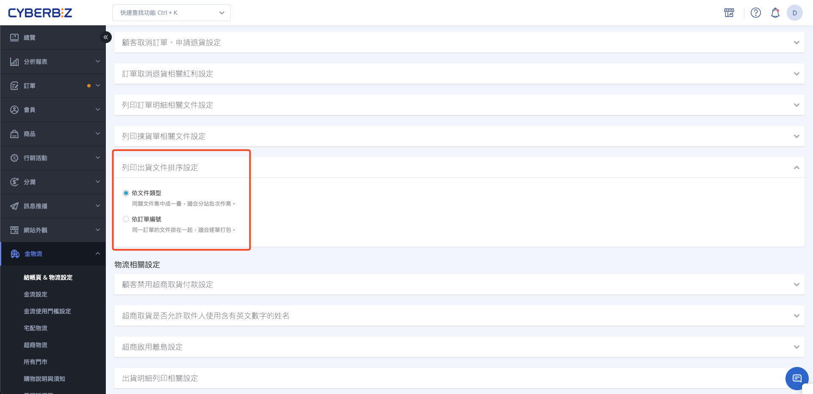

{ title="列印出貨文件排序設定" .hero-page }

## 列印出貨文件排序說明

批次一次印多張訂單時，PDF 裡各張紙的順序會影響揀貨台怎麼拆、打包員能不能一次拿到同一筆訂單。請先依現場作業選排序，再從訂單列表出貨列印。

目前僅適用與 CYBERBIZ 直串的 **黑貓宅配**、**黑貓快速到店**。單筆訂單兩種排序結果相同，差別只出現在批次列印。

!!! note "請先選現場作業再改設定"
    **依文件類型** 適合先把所有揀貨單印成一疊、再印託運單。**依訂單編號** 適合一筆訂單印完再接下筆，方便逐單打包。

## 操作步驟

### 選擇列印排序 { #setup-shipping-docs-sort }

1. 登入 CYBERBIZ 管理後台，前往 **金物流 > 結帳頁 & 物流設定**。
2. 展開 **列印出貨文件排序設定**。
3. 選擇一種排序。下次從訂單列表執行 **進行出貨/列印文件** 時，PDF 會依此排列。

| 選項 | 排列方式 | 適合 |
| :--- | :--- | :--- |
| 依文件類型（預設） | 先排完全部揀貨單，再排全部託運單、出貨明細、訂單明細 | 分批作業，同類型文件集中成一疊 |
| 依訂單編號 | 同一筆訂單勾選的文件排完，再接下一個訂單編號 | 逐單打包，同一訂單的文件排在一起 |

同一類型內的預設順序為：揀貨單 → 託運單 → 出貨明細 → 訂單明細。

實際出貨與列印步驟請見 [使用黑貓宅配出貨](../home-delivery/tcat-home-delivery-v2.md){ title="使用黑貓宅配出貨" }、[使用黑貓快速到店出貨](../tcat-quick-store/tcat-quick-store-shipping.md){ title="使用黑貓快速到店出貨" }。

## 後續操作

- :lucide-cat:{ .lg }  
  [__黑貓宅配出貨__](../home-delivery/tcat-home-delivery-v2.md){ title="使用黑貓宅配出貨" }  
  從訂單列表進行出貨、列印或下載宅配出貨文件。

- :lucide-truck:{ .lg }  
  [__黑貓快速到店出貨__](../tcat-quick-store/tcat-quick-store-shipping.md){ title="使用黑貓快速到店出貨" }  
  從訂單列表進行出貨、列印或下載快速到店出貨文件。

## 常見問題

??? quote "宅配通或其他物流也會套用這個排序嗎？"

    不會。此設定目前只作用在與 CYBERBIZ 直串的黑貓宅配、黑貓快速到店。
