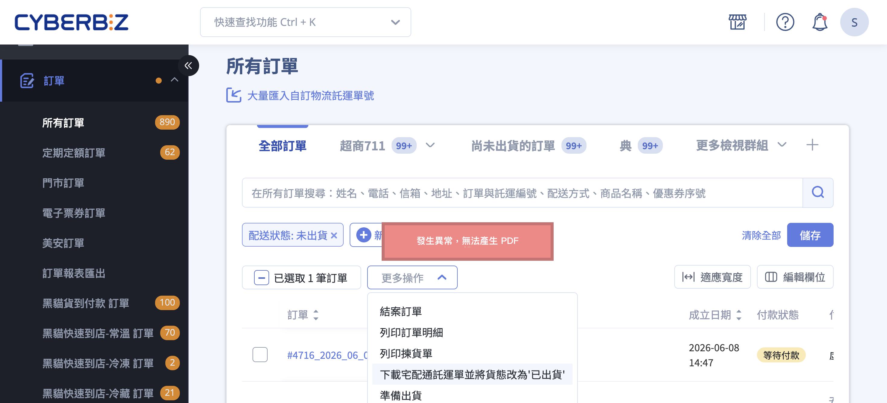

{ title="下載託運單異常" .hero-page }

## 託運單異常說明 { #intro-shipping-issue }

當您在後台執行出貨、下載託運單或追蹤貨態時，偶爾會遇到「託運單下載不出來」或「貨態沒有如預期更新」的狀況。本頁整理最常見的原因與對應處理方式，協助您快速排除問題、順利完成出貨。

大多數情形並非系統故障，而是物流帳戶餘額、瀏覽器設定、收件資訊或託運單時效等可自行排除的因素。建議先從下方的速查表找到符合的狀況，再前往對應章節操作。

## 常見狀況速查 { #overview-shipping-issue }

| 您遇到的狀況 | 最可能的原因 | 前往章節 |
| :-- | :-- | :-- |
| 按下下載後沒有檔案，但貨態已變「已出貨」 | 瀏覽器封鎖了自動下載 | [點下載卻沒有檔案](#operate-shipping-issue-popup-blocked) |
| 綠界託運單一直下載失敗 | 綠界帳戶預付物流款不足 | [綠界託運單下載失敗](#operate-shipping-issue-ecpay-balance) |
| 黑貓宅配無法產生單號 | 收件地址有錯字或不完整 | [無法產生單號](#operate-shipping-issue-wrong-address) |
| 單號失效、貨態無法追蹤 | 託運單逾期未實際交寄 | [託運單逾期失效](#operate-shipping-issue-label-expired) |
| 超商取貨通知「門市關轉」 | 取貨門市結束營業或整修 | [門市關轉處理](#operate-shipping-issue-store-closed) |
| 託運單檔案不見了 | 需要重新下載 | [補印託運單](#operate-shipping-issue-reprint) |

## 排解步驟 { #operate-shipping-issue }

### 綠界託運單下載失敗 { #operate-shipping-issue-ecpay-balance }

若您使用綠界金物流串接，下載託運單時一直失敗，最常見的原因是 **綠界帳戶的「預付物流款」餘額不足** ，無法支付物流預付款。

1. **登入綠界後台：** 進入您的綠界科技廠商管理後台。
2. **進入帳戶管理：** 於選單點選「帳戶管理」>「預付款項」。
3. **執行儲值：** 選擇「預付物流款」，填寫欲預存的金額，系統會產生一組 ATM 繳費帳號，完成轉帳即可。
4. **重新下載：** 待金額入帳後，回到 CYBERBIZ 後台重新執行下載託運單，該訂單貨態即會更新為「已出貨」。

完整的儲值操作請參考綠界官網：[預付物流款儲值教學 :lucide-external-link:](https://support.ecpay.com.tw/9772/)。

!!! note "註釋"
    預付物流款是綠界帳戶內的設定，與 CYBERBIZ 後台的帳務獨立。若儲值後仍無法下載，請聯繫綠界客服確認帳戶狀態。

- :lucide-credit-card:{ .ig .middle } [__申請綠界金流與超商取貨付款__](../../payments-and-logistics/apply-for-ecpay-payment-and-cvs-cod.md){ title="申請綠界金流與超商取貨付款" }

---

### 點下載卻沒有檔案 { #operate-shipping-issue-popup-blocked }

若您點選下載後，系統已將貨態改為「已出貨」，卻沒有任何檔案下載下來，通常是 **瀏覽器封鎖了自動下載** （尤其一次下載多筆託運單時）。

1. **先確認貨態：** 若訂單已變為「已出貨」，代表系統已成功產生託運單，只是檔案沒有順利下載，不需重新打單。
2. **檢查瀏覽器封鎖：** 留意網址列右側是否出現下載被封鎖的提示，將本站設為「允許下載多個檔案」，並暫時關閉 AdBlock 等廣告阻擋擴充套件。
3. **重新取得檔案：** 透過 **「補印託運單」** 重新下載既有檔案，不會重新扣款也不會產生新單號（見 [補印託運單](#operate-shipping-issue-reprint)）。

!!! tip "技巧"
    下載多筆訂單時，若中途關閉或離開頁面，部分訂單可能已變更為「已出貨」但檔案尚未下載，這些訂單一律改用「補印託運單」重新取得即可。

---

### 黑貓宅配無法產生單號 { #operate-shipping-issue-wrong-address }

使用 **黑貓宅配** 時，系統不支援地址模糊比對，只要收件地址有錯字（例如「峨眉」誤寫為「峨嵋」）或地址不完整，就會無法產生單號。

=== "尚未出貨"
    1. **確認正確地址：** 與顧客確認完整且正確的收件地址。
    2. **修改收件資訊：** 至該筆訂單詳情頁的收件資訊區塊修改地址。
    3. **重新下載：** 地址更新後，重新執行下載託運單即可產生單號。

=== "已產生單號 / 已出貨"
    1. **列印託運單：** 系統已無法再修改地址，請先列印出託運單。
    2. **手寫更正：** 於託運單上以手寫方式更正為正確地址。
    3. **告知司機：** 交貨時主動向物流司機說明正確地址。

- :lucide-truck:{ .ig .middle } [__使用黑貓宅配出貨__](../home-delivery/tcat-home-delivery-v2.md)
- :lucide-settings:{ .ig .middle } [__設定與加印黑貓託運單__](../../payments-and-logistics/setup-print-tcat-waybill-v2.md)

---

### 託運單逾期失效 { #operate-shipping-issue-label-expired }

託運單產生後若未在時效內實際交寄，單號會失效，後續貨態將無法追蹤，狀態可能轉為 [運送異常](../references/fulfillment-statuses.md#fulfillment-statuses-table){ title="配送狀態對照表" data-preview } 或「取消寄件」。

* **宅配：** 下載託運單後即扣除 Cyber幣，若超過 **14 天** 未實際出貨，單號會失效，預扣的 Cyber幣將於單號失效後退回帳戶。
* **超商大宗寄倉 B2C：** 須於託運單產出後的隔天起數日內將貨品送達超商物流中心，逾期狀態會轉為「運送異常」，該單號將永久失效且無法補印[^2]。
* **超商店到店 C2C：** 建議盡早完成交寄，逾期單號會由系統自動刪除[^3]。

[^2]: 超商大宗寄倉 B2C 一般為隔天起 5 天內（含假日）須送達物流中心。
[^3]: 超商店到店 C2C 一般建議 5～7 日內交寄（各通路略有差異）。

---

### 門市關轉處理 { #operate-shipping-issue-store-closed }

顧客選擇的超商取貨門市若結束營業或整修（門市關轉），系統會發送通知信，您需在期限內聯絡顧客重新選擇門市。

1. **聯絡顧客：** 收到門市關轉通知後，與顧客確認新的取貨門市。
2. **重新選擇門市：** 進入該筆訂單詳情頁的門市資訊區塊，點選 **「重新選擇門市」** 設定新的取貨門市。
3. **於期限內完成：** 依各通路規定的期限內完成重新選擇並回報物流商：
    * 7-11（店到店 C2C）：**6 天內**
    * 7-11（大宗寄倉 B2C）：**2 天內**
    * 全家：**6 天內**
    * 萊爾富：請 **盡速** 聯絡顧客重新選擇門市

!!! info "提示"
    若超過通路規定期限仍未重新選擇門市，可能導致包裹被退回。請務必在收到通知後盡快處理。

- :lucide-store:{ .ig .middle } [__超商 C2C 門市關轉（閉店）__](../cvs-shipping/cvs-c2c-shipping.md#operate-cvs-c2c-exception-store-closed)
- :lucide-package:{ .ig .middle } [__超商 B2C 門市關轉處理__](../cvs-shipping/cvs-b2c-bulk-shipping.md#operate-cvs-b2c-shipping-store-change)
- :lucide-rotate-ccw:{ .ig .middle } [__7-11 C2C 退貨門市關轉__](../returns-refunds/7-11-c2c-return.md#operate-seven-eleven-c2c-return-pickup)

---

### 補印託運單 { #operate-shipping-issue-reprint }

若託運單檔案遺失、損壞或先前沒下載成功，可重新下載 **已產生的** 託運單，不會重新扣款，也不會產生新的單號。

1. **找到補印入口：** 於訂單列表或訂單詳情頁，對已出貨的訂單點選 **「補印託運單」** （超商取貨訂單顯示為 **「補印到店條碼」** ）。
2. **重新下載：** 系統會重新下載原本已產生的託運單檔案。

!!! note "註釋"
    補印取得的是原本的單號與託運單，不會重複計費，請放心使用。

<!-- 

- :lucide-printer:{ .ig .middle } [__補印與加印託運單__](../../payments-and-logistics/reprint-waybills.md)

 -->

---

### DHL 運送異常 { #operate-shipping-issue-dhl-problem }

若 DHL 在運送途中出現異常，CYBERBIZ 會主動聯繫您協助溝通處理，並於狀況解決後持續追蹤，直到貨態更新為「已收貨」。此情形您無需自行操作，留意客服通知即可。

- :lucide-globe:{ .ig .middle } [__DHL 跨境物流__](../../payments-and-logistics/dhl-cross-border-logistics.md){ title="DHL 跨境物流" }

---

## 常見問題 { #faq-shipping-issue }

??? quote "下載沒反應 / 無法下載託運單"
    { #faq-shipping-issue-download-no-response }
    若貨態已變為「已出貨」，代表託運單已成功產生，只是檔案沒下載下來。請依序檢查：

    * 瀏覽器是否封鎖了自動下載，將本站設為允許下載多個檔案。
    * 是否有 AdBlock 等擴充套件阻擋，暫時關閉後再試。
    * 仍取不到檔案時，改用 [補印託運單](#operate-shipping-issue-reprint) 重新下載，不會再次扣款。

??? quote "下載到一半離開頁面會怎樣"
    { #faq-shipping-issue-leave-page }
    下載多筆託運單時若中途離開頁面，下載會中斷，部分訂單可能已變更為「已出貨」但檔案尚未取得。這些訂單一律改用 [補印託運單](#operate-shipping-issue-reprint) 重新下載即可，不會重複扣款。

??? quote "單號失效，預扣的 Cyber幣會退回嗎"
    { #faq-shipping-issue-cyber-coin-refund }
    會。以順豐為例，下載託運單時即扣除 Cyber幣，若超過 21 天未實際出貨，單號失效後預扣的 Cyber幣將自動退回帳戶。其他宅配物流的退回機制依各物流商規定。

??? quote "補印託運單要再收費嗎"
    { #faq-shipping-issue-reprint-fee }
    不會。補印取得的是原本已產生的單號與託運單檔案，屬於重新下載，不會重複計費，也不會產生新單號。

??? quote "已出貨後才發現收件地址寫錯"
    { #faq-shipping-issue-address-after-ship }
    託運單一旦產生（尤其黑貓宅配），系統已無法修改地址。請列印出託運單後以手寫方式更正為正確地址，並於交貨時主動向物流司機說明。

## 後續操作 { #next-steps-shipping-issue }

- :lucide-package-check:{ .lg }  
  [__訂單部分出貨__](../home-delivery/partial-shipment-v2.md)  
  一筆訂單只想先寄出部分商品時的操作方式。

- :lucide-banknote-x:{ .lg }  
  [__付款失敗排解__](../payment-failed.md)  
  顧客付款異常或訂單卡在待付款時的處理。

## 參考資料 { #reference-shipping-issue }

* [配送狀態對照表](../references/fulfillment-statuses.md)

