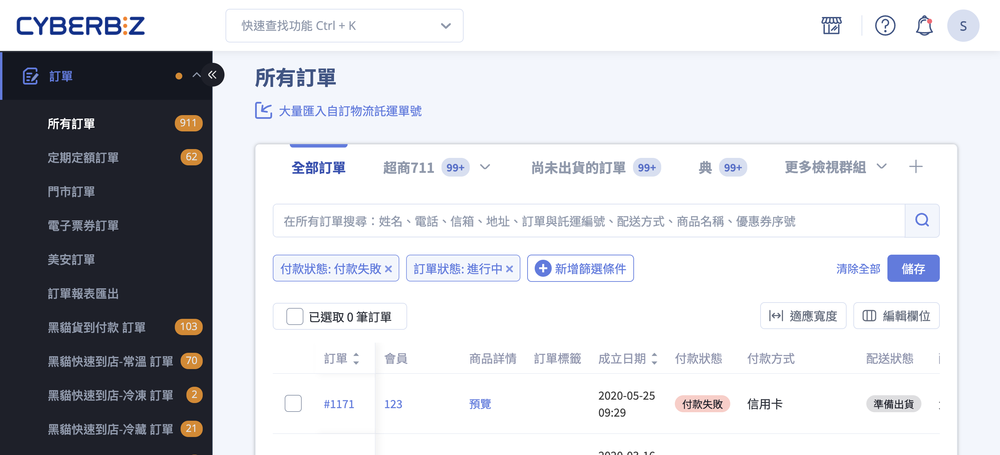

---

title: 處理付款失敗訂單
description: 訂單付款失敗時，商家可採取的處理方式，包含引導顧客重新付款、設定自動提醒、自動取消訂單，以及定期定額重新扣款等操作。
created: 2026-06-08 13:52
last_modified: 2026-06-08 17:50
lang: zh-TW
type: tutorial
status: ""
version: ""
author: Jase
reviewers: []
notes: []
ga_views: 0
feedback: 0
products:
  - EC
modules:
  - 訂單
sites:
  - TW
audiences:
  - admin
difficulty: beginner
tnb: trunk
plans:
  - 專業
  - 進階
  - 高手
  - 專業PLUS
  - 進階PLUS
  - 高手PLUS
  - 企業
cyb_extensions: []
intents:
  - 處理付款失敗訂單
  - 引導顧客重新付款
  - 設定付款失敗自動提醒
  - 自動取消付款失敗訂單
  - 定期定額扣款失敗處理
features:
  - 重新付款連結
  - 付款失敗自動提醒
  - 訂單自動取消
  - 定期定額重新扣款
  - AFTEE 先享後付
  - 信用卡 3D 驗證
  - 美安 Shop.com 導購
prerequisites: []
related:
  - "[[provide-payment-link]]"
  - "[[unpaid-reminder-settings]]"
  - "[[manage-email-templates]]"
  - "[[manage-sms-templates]]"
  - "[[auto-close-order-settings]]"
  - "[[cancel-order]]"
  - "[[定期定額活動頁]]"
  - "[[setup-aftee]]"
  - "[[setup-credit-card-3d-verification]]"
  - "[[payment-statuses]]"
tags:
  - 付款失敗
  - 重新付款
  - 訂單提醒
  - 自動取消
  - 定期定額
  - AFTEE
  - 3D驗證
  - 美安
acoiv: operation
apis: []
devices:
  - desktop
  - mobile
ui_components:
  - 重新付款連結
  - 結帳頁
  - 自動提醒設定
  - 定期定額訂單列表
paths:
  - 訂單 > 所有訂單
  - 金物流 > 結帳頁 & 物流設定
  - 訊息推播 > 簡訊通知樣板
  - 訊息推播 > Email 通知樣板
  - 定期定額訂單 > 定期訂單列表
layouts: []
wp_url:
  - https://www.cyberbiz.io/support/?p=2402
permalink: ""
comments: false
search:
  exclude: false
icon: lucide/banknote-x
hide: []
---

{ .hero-page }

## 付款失敗說明 { #intro-payment-failed }

當顧客因信用卡資訊輸入錯誤、額度不足或其他因素導致刷卡未成功時，訂單的付款狀態會顯示為「付款失敗」。這類訂單並非無法挽回，您可以引導顧客重新付款、設定系統自動寄送提醒，或在確認顧客不購買時取消訂單，降低訂單流失。

本頁說明在訂單付款失敗後，您可以採取的四種處理方式，以及定期定額、先享後付等特殊金流失敗時的對應做法。

---

## 使用前提與限制 { #prerequisites-payment-failed }

各項處理方式的開通條件不同，大多數功能所有方案皆可直接使用，僅少數需要對應方案：

- [x] **引導顧客重新付款**：所有方案皆可使用，無需額外開通。
- [x] **付款失敗自動提醒**：所有方案皆可使用，啟用後依設定天數寄送通知。
- [x] **訂單自動取消**：所有方案皆可使用，於設定頁輸入天數即生效。
- [x] **定期定額重新扣款**：需開通定期定額功能的方案。
- [x] **美安訂單抽成處理**：需開通美安夥伴商店功能的方案。

??? plan "各項功能的方案差異"
    | 處理方式 | 開通條件 |
    | :-- | :-- |
    | 重新付款連結 | 所有方案內建 |
    | 付款失敗自動提醒 | 所有方案內建 |
    | 訂單自動取消 | 所有方案內建 |
    | 定期定額重新扣款 | 需具備定期定額功能的方案 |
    | 美安(Shop.com)導購 | 需具備美安夥伴商店功能的方案 |
    | AFTEE 先享後付 | 需具備 AFTEE 先享後付功能的方案 |

    如不確定您的店家是否已開通上述功能，請聯繫您的 CYBERBIZ 業務窗口確認。

---

## 操作步驟 { #operate-payment-failed }

以下依四種常見情境分別說明處理步驟。

### 引導顧客重新付款 { #operate-payment-failed-resend-link }

當訂單顯示「付款失敗」時，您可以將該筆訂單的結帳頁連結提供給顧客，讓顧客回到結帳頁重新完成付款。

1. **進入訂單詳情頁：** 前往後台「訂單」>「所有訂單」，點選付款失敗的「訂單編號」進入訂單詳情頁。
2. **找到結帳頁連結：** 在訂單詳情頁的付款狀態區塊，當訂單尚未付款時，系統會顯示提示文字「如果您聯繫了顧客，對方遺失了線上結帳的頁面，可將 此連結地址 發送給顧客」[^adjustment]。
3. **複製並提供連結：** 點擊或複製其中的「此連結地址」，透過您與顧客聯繫的管道(電話、通訊軟體等)提供給顧客。
4. **顧客重新付款：** 顧客開啟連結後會回到該筆訂單的結帳頁面，可重新選擇店家已開啟的付款方式完成付款。付款成功後，訂單付款狀態會自動更新。

!!! tip "技巧"
    顧客若是在結帳當下付款失敗，結帳頁會即時顯示失敗訊息，顧客可直接於該頁面重試，不一定需要您另外提供連結。

[^adjustment]: 若該訂單已有補退款的待結算金額，系統顯示的提示會改為「若會員遺失線上結帳頁面，可將此連結地址發送給顧客。請注意：必須先完成原訂單付款才能進行補退款狀態紀錄。」

- :lucide-link:{ .lg }
  [__提供重新付款連結__](order-settings/provide-payment-link.md){ title="提供顧客付款連結" }

---

### 設定付款失敗自動提醒 { #operate-payment-failed-reminder }

為提高訂單轉換率，您可以開啟系統自動提醒，讓系統在訂單付款失敗後，依您設定的天數自動寄送通知給顧客。

1. **進入設定頁：** 前往後台「金物流」>「結帳頁 & 物流設定」，找到「訂單付款失敗提醒設定」區塊。
2. **設定寄送天數：** 在「設定天數」欄位輸入間隔天數，點擊 **「送出」** 。系統會依設定天數做間隔，**最多寄送三次** [^reminder-rule]。
3. **啟用通知樣板：** 前往「訊息推播」，於「簡訊通知樣板」找到「顧客付款失敗提醒信」、或於「Email 通知樣板」找到「顧客付款失敗提醒」，啟用並視需要編輯內容。

!!! note "註釋"
    貨到付款的訂單不會寄送此提醒，因為貨到付款無需線上付款。

[^reminder-rule]: 以設定 3 天為例，1 月 1 號的訂單會在 1 月的 4 號、7 號、10 號各寄一次，共三次。

- :lucide-bell-ring:{ .lg }
  [__設定付款失敗自動提醒__](order-settings/unpaid-reminder-settings.md){ title="設定未付款提醒" }

- :lucide-mail:{ .lg }
  [__管理 Email 通知樣板__](../notifications/manage-email-templates.md){ title="設定與管理 Email 通知樣板" }

- :lucide-message-square:{ .lg }
  [__管理簡訊通知樣板__](../notifications/manage-sms-templates.md){ title="設定與管理簡訊通知樣板" }

---

### 取消付款失敗訂單 { #operate-payment-failed-cancel }

若顧客確定不購買，或付款失敗訂單堆積過多，您可以讓系統自動取消，或手動處理。

**自動取消(建議)：**

1. **進入設定頁：** 前往後台「金物流」>「結帳頁 & 物流設定」，找到「訂單自動取消」區塊。
2. **設定取消天數：** 輸入天數後儲存。超過設定天數仍未付款成功的訂單(**包含付款失敗的訂單**)會被系統自動取消[^auto-cancel-default]。

**手動取消：**

* 由顧客於前台「會員中心」自行取消未付款的訂單。
* 或由您於訂單詳情頁手動取消該筆訂單。

[^auto-cancel-default]: 此天數預設為 7 天；若設定為 0，系統則不會自動取消任何訂單。

- :lucide-clock-alert:{ .lg }
  [__設定訂單自動取消__](order-settings/auto-close-order-settings.md){ title="設定訂單自動結案" }

- :lucide-circle-x:{ .lg }
  [__商家手動取消訂單__](basics/cancel-order.md#orders-cancel-merchant){ title="如何取消訂單" }

---

### 定期定額子訂單重新扣款 { #operate-payment-failed-recurring-recharge }

定期定額訂單的子訂單若扣款失敗，系統會分別發信通知您與顧客。顧客端無法自行重試，需由您於後台手動重新扣款。

1. **進入定期訂單列表：** 前往後台「定期定額訂單」，開啟「定期訂單列表」。
2. **找到扣款失敗的子訂單：** 在列表中找到顯示扣款失敗的定期訂單。
3. **執行重新扣款：** 點擊該筆訂單的 **「重新扣款」** 按鈕，於彈出的確認視窗點擊 **「重設扣款」** 確認送出。

!!! plan "方案 / 開通條件"
    定期定額為需開通的功能。若您的店家未開通，定期訂單列表不會出現「重新扣款」按鈕。顧客無法自行重新扣款，需聯繫您協助處理。

- :lucide-repeat:{ .lg }
  [__定期定額__](../marketing/other-tools/subscription-campaign-page.md){ title="定期訂購活動頁" }

---

## 特殊金流失敗情境 { #specs-payment-failed }

不同金流方式付款失敗時，排查方向與處理方式略有不同：

### AFTEE 先享後付 { #specs-payment-failed-aftee }

若顧客的 AFTEE 先享後付審核未通過，可請顧客依系統指示重新操作，或建議顧客直接聯繫 AFTEE 官方洽詢審核結果。

- :lucide-layers:{ .lg }
  [__AFTEE 先享後付金流說明__](../payments-and-logistics/setup-aftee.md){ title="設定 AFTEE" }

---

### 信用卡 3D 驗證失敗 { #specs-payment-failed-3ds }

若顧客在信用卡 3D 驗證階段失敗(未收到驗證簡訊或驗證未通過)，屬於發卡銀行端的驗證問題，需請顧客自行與其發卡銀行聯繫確認原因。

- :lucide-shield-check:{ .lg }
  [__設定信用卡 3D 驗證門檻__](../payments-and-logistics/setup-credit-card-3d-verification.md){ title="設定信用卡 3D 驗證門檻" }

---

### 綠界托運單下載異常 { #specs-payment-failed-ecpay-logistics }

若在下載綠界托運單時發生異常，常見原因為綠界帳戶的可提領餘額不足以支付物流運費，導致無法建立物流訂單。請至綠界後台儲值預付物流款後再行下載。

---

### 美安(Shop.com)導購訂單 { #specs-payment-failed-shopcom }

!!! note "重要提醒"
    若您使用美安(Shop.com)導購，付款失敗的訂單仍會被認列抽成。請務必對付款失敗的美安訂單操作「取消訂單」，系統才會同步向美安取消，將其從抽成認列中扣除。

---

## 常見問題 { #faq-payment-failed }

??? quote "付款失敗的訂單，顧客還能自己重新付款嗎？"
    { #faq-payment-failed-customer-retry }
    可以。請至 [訂單詳情頁](#operate-payment-failed-resend-link){ title="處理付款失敗訂單" } 的付款狀態區塊複製結帳頁連結提供給顧客，顧客開啟後即可回到結帳頁重新付款。若顧客是在結帳當下失敗，也可直接於頁面上重試。

??? quote "自動提醒最多會寄幾次？多久寄一次？"
    { #faq-payment-failed-reminder-times }
    系統會依您在 [付款失敗提醒設定](#operate-payment-failed-reminder){ title="處理付款失敗訂單" } 填入的天數做間隔，最多寄送三次。

    - 例如設定為 3 天，1 月 1 號的訂單會在 1 月 4 號、7 號、10 號各寄一次。
    - 貨到付款訂單不在提醒範圍內。

??? quote "付款失敗的訂單會被自動取消嗎？"
    { #faq-payment-failed-auto-cancel }
    會。只要您設定了 [訂單自動取消](#operate-payment-failed-cancel){ title="處理付款失敗訂單" } 天數(預設 7 天)，超過天數仍未付款成功的訂單，包含付款失敗的訂單，都會被系統自動取消。將天數設為 0 即可關閉自動取消。

??? quote "定期定額扣款失敗，顧客可以自己重新扣款嗎？"
    { #faq-payment-failed-recurring }
    不行。定期定額子訂單扣款失敗時，顧客端無法自行操作，需由您於 [定期訂單列表](#operate-payment-failed-recurring-recharge){ title="處理付款失敗訂單" } 點擊「重新扣款」處理。

??? quote "美安訂單付款失敗，需要特別處理嗎？"
    { #faq-payment-failed-shopcom }
    需要。付款失敗的美安訂單仍會被認列抽成，請務必對該筆訂單操作「取消訂單」，系統才會同步向美安取消並扣除抽成認列。

---

## 參考資料 { #reference-payment-failed }

* [訂單付款狀態對照表](references/payment-statuses.md#payment-statuses){ title="訂單付款狀態對照表" data-preview }
