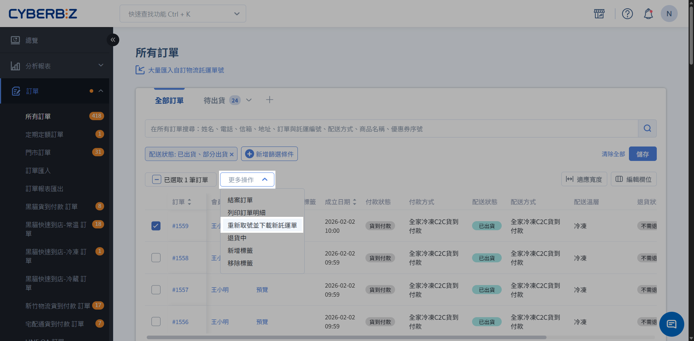

## 使用須知 { #prerequisites-renew-waybill-after-expiration }

- **使用情境**：原託運單已超過出貨（補印）期限，無法再用於交寄，需要重新取得託運單。

- **適用物流**：
    - [超商 B2C 大宗寄倉](cvs-shipping/cvs-b2c-bulk-shipping/)
    - [超商 C2C 店到店](cvs-shipping/cvs-c2c-shipping/)
    - [全家冷凍寄倉 B2C](../payments-and-logistics/setup-family-mart-frozen-b2c/)
    - [全家冷凍店到店 C2C](cvs-shipping/family-mart-frozen-c2c/)

    > 黑貓快速到店不支援本功能。

- **訂單配送狀態**：僅適用於 **已出貨** 或 **[部分出貨](cvs-shipping/cvs-partial-shipment.md)** 訂單。

    > 超商部分出貨訂單，其超商託運單同樣支援託運單逾期後重新取號。

- **託運單狀態**：原託運單必須已逾期，且無配送記錄。

    !!! tip "系統判斷邏輯"
        - 託運單尚未逾期：於期限內使用 **補印託運單**，取得原託運單。
        - 託運單已逾期且沒有配送記錄：使用 **重新取號並下載新託運單**，取得新的託運單。

## 操作流程 { #operate-renew-waybill-after-expiration }

1. 登入 CYBERBIZ 管理後台，前往 **訂單 > 所有訂單**。
2. 勾選訂單後選擇 **重新取號並下載新託運單**。
3. 系統將重新取得託運單號。下載新託運單，依原超商物流流程完成交寄。

!!! warning "重新取號前請確認配送記錄"
    若原託運單已有配送記錄，請勿重新取號。請先確認實際出貨狀態，再執行重新取號。

- :lucide-calendar-search:{ .lg }
  [__查詢各超商託運單失效期限__](references/cvs-waybill-expiration-reference.md#reference-cvs-waybill-expiration){ data-preview }
  查看各超商物流的補印期限與失效判定時間。

