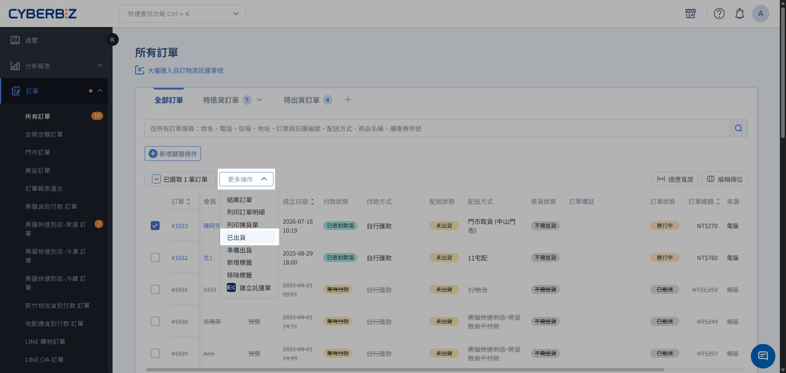
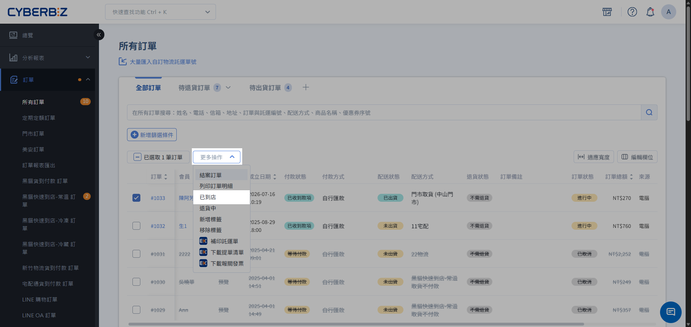
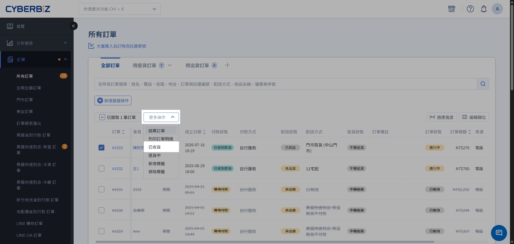
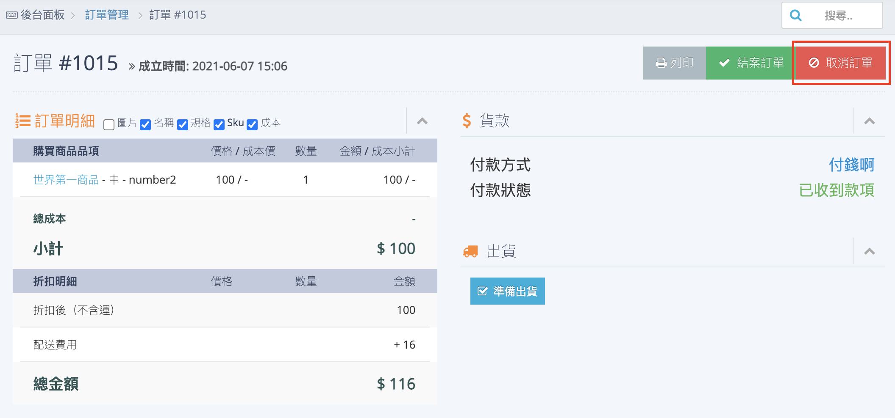
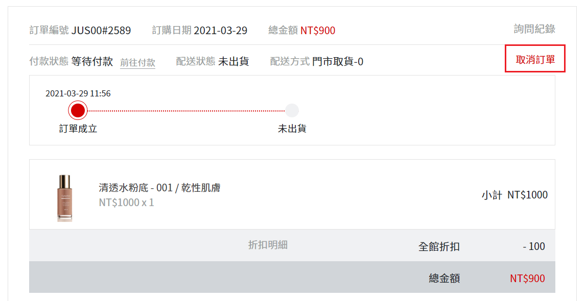

# 門市取貨訂單出貨
當顧客選擇「門市取貨」下單後，管理員需透過後台執行出貨作業。本指南將引導您完成從篩選訂單、列印到店條碼到處理後續退貨的完整流程。
{ .subtitle }

[:lucide-layers:{ title="適用產品" }](../../resources/conventions#適用產品) | 品牌官網
[:lucide-tag:{ title="適用方案" }](../../resources/conventions#適用方案) | 所有 PLUS / 企業
{ .doc-badge }

!!! tip "適用範圍與對照"
    本文件僅適用於 **一般門市訂單** 的出貨管理。若需操作 **POS 門市訂單** 的入庫與取貨流程，請參閱 [POS 門市入庫與取貨作業](../../pos/orders/store-pickup-orders-inbound-and-pickup.md)。

## 使用須知

- **出貨限制**：門市到貨訂單僅支援 **全部出貨**，**不支援部分出貨**。
- **版本限制**：此功能不支援 **高手版**。

## 操作流程

### 出貨作業

1. 登入 CYBERBIZ 管理後台，前往 **訂單 > 所有訂單**。

    > 您可使用訂單篩選器，在 **配送方式** 中選擇 `門市取貨`，找出待處理訂單。

2. 勾選欲處理的訂單（可單筆或批次勾選相同配送方式的訂單）。
3. 點選右上角 **選擇操作**，選擇 **已出貨**。

    { .screenshot }

4. 依訂單出貨進度，將 **配送狀態** 切換為 **已到店 > 已收貨**。

    > 顧客可至會員中心查看訂單狀態，但系統不會主動通知顧客狀態變更。

    { .screenshot }
    { .screenshot }
    

## 常見情境處理

### 取消訂單

=== "商家"

    若配送狀態為 `未出貨`，管理員可直接在訂單內點選 **取消訂單**。

    { .screenshot }

=== "消費者"

    消費者也可於前台訂單明細頁 **取消訂單**。

    { .screenshot }

