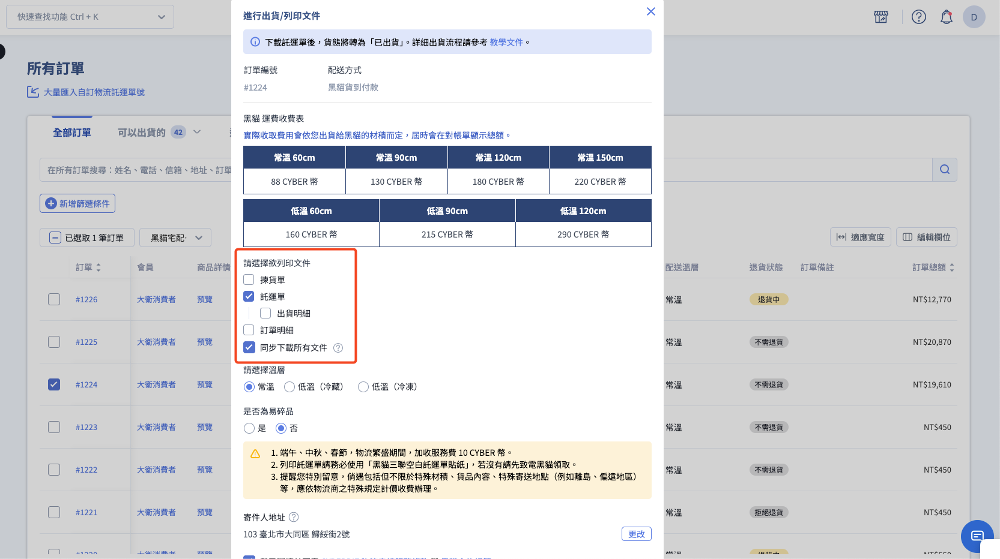
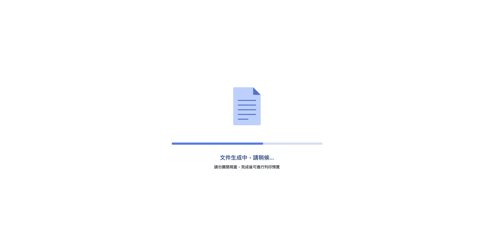
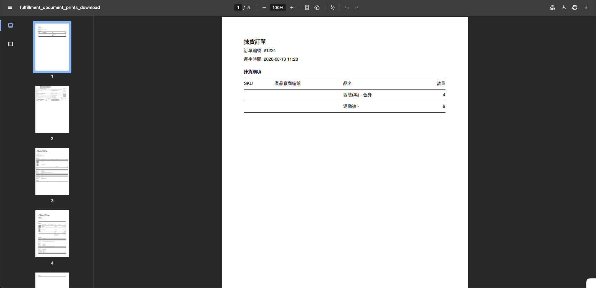

{ title="下載黑貓快速到店常溫託運單" .hero-page }

## 黑貓快速到店出貨說明 { #intro-tcat-cvs }

「黑貓快速到店」是商家將商品委由黑貓物流送至消費者指定的 7-11 門市進行取貨的服務，依商品溫層分為常溫、冷藏、冷凍三種。本文將引導您如何在新版訂單列表中批次處理訂單、列印或下載託運單，並將貨態變更為「已出貨」。確認出貨後，瀏覽器會另開分頁顯示 PDF，您可以直接列印，不必先解壓縮。

!!! info "其他黑貓服務"
    * 若顧客選擇宅配，請見 [使用黑貓宅配出貨](../home-delivery/tcat-home-delivery-v2.md){ title="使用黑貓宅配出貨" }。
    * 自動呼叫黑貓司機到府收件，請見 [自動呼叫黑貓司機取件](../home-delivery/tcat-auto-call-driver-v2.md){ title="自動呼叫黑貓司機取件" }。

## 使用前提與限制 { #prerequisites-tcat-cvs }

在執行黑貓快速到店出貨前，請確保您的系統設定、訂單狀態與硬體設備皆符合以下規範。

### 適用訂單狀態 { #prerequisites-tcat-cvs-order-status }

系統僅允許符合以下條件的訂單執行出貨：

- [x] **配送方式**： 結帳選用對應的「黑貓快速到店」。
- [x] **付款狀態**： 顯示為「已收到款項」或「貨到付款」。
- [x] **配送狀態**： 顯示為「未出貨」、「部分出貨」或「準備出貨中」。

---

### 配送規範 { #prerequisites-tcat-cvs-shipping-rules }

下列為黑貓快速到店的物流規範，請於包裝與出貨前確認：

| 項目 | 內容 |
| :-- | :-- |
| 包裹重量上限 | 單件 10 公斤 |
| 包裹材積上限 | 長 ＋ 寬 ＋ 高 不超過 105 公分 |
| 配送區域 | 僅支援台灣本島，不支援離島 |
| 取貨期限 | 商品抵達超商後，常溫可放置 7 日；冷藏／冷凍僅可放置 4 日。黑貓會於 **包裹到店第一日** 與 **退貨前一日** 各發 1 封簡訊通知消費者，共 2 封。 |
| 託運單時效 | 產出託運單後須於 7 日內聯繫黑貓完成收貨，逾期單號將失效 |
| [逾期未取](#tcat-cvs-overdue-pickup){ title="到店逾期未取" } | 包裹退回商家，黑貓將 **加收一次回程運費** |

!!! tip "冷藏／冷凍出貨的包裝建議"
    * **預冷時間** ：冷藏商品建議預冷 6 小時以上、冷凍商品建議預冷 12 小時以上，以維持溫層至門市取貨時。
    * **託運單防水** ：建議使用防水貼紙列印託運單，或將託運單放入透明防水袋後再黏貼於包裹外，避免因冷凝水使條碼模糊導致司機無法掃描。

---

### 系統限制 { #prerequisites-tcat-cvs-system-contraints }

- **溫層分流（不可混批）**： 常溫、冷藏、冷凍分屬不同託運單。批次勾選出貨時，不同溫層的訂單不可混合勾選處理。
- **功能開通限制**： 商店須開通對應溫層的功能。若要使用冷藏與冷凍服務，系統必須額外開通「商品綁溫層」功能。
- **與峰潮物流互斥**：若商店已串接峰潮物流，則無法使用黑貓快速到店功能，兩者擇一。

## 操作步驟 { #tcat-cvs-operate }

### 出貨前準備 { #prerequisites-tcat-cvs-checklist }

執行黑貓快速到店出貨前，請完成以下準備：

- [x] **黑貓寄件人地址**： 至「金物流」>「[黑貓快速到店託運單](../../payments-and-logistics/setup-print-tcat-quick-store-waybill-v2.md#configure-ezcat-cvs-shipping-note-sender-setup){ title="設定寄件人資訊" }」設定寄件人地址，否則託運單上的寄件人資訊將不完整。
- [x] **耗材與設備**： 已備妥「黑貓三聯空白託運單貼紙」（可致電黑貓客服 02-412-8888 取得），並建議使用雷射印表機列印，以確保條碼清晰。
- [x] **商品預冷（低溫包裹）**： 冷藏商品須預冷 6 小時以上；冷凍商品須預冷 12 小時以上。
- [x] **確認餘額**：一般版商家請至 [儲值中心查看 CYBER 幣餘額](../../website-management/points-deposits.md#cyber-coin-balance){ data-preview }，確認餘額充足；PLUS版 / 企業版商家無此限制。

--- 

### 批次出貨並列印出貨文件 { #operate-tcat-csv-shipping-note }

1. **進入訂單列表**：登入後台，前往 **訂單 > 所有訂單**。
2. **勾選訂單**：在列表中勾選欲出貨的訂單，需確認所選訂單的配送方式皆為「黑貓宅配」。
3. **點擊「更多操作」**：於列表上方點擊 **更多操作** ，在下拉選單中選擇 **黑貓宅配- 進行出貨/列印文件**[^1]。

4. **設定彈出視窗內欄位**：在「進行出貨/列印文件」視窗中依序設定
    * **請選擇溫層**：選擇 **常溫** 、 **低溫(冷藏)** 或 **低溫(冷凍)** 。請確保 **規格與實寄包裹一致**。
    * **是否為易碎品**：選擇 **是** 或 **否** 。
    * **寄件地址**：預設帶入該物流上一次使用的寄件地址（首次帶入 [黑貓設定](../../payments-and-logistics/setup-print-tcat-waybill-v2.md#configure-ezcat-shipping-note-sender-setup){ title="設定寄件人資訊" } 中的地址），如需更改可於視窗內點擊 **「更改」** 按鈕編輯[^3]。

5. **勾選欲列印的文件**：在 **請選擇欲列印文件** 勾選本次要印的種類。預設勾選 **託運單** 與 **同步下載所有文件**。

    | 項目 | 預設 | 說明 | 勾選後按下確認，訂單是否改為 `已出貨` |  
    | :--- | :--- | :--- | :--- |
    | 揀貨單 | 未勾選 | 倉庫揀貨用 | 否 | 
    | 託運單 | 勾選 | 用於黏貼於包裹外箱，供物流人員掃描與送達 | **是** |
    | 出貨明細 | 未勾選 | 須先勾選託運單，才能再勾選 | 否 |
    | 訂單明細 | 未勾選 | 給內部存檔或放入包裹 | 否 | 
    | 同步下載所有文件 | 勾選 | 另將文件打成 ZIP 下載到本機 | **是** |

    { title="勾選欲列印的出貨文件" .screenshot }

6. **同意條款**：勾選 **我已閱讀並同意 CYBERBIZ 物流串接服務條款 與 黑貓合約規範** 。未勾選時 **確認** 無法點擊。

    !!! plan "從彈出視窗直接呼叫黑貓司機"
        若你的店家已開通呼叫黑貓功能，視窗下方會出現「自動呼叫黑貓司機取件」區塊，可在出貨的同時預約司機到府收件。詳細操作請見 [如何自動呼叫黑貓司機取件](../home-delivery/tcat-auto-call-driver-v2.md){ title="自動呼叫黑貓司機取件" }。

7. **確認出貨**：點擊 **確認** 。瀏覽器會另開分頁，先顯示「文件生成中，請稍候」。請勿關閉該分頁。

    { title="出貨文件生成中" .screenshot }

8. **列印 PDF**：生成完成後，分頁會顯示您勾選的文件。點選瀏覽器右上角的列印圖示，或使用 Windows `Ctrl + P`、Mac `Command + P`。

    { title="瀏覽器預覽出貨文件PDF" .screenshot }

    有勾選 **同步下載所有文件** 時，系統也會下載[^1] [託運單 ZIP 壓縮檔](#tcat-cvs-zip-contents){ title="託運單 ZIP 內容物" }。PDF 預設順序為揀貨單 → 託運單 → 出貨明細 → 訂單明細；批次多張訂單時可改 [列印排序](../order-settings/setup-shipping-docs-sort.md){ title="設定列印出貨文件排序" }。

9. **確認貨態已變更**：本次有勾選 **託運單** 或 **同步下載所有文件** 時，被勾選訂單的配送狀態會轉為 **已出貨** 。(詳見 [確認貨態變更](#tcat-cvs-verify-status){ title="確認貨態變更" })

[^1]: 若未出現選項，可能是因為訂單狀態不符或物流設定未完成。詳情參考 [常見問題：沒有進行出貨/列印文件選項](#faq-tcat-cvs-action-missing)。 
[^2]: 若沒有正常下載，請確認瀏覽器是否阻擋了彈跳視窗或廣告，允許本站彈跳視窗後重新點擊下載。更多疑難排解參考 [常見問題：無法下載托運單](#faq-tcat-cvs-download-no-response)
[^3]: 修改後會同步更新該物流頁面地址，不同物流間及公司物流地址互不影響。
---

### 呼叫黑貓司機取件 { #tcat-cvs-call-driver-pickup }

下載託運單後，需聯繫黑貓司機到貨取件:

* **電話呼叫**：撥打黑貓客服專線 (02-412-8888) 安排取件。
* **從後台直接呼叫**：若已開通 [呼叫黑貓功能](../home-delivery/tcat-auto-call-driver-v2.md){ title="自動呼叫黑貓司機取件" }，可在下載託運單時於彈出視窗內預約司機取件。

---

### 確認貨態變更 { #tcat-cvs-verify-status }

成功確認出貨後，可在兩個地方確認貨態：

- **訂單列表頁**：配送狀態欄位顯示 **已出貨**
- **訂單詳情頁**：狀態顯示為 [已出貨(待物流收件)](../home-delivery/shipping-status-tooltip.md#shipping-status-text-type){ data-preview }，表示託運單已產生但黑貓尚未收件

若貨態未更新，請檢查：

* 是否實際完成確認(瀏覽器是否阻擋了新分頁或下載)
* 是否所有勾選的訂單配送方式都符合「黑貓快速到店」

---

### 地址錯誤排除 { #tcat-cvs-address-error }

下載託運單時若出現「寄件人資訊不完整提示」，代表黑貓寄件地址未設定或不完整：

1. 前往 **金物流 > 黑貓快速到店託運單**，確認「黑貓快速到店設定」區塊內的 **寄件地址** 完整填寫(含縣市、區域)，儲存後系統會自動向黑貓查詢寄件人區碼。
2. 儲存後重新執行下載。

??? info "關於寄件地址的注意事項"
    * **地址來源**：寄件地址取自 **金物流 > 黑貓快速到店託運單** 中「黑貓快速到店設定」的地址。
    * **修改方式**：可在下載託運單的彈窗中點擊 **「更改」** 直接編輯，修改後會同步更新至黑貓快速到店設定頁面。

---

### 到店逾期未取 { #tcat-cvs-overdue-pickup }

包裹送達超商後，消費者有取貨期限：

* **常溫**：7 日內
* **冷藏 / 冷凍**：4 日內

黑貓會發送 **2 封簡訊** 提醒消費者：

| 簡訊 | 發送時機 |
| :-- | :-- |
| 第 1 封 | 包裹到店當日 |
| 第 2 封 | 退貨前 1 日(常溫第 6 日、冷藏/冷凍第 3 日) |

## 後續操作 { #nextstep-tcat-cvs }

<!-- - :lucide-printer:{ .lg }  
  [__補印託運單__](../../payments-and-logistics/reprint-waybills.md){ title="補印與加印託運單" }  
  若須重新列印（例如標籤受潮、列印不清），回到訂單列表勾選同筆訂單，於「更多操作」選擇補印託運單。 -->

- :lucide-list-ordered:{ .lg }  
  [__列印出貨文件排序__](../order-settings/setup-shipping-docs-sort.md){ title="設定列印出貨文件排序" }  
  批次列印多張訂單時，可改成依文件類型或依訂單編號排列。

- :lucide-truck:{ .lg }  
  [__自動呼叫司機__](../home-delivery/tcat-auto-call-driver-v2.md){ title="自動呼叫黑貓司機取件" }  
  開通「呼叫黑貓」功能者可於列印託運單時自動呼叫司機。

- :lucide-package-check:{ .lg }  
  [__部分出貨__](../home-delivery/partial-shipment-v2.md){ title="處理訂單部分出貨" }  
  若一筆訂單中只想先寄出部分商品，可改從訂單詳情頁勾選指定品項。

- :lucide-copy-plus:{ .lg }  
  [__加印託運單__](../../payments-and-logistics/setup-print-tcat-waybill-v2.md){ title="設定與加印黑貓託運單" }  
  若一筆訂單因商品多需拆分為多箱寄出，每箱需各自一張託運單。

## 常見問題 { #faq-tcat-cvs }

??? quote "下載沒反應 / 無法下載託運單" 
    { #faq-tcat-cvs-download-no-response }

    通常為以下原因之一：

    * **瀏覽器阻擋彈跳視窗**：請檢查瀏覽器是否阻擋了彈跳視窗或廣告，允許本站彈跳視窗後重新點擊下載。
    * **CYBER 幣不足(一般版商家)**：請至 [儲值中心](../../website-management/points-deposits.md){ data-preview } 儲值。
    * **黑貓快速到店寄件地址未設定**：至 **金物流 > 黑貓快速到店託運單** 的「黑貓快速到店設定」區塊完成寄件地址填寫。
    * **未勾選同意條款**：確認彈出視窗下方「我已閱讀並同意 CYBERBIZ 物流串接服務條款 與 黑貓合約規範」已勾選。

??? quote "「更多操作」下拉中找不到「進行出貨/列印文件」選項？"
    { #faq-tcat-cvs-action-missing }

    通常為以下原因之一：

    * 勾選的訂單在結帳時並未選擇黑貓快速到店配送，或混合勾選了不同溫層／不同物流的訂單。請確保本批訂單為同一種黑貓快速到店類型。
    * 訂單貨態不在「未出貨」、「部分出貨」、「準備出貨中」範圍內（例如已退款、已取消），無法執行出貨。

??? quote "只勾揀貨單或訂單明細，貨態會改成已出貨嗎？"
    { #faq-tcat-cvs-print-without-waybill }

    不會。只有勾選 **託運單** 或 **同步下載所有文件**，再按下 **確認**，訂單才會改為已出貨。只印揀貨單或訂單明細時，配送狀態維持原狀。

??? quote "「是否自動呼叫黑貓司機取件」的選項是灰色／無法勾選？"
    { #faq-tcat-cvs-call-disabled }

    可能為以下情況：

    * 目前時間已超過當日 **16:30** ，自動呼叫功能會自動關閉並停留在「否」，請於次日再使用，或自行致電黑貓安排當日取件。
    * 商店未開通「呼叫黑貓」功能，整個自動呼叫區塊不會顯示，請聯繫業務窗口或致電黑貓客服取件。

??? quote "付款狀態還是「等待付款」可以先下載託運單嗎？"
    { #faq-tcat-cvs-payment-status }

    不行。出貨動作要求訂單付款狀態為「已收到款項」或「貨到付款」，且貨態為「未出貨」、「部分出貨」或「準備出貨中」。若付款尚未確認，請先處理收款後再執行出貨。

??? quote "託運單列印壞掉或遺失，可以重印嗎？"
    { #faq-tcat-cvs-redownload }

    可以。請在訂單列表勾選該筆訂單，於「更多操作」選擇 **補印託運單** ，系統會以原託運單號重新產出檔案，不會重複建立單號。

??? quote "同一批訂單可以混合常溫與冷凍一起出貨嗎？"
    { #faq-tcat-cvs-mixed-temperature }

    不行。常溫、冷藏、冷凍為三個獨立的下載動作，且訂單在結帳時即已綁定溫層。請依溫層分批勾選與出貨，避免出貨後因溫層不符影響商品品質。

??? quote "冷藏或冷凍商品出貨時有什麼注意事項？"

    冷藏與冷凍商品出貨時請注意以下事項：

    - **預冷時間**：冷藏商品建議預冷 6 小時以上，冷凍商品建議預冷 12 小時以上，以維持溫層至門市取貨時
    - **託運單防水**：建議使用防水貼紙列印託運單，或將託運單放入透明防水袋後再黏貼於包裹表面，避免因冷凝水使條碼模糊導致司機無法掃描

??? quote "一般版商家 CYBER 幣餘額不足時可以下載託運單嗎？"

    不行。下載託運單時系統會即時從 CYBER 幣餘額扣款，餘額不足時下載會失敗。請先至 [儲值中心](../../website-management/points-deposits.md){ data-preview } 儲值後再重新操作。

### 託運單 ZIP 內容物 { #tcat-cvs-zip-contents }

下載完成後，zip 內包含四份 PDF，分別供不同流程使用：

| 檔案 | 用途 | 收件對象 |
|---|---|---|
| **託運單** | 黑貓收件、配送依據；以黑貓三聯空白託運單貼紙列印後黏貼於包裹表面 | 司機 |
| **出貨明細** | 出貨包裹內附的明細單，含品項與數量 | 消費者(隨包裹) |
| **揀貨單** | 倉庫揀貨用的清單，依品項彙整方便揀料 | 內部倉務人員 |
| **訂單明細** | 訂單完整資訊，含金額、付款方式、消費者資料 | 內部存檔 / 客服 |

