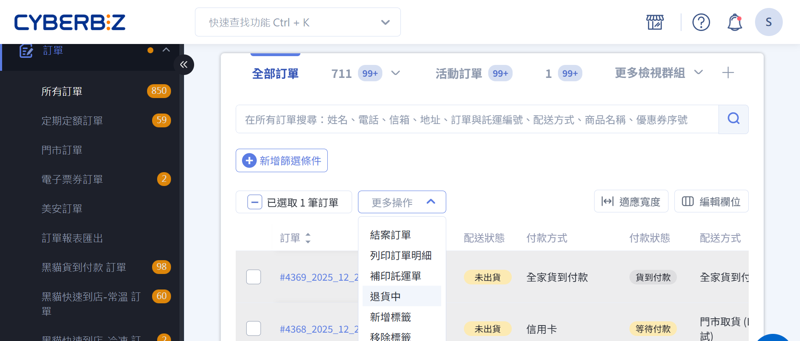
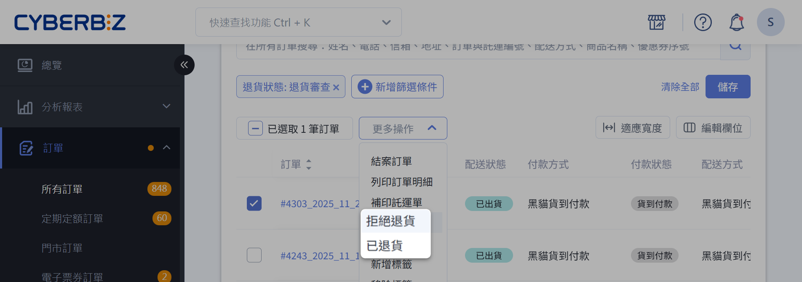
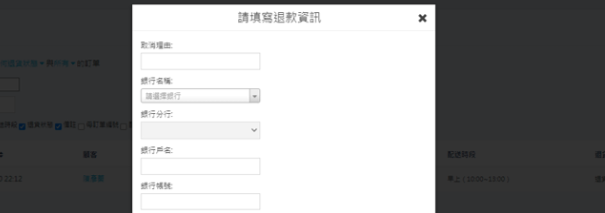
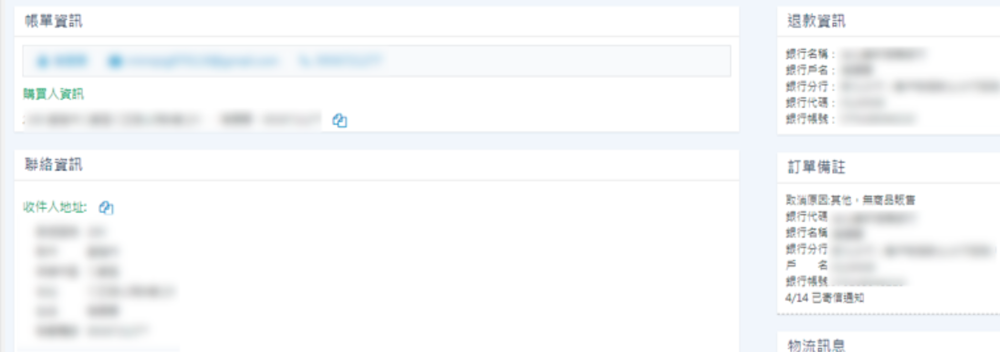
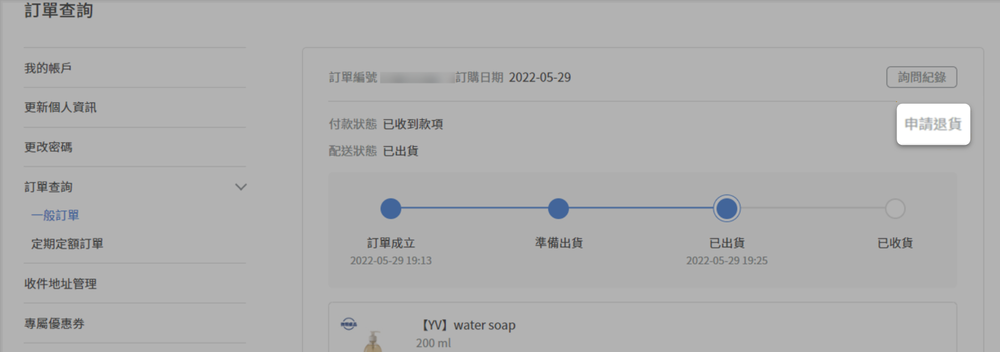
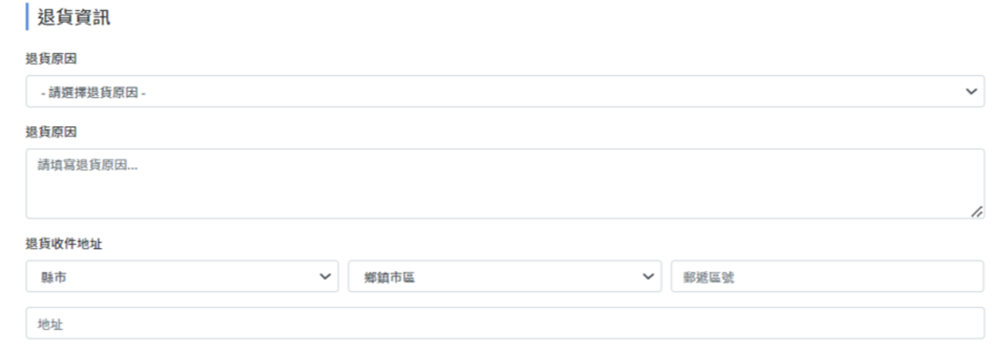
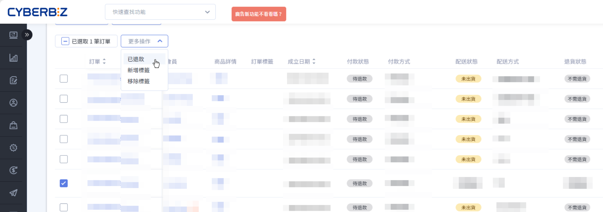
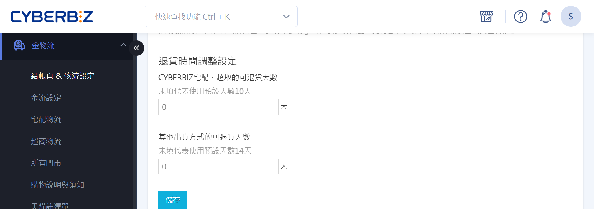

# 一般退貨退款

訂單商品進行退貨與退款的操作流程。
{ .subtitle }

{ .hero-page }

### 操作目錄

- [訂單退款形式說明](#訂單退款形式說明) (各方案有所不同)
- [商家操作退款流程](#商家操作退款流程)
- [顧客申請退貨退款](#顧客申請退貨退款)
- [LINE Pay、街口支付逾期退款流程](#line-pay街口支付逾期退款流程)
- [退貨時間設定](#退貨時間設定) (各方案有所不同)

### 注意事項

*   **通用規則**:
    *   每筆訂單僅接受一次退貨及一次退款申請。
    *   **紅利/優惠券**:
        *   訂單中使用的紅利/優惠券，系統「不會」自動歸還。
        *   訂單消費所獲得的紅利/優惠券，系統「不會」自動扣除。
        *   若需手動調整，請至「會員」>「所有會員」> 顧客個人頁面操作。
    *   **分潤處理**: 已「結案」的訂單，即使後續退貨，分潤仍會計算且不受影響。
    *   **人工退款**: 若需由 CYBERBIZ 進行人工退款，將酌收每筆 30 元帳務處理費，並於 7-10 個工作天內完成。
    *   **全部退貨**: 將退還整筆訂單金額（含運費）。
    *   **發票處理**:
        *   **CYBERBIZ 代開**: 發票將進行折讓。
        *   **非 CYBERBIZ 代開 (如星益欣、綠界)**: 依開立時間作廢或折讓（通常為當月 5 號前作廢，之後折讓）。
*   **倉儲用戶**: 使用 CYBERBIZ 電商倉儲的商家，若需自行驗收退貨，請參考 [商家自行驗收退貨](https://www.cyberbiz.io/support/?p=4414) 文件。

## 訂單退款形式說明

不同方案支援的退款方式有所差異。請根據您的方案點擊下方頁籤，查看對應的退款形式。

=== "一般版"

    | 支付方式 | 自動退款 | 需人工退款 | 備註 |
	| :--- | :---: | :---: | :--- |
	| 信用卡 | :lucide-x: | :lucide-check: | 請至金流商後台操作 |
	| LINE Pay | :lucide-x: | :lucide-check: | 請至金流商後台操作 |
	| 街口支付 | :lucide-x: | :lucide-check: | 請至金流商後台操作 |
	| PayPal | :lucide-x: | :lucide-check: | 請至金流商後台操作 |
	| 貨到付款 | :lucide-x: | :lucide-check: | 請自行轉帳退回 |
	| 超商代碼 | :lucide-x: | :lucide-check: | 請自行轉帳退回 |
	| 虛擬ATM | :lucide-x: | :lucide-check: | 請自行轉帳退回 |
	| 普通付款方式 | :lucide-x: | :lucide-check: | 請自行轉帳退回 |

    **附註事項：**
    
    - 一般版不支援自動退款功能，所有退款皆需人工處理。
    - 信用卡、LINE Pay 等金流，請登入對應的金流服務商後台進行退款。
    - 貨到付款、ATM 等方式，請商家自行與消費者協調退款方式（如轉帳）。

=== "PLUS版"

    | 支付方式 | 自動退款 | 需人工退款 | 備註 |
    | :--- | :---: | :---: | :--- |
    | 信用卡 | :lucide-check: | 付款超過180天 | |
    | PayPal | :lucide-check: | 付款超過180天 | |
    | AFTEE | :lucide-check: | :lucide-x: | 自動退款至顧客帳戶 |
    | ATOME | :lucide-check: | :lucide-x: | 自動退款至顧客帳戶 |
    | 貨到付款 | :lucide-x: | :lucide-check: | |
    | 超商代碼 | :lucide-x: | :lucide-check: | |
    | 虛擬ATM | :lucide-x: | :lucide-check: | |
    | LINE Pay | :lucide-x: | :lucide-check: | 商家需至金流後台操作或自行轉帳 |
    | 街口支付 | :lucide-x: | :lucide-check: | 商家需至金流後台操作或自行轉帳 |

    **附註事項：**
    
    - 超過自動退款期限後，需由商家向顧客索取退款帳戶資訊，由 CYBERBIZ 進行人工退款，每筆收取 30 元帳務處理費。
    - 貨到付款、超商代碼、虛擬ATM，以及自有帳戶的 LINE Pay/街口支付，皆需要進行人工退款。

=== "企業版"

    | 支付方式 | 自動退款 | 需人工退款 | 備註 |
    | :--- | :---: | :---: | :--- |
    | 信用卡 | :lucide-check: | 付款超過180天 | |
    | LINE Pay | :lucide-check: | 付款超過60天 | |
    | 街口支付 | :lucide-check: | 付款超過180天 | 街口聯名卡直接退刷，銀行帳戶扣款則退至街口帳戶 |
    | PayPal | :lucide-check: | 付款超過180天 | |
    | AFTEE | :lucide-check: | :lucide-x: | 自動退款至顧客帳戶 |
    | 貨到付款 | :lucide-x: | :lucide-check: | |
    | 超商代碼 | :lucide-x: | :lucide-check: | |
    | 虛擬ATM | :lucide-x: | :lucide-check: | |

    **附註事項：**
    
    - 超過自動退款期限後，商家需向顧客索取退款帳戶資訊，由 CYBERBIZ 進行人工退款，每筆收取 30 元帳務處理費。
    - 貨到付款、超商代碼、虛擬ATM 皆需由 CYBERBIZ 進行人工退款。

## 商家操作退款流程

本節說明商家在後台手動發起退貨退款的標準流程。此流程適用於所有方案，但退款方式（自動或人工）請參考上一節的說明。

### 步驟一：將訂單狀態更改為「退貨中」

若訂單已超過顧客可自行申請退貨的期限，或商家需主動處理退貨時，請執行此操作。

1.  前往「訂單」>「所有訂單」，找到目標訂單。
2.  勾選訂單，點擊「更多操作」並將訂單狀態更改為「**退貨中**」。此狀態會同步顯示於顧客的前台訂單頁面。
3.  若需取回商品，可搭配使用 [逆物流服務](https://www.cyberbiz.io/support/?p=5813)。

### 步驟二：將訂單狀態更改為「退貨審查」

當商家收到顧客退回的商品後，請執行此操作以審核商品狀態。

1.  勾選已處於「退貨中」的訂單。
2.  點擊「更多操作」，將訂單狀態更改為「**退貨審查**」。

### 步驟三：審核並執行退款或拒絕

根據商品檢查結果，決定是否退款。

1.  勾選已處於「退貨審查」的訂單。
2.  點擊「更多操作」，選擇執行「**已退貨**」或「**拒絕退貨**」。
    *   **已退貨**：進入退款流程。
    *   **拒絕退貨**：流程終止，無法再次申請退貨退款。

### 步驟四：處理退款

*   **自動退款** (適用於企業版/PLUS版的部分金流):
    *   執行「已退貨」後，系統將自動觸發退款流程，款項會退回原支付帳戶。

*   **人工退款**:
    *   執行「已退貨」後，系統會彈出「**人工退款資料**」視窗。
    *   請填寫顧客提供的銀行帳戶資訊，送出後將由 CYBERBIZ 財會人員處理。

		

    *   申請後，商家後台與顧客前台皆會顯示相關退款資訊。

		

## 顧客申請退貨退款

若訂單在可申請退貨的期限內，顧客可自行於前台提出申請。

### 顧客操作流程

1.  登入會員後，前往「我的帳戶」>「訂單查詢」。
2.  找到目標訂單，點擊訂單編號進入明細頁。
3.  點擊「**申請退貨**」。

	
	
4.  填寫退貨原因。若非自動退款的支付方式，需一併填寫退款銀行資訊。

	
	
5.  送出申請後，訂單狀態會變為「**退貨申請**」。

### 商家後續操作

顧客申請後，商家需接續完成審核流程。

- 訂單狀態變為「退貨申請」後，請依照 [商家操作退款流程](#商家操作退款流程) 的 **步驟一** 至 **步驟四**，依序將訂單狀態更改為「退貨中」、「退貨審查」，最後執行「已退貨」或「拒絕退貨」。

## LINE Pay、街口支付逾期退款流程

若您的 LINE Pay 或街口支付訂單已超過金流服務商的自動退款期限（LINE Pay 為 60 天，街口支付為 180 天），則退款流程將轉為人工處理。此流程適用於使用 **自有金流帳戶** 的商家。

### 方法一：顧客從前台申請

1.  **顧客端**：顧客如常操作「[申請退貨](#顧客申請退貨退款)」，並填寫退款的銀行帳戶資料。
2.  **商家端**：
    *   訂單進入「退貨申請」狀態。
    *   商家依序操作「退貨中」→「退貨審查」→「已退貨」。
    *   執行「已退貨」後，訂單的付款狀態會變為「**待退款**」。
    *   商家需 **自行匯款** 給顧客，完成後再手動將訂單狀態更新為「**已退款**」。

	

### 方法二：商家在後台操作

**商家端**：

*   商家主動操作「退貨中」→「退貨審查」→「已退貨」。
*   執行「已退貨」時，系統會要求填寫顧客的銀行資訊。
*   填寫完畢後，訂單狀態變為「**待退款**」。
*   商家 **自行匯款** 後，手動將狀態更新為「**已退款**」。

## 退貨時間設定

[:lucide-lock:{ title="適用方案" }](../../resources/conventions#適用方案) |  PLUS / 企業

您可以自訂顧客可在前台申請退貨的天數。

=== "PLUS版"

    *   **後台路徑**: 「金物流」→「結帳頁 & 物流設定」→「退貨時間調整設定」
    *   **設定項目**:
        *   **使用 CYBERBIZ 串接物流**: 可設定「已收貨」後 \_\_\_ 天內可申請退貨。（預設 10 天）
        *   **使用自訂物流**: 可設定「已出貨」後 \_\_\_ 天內可申請退貨。（預設 14 天）
    *   填寫 `0` 代表不開放顧客自行申請退貨。

=== "企業版"

    *   **後台路徑**: 「金物流」→「結帳頁 & 物流設定」→「前台退貨設定」
    *   **設定項目**:
        *   **使用 CYBERBIZ 串接物流**: 可設定「已收貨」後 \_\_\_ 天內可申請退貨。（預設 10 天）
        *   **使用自訂物流**: 可設定「已出貨」後 \_\_\_ 天內可申請退貨。（預設 14 天）
    *   填寫 `0` 代表不開放顧客自行申請退貨。

## 常見問題

??? quote "一筆訂單可以申請幾次退貨與退款？"
	每筆訂單 **僅能申請一次退貨及一次退款** ，完成或被拒絕後無法再次申請。

??? quote "退貨後，紅利或優惠券會自動歸還或扣回嗎？"
	不會。

	- 使用的紅利／優惠券 **不會自動歸還**    
	- 訂單獲得的紅利／優惠券 **不會自動扣除**
	    
	如需調整，請至 **會員 > 所有會員 > 顧客個人頁面** 手動處理。

??? quote "所有方案都支援自動退款嗎？"

	不是。是否支援自動退款，取決於 **方案類型與付款方式**：
	
	- **一般版**：不支援自動退款，需人工處理
	- **PLUS / 企業版**：部分金流支援自動退款，逾期則需人工退款
    
??? quote "什麼情況下需要人工退款並收取手續費？"

	當退款無法自動完成（如付款逾期）時，將由 CYBERBIZ 進行人工退款，每筆收取 **30 元帳務處理費**。

??? quote "顧客如何申請退貨？"

	在可申請期限內，顧客可於前台操作：  **我的帳戶 > 訂單查詢 > 訂單明細 > 申請退貨**

??? quote "商家拒絕退貨後，顧客還能再次申請嗎？"

	不行。一旦執行「**拒絕退貨**」，該筆訂單即無法再次申請退貨退款。

??? quote "可以設定顧客可申請退貨的天數嗎？"

	可以，但僅適用於 **PLUS / 企業版**。將天數設為 `0` 代表不開放顧客自行申請退貨。