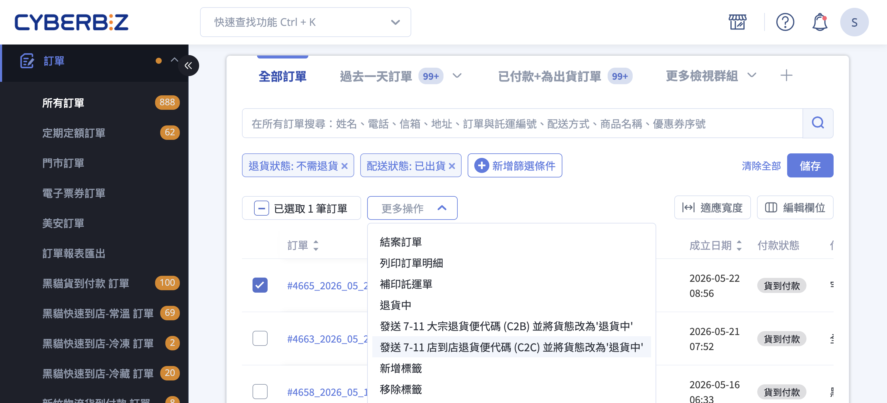
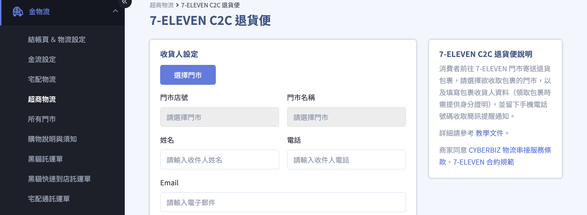
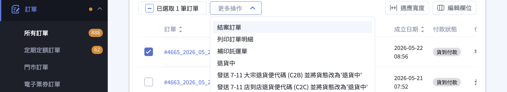
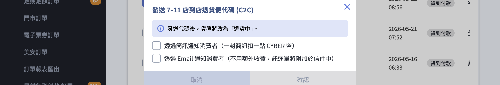

開通 7-11 C2C 退貨便、設定收貨人資料、發送退貨寄件代碼給消費者，以及完整的退貨審查與退款流程。
{ .subtitle }

[:lucide-grid-2x2-plus:{ title="適用擴充" }](../../resources/conventions#適用擴充) | CYBERBIZ PAYMENTS
{ .doc-badge }

{ .hero-page }

## 7-11 C2C 退貨便說明

本功能讓消費者可透過 7-ELEVEN 門市寄回退貨商品，商家無需要求消費者原訂單必須是超商取貨，任何配送方式的訂單都可以透過此服務收回退貨包裹。

## 使用前提與限制 { #prerequisites-seven-eleven-c2c-return }

!!! plan "方案 / 開通條件"
    「7-ELEVEN C2C 退貨便」屬於 **加值購買功能**，非任何方案預設包含。商店需先向 CYBERBIZ 客服申請開通，完成後才會在後台「金物流 > 超商物流」清單中出現此服務。

訂單必須同時符合以下條件，才能在訂單列表點選發送退貨代碼：

- [x] **訂單金額**：單筆訂單總金額需小於 **NT$20,000**(超過上限會被系統擋下)
- [x] **配送方式**：單一配送方式的訂單(不支援多重配送方式拆單)
- [x] **退貨狀態**：訂單需處於「不需退貨」、「申請退貨」或「退貨中」其中一種
- [x] **配送狀態**：CYBERBIZ 物流訂單需為「已出貨 / 到貨 / 收貨」；其他物流訂單需為「已收貨」
- [x] **收貨人資料**：已在「金物流 > 超商物流 > 7-ELEVEN C2C 退貨便」完成商家收貨資料設定

完整的「配送方式 × 配送進度 × 退貨狀態」對應矩陣，以及每個欄位的詳細說明，請見 [訂單發送條件對照表](./references/7-11 C2C 退貨便 — 訂單發送條件對照表.md)。

## 計費規則 { #pricing-seven-eleven-c2c-return }

| 項目 | 費用 | 負擔方 |
| :-- | :-- | :-- |
| 退貨運費 | **NT$70 / 單** | 商家全額負擔 |
| 簡訊通知消費者 | 1 點 CYBER 幣 / 封 | 商家負擔(可選擇不發送) |
| Email 通知消費者 | 免費 | — |

!!! info "Cyber 幣預扣與返還機制"
    商家於後台產生退貨便代碼時，系統會 **預扣 Cyber 幣** 作為退貨運費。若代碼產生後 **超過 2 週仍未被消費者用於寄件**，系統會自動取消該筆代碼並將 Cyber 幣補回商家帳戶，並在備註欄位記錄返還金額與時間。

## 操作步驟 { #operate-seven-eleven-c2c-return }

### 一、開通與設定收貨人資料 { #operate-seven-eleven-c2c-return-setup }

開通後，商家需先填寫「收貨人設定」，系統才能在發送退貨代碼時正確產製託運單。

1. **進入設定頁**：後台依序點選 **「金物流/超商物流」 > 「7-ELEVEN C2C 退貨便」** ，點擊 **編輯** :lucide-file-pen-line:。
2. **啟用設定**：勾選同意開通功能，點擊 **確認**。
2. **選擇收件門市**：點擊 **「選擇門市」** 按鈕(已設定過則顯示為 **「修改門市」** )，畫面會跳出 7-ELEVEN 官方門市地圖視窗，選定後系統會自動帶入 **門市店號** 與 **門市名稱**(此兩欄位無法手動編輯)。
3. **填寫收貨人資料**：依序輸入 **姓名** 、 **電話** 、 **Email** 三個欄位[^1]。
4. **儲存設定**：確認資料無誤後送出儲存。

[^1]: 姓名請務必填寫 **與身分證件一致** 的真實姓名，商家至門市領取退貨包裹時店員會核對證件；電話建議使用手機號碼，以便接收「包裹到店」的系統簡訊通知。

---

### 二、發送退貨寄件代碼給顧客 { #operate-seven-eleven-c2c-return-send-code }

當消費者提出退貨需求，商家可從訂單列表頁產生一組代碼提供給消費者。

1. **進入訂單列表**：後台依序點選 **「訂單」 > 「所有訂單」** 。
2. **勾選欲退貨的訂單**：確認該訂單符合 [使用前提與限制](#prerequisites-seven-eleven-c2c-return){ data-preview } 中列出的條件。
3. **點選批次動作**：在訂單上方的更多操作中選擇 **「發送 7-11 C2C 退貨寄件代碼並將貨態改為'退貨中'」** 。

    

4. **選擇通知方式**：畫面會彈出 **「發送 7-11 C2C 退貨代碼」** 視窗，提示「發送代碼後，貨態將改為「退貨中」。」，並提供兩種通知方式可勾選(至少需勾選一項才能送出):
    * **透過簡訊通知消費者**：一封簡訊扣一點 CYBER 幣，系統會把代碼發送至消費者下單時填寫的手機號碼。
    * **透過 Email 通知消費者**：不用額外收費，託運單 PDF 會直接附加於信件中，消費者可自行列印。

    

5. **確認送出**：確認後系統會即時：
    * 預扣 Cyber 幣(退貨運費 70 元)
    * 取得 7-ELEVEN 退貨代碼
    * 依勾選的通知方式發送代碼與託運單給消費者
    * 將該筆訂單貨態改為 **「退貨中」**

!!! tip "代碼有效期限"
    退貨便代碼自申請當日起 **7 天內** 有效，逾期將自動失效；若 2 週內消費者仍未持代碼至門市寄件，系統會自動取消代碼並返還預扣的 Cyber 幣。

---

### 三、消費者端的寄件流程(供商家參考) { #operate-seven-eleven-c2c-return-customer }

商家可以據此向消費者說明寄件方式：

1. **使用簡訊代碼**：消費者前往 7-ELEVEN 門市，於 ibon 機台依序點選 **「交貨便/寄件/ibon 寄件」 > 「代碼輸入」** ，輸入通知中的代碼並列印託運單。
2. **使用 Email 託運單**：Email 通知信中附有託運單 PDF，消費者可自行列印並貼於包裹外箱。
3. **櫃台交寄**：消費者將貼好託運單的包裹交給 7-ELEVEN 店員即完成寄件， **無需在櫃台支付任何費用** 。

---

### 四、商家端取貨與門市關轉處理 { #operate-seven-eleven-c2c-return-pickup }

1. **包裹到店通知**：當包裹送達商家設定的收件門市時，系統會發送簡訊至設定的電話號碼。
2. **前往門市取貨**：商家需在包裹到店後 **7 天內** 攜帶 **與「姓名」欄位一致的身分證件正本** 前往門市領取，逾期未取時，包裹會自動改以 **宅配到付** 方式退回「[公司物流地址](../website-management/設定網站基本資訊.md#gp-logistics-address){ data-preview }」(由商家負擔宅配運費)。
3. **遇到門市關轉時**:
    * **發送代碼前門市已關**：回到「金物流 > 超商物流 > 7-ELEVEN C2C 退貨便」設定頁，重新選擇門市後再次發送代碼。
    * **包裹寄出後門市關閉**：進入該筆訂單的 **訂單詳情頁** ，系統會在物流資訊區塊下方顯示警示與 **「重新選擇門市」** 按鈕，商家需在門市關閉後 **6 天內** 重選新的收件門市[^2]，否則包裹會改以宅配到付方式退回公司物流地址。

        

[^2]: 重選門市的入口僅在「門市關閉、尚未重選、且關閉時間在 6 天內」三項條件同時成立時才會顯示。超過 6 天後該按鈕會自動消失。

---

### 五、退貨審查與退款 { #operate-seven-eleven-c2c-return-refund }

1. **包裹簽收後**：商家在門市取回包裹並系統簽收後，該筆訂單的退貨狀態會自動變更為 **「退貨審查」** 。
2. **檢查商品完整性**：逐項確認商品狀況。如確認退款，回到訂單列表頁勾選該筆訂單，點選批次動作 **「已退貨」** 標記退貨完成。
3. **執行退款**:
    * **CYBERBIZ PAYMENTS 串接訂單**：系統依原付款方式啟動退刷或人工退款流程，商家依後台指示完成即可。
    * **其他金流訂單**：商家需至原金流商後台執行退刷，或請消費者提供帳戶資訊後自行匯款，完成後再於訂單詳情頁將付款狀態手動標記為「已退款」。

## 重要規範與限制 { #specs-seven-eleven-c2c-return }

* **單筆訂單僅能申請一次退貨**：若已標記為「退貨中」、「退貨審查」或「已退貨」的訂單，無法再次發送退貨便代碼。
* **金額上限 NT$20,000**：這是 7-ELEVEN 物流系統的硬性限制，超過此金額的訂單需採用其他退貨方式(如宅配到府)。
* **無法跨物流商**：本服務僅限退回至 7-ELEVEN 門市，商家無法指定其他超商品牌。
* **無法部分退貨**：整筆訂單以單一退貨代碼處理，若僅需部分商品退貨，商家需自行與消費者溝通實際退款金額。
* **代碼效期 7 天 / 取貨期 7 天**：消費者需在代碼產生後 7 天內至門市寄件；商家需在包裹到店後 7 天內前往領取，否則改為宅配到付退回。

## 後續操作 { #next-steps-seven-eleven-c2c-return }

- :lucide-truck:{ .lg }  
  [__部分出貨操作__](設定訂單部分出貨.md){ data-preview }  
  退貨完成後若需要重新出貨剩餘品項，可參考部分出貨流程。

- :lucide-settings:{ .lg }  
  [__公司物流地址設定__](../website-management/設定網站基本資訊.md#gp-logistics-address){ data-preview }  
  逾期未取的退貨包裹會改以宅配到付方式退回此地址，建議事先確認資料正確。

- :lucide-check-circle:{ .lg }  
  [__退貨審查與退款執行__](訂單退貨流程.md){ data-preview }  
  包裹簽收後系統自動改為「退貨審查」，商家需逐項確認商品狀況，再依原付款方式啟動退刷或人工退款流程。

- :lucide-credit-card:{ .lg }  
  [__其他金流退款__](訂單退款流程.md){ data-preview }  
  非 CYBERBIZ PAYMENTS 串接訂單，商家需至原金流商後台執行退刷，或請顧客提供帳戶資訊後自行匯款。

## 常見問題 { #faq-seven-eleven-c2c-return }

??? quote "為什麼訂單列表的批次動作裡找不到「發送 7-11 C2C 退貨寄件代碼」?"
    { #faq-seven-eleven-c2c-return-action-missing }
    請依序檢查：

    - 商店是否已向 CYBERBIZ 客服申請開通「7-ELEVEN C2C 退貨便」加值功能
    - 勾選的訂單是否符合所有發送條件 — 詳見 [訂單發送條件對照表](./references/7-11 C2C 退貨便 — 訂單發送條件對照表.md){ data-preview }
    - 是否同時勾選了不同狀態的訂單(批次動作要求所選訂單狀態一致)

??? quote "Cyber 幣什麼時候會扣款?消費者沒寄件還會被扣嗎?"
    { #faq-seven-eleven-c2c-return-cyber-charge }
    商家點選 **「確認」** 送出退貨代碼的當下，系統會立即預扣 Cyber 幣(NT$70 / 單)。若消費者在 2 週內未持代碼至門市寄件，系統會自動取消該代碼並把預扣的 Cyber 幣補回帳戶，並在備註中記錄返還明細。

??? quote "商家忘了去門市取退貨包裹會怎麼樣?"
    { #faq-seven-eleven-c2c-return-pickup-overdue }
    包裹到店後若超過 7 天未領取，系統會將包裹改以 **宅配到付** 方式退回到「一般設定 > 公司物流地址」設定的地址， **宅配運費由商家負擔** 。

??? quote "可以改用 OK、全家、萊爾富等其他超商退貨嗎?"
    { #faq-seven-eleven-c2c-return-other-cvs }
    目前 CYBERBIZ 後台的 C2C 退貨代碼功能僅支援 7-ELEVEN，其他超商品牌需請消費者自行寄回(費用依超商規定)。

??? quote "為什麼設定收貨人時門市店號與門市名稱欄位無法輸入?"
    { #faq-seven-eleven-c2c-return-store-readonly }
    這兩個欄位由系統自動帶入。請點擊 **「選擇門市」** 按鈕(已選擇過則為 **「修改門市」** )從 7-ELEVEN 官方門市地圖視窗中挑選，系統會自動填入正確的店號與名稱，以避免拼字錯誤造成寄件失敗。

??? quote "包裹寄出後，7-ELEVEN 門市突然關閉怎麼辦?"
    { #faq-seven-eleven-c2c-return-store-closed }
    進入該筆訂單的訂單詳情頁，系統會在物流資訊區塊下方顯示提示與 **「重新選擇門市」** 按鈕。請在門市關閉後 **6 天內** 重選新門市，超過 6 天該入口會消失，屆時包裹會改以宅配到付方式退回公司物流地址。

## 參考資料 { #reference-seven-eleven-c2c-return }

- [訂單發送條件對照表](./references/7-11 C2C 退貨便 — 訂單發送條件對照表.md)
- [7-ELEVEN 交貨便官方說明](https://www.7-11.com.tw/service/accept.aspx){ target="_blank" }

