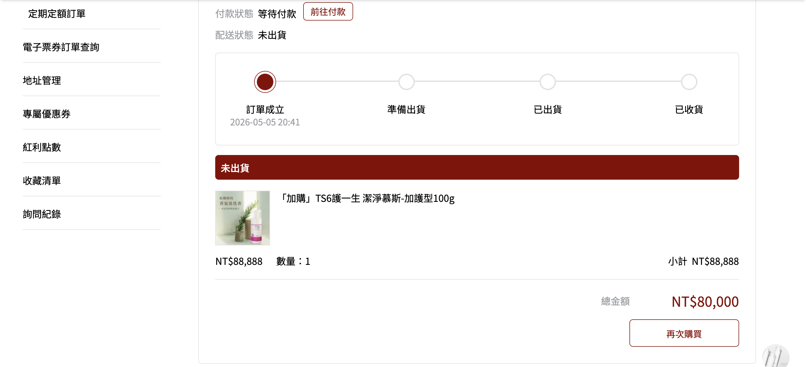
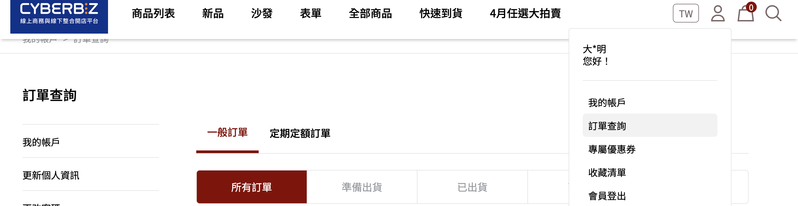
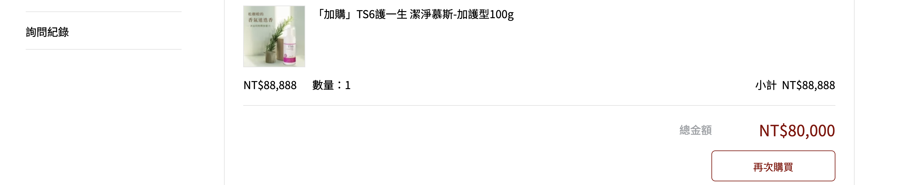

前台會員的再次購買功能，讓會員能輕鬆重新下單過去購買過的產品，包含使用前提、操作流程及特殊情境說明。
{ .subtitle }

[:lucide-tag:{ title="適用方案" }](../../../resources/conventions#適用方案) | 企業  
[:lucide-bolt:{ title="適用功能" }](../../resources/conventions#適用功能) | 拖拉版型
{ .doc-badge }

{ .hero-page }

## 再次購買功能說明

「**再次購買**」功能能讓會員輕鬆重新下單過去曾購買過的產品，無需再次瀏覽整個網站或搜尋商品。這項功能縮短了購物選擇時間，有助於提升會員的購物體驗與忠誠度。

## 使用前提與限制

在開始使用前，請先確認商店符合以下條件：

- [x] **版型限制**：此功能僅支援「**拖拉版型**」使用。
- [x] **訂單類型**：僅支援「**一般訂單**」，不包含定期定額訂單或快速到貨訂單。
- [x] **結帳依據**：再次購買時的商品價格、內容與優惠計算，皆以 **新購物車結帳頁面的最終資訊** 為準。

## 前台會員操作流程

1.  **進入訂單列表**：會員登入官網後，進入「**訂單查詢**」中的「一般訂單」分頁。

    

2.  **選取訂單**：挑選想要重複購買的舊訂單，不論該筆訂單是否已付款或已出貨皆可操作。
3.  **點擊再次購買**：在該筆訂單的右下角點擊「**再次購買**」按鈕，或從「近期訂單」中直接點選。

    

    !!! note "自動過濾非銷售品項"
        系統僅會將「一般商品」加入購物車。原訂單內的贈品、加價購商品、首購禮及贈品券將自動排除，不會重複加入。 [瞭解詳情][order-repurchase-block]{ data-preview }

    ??? warning "若包含失效或缺貨商品"

        當原訂單包含已下架或庫存不足的商品時，系統將跳出彈窗告知。

        * **處理方式**：點擊「確認」後，系統仍會將其餘符合條件的商品加入購物車。
        * **詳細說明**：[系統提示與警告][order-repurchase-error]{ data-preview }。

4.  **加入購物車**：系統會自動將符合條件的商品與數量加入新購物車，會員隨後即可前往購物車進行結帳。

## 無法加入購物車特殊情境 { #order-repurchase-block }

當會員點選「再次購買」時，若原訂單內含有以下情況的商品，該品項將 **不會** 被加入新的購物車：

*   **商品失效**：原商品已不存在或訂單狀態被設定為「**非公開**」。
*   **庫存不足**：商品庫存歸零，且後台設定為「**庫存不足時停止銷售**」。
*   **行銷贈品類**：原商品屬於 **贈品、加價購、首購禮或贈品券**。
*   **組合品限制**：若原訂單購買的是組合品，但其中的任一子商品符合上述無法加入的規則，則整個組合品都無法加入新購物車。

## 系統提示與警告 { #order-repurchase-error}

點選按鈕後，若部分商品碰到特定狀況，系統會彈窗告知會員：

* **提示內容**：條列說明哪些商品因「已下架」、「設為非公開」或「庫存不足」而無法加入。
* **後續處理**：點擊彈窗中的「確認」後，系統仍會將 **其餘符合條件** 的商品加入購物車，您可繼續完成結帳。

## 後續操作

- :lucide-shopping-cart:{ .lg }  
  [__前往購物車結帳__](../../shopping-cart/購物車結帳流程.md){ data-preview }  
  商品加入購物車後，會員可前往購物車確認商品數量、優惠及運費，完成結帳流程。

- :lucide-file-search:{ .lg }  
  [__查詢訂單狀態__](訂單管理介面說明.md){ data-preview }  
  結帳完成後，會員可於「訂單查詢」查看訂單狀態、出貨進度與付款資訊。

- :lucide-tag:{ .lg }  
  [__設定訂單加價購__](../marketing/設定訂單加價購.md){ data-preview }  
  吸引會員再次購買時，可在結帳頁面加購其他商品，提升客單價與回購率。

## 常見問題

??? quote "為什麼點選「再次購買」後，部分商品沒有被加入購物車？"

    若原訂單含有以下情況的商品，該品項將不會被加入新的購物車：

    - [x] **商品失效**：原商品已不存在或訂單狀態被設定為「非公開」
    - [x] **庫存不足**：商品庫存歸零，且後台設定為「庫存不足時停止銷售」
    - [x] **行銷贈品類**：原商品屬於贈品、加價購、首購禮或贈品券
    - [x] **組合品限制**：若原訂單購買的是組合品，但其中任一子商品符合上述規則，則整個組合品都無法加入

??? quote "再次購買功能支援哪些類型的訂單？"

    此功能僅支援「**一般訂單**」，不包含定期定額訂單或快速到貨訂單。不論該筆訂單是否已付款或已出貨，會員皆可操作再次購買。

??? quote "再次購買時的商品價格如何計算？"

    再次購買時的商品價格、內容與優惠計算，皆以 **新購物車結帳頁面的最終資訊** 為準，不會沿用原訂單的價格或優惠設定。

