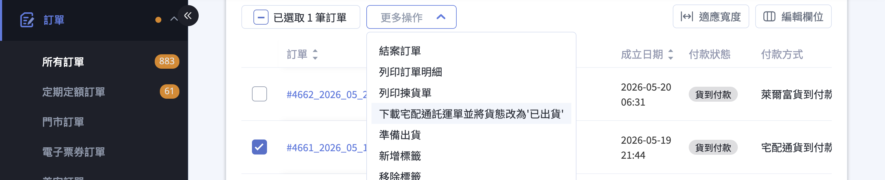
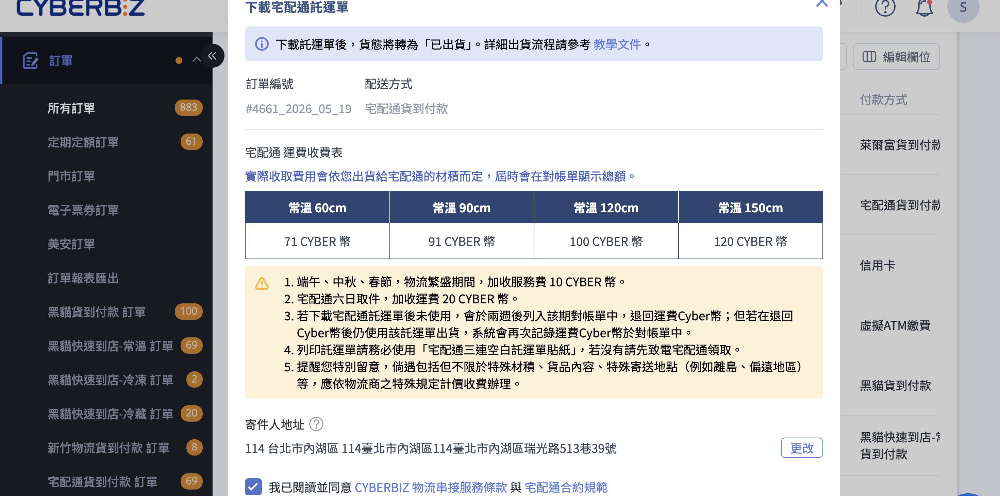

使用宅配通出貨。包含批次下載託運單、單筆與部分出貨、補印託運單等操作，以及運費計價規則與常見問題。
{ .subtitle }

{ .hero-page }

## 宅配通出貨說明 { #intro-pelican }

開通與宅配通系統串接的物流功能後，您可以從後台直接產出宅配通官方託運單 PDF，並由系統自動把訂單貨態更新為「已出貨(待物流收件)」，免去手寫單與另行登錄追蹤的工作。

本文聚焦於 **日常出貨流程** ，包含批次下載託運單、單筆與部分出貨、補印託運單等操作。寄件人設定、加印託運單(同訂單多箱)、逆物流退貨等進階管理操作，請見 [宅配通託運單管理頁](../payments-and-logistics/設定宅配通託運單.md)。

!!! info "重要規範" 
    * **嚴禁使用手寫單**：串接物流必須使用系統產出的託運單。手寫單無法回傳貨態，將影響對帳與客服處理。
    * **特殊區域與材積**：部分[離島、偏遠地區][reference-pelican-exclusion]{ data-preview }及特殊材積、特殊貨品內容，可能無法配送或需依宅配通公告另行加價，實際配送與費用以宅配通公告為準。
    * **冷鏈商品**：宅配通低溫配送目前暫不開放，請改用其他物流方案。

## 使用前提與限制 { #prerequisites-pelican }

### 方案與開通 { #activate-pelican }

- 宅配通託運單為加值功能，需先聯繫您的 CYBERBIZ 業務窗口開通。
* 開通後，後台左側選單會出現「宅配託運單管理」>「宅配通託運單」入口，訂單列表的「選擇操作」也會出現「下載宅配通託運單並將貨態改為『已出貨』」選項。

---

### 計費方式 { #prerequisites-pelican-billing-mode }

| 商家類型 | 計費方式 | 印單前提 |
| :-- | :-- | :-- |
| 一般版 | 預扣 **Cyber 幣** ，自帳戶餘額扣除 | 餘額不足時無法列印，需先至儲值中心儲值 |
| PLUS 版 / 企業版 | 列入每期 **對帳單** 統一收款 | 無須預先儲值 |

!!! info "提示"
    若不確定自家屬於哪一種計費方式，進入「宅配通託運單」頁面後，頁面上方若顯示「目前 Cyber 幣 餘額」即為一般版；若顯示對帳單說明文字即為 PLUS 版 / 企業版。

---

### 出貨前置設定 { #prerequisites-pelican-preconfig }

首次使用宅配通出貨前，請先完成下列設定：

- [x] **公司物流地址**(批次出貨用)：至「管理中心」>「一般設定」設定宅配通專用的公司物流地址。批次下載託運單時，彈窗內也可以當次調整。
- [x] **宅配通寄件人資料**(加印託運單與逆物流用)：至「金物流」>「宅配通託運單」頁面的「宅配通設定」區塊填寫，詳見 [宅配通託運單管理頁][configure-pelican-shipping-note-sender]{ data-preview } 。

---

### 託運單貼紙與設備 { #prerequisites-pelican-preparations }

* 託運單必須列印於宅配通官方提供的 **「宅配通三連空白託運單貼紙」** 上，系統產出的內容才會對齊欄位。
* 領取貼紙：請先聯繫 CYBERBIZ 客服取得「客戶代號」，再致電宅配通索取貼紙。
* 列印設備建議使用 **雷射印表機** ，避免條碼掉色或模糊導致物流端掃描失敗。
* 嚴禁使用手寫單據出貨，否則系統無法追蹤貨態，後續對帳與客訴將無法處理。

---

### 訂單條件 { #prerequisites-pelican-order-status }

可使用宅配通出貨的訂單需符合下列條件：

* 訂單的 **配送方式為宅配通** (批次出貨時，若勾選的訂單包含其他物流類型將無法一次下載)。
* 付款狀態為「已付款」或「貨到付款」。
* 配送狀態為「未出貨」、「部分出貨」、「準備出貨」或「運送異常」。

## 計費規則 { #pricing-pelican }

### 基本運費 { #pricing-pelican-rate }

每張託運單的基本運費依「配送商品尺寸」決定，常溫 60 / 90 / 120 / 150 cm 各有對應費率。完整費率與加收費用請見 [配送商品尺寸與運費對照表][reference-pelican-shipment-rates]{ data-preview } 。

!!! note "註釋"
    宅配通低溫配送(冷藏 / 冷凍)目前 **暫不開放** 。若有冷鏈商品出貨需求，請與您的業務窗口討論其他物流方案。

---

### 額外加收費用 { #pricing-pelican-extra }

| 情境 | 加收費用 | 說明 |
| :-- | :-- | :-- |
| 繁盛期取件 | 每件 +10 Cyber 幣 | 端午、中秋、春節等物流繁盛期間 |
| 週六、週日取件 | 每件 +20 Cyber 幣 | 由宅配通在週末上門取件 |

*若實際出貨時，尺寸與所選運費不同而產生較高費用時，差額將列入之後的對帳單中。*

---

### 14 日未使用退費規則 { #pricing-pelican-14day-refund-pelican }

* 託運單下載後若 **兩週(14 日)內未實際寄出** ，系統會自動退回該張託運單預扣的運費，並把單號狀態改為「取消寄件」。
* 退費後若仍使用該張託運單出貨，系統會 **再次記錄運費** (一般版扣 Cyber 幣；PLUS 版 / 企業版列入對帳單)。
* 建議印單後盡快交付物流，避免單號失效造成對帳混淆。

## 操作步驟 { #operate-pelican }

### 批次下載託運單並更新貨態 { #operate-pelican-bulk-download }

當您有多筆宅配通訂單要一次出貨時，從訂單列表批次處理最有效率。

1. **進入訂單列表**：前往後台「訂單」>「所有訂單」。
2. **篩選宅配通訂單**：建議先用「配送方式」篩選為「宅配通」，確保勾選的訂單都是同一物流[^1]。
3. **勾選欲出貨訂單**：在訂單列表左側勾選要出貨的訂單(可跨頁勾選或全選當頁)。
4. **執行批次操作**：點選列表上方的「選擇操作」下拉，選擇 **「下載宅配通託運單並將貨態改為『已出貨』」** 。

    

5. **檢視運費明細**：彈窗 中段會列出本批次要扣除的 Cyber 幣或對帳金額，請確認與[預期相符][pricing-pelican-extra]{ data-preview }。
6. **確認寄件公司地址**：彈窗內會顯示您的 [公司物流地址][gp-logistics-address]{ data-preview }。若需臨時調整，可點擊 **更改** 修改。

    

    ??? quote "需要自訂寄件資訊?"
        若你的寄件地址需要不同於公司物流地址(例如倉庫地址)，或需要自訂寄件人姓名、電話、託運單預設品名，請另到 金物流 > 宅配通託運單 於「[宅配通設定][configure-pelican-shipping-note-sender]{ data-preview }」區塊填寫並儲存。

7. **同意條款**：勾選頁面底部的 **「我已閱讀並同意 CYBERBIZ 物流串接服務條款 與 宅配通合約規範」** 。
8. **確認下載**：點擊 **「確認」**。系統會建立託運單、扣除運費，並將訂單貨態更新為「[已出貨(待物流收件)][shipping-status-text-type]{ data-preview }」。

    !!! warning "印單後無法修改收貨資訊"
        一旦下載託運單，系統會將收貨資訊與託運單綁定，無法在後台修改。如需修改，只能取消該張託運單(請聯繫 CYBERBIZ 客服)後重新建立。

9. **接收託運單檔案**：系統會自動下載一個[壓縮檔][reference-logistics-zip-contents]{ data-preview }，內含託運單 PDF 與相關出貨單據。請以「宅配通三連空白託運單貼紙」列印託運單並貼於紙箱。
10. **預約收件**：列印完成後請聯繫宅配通客服預約收件，或依您與宅配通約定的固定取件時段準備出貨。收件後，訂單詳情頁內狀態會顯示為「[已出貨(配送中)][shipping-status-text-type]{ data-preview }」。

[^1]: 勾選的訂單若包含非宅配通訂單(例如混雜黑貓、超商取貨)，彈窗會無法開啟或在送出時跳錯。請先用「配送方式」篩選器確保批次內物流類型一致。

---

### 單筆出貨與部分出貨 { #operate-pelican-single-shipment }

若您只想針對 **單一訂單** 出貨，或這筆訂單只有部分商品要先寄出，請改從訂單詳情頁操作。

1. 進入「訂單」>「所有訂單」，點選訂單編號進入訂單詳情頁。
2. 於右側「出貨」區塊勾選本次要出貨的商品。
3. 在「選擇出貨方式」下拉選單選擇「宅配通託運單」。
4. 在「請選擇費用」下拉選單挑選對應的配送尺寸。
5. 視需求調整「發送郵件通知顧客」勾選狀態。
6. 點擊 **「確認出貨」** ，系統會建立託運單並扣除運費。

詳細的部分出貨流程、不同物流的差異與 FAQ，請參閱 [訂單部分出貨](設定訂單部分出貨.md){ data-preview } 。

---

### 補印託運單(損壞或遺失) { #operate-pelican-reprint }

如果託運單已下載過，但貼紙印壞、遺失，或想再列印一次同一張單，可以使用補印功能。**補印不會產生新單號，也不會重複扣費。**

1. 前往「訂單」>「所有訂單」。
2. 篩選或勾選狀態為「已出貨」的宅配通訂單。
3. 從「選擇操作」下拉中選擇 **「補印託運單」** 。
4. 系統會重新產出原本的託運單 PDF，請以宅配通三連空白託運單貼紙列印。

!!! info "提示"
    補印僅針對 **已產出過的單號** 重新印出 PDF 。若您需要為同一訂單產生 **新的單號** (例如拆箱分多件寄送)，請改用 [加印託運單][operate-pelican-shipping-note-add-print]{ data-preview } 功能。

## 後續操作 { #followup-pelican }

- :lucide-truck:{ .lg }  
  [__追蹤貨態__]()  
  出貨後配送狀態會變為「已出貨(待物流收件)」，等宅配通實際收件並掃描後，會依物流回拋逐步更新為運送中、已送達等狀態。

- :lucide-receipt:{ .lg }  
  [__檢視對帳紀錄__]()  
  「宅配通託運單」頁面下方的單號使用紀錄會列出每張託運單的訂單編號、單號、扣除金額與單號狀態，可用於對帳。

- :lucide-printer:{ .lg }  
  [__加印或處理退貨__][operate-pelican-shipping-note-add-print]{ data-preview }  
  同一筆訂單需要拆箱多寄，或處理顧客退貨時，請至宅配通託運單管理頁進行加印託運單或建立逆物流。

---

## 常見問題 { #faq-pelican }

??? quote "「下載宅配通託運單並將貨態改為『已出貨』」選項不見了?"
    { #faq-pelican-action-missing }

    請依下列順序檢查：

    * 您的方案是否已開通宅配通託運單功能(未開通時整個入口都不會出現)
    * 勾選的訂單是否包含 **非宅配通** 的物流類型(混合勾選時系統無法批次處理)
    * 訂單付款狀態是否為「已付款」或「貨到付款」
    * 若仍找不到，請聯繫 CYBERBIZ 業務窗口確認方案是否包含宅配通

??? quote "Cyber 幣不足時要怎麼處理?"
    { #faq-pelican-insufficient-points }

    若您是一般版商家，須先至「儲值中心」儲值 Cyber 幣後才能列印託運單。PLUS / 企業版商家無此限制，運費會列入每期對帳單。

??? quote "託運單下載後沒寄出，Cyber 幣會自動退嗎?"
    { #faq-pelican-unused-refund }

    會。下載後 **兩週(14 日)內未實際寄出** ，系統會自動退回該張託運單的運費，並將單號狀態標記為「取消寄件」。若退費後仍使用該張託運單，系統會再次記錄運費。

??? quote "已經出貨了才發現收件地址打錯，怎麼辦?"
    { #faq-pelican-modify-address }

    託運單一旦下載，後台 **無法自行修改** 收件資訊。如包裹尚未交付物流，建議:

    * 聯繫 CYBERBIZ 客服協助取消該張託運單
    * 修改訂單收件資料後，以新訂單資料重新下載託運單

    若包裹已被宅配通收走，請直接聯繫宅配通客服處理。

??? quote "一筆訂單要分多箱寄，應該用「部分出貨」還是「加印託運單」?"
    { #faq-pelican-multibox }

    判斷標準:

    * 商品 **一次全部寄出，但裝不下一箱** > 使用 [加印託運單][operate-pelican-shipping-note-add-print]{ data-preview } ，可在同一筆訂單建立多張單號，每箱貼一張。
    * 商品 **分批寄出** (例如缺貨先寄一部分，後續到貨再寄)> 使用「部分出貨」，於訂單詳情頁勾選本次要寄的商品即可。
    * 貨到付款訂單若要分箱寄送， **必須** 使用加印託運單(代收款需綁定託運單號)。

??? quote "「補印託運單」和「加印託運單」有什麼差別?"
    { #faq-pelican-reprint-vs-addprint }

    * **補印託運單**：針對 **已產生過的單號** 重新印一次 PDF，不會產生新單號，**不會重複扣費** 。適用情境:貼紙印壞、檔案遺失。
    * **加印託運單**：為同一筆訂單建立 **新的單號** ，每張單會 **各自扣費** ，系統會帶入原訂單資訊。適用情境:同訂單分多箱寄送。

??? quote "可以使用手寫的宅配通託運單嗎?"
    { #faq-pelican-handwritten }

    不可以。串接物流必須使用系統產出的託運單，系統才能與宅配通介接回拋貨態。使用手寫單會導致系統無法追蹤包裹，對帳與客訴也無法處理。

??? quote "離島或偏遠地區可以使用宅配通嗎?"
    { #faq-pelican-remote-area }

    部分離島(如澎湖、金門、馬祖等)、偏遠地區與特殊地址(如郵政信箱)可能無法配送，或需依宅配通公告另行加價。實際可配送範圍與運費請以宅配通官方公告為準，建議出貨前先與顧客確認。

??? quote "貨到付款的代收手續費怎麼算?"  
    { #faq-pelican-cod-fee }

    宅配通貨到付款訂單，除基本運費外會另收 **代收手續費** ，依「代收金額」階梯計算(完整費率見 [代收手續費對照表][reference-pelican-cod-fee]{ data-preview })：

    * 2,000 元以下 → 30 Cyber 幣
    * 2,001 ~ 5,000 元 → 60 Cyber 幣
    * 5,001 ~ 10,000 元 → 90 CYBER 幣
    * 10,001 ~ 20,000 元 → 120 Cyber 幣
    * 20,001 ~ 50,000 元 → 150 Cyber 幣
    * 50,001 元以上 → 300 Cyber 幣

## 參考資料 { #reference-pelican }

### 宅配通費用對照表 { #reference-pelican-shipment-rates }

本對照表列出 **宅配通託運單** 各規格的 Cyber 幣扣抵金額，供商家估算列印成本參考。實際扣抵以後台「選擇貨品大小」下拉選單顯示為準。

=== "一般版"

    商家未與 CYBERBIZ 簽訂客製費率合約時適用。

    | 材積 | 常溫 本島 | 常溫 離島 | 繁盛期 加收[^2] | 週六、週日取件 加收[^3] |
    | :-- | --: | --: | --: | --: |
    | 60cm  |  71 | 220 | +10 | +20 |
    | 90cm  |  91 | 280 | +10 | +20 |
    | 120cm | 111 | 320 | +10 | +20 |
    | 150cm | 133 | 360 | +10 | +20 |

=== "PLUS 版 / 企業版"

    訂閱 CYBERBIZ **專業 PLUS 版** 、**進階 PLUS 版** 、**高手 PLUS 版** 、**企業版** 方案的商家適用。

    | 材積 | 常溫 本島 | 常溫 離島 | 繁盛期 加收[^2] | 週六、週日取件 加收[^3] |
    | :-- | --: | --: | --: | --: |
    | 60cm  |  71 | 220 | +10 | +20 |
    | 90cm  |  91 | 280 | +10 | +20 |
    | 120cm | 100 | 320 | +10 | +20 |
    | 150cm | 120 | 360 | +10 | +20 |

!!! note "註釋"
    - 金額均為 **Cyber 幣** ，且 **含稅** 。宅配通 **低溫(冷藏／冷凍)** ，上表僅列常溫費率。
    * **重量限制 20kg 內** ；單邊長與材積上限以宅配通公告為準。
    * **離島運費** 適用於宅配通有提供配送服務的特定離島地址；[不在服務範圍內的離島][reference-pelican-exclusion]{ data-preview }恕無法配送。最新服務範圍以宅配通公告為準。
    * **託運單下載後 14 日內未實際寄出** ，系統會自動退回該張託運單預扣的運費，並把單號狀態改為「取消寄件」；若退費後仍使用該張託運單出貨，系統會再次記錄運費。
    * 若您的店家與 CYBERBIZ 已協議客製費率，系統會自動套用，實際扣抵以後台下拉選單顯示為準。

[^2]: 指端午、中秋、春節物流尖峰期間，於上述基本費率額外加收。
[^3]: 由宅配通在週末上門取件，每件加收 20 Cyber 幣。 

---

### 貨到付款代收手續費 { #reference-pelican-cod-fee }

宅配通貨到付款訂單，除基本運費外另收代收手續費，依「代收金額」階梯計算，**所有方案費率相同**：

| 代收金額(新台幣) | 代收手續費 |
| :-- | --: |
| 2,000 元(含)以下 | 30 Cyber 幣 |
| 2,001 ~ 5,000 元 | 60 Cyber 幣 |
| 5,001 ~ 10,000 元 | 90 Cyber 幣 |
| 10,001 ~ 20,000 元 | 120 Cyber 幣 |
| 20,001 ~ 50,000 元 | 150 Cyber 幣 |
| 50,001 元以上 | 300 Cyber 幣 |

!!! note "註釋"
    - 金額含稅。
    - **顧客拒收或退貨時，系統不收取代收手續費**。
    - 代收手續費與基本運費分開計算，計費方式同基本運費(一般版扣 Cyber 幣;PLUS / 企業版列入對帳單)。
    - 實際扣款金額以宅配通對帳單為準;對帳前系統會以代收金額(= 訂單總額)試算。

---

### 宅配通不支援地區 { #reference-pelican-exclusion }

以下區域恕不提供宅配通貨件配送服務：

- **澎湖地區**：望安鄉、七美鄉、虎井島、桶盤島、大倉嶼、員貝嶼、鳥嶼、花嶼、吉貝嶼。
- **金門地區**：烏坵、烈嶼、大膽、二膽。
- **馬祖地區(連江縣)**：南竿鄉、北竿鄉、莒光鄉、東引鄉。
- **其它**：蘭嶼、綠島、小琉球等外島及郵政信箱。

!!! info "貼心提醒"
    離島與偏遠地區之服務範圍可能調整而變動。最新且詳細的服務區域規範，請至 [宅配通官方網站 - 服務據點查詢 :lucide-external-link:](https://www.e-can.com.tw/m/search_Location.aspx) 進行確認。
