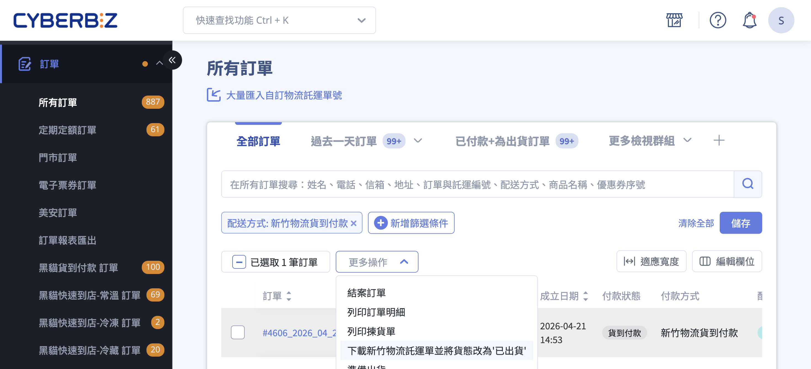
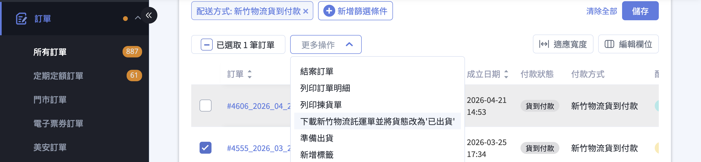
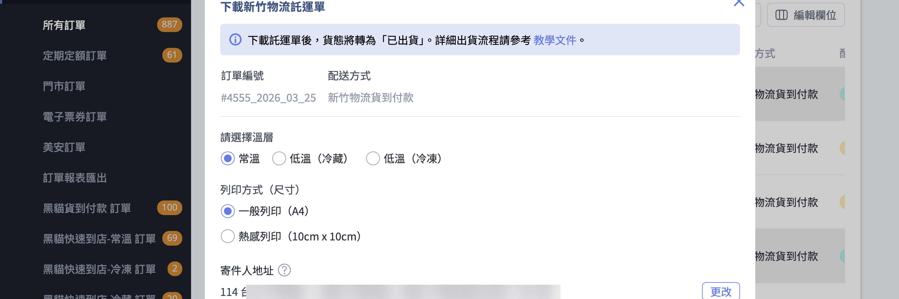

透過訂單列表批次選取訂單，下載新竹物流託運單並將貨態更新為已出貨。
{ .subtitle }

{ .hero-page }

## 新竹物流出貨說明 { #intro-hct-shipping }

當您的訂單採用 **新竹物流** 配送時，可在訂單列表批次選取訂單，直接由系統產生託運單號、下載託運單與相關文件，並一次將訂單貨態更新為「已出貨」。本文說明訂單列表的批次出貨流程、5 份下載文件的用途，以及司機取件後續事項。

## 使用前提與限制 { #prerequisites-hct-shipping }

### 開通條件 { #prerequisites-hct-shipping-enable }

於訂單列表看到「下載新竹物流託運單」這個選項之前，以下事項需先完成：

- [x] **完成新竹物流託運單設定**：至「金物流」>「[新竹物流託運單](../payments-and-logistics/設定新竹物流託運單.md){ data-preview }」填寫寄件人資訊[^1]。
- [x] **同步公司物流地址**：至「管理中心/一般設定」>「公司物流地址」完成寄件人資訊，以利託運單寄件欄位完整填寫。

!!! plan "扣費方式依方案而定"
    新竹物流託運單的扣費方式分為兩類，操作前請先確認您的方案歸屬：

    - **一般版**：列印託運單時 **立即扣除 Cyber 幣**，餘額不足將擋下列印。請先至「管理中心」>「儲值中心」儲值。
    - **PLUS 版/ 企業版**：不需儲值，費用 **列入每期對帳單**。

[^1]: 若尚未設定，訂單列表的下載動作不會出現。

---

### 訂單條件 { #prerequisites-hct-shipping-order }

執行批次下載時，系統會檢查所選訂單是否符合下列條件，任一項不符則「更多操作」中不會出現此選項：

| 條件 | 允許的狀態 |
| :-- | :-- |
| 訂單狀態 | 開啟，且所有勾選訂單狀態必須一致 |
| 配送方式 | **必須全部為新竹物流**(混合其他物流方式時不會出現) |
| 付款方式 | 非黑貓貨到付款 / 宅配通貨到付款 / 順豐貨到付款 |

## 計費規則 { #pricing-hct-shipping }

新竹物流託運單以 **Cyber 幣** 計價，依包裹尺寸與溫層而定，詳細費率請參考 [運費對照表](references/新竹物流配送尺寸與運費對照表.md#hct-rate-card){ data-preview }。

扣費時點：

- **一般版**：確認下載當下立即扣除[^pricing-deposit]。若 Cyber 幣不足，系統會擋下列印，請先至「儲值中心」儲值。
- **PLUS 版/ 企業版**：不擋下列印，費用於每期對帳單一併結算。

[^pricing-deposit]: 託運單建立後若於 14 天內未實際寄件，系統會自動回補 Cyber 幣(詳見 [託運單時效](#specs-hct-shipping-expiry))。

## 操作步驟 { #operate-hct-shipping }

### 一、勾選訂單 { #operate-hct-shipping-select }

前往後台「訂單」>「所有訂單」，於列表中勾選欲[一併出貨的訂單][specs-hct-shipping-uniform]{ data-preview }。

!!! tip "先篩選再勾選"
    新版訂單列表支援先用「配送方式 = 新竹物流」篩選後再全頁勾選，可加速批次出貨。瞭解 [如何篩選訂單](../orders/搜尋與篩選訂單.md#orders-filter){ data-preview }

---

### 二、選擇下載動作 { #operate-hct-shipping-action }

點擊列表上方的 **「更多操作」** 下拉選單，選擇 **「下載新竹物流託運單並將貨態改為『已出貨』」**。

!!! info "提示"
    若您是補印已下載過的託運單(不想再次扣款)，請選擇 **「補印託運單」**，流程相同，但 **不會** 再次扣除 Cyber 幣或產生新單號。

---

### 三、設定溫層、紙張與寄件地址 { #operate-hct-shipping-modal }

點擊動作後系統會彈出「下載新竹物流託運單」視窗，依序設定：

- **溫層**：依包裹實際溫層擇一(同一批次只能選一個溫層)
    - **常溫**
    - **低溫(冷藏)**
    - **低溫(冷凍)**

    !!! warning "多溫層訂單提醒"
        若您勾選的訂單涵蓋不同溫層，視窗會出現提示:「您有不同溫層的訂單，請注意出貨後是否會影響商品品質。」系統仍會用您此次選定的溫層產製託運單，請評估該批貨品是否能共同寄送。

- **紙張規格**：
    - **一般列印(A4)**：適用 A4 六模託運單貼紙
    - **熱感列印(10cm x 10cm)**：適用 10cm × 10cm 熱感應紙
- **公司物流地址**：若尚未填寫，請於視窗下方「寄件人地址」區塊補上；此處的地址會作為新竹物流託運單的寄件人地址。點擊 「更改」可編輯該次出貨地址。

---

### 四、確認下載 { #operate-hct-shipping-download }

點擊 **「確認」** 後，系統會：

- 依您選擇的溫層產生新竹物流託運單號
- **一般版** 立即扣除 Cyber 幣；**PLUS 版 / 企業版** 列入對帳單
- 自動下載一個壓縮檔，內含 **5 份 PDF** 文件
- 將訂單貨態變更為 **「已出貨(待物流收件)」**

下載的 5 份文件用途如下：

| 檔案 | 用途 |
| :-- | :-- |
| 託運單-寄件資料 | 黏貼於紙箱表面(請務必使用新竹物流專用紙列印)，建議使用雷射印表機產出託運單，以避免出貨資訊異常風險。 |
| 新竹物流託運總表 | **重要文件**，請妥善保存，於司機收貨時提供點收 |
| 出貨明細 | 出貨時揀貨核對用 |
| 訂單明細 | 隨包裹寄出給顧客 |
| 揀貨訂單 | 倉庫人員揀貨用 |

!!! warning "貨態變更後不可改"
    訂單貨態一旦變更為「已出貨」，**無法再修改收貨人資訊**。請於下載前確認訂單資料正確。

---

### 五、司機取件 { #operate-hct-shipping-pickup }

託運單下載完成後，系統會將訂單資訊送至新竹物流，後續取件流程:

1. **派遣司機**：系統自動派遣，收件時效約 **1 ~ 3 個工作天**，站所大多於下午開始收件。
2. **司機收件**：司機到場時請出示 **新竹物流託運總表**(下載檔案中的PDF)供司機點收。
3. **狀態更新**：司機收件後，訂單會自動更新為 **「已出貨(配送中)」**。

??? tip "若多日無人收貨"
    可電聯新竹物流所屬營業所，提供寄件客代 **0577349** 及以下資訊並說明「已有印好的託運單」，請站所安排取件：

    - 說明為順立智慧 CYBERBIZ 的廠商要寄件
    - 通知包裹已貼好託運單 (已備好託運單)
    - 提供寄件資訊：出貨地、電話、聯絡人、件數
    - 寄件客代：0577349

## 重要規範與限制 { #specs-hct-shipping }

### 配送尺寸、重量與不受理品項 { #specs-hct-shipping-restrictions }

新竹物流有 **[尺寸 / 重量上限](references/新竹物流配送尺寸與運費對照表.md#hct-rate-card-limits){ data-preview }** 與 **低溫不受理品項** 限制，出貨前請逐一檢查您的包裹是否符合，完整內容請參考：

- [新竹物流配送尺寸與運費對照表](references/新竹物流配送尺寸與運費對照表.md)

!!! warning "常見不受理品項摘要"
    低溫包裹中，以下品項新竹物流 **不受理**(完整清單見上方對照表):
    
    - 疫苗、血液 / 尿液檢體、冷藏藥品
    - 鮮奶油蛋糕、母奶、冰淇淋
    - 未密封包裝之榴槤 / 鹹魚
    - 保存期短於 3 天之商品

---

### 託運單時效(14 日失效) { #specs-hct-shipping-expiry }

託運單產出後 **14 日內** 若未實際寄件，單號將會失效：

- 系統會將該筆託運單狀態改為 **「取消寄件」**。
- **一般版** 已扣除的 Cyber 幣會自動全額回補(可至「金物流」>「新竹物流託運單」的「單號使用紀錄」確認)。
- 失效後若仍要寄件，需重新進入訂單下載新單號，並重新扣費。

--- 

### 配送方式必須相同 { #specs-hct-shipping-uniform }

勾選的訂單中，**所有訂單的配送方式必須都是新竹物流**，否則「更多操作」中不會出現此選項。若您混合勾選了其他物流(例如黑貓、宅配通)，請取消勾選後重新選取。

---

### 分箱寄送需用「加印託運單」 { #specs-hct-shipping-extra-label }

若一筆訂單需 **拆成多箱寄送**(例如商品數量多、單一紙箱裝不下)，請改用 [加印託運單](../payments-and-logistics/設定新竹物流託運單.md#operate-hct-waybill-reprint){ data-preview } 功能，在「新竹物流託運單」頁面輸入同一訂單編號，產生新的單號與託運單。

!!! note "註釋"
    「加印託運單」只能列印 **純配送** 的託運單。若訂單為貨到付款且需分箱，請聯繫客服協助處理代收款分配。

## 後續操作 { #next-steps-hct-shipping }

- :lucide-printer:{ .lg }  
  [__設定新竹物流託運單__](../payments-and-logistics/設定新竹物流託運單.md){ data-preview }  
  寄件人資訊、加印託運單、新竹逆物流流程設定。

- :lucide-table:{ .lg }  
  [__新竹物流配送尺寸與運費對照表__](references/新竹物流配送尺寸與運費對照表.md){ data-preview }  
  尺寸 / 溫層 / 不受理品項與 Cyber 幣費率。

- :lucide-package-open:{ .lg }  
  [__訂單部分出貨__](設定訂單部分出貨.md){ data-preview }  
  同一筆訂單分次出貨的操作方式。

## 常見問題 { #faq-hct-shipping }

??? quote "「更多操作」裡找不到新竹物流下載選項?"
    { #faq-hct-shipping-action-missing }
    請依以下順序檢查：

    - 是否已完成 **「新竹物流託運單設定」**(寄件人名稱、電話、地址都已填妥) 未設定時，訂單列表不會出現此選項。
    - 所勾選的訂單 **配送方式是否全部為新竹物流** 混合其他物流時不會出現。
    - 所勾選的訂單 **付款方式是否包含其他物流的貨到付款**(黑貓、宅配通、順豐) 若有則不會出現。
    - 訂單狀態是否一致且皆為「開啟」

??? quote "勾選的訂單有不同溫層，可以一次出貨嗎?"
    { #faq-hct-shipping-mixed-temperature }
    可以，系統會出現提示「您有不同溫層的訂單，請注意出貨後是否會影響商品品質。」並以您 **此次選定的單一溫層** 產製託運單。建議混合溫層時 **分批下載**(先勾常溫訂單下載，再勾低溫訂單下載)，避免商品品質受影響。

??? quote "下載後想要取消託運單怎麼辦?"
    { #faq-hct-shipping-cancel }
    商家後台 **無法自行取消** 已產生的託運單。如需取消請聯繫 CYBERBIZ 客服協助。

    若您 **沒有實際寄件**，系統會於建立後 **14 天** 自動將單號改為「取消寄件」並回補 Cyber 幣(僅一般版)，您不需要額外操作。

??? quote "託運單失效了怎麼補?"
    { #faq-hct-shipping-expired }
    託運單失效後，系統會將 **Cyber 幣回補** 至您的儲值中心(僅一般版)，並將單號狀態改為「取消寄件」。若仍要寄出該訂單，請重新進入訂單列表，再次執行下載託運單流程，系統會產生新的單號與重新扣費。

??? quote "下載按鈕點了沒反應 / 一直在轉?"
    { #faq-hct-shipping-download-stuck }
    請依序檢查：

    - **Cyber 幣餘額是否足夠**(僅一般版) 若不足，請先至「儲值中心」儲值。
    - **公司物流地址是否完整** 視窗下方「公司物流地址」必須填寫完整縣市、區、地址。
    - **瀏覽器是否阻擋下載彈窗** 請允許網站下載檔案後重試。

??? quote "一筆訂單需要分多箱寄送，怎麼辦?"
    { #faq-hct-shipping-multi-box }
    請使用 **加印託運單** 功能:至「金物流」>「新竹物流託運單」>「加印託運單」，輸入同一訂單編號即可產生新的單號與託運單。每張加印託運單會 **個別扣費**。詳見 [加印託運單操作說明][hct-setup-reprint]{ data-preview }。

??? quote "補印託運單和一般下載託運單有什麼不同？"
    { #faq-hct-shipping-reprint-vs-download }

    一般下載託運單會產生新的單號、依方案扣除 Cyber 幣，並將貨態改為「已出貨」。**補印託運單** 則不會產生新單號也不會再次扣款，流程與一般下載相同，適合紙張毀損或遺失時重新列印。

??? quote "一般版和 PLUS 版/企業版的扣費方式有什麼差別？"
    { #faq-hct-shipping-plan-pricing }

    - **一般版**：下載託運單時 **立即扣除 Cyber 幣**，餘額不足將擋下列印。若 14 天內未實際寄件，系統會自動回補。
    - **PLUS 版/企業版**：不需預先儲值，費用 **列入每期對帳單**，不會擋下列印。

??? quote "貨態變更為「已出貨」後還能修改收件人資訊嗎？"
    { #faq-hct-shipping-modify-recipient }

    不行。訂單貨態一旦變更為「已出貨」，**無法再修改收貨人資訊**。請於下載託運單前，務必確認訂單中的收件人姓名、電話、地址皆正確。

