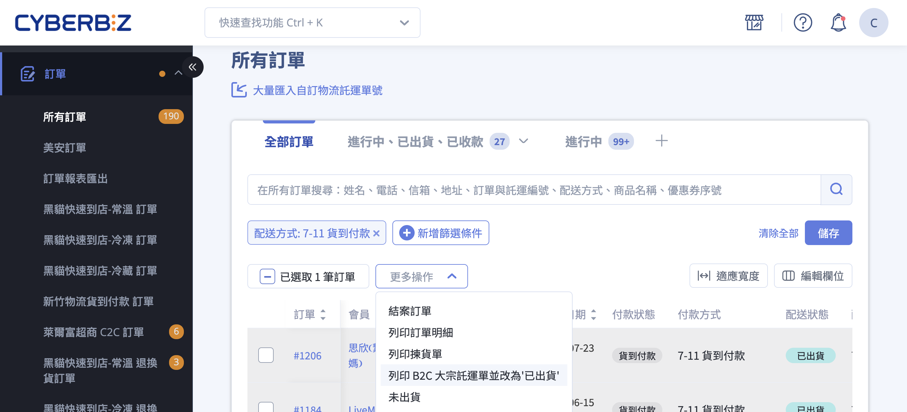
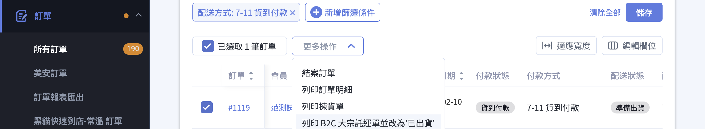

完成 B2C 通路設定後，於訂單列表批次下載託運單、產生託運單號，並將集中包裝的貨件寄至超商物流中心，再由物流中心分發至消費者指定門市。
{ .subtitle }

{ .doc-badge }

{ .hero-page }

## 超商大宗寄倉 B2C 說明 { #intro-cvs-b2c-shipping }

相較於店到店 C2C 需逐筆至超商門市寄件，**B2C 大宗寄倉** 讓商家可一次批次處理多筆訂單：

1. 在訂單列表勾選同通路、同付款狀態的訂單
2. 透過「選擇操作」批次下載託運單 PDF
3. 將商品集中打包並逐件貼上標籤
4. 自行聯絡貨運將大紙箱寄至超商物流中心

## 使用前提與限制 { #prerequisites-cvs-b2c-shipping }

- [x] **通路已設定並啟用**：需先於「[設定超商大宗寄倉 B2C](../payments-and-logistics/設定超商大宗寄倉 B2C.md){ data-preview }」完成申請、測標、啟用。
- [x] **訂單狀態符合**：付款狀態需為「**已收到款項**」或「**貨到付款**」，配送狀態需為「**未出貨**」或「**處理中**」。
- [x] **同一批次需同通路**：勾選的訂單必須屬於同一家超商（例：皆為 7-ELEVEN），不同通路需分批操作。
- [x] **CYBER 幣餘額充足**：一般版 商家需確認餘額足以扣除運費，詳見 [計費方式](../payments-and-logistics/references/超商大宗寄倉B2C方案與計費對照.md#reference-cvs-b2c-plans-billing){data-preview }。

## 操作步驟 { #operate-cvs-b2c-shipping }

### 下載託運單 { #operate-cvs-b2c-shipping-download }

1. **進入訂單管理**：登入後台，路徑為「**訂單**」>「**所有訂單**」。
2. **勾選訂單**：在訂單列表勾選欲出貨的訂單，**請確保勾選的訂單皆為相同配送方式**（例如皆為 7-ELEVEN 超商取貨）。
3. **執行下載**：點擊頁面右上方「**更多操作**」下拉，選擇「**列印 B2C 大宗託運單並改為『已出貨』**」[^1]。
4. **確認操作**：彈窗顯示「確認要『列印 B2C 大宗託運單並改為已出貨』嗎？」後點擊 **「確認」**。
5. **下載文件**：系統會自動產生託運單號並下載含託運資料的壓縮檔，訂單列表配送狀態變為「**已出貨**」，訂單詳情頁則顯示「**[已出貨（待物流收件）](出貨狀態物流提示文字說明.md#shipping-status-text-type){ data-preview }**」。

[^1]: 下拉選項會依勾選訂單的通路動態判斷，若勾選的是全家冷凍訂單，選項會顯示為「下載全家冷鏈材積託運單並更改為『已出貨』」。

!!! warning "下載中請勿離開頁面"
    系統在背景產生託運單號時若中途關閉視窗，**部分訂單可能已變更為「已出貨」但託運單未下載**，需透過 [補印託運單](#operate-cvs-b2c-shipping-reprint){ data-preview } 重新取得。

---

### 託運文件處理 { #operate-cvs-b2c-shipping-documents }

下載的壓縮檔內含以下文件，請依用途妥善處理：

| 文件 | 用途 |
| :-- | :-- |
| 託運單（寄件資料） | **黏貼於該訂單包裹外箱表面**，供物流中心過刷辨識 |
| 出貨明細 | 商家內部揀貨對照使用 |
| 訂單明細 | 隨貨放入包裹供消費者核對 |
| 揀貨訂單 | 商家內部揀貨核對使用 |

!!! tip "列印技巧"
    * 必須使用 **雷射印表機** 搭配 **2x3 規格貼紙** 列印託運單，避免條碼模糊導致無法判讀。
    * 將託運標籤貼平於外包裝 **左上角**，條碼與 QR Code 不可凹折或被膠帶覆蓋。

---

### 交寄物流中心 { #operate-cvs-b2c-shipping-deliver }

商家須於「**託運單產出隔日起 5 天內**」將貨品送達物流中心，逾期單號自動失效且無法補印。

1. **包裹封裝**：將個別貼好標籤的商品**集中裝入大紙箱**，不可散裝。若因無外箱保護導致損壞，需由商家承擔。
2. **聯絡貨運**：自行聯絡第三方物流（如黑貓、宅配通、新竹物流）將大紙箱寄至對應物流中心。完整收貨地址、時段、收件單位請見
[物流中心收貨資訊](../payments-and-logistics/references/cvs-b2c-logistics-centers.md#reference-cvs-b2c-centers-list){ data-preview }。
3. **物流中心簽收**：物流中心收件後，系統訂單狀態會由「待物流收件」自動變更為「**已出貨（配送中）**」。

### 補印託運單 { #operate-cvs-b2c-shipping-reprint }

若標籤遺失或損毀，可於下載後 **5 日內**於後台補印。

1. 於訂單列表勾選需補印的訂單。
2. 點擊「**選擇操作**」下拉，選擇「**補印託運單**」。
3. 系統會重新下載相同託運單號的 PDF，**不會重複扣除運費**，訂單狀態也不會再次變動。

### 門市關轉處理 { #operate-cvs-b2c-shipping-store-change }

若消費者選擇的取貨門市發生關轉（裝修、歇業等），系統會發送通知信給商家：

1. 收到通知後，需於 **2 日內**主動聯繫消費者確認新門市。
2. 進入該訂單的詳情頁，**重新選擇收件門市**。
3. 確認後系統會自動更新出貨資訊。

---

## 重要規範與限制 { #specs-cvs-b2c-shipping }

* **出貨不可逆**：一旦下載託運單，訂單狀態即變為「已出貨」，且**無法修改收貨資訊**。請於下載前確認資料正確。
* **CYBER 幣餘額不足將擋下載**：一般版商家若 CYBER 幣不足，系統會直接擋下載並提示「CYBER 幣餘額不足」。詳見
[計費方式](../payments-and-logistics/references/cvs-b2c-plans.md#reference-cvs-b2c-plans-billing){ data-preview }。
* **重量與材積限制**：訂單總重量 / 材積若超過該通路上限將無法產生託運單，詳見
[重量與材積限制](../payments-and-logistics/references/cvs-b2c-channels.md#reference-cvs-b2c-channels-specs){ data-preview }。
* **5 天交寄期限**：託運單產生隔日起 5 天內未送達物流中心將自動失效，且無法補印或退費。

---

## 後續操作 { #next-steps-cvs-b2c-shipping }

- :lucide-settings:{ .lg }
  [__設定超商大宗寄倉 B2C__](../payments-and-logistics/cvs-b2c-setup.md){ data-preview }
  尚未開通通路？先完成申請與啟用。

- :lucide-coins:{ .lg }
  [__儲值 CYBER 幣__](#){ data-preview }
  一般版商家確保餘額足以扣除大量訂單運費。

- :lucide-file-text:{ .lg }
  [__查詢對帳單__](#){ data-preview }
  PLUS 版、企業版商家可於對帳單檢視當月累計運費。

---

## 常見問題 { #faq-cvs-b2c-shipping }

??? quote "為什麼下載託運單按鈕被擋下？"
    { #faq-cvs-b2c-shipping-blocked }
    可能原因：

    - 勾選的訂單包含**不同通路**（例如同時勾了 7-ELEVEN 與全家）
    - 訂單付款狀態不符（需為「已收到款項」或「貨到付款」）
    - 訂單配送狀態已是「已出貨」或「已取消」
    - CYBER 幣餘額不足（一般版）
    - 該通路尚未在後台啟用，請至 [設定頁](../payments-and-logistics/cvs-b2c-setup.md){ data-preview } 確認

??? quote "下載中離開頁面會怎樣？"
    { #faq-cvs-b2c-shipping-leave }
    系統會中斷下載，**部分訂單可能已變更為「已出貨」但託運單尚未下載完成**。請於 5 日內以「補印託運單」重新取得 PDF。

??? quote "5 天內沒交寄會怎樣？"
    { #faq-cvs-b2c-shipping-overdue }
    託運單號將自動失效，且**無法補印或退費**。若仍需出貨，須請消費者重新下單。

??? quote "補印託運單會再扣 CYBER 幣嗎？"
    { #faq-cvs-b2c-shipping-reprint-cost }
    不會。補印僅是重新下載已產生的託運單號 PDF，不會建立新單號，也不會重複扣款或改變訂單狀態。

??? quote "託運單下載後可以修改收貨資訊嗎？"
    { #faq-cvs-b2c-shipping-edit }
    **不可以**。下載託運單即代表已完成託運申請，收件地址、門市、收件人皆無法修改。若遇門市關轉，請依「[門市關轉處理](#operate-cvs-b2c-shipping-store-change){ data-preview
}」流程處理。

??? quote "可以混合不同超商一次下載嗎？"
    { #faq-cvs-b2c-shipping-mixed }
    不可以。每次批次操作只能勾選同一通路的訂單，請依通路分批執行。

---

## 參考資料 { #reference-cvs-b2c-shipping }

- [物流中心收貨資訊](../payments-and-logistics/references/cvs-b2c-logistics-centers.md){ data-preview }
- [各通路重量與材積限制](../payments-and-logistics/references/cvs-b2c-channels.md){ data-preview }
- [方案開通與計費對照](../payments-and-logistics/references/cvs-b2c-plans.md){ data-preview }

## 後續操作

- :lucide-import:{ .lg }
  [____]()
  。

- :lucide-ban:{ .lg }
  [____]()
  。

## 常見問題

??? quote ""

