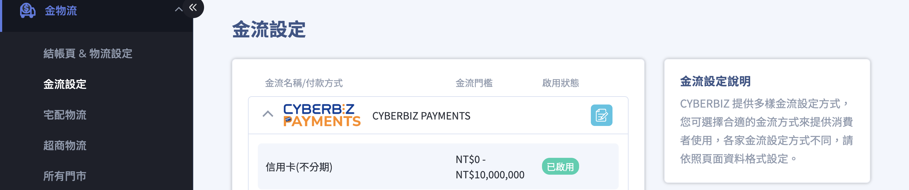
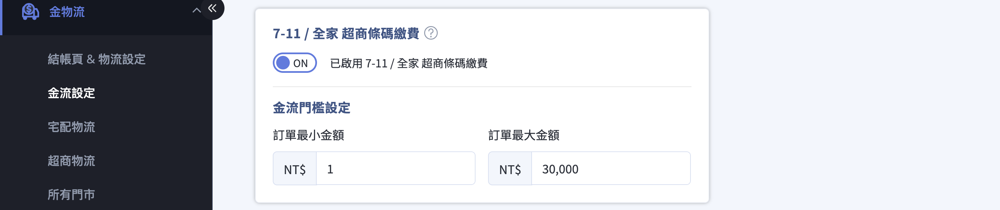
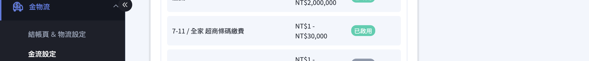

{ .subtitle }

[:lucide-bolt:{ title="適用功能" }](../../resources/conventions#適用功能) | CYBERBIZ PAYMENTS
{ .doc-badge }

{ .hero-page }

## 超商條碼付款說明

**超商條碼繳費** 讓顧客可以在官網下單後，取得一組專屬條碼，並前往指定的便利商店完成付款。

!!! warning "重要注意事項"

    為了確保能順利繳費，請務必留意以下規則：

    *   **條碼時效性**：超商條碼 **每 3 小時會自動更新一次**，舊的條碼會自動失效。請務必在抵達超商現場後，透過官網或 Email 連結重新開啟即時條碼，**請勿使用預先截圖的舊條碼** 付款。
    *   **訂單自動取消**：若商家有設定「[訂單自動取消][系統自動取消付款超時]{ data-preview }」的天數限制，一旦超過時限，條碼將會失效且無法進行繳費。
    *   **支援門市**：目前僅支援於 **7-11** 與 **全家便利商店** 進行掃碼繳費。

    如果顧客在獲取條碼時遇到問題，亦可聯繫商家索取專屬的「**[消費者付款連結](提供顧客付款連結.md){ data-preview }**」來重新取得繳費頁面。

## 啟用超商條碼繳費

商家可透過 CYBERBIZ PAYMENTS 開啟此功能，讓消費者在結帳時選擇產生超商條碼並至門市付款。

### 步驟 1：編輯 CYBERBIZ PAYMENTS 金流設定

1.  登入 CYBERBIZ 管理後台，前往 **金物流 > 金流設定**。
2.  在金流設定列表中，找到「**CYBERBIZ PAYMENTS**」選項。
3.  點擊右側的「**編輯** :lucide-file-pen:」按鈕進入設定頁面。

{ .screenshot }

### 步驟 2：開啟超商條碼繳費功能

1.  在 CYBERBIZ PAYMENTS 設定頁面中，找到「**7-11 / 全家 超商條碼繳費**」選項。
2.  將開關切換至「**開啟**」狀態。

{ .screenshot }

### 步驟 3：儲存設定

1.  確認開啟後，點擊頁面下方的「**確認**」按鈕。
2.  系統顯示儲存成功訊息後，可在金流設定列表中確認完成功能開啟。

{ .screenshot }

!!! warning "重要提醒"
    - 開啟超商條碼繳費功能後，請確認您同時有搭配支援的物流方式（如超商取貨），消費者才能在結帳時正常選擇此付款方式。
    - 若設定「訂單自動取消」天數，超商條碼將於天數期滿後失效。

## 取得超商條碼的步驟

消費者在下單過程中與下單後，可以透過以下三種管道取得繳費條碼：

1.  **結帳頁面選擇**：在官網結帳時，於付款方式中選擇「**超商條碼**」並送出訂單。
2.  **訂單成立頁面**：完成下單後，頁面會直接顯示超商條碼。您可以將此頁面保留，直接提供給店員掃描。
3.  **訂單查詢頁面**：若下單時未立即繳費，可登入官網會員進入「訂單查詢」，點擊該筆訂單的「**前往付款**」，系統會引導回訂單成立頁並顯示條碼。
4.  **Email 通知信**：若商家有開啟新訂單通知，您可以在收到的訂單成立 Email 中，點擊「**前往繳款**」按鈕來取得條碼。

## 便利商店現場付款方式

取得條碼後，請前往支援的超商（**7-11 或全家**）進行繳費：

*   **無須列印**：您不需要將條碼印出來，只需將手機螢幕上的條碼畫面展示給店員掃描即可。
*   **全螢幕與亮度**：建議點擊條碼圖示進入**全螢幕模式**，並將手機**螢幕亮度調至最亮**，以利超商掃碼槍讀取。
*   **完成付款**：店員掃描成功並收取款項後，即完成繳費手續。

## 後續操作

- :lucide-import:{ .lg }
  [____]()
  。

- :lucide-ban:{ .lg }
  [____]()
  。

## 常見問題

??? quote ""

