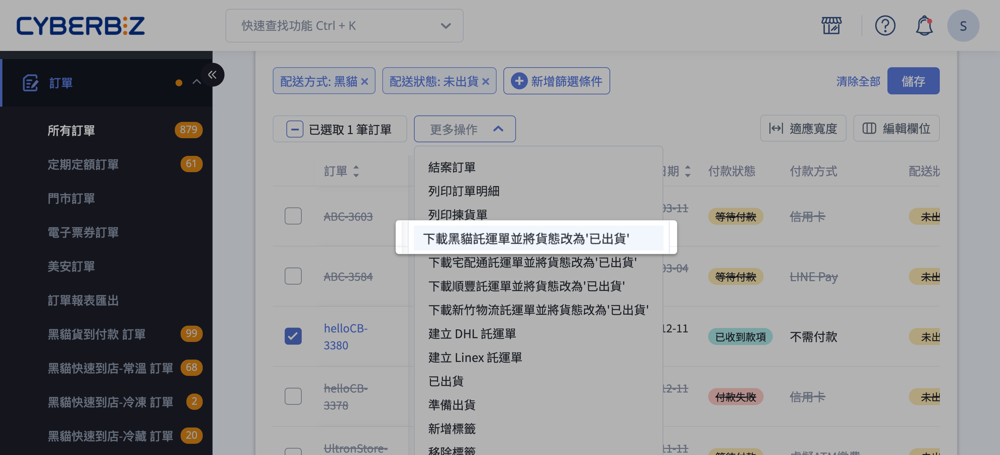
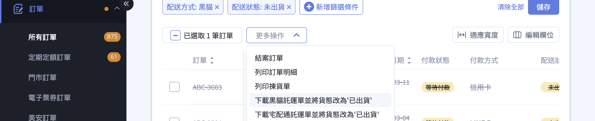

{ .subtitle }

{ .hero-page }

## 黑貓宅配出貨說明

後台與黑貓宅急便系統整合，商家可從訂單列表批次產出黑貓宅配託運單、自動扣除運費，並將訂單貨態同步更新為「已出貨」。本文聚焦於 **黑貓宅配(B2C 宅配到府)** 的出貨流程。

!!! info "其他黑貓服務"
    * 若顧客選擇超商取貨，請見 [使用黑貓快速到店出貨][cvs]{ data-preview }。
    * 自動呼叫黑貓司機到府收件，請見 [自動呼叫黑貓司機取件][call-driver]{ data-preview }。

## 功能介紹 { #tcat-home-overview }

後台的訂單列表 **更多操作** 提供下載黑貓宅配託運單的批次動作。商家在訂單列表勾選顧客選擇黑貓宅配的訂單後，可一次產生託運單
PDF、扣除運費、並將訂單貨態更新為「已出貨」。

本流程適用於 **顧客在前台選擇黑貓宅配到府** 的訂單。若顧客選擇超商取貨，請改見 [使用黑貓快速到店出貨][cvs]{ data-preview }。

## 頁面功能總覽 { #tcat-home-features-summary }

在訂單列表 的 **更多操作** 下拉選單中，黑貓宅配相關動作:

| 動作名稱 | 用途 | 何時出現 |
| :-- | :-- | :-- |
| 下載黑貓託運單並將貨態改為'已出貨' | 為宅配訂單產生託運單並更新貨態 | 訂單配送方式為「黑貓宅配」且付款已成立 |
| 補印託運單 | 重新下載已產生的託運單(單號遺失時使用) | 訂單貨態為「已出貨」或「部分出貨」 |

加印託運單(同一訂單拆多箱、另行扣費)不在訂單列表執行，需到 **金物流 > 黑貓託運單** 頁面操作，詳見 [情境五][tcat-home-scenario-additional]{
data-preview }。

[tcat-home-scenario-additional]: #tcat-home-scenario-additional

## 計費與規則 { #tcat-home-pricing }

### 運費扣款方式(依方案) { #tcat-home-shipping-fee }

商家方案不同，黑貓運費的扣款方式也不同:

=== "一般版"
    需先儲值 **CYBER 幣** 。下載託運單時系統會即時從 CYBER 幣餘額扣除運費，餘額不足時下載會失敗。

=== "PLUS 版 / 企業版"
    無須事先儲值。每筆運費將計入「對帳中心」，於每期對帳單一次結清。

!!! tip "如何查詢扣款明細"
    一般版商家可至 **儲值中心 > 明細紀錄** [查詢扣款歷程][cyber-coin-transaction-history]{ data-preview }；PLUS / 企業版商家可至 **對帳中心** 查詢月結帳單。

---

### 託運單有效期 { #tcat-home-label-expiry }

下載託運單後即會扣除 CYBER 幣。**如超過 21 天(3 週)未使用單號(實際出貨)** ，系統會將該單號認列為失效，所扣的 CYBER 幣會自動退回帳戶。

!!! warning "依黑貓官方規範為準"
    上述「21 天」為 CYBERBIZ 系統側計算 CYBER 幣退費的依據。實際單號於黑貓系統內的有效期，請以黑貓官方公告為準。

---

### 繁盛期加收 { #tcat-home-busy-season }

物流繁盛期間，黑貓每張託運單將額外加收 **10 CYBER 幣** 的服務費。依系統提示文案，繁盛期涵蓋:

* 端午
* 中秋
* 春節

!!! warning "依黑貓官方規範為準"
    繁盛期確切日期區間請以黑貓官方公告為準。

### 溫層混配警告 { #tcat-home-temperature-mismatch }

若 **列印常溫託運單卻以低溫寄送** ，或 **列印低溫託運單卻以常溫寄送** ，每張託運單將額外加收 **50 CYBER 幣**
的帳務處理費。下載前請務必確認商品實際溫層與所選溫層一致。

## 操作步驟 { #tcat-home-operate }

### 出貨前準備 { #tcat-home-prerequisites }

執行黑貓宅配出貨前，請完成以下準備:

- [x] **領取黑貓三聯空白託運單貼紙**：致電黑貓宅急便 (02-412-8888) 領取「三聯空白託運單貼紙」(俗稱 A4 三模託運單)。若選擇 A4
一般列印，系統列印的內容必須印在這款貼紙上，司機才會收件。
- [x] **設定公司物流地址**：進入後台 [一般設定 > 公司物流地址][gp-logistics-address]{ data-preview }，完整填寫縣市、區域與地址。未設定或地址不完整時，下載託運單會出現「缺少寄件人區碼，請確認黑貓寄件地址有正確填寫」的錯誤。
- [x] **確認餘額或對帳狀態**：一般版商家請至 [儲值中心查看 CYBER 幣餘額][cyber-coin-balance]{ data-preview } ，確認足以支付運費；PLUS /
企業版商家無此限制。
- [x] **列印設備建議**：建議使用 **雷射印表機** 列印託運單，避免出貨條碼判讀異常。

---

### 批次下載黑貓宅配託運單 { #tcat-home-scenario-batch }

以下為最常見的批次出貨流程:

=== "新版訂單列表"

    1. **進入訂單列表**：登入後台，前往 **訂單 > 所有訂單**。
    2. **勾選訂單**：在列表中勾選欲出貨的訂單，需確認所選訂單的配送方式皆為「黑貓宅配」。瞭解 [如何篩選訂單][orders-filter]{ data-preview }

        

        !!! info "若勾選不同配送方式的訂單，則會無法下載託運單。"

    3. **點擊「更多操作」**：於列表上方點擊 **更多操作** ，在下拉選單中選擇 **下載黑貓託運單並將貨態改為'已出貨'** 。
    4. **設定彈出視窗內欄位**：在跳出的「下載黑貓託運單」視窗中依序設定:
        * **列印方式(尺寸)**：選擇 **熱感列印(10cm x 10cm)** 、 **一般列印(A4)** 或 **熱感列印(A6)** 。三種尺寸的差異見[託運單列印方式對照表][tcat-print-formats]{ data-preview }。
        * **請選擇溫層**：選擇 **常溫** 、 **低溫(冷藏)** 或 **低溫(冷凍)** 。
        * **是否為易碎品**：選擇 **是** 或 **否** 。
        * **寄件地址**：系統會自動帶入「[公司物流地址][gp-logistics-address]{ data-preview }」，確認無誤即可。
        * **同意條款**：勾選 **我已閱讀並同意 CYBERBIZ 物流串接服務條款 與 黑貓合約規範** 。未勾選時下載按鈕無法點擊。
    5. **確認下載**：點擊 **確認** ，系統會下載託運單 PDF 並扣除運費。
    6. **貨態自動更新**：下載完成後，所選訂單的貨態自動變更為 **已出貨** 。

    !!! info "進階：從彈出視窗直接呼叫黑貓司機"
        若你的店家已開通呼叫黑貓功能，視窗下方會出現「自動呼叫黑貓司機取件」區塊，可在下載託運單的同時預約司機到府收件。詳細操作請見[自動呼叫黑貓司機取件][call-driver]{ data-preview }。

=== "舊版訂單列表"

    舊版訂單列表 `/admin/orders` 的操作流程相似，但有以下差異:

    * 彈出視窗上方為「呼叫黑貓」單一勾選框，沒有進階設定區塊;新版改為獨立的「自動呼叫黑貓司機取件」區塊，且需另行開通。
    * 易碎品、溫層、列印尺寸欄位的選項本身與新版一致。
    * 舊版彈出視窗內無法預先設定「事先電話聯絡」與「準備推車」等項目。

    若你仍在使用舊版列表，建議切換至新版以取得完整體驗。[print-formats]: ./references/tcat-print-formats.md

### 部分出貨 { #tcat-home-scenario-partial }

若一筆訂單中只想先寄出部分商品，可改從訂單詳情頁勾選指定品項:

1. **進入訂單詳情** :在訂單列表點擊訂單編號，進入訂單詳情頁。
2. **勾選欲出貨的商品** :在訂單頁面的商品明細區塊，勾選本次要先出貨的品項。
3. **選擇出貨方式** :於下方出貨區塊選擇「黑貓宅配」並確認送出。系統會為該筆訂單建立部分出貨紀錄，後續可重複此流程寄送剩餘商品。

!!! warning "適用付款方式限制(待確認)"
  既有商家文件提到「部分出貨僅限宅配貨到不付款訂單」，但目前 CYBERBIZ 系統程式碼中未找到此明確限制邏輯。實際適用條件請以業務團隊提供之資訊為準。

### 情境四:補印託運單 { #tcat-home-scenario-reprint }

若已下載過的託運單檔案遺失(例如貼紙印壞、檔案不見)，可在訂單列表批次補印:

1. **勾選已出貨訂單** :在訂單列表中勾選貨態為 **已出貨** 或 **部分出貨** 的訂單。
2. **執行補印** :點擊 **更多操作 > 補印託運單** ，系統會以原本的單號重新產生 PDF。
3. **不會重複扣費** :補印使用同一個運送單號， **不會再次扣除 CYBER 幣** 。

### 情境五:加印託運單(同一訂單拆多箱寄送) { #tcat-home-scenario-additional }

若一筆宅配訂單因商品多需拆分為多箱寄出，每箱需各自一張託運單:

1. **進入加印頁面** :前往後台路徑 **金物流 > 黑貓託運單** (對應 URL 為 `/admin/shipping_notes/ezcat`)。
2. **輸入訂單編號** :在「加印託運單」區塊輸入要加印的訂單編號。
3. **選擇尺寸與張數** :選擇貨品大小，以及要加印的張數。
4. **同意條款並下載** :勾選服務條款後點擊「確認下載」。
5. **產生新單號並扣費** :系統會為每張加印託運單產生 **新的運送單號** ，並依張數 **再次扣除 CYBER 幣** 。

!!! warning "加印與補印的差別"
  * **補印** :同一筆訂單、 **同一個** 單號的重新列印，不扣費。
  * **加印** :同一筆訂單需 **新增單號** (拆箱寄送)，會再次扣費。

!!! note "黑貓快速到店加印請走另一頁面"
  本頁僅供宅配訂單加印。若需加印黑貓快速到店託運單，請至 **金物流 > 黑貓快速到店託運單** (`/admin/shipping_notes/ezcat_cvs`)，操作流程見
[使用黑貓快速到店出貨][cvs]{ data-preview } 的加印章節。

---

## 後續操作 { #tcat-home-next-steps }

### 5.1 呼叫黑貓司機取件 { #tcat-home-call-driver-pickup }

下載託運單後，需聯繫黑貓司機到貨取件:

* **電話呼叫** :撥打黑貓客服專線 (02-412-8888) 安排取件。
* **從後台直接呼叫** :若已開通呼叫黑貓功能，可在下載託運單時於彈出視窗內預約司機取件。詳見 [自動呼叫黑貓司機取件][call-driver]{ data-preview }。

### 5.2 確認貨態變更 { #tcat-home-verify-status }

成功下載託運單後，訂單貨態會自動變更為 **已出貨** 。若貨態未更新，請檢查:

* 是否實際完成下載(瀏覽器是否阻擋了下載對話框)。
* 是否所有勾選的訂單配送方式都符合「黑貓宅配」(例如:不小心勾選了黑貓快速到店或其他物流商的訂單)。

### 5.3 地址錯誤排除 { #tcat-home-address-error }

下載託運單時若出現「缺少寄件人區碼，請確認黑貓寄件地址有正確填寫」，代表 **公司物流地址未設定或不完整** :

1. 前往 [一般設定 > 公司物流地址](/admin/general_preferences#gp-logistics-address) ，完整填寫縣市、區域、地址。
2. 儲存後重新執行下載。

若收件人地址有錯字或不完整(例如「峨嵋」誤植為「峨眉」)，系統可能於下載階段或交付黑貓後才回報。 **訂單已出貨後無法在後台修改收件地址**
，請於託運單上手寫更正，並於司機收件時口頭告知。

## 常見問題 { #tcat-home-faq }

??? quote "為什麼點下載卻沒有反應 { #tcat-home-faq-download-no-response }" 
    通常為以下三種原因之一：

    * **CYBER 幣不足(一般版商家)**：請至 [儲值中心][cyber-coin-balance]{ data-preview } 儲值。
    * **公司物流地址未設定**：至 [一般設定 > 公司物流地址][gp-logistics-address]{ data-preview } 完成設定。
    * **未勾選同意條款**：確認彈出視窗下方「我已閱讀並同意 CYBERBIZ 物流串接服務條款 與 黑貓合約規範」已勾選。

??? quote "為什麼某些訂單沒有「下載黑貓託運單」選項 { #tcat-home-faq-missing-option }"

    下拉選單會依訂單的配送方式自動篩選，可能原因:

    * 訂單配送方式不是黑貓宅配(可能是黑貓快速到店、宅配通、順豐、新竹物流或其他物流)。
    * 訂單付款狀態尚未到位(例如未付款、待轉帳)。
    * 訂單已是「已出貨」狀態，此時應改用 **補印託運單** 而非「下載」。

### 託運單下載後可以修改地址嗎? { #tcat-home-faq-edit-address }

不可以。已下載的託運單地址無法在系統內修改，需在託運單上 **手寫更正** ，並於交件時告知司機。

### 託運單下載後幾天內必須寄出? { #tcat-home-faq-expiry }

依系統規範， **21 天(3 週)內** 須完成實際出貨，否則單號會被認列為失效， CYBER 幣會自動退回。實際黑貓側的單號有效期請以黑貓官方規範為準。

### 同一筆訂單可以同時用兩家物流出貨嗎? { #tcat-home-faq-mixed-shipping }

不可以。一筆訂單只能搭配一種物流商。若需拆分品項出貨，請參考 [情境三的部分出貨][tcat-home-scenario-partial-link]{ data-preview }
流程，或聯繫業務團隊。

[tcat-home-scenario-partial-link]: #tcat-home-scenario-partial

### 補印託運單會額外扣費嗎? { #tcat-home-faq-reprint-fee }

不會。補印使用原來的單號，系統不會再次扣除 CYBER 幣。若需要 **新單號** (例如同一筆訂單拆成多箱)，請使用「加印託運單」，加印會依張數扣費(見
[情境五][tcat-home-scenario-additional]{ data-preview })。

### 我是峰潮物流商家，可以用這個流程嗎? { #tcat-home-faq-honeycomb }

不能。峰潮物流商家的出貨由峰潮代為處理 —— 訂單會自動進入峰潮倉儲，由峰潮端產生黑貓託運單。商家無需自行下載託運單，本文流程不適用。後台部分相關 panel
與選項也會對峰潮商家自動隱藏，例如「公司物流地址」設定區塊。詳情請洽詢業務團隊或峰潮窗口。

## 參考資料 { #tcat-home-references }

### 託運單列印方式對照表 { #tcat-print-formats }

CYBERBIZ 黑貓託運單下載彈出視窗的「列印方式(尺寸)」提供三種選項，商家應依手邊的印表機與託運單貼紙挑選。

| 列印方式 | 適用印表機 | 託運單貼紙 / 紙張 | 建議用途 |
| :-- | :-- | :-- | :-- |
| 熱感列印(10cm x 10cm) | 熱感標籤印表機 | 10cm x 10cm 規格的熱感標籤紙 | 高出貨量、需要快速貼標的商家 |
| 一般列印(A4) | 一般雷射印表機 | 黑貓三聯空白託運單貼紙(A4 三模) | 多數小型至中型商家的標準選擇 |
| 熱感列印(A6) | 熱感標籤印表機 | A6 規格的熱感標籤紙 | 使用 A6 尺寸熱感標籤的出貨場景 |

!!! note "註釋"
    * **一般列印(A4)** 需搭配黑貓提供的 **三聯空白託運單貼紙** (A4 三模)，請先致電黑貓 (02-412-8888) 索取。
    * 熱感列印選項適合長期高量出貨的商家，需自備熱感印表機與對應規格的標籤紙。
    * 列印效果不佳可能造成黑貓掃描條碼判讀異常，建議定期檢查印表機碳粉/熱感頭狀態。
    * 列印方式選擇後 **不影響運費** ，運費僅依商品尺寸與溫層計算。

### 對照表(獨立檔案)

* [黑貓出貨動作對照表][actions]{ data-preview } —— 列出黑貓所有出貨動作與彈出視窗欄位差異(跨宅配 + 快速到店)。
* [託運單列印方式對照表][print-formats]{ data-preview } —— 列印方式三種尺寸選項(熱感 10x10、A4、熱感 A6)的差異。

[actions]: ./references/tcat-shipping-actions.md

### 相關文件

* [使用黑貓快速到店出貨][cvs]{ data-preview } —— 顧客選擇超商取貨的訂單請見此篇。
* [自動呼叫黑貓司機取件][call-driver]{ data-preview } —— 進階功能，需另行開通呼叫黑貓 plugin。

### 後台路徑速查

* 訂單列表(新版):`/admin/orders_v2`
* 訂單列表(舊版):`/admin/orders`
* 公司物流地址:[一般設定 > 公司物流地址](/admin/general_preferences#gp-logistics-address)
* CYBER 幣餘額:[儲值中心](/admin/points_deposits#cyber-coin-balance)
* 黑貓加印託運單:**金物流 > 黑貓託運單** (`/admin/shipping_notes/ezcat`)
* 黑貓客服專線:02-412-8888

## 操作步驟

---

### 批次下載黑貓宅配託運單

以下為最常見的批次出貨情境。其他物流商(宅配通、順豐、新竹物流)的操作步驟雷同，僅動作名稱不同。

=== "新版訂單列表"

    1. **進入訂單列表**：前往後台路徑 **訂單 > 所有訂單**。
    2. **勾選訂單**：在列表中勾選欲出貨的訂單，需確認所選訂單的配送方式皆為「黑貓宅配」。瞭解 [如何篩選訂單][orders-filter]{ data-preview }

          !!! info "若勾選不同配送方式的訂單，則會無法下載託運單。"

    3. **點擊「更多操作」**：於列表上方點擊 **更多操作** ，在下拉選單中選擇 **下載黑貓託運單並將貨態改為'已出貨'** 。
    4. **設定彈出視窗內欄位**：在跳出的「下載黑貓託運單」視窗中依序設定:
        * **列印方式(尺寸)** :選擇 **熱感列印(10cm x 10cm)** 、 **一般列印(A4)** 或 **熱感列印(A6)** 。三種尺寸的差異見 [託運單列印方式對照表][print-formats]{ data-preview }。
        * **請選擇溫層** :選擇 **常溫** 、 **低溫(冷藏)** 或 **低溫(冷凍)** 。
        * **是否為易碎品** :選擇 **是** 或 **否** 。
        * **寄件地址** :系統會自動帶入「公司物流地址」，確認無誤即可。
        * **同意條款** :勾選 **我已閱讀並同意 CYBERBIZ 物流串接服務條款 與 黑貓合約規範** 。未勾選時下載按鈕無法點擊。
    5. **確認下載** :點擊 **確認** ，系統會下載託運單 PDF 並扣除運費。
    6. **貨態自動更新** :下載完成後，所選訂單的貨態自動變更為 **已出貨** 。

    !!! info "進階:從彈出視窗直接呼叫黑貓司機"
        若你的店家已開通呼叫黑貓功能，視窗下方會出現「自動呼叫黑貓司機取件」區塊，可在下載託運單的同時預約司機到府收件，不需另外撥打電話。詳細操作請見 [自動呼叫黑貓司機取件][call-driver]{ data-preview }。

=== "舊版訂單列表"

    舊版訂單列表 `/admin/orders` 的操作流程相似，但有以下差異:

    * 彈出視窗上方為「呼叫黑貓」單一勾選框，沒有進階設定區塊;新版改為獨立的「自動呼叫黑貓司機取件」區塊，且需另行開通。
    * 易碎品、溫層、列印尺寸欄位的選項本身與新版一致。
    * 舊版彈出視窗內無法預先設定「事先電話聯絡」與「準備推車」等項目。

    若你仍在使用舊版列表，建議切換至新版以取得完整體驗。

[print-formats]: ./references/tcat-print-formats.md
[call-driver]: ./tcat-call-driver.md

### 情境三:批次下載黑貓快速到店(超商)託運單

當顧客選擇黑貓快速到店時，訂單列表的「更多操作」會依商品溫層出現對應動作:

* 常溫商品:**下載黑貓快速到店常溫託運單並將貨態改為'已出貨'**
* 冷凍商品:**下載黑貓快速到店冷凍託運單並將貨態改為'已出貨'**
* 冷藏商品:**下載黑貓快速到店冷藏託運單並將貨態改為'已出貨'**

操作流程與情境二相同，但彈出視窗 **不會出現「是否為易碎品」欄位** (超商取貨包裹已自動分流)。其餘欄位(列印方式、寄件地址、同意條款)操作方式一致。

完整 Modal 欄位對照見 [黑貓出貨動作對照表][actions]{ data-preview }。

### 情境四:部分出貨

若一筆訂單中只想先寄出部分商品，可改從訂單詳情頁勾選指定品項:

1. **進入訂單詳情** :在訂單列表點擊訂單編號，進入訂單詳情頁。
2. **勾選欲出貨的商品** :在訂單頁面的商品明細區塊，勾選本次要先出貨的品項。
3. **選擇出貨方式** :於下方出貨區塊選擇「黑貓宅配」並確認送出。系統會為該筆訂單建立部分出貨紀錄，並可在下次重複此流程寄送剩餘商品。

!!! warning "適用付款方式限制(待確認)"
    既有商家文件提到「部分出貨僅限宅配貨到不付款訂單」，但目前 CYBERBIZ 系統程式碼中未找到此明確限制邏輯。實際適用條件請以業務團隊提供之資訊為準。

### 情境五:補印託運單

若已下載過的託運單檔案遺失(例如貼紙印壞、檔案不見)，可在訂單列表批次補印:

1. **勾選已出貨訂單** :在訂單列表中勾選貨態為 **已出貨** 或 **部分出貨** 的訂單。
2. **執行補印** :點擊 **更多操作 > 補印託運單** ，系統會以原本的單號重新產生 PDF。
3. **不會重複扣費** :補印使用同一個運送單號， **不會再次扣除 CYBER 幣** 。

### 情境六:加印託運單(同一訂單拆多箱寄送)

若一筆訂單因商品多需拆分為多箱寄出，每箱需各自一張託運單:

1. **進入加印頁面** :前往後台路徑 **金物流 > 黑貓託運單** (對應 URL 為 `/admin/shipping_notes/ezcat`)。
2. **輸入訂單編號** :在「加印託運單」區塊輸入要加印的訂單編號。
3. **選擇尺寸與張數** :選擇貨品大小，以及要加印的張數。
4. **同意條款並下載** :勾選服務條款後點擊「確認下載」。
5. **產生新單號並扣費** :系統會為每張加印託運單產生 **新的運送單號** ，並依張數 **再次扣除 CYBER 幣** 。

!!! warning "加印與補印的差別"
    * **補印** :同一筆訂單、 **同一個** 單號的重新列印，不扣費。
    * **加印** :同一筆訂單需 **新增單號** (拆箱寄送)，會再次扣費。

---

## 五、後續操作

### 5.1 呼叫黑貓司機取件

下載託運單後，需聯繫黑貓司機到貨取件:

* **電話呼叫** :撥打黑貓客服專線 (02-412-8888) 安排取件。
* **從後台直接呼叫** :若已開通呼叫黑貓功能，可在下載託運單時於彈出視窗內預約司機取件。詳見 [自動呼叫黑貓司機取件][call-driver]{ data-preview }。

### 5.2 確認貨態變更

成功下載託運單後，訂單貨態會自動變更為 **已出貨** 。若貨態未更新，請檢查:

* 是否實際完成下載(瀏覽器是否阻擋了下載對話框)。
* 是否所有勾選的訂單配送方式都符合所選動作對應的物流類型(例如:勾選了非黑貓宅配訂單)。

### 5.3 地址錯誤排除

下載託運單時若出現「缺少寄件人區碼，請確認黑貓寄件地址有正確填寫」，代表 **公司物流地址未設定或不完整** :

1. 前往 **管理中心 > 一般設定 > 公司物流地址** ，完整填寫縣市、區域、地址。
2. 儲存後重新執行下載。

若收件人地址有錯字或不完整(例如「峨嵋」誤植為「峨眉」)，系統可能於下載階段或交付黑貓後才回報。 **訂單已出貨後無法在後台修改收件地址**
，請於託運單上手寫更正，並於司機收件時口頭告知。

---

## 六、常見問題(FAQ)

### 為什麼點下載卻沒有反應?

通常為以下三種原因之一:

* **CYBER 幣不足(一般版商家)** :請至「CYBER 幣管理」儲值。
* **公司物流地址未設定** :至 **管理中心 > 一般設定 > 公司物流地址** 完成設定。
* **未勾選同意條款** :確認彈出視窗下方「我已閱讀並同意 CYBERBIZ 物流串接服務條款 與 黑貓合約規範」已勾選。

### 為什麼某些訂單沒有「下載黑貓託運單」選項?

下拉選單會依訂單的配送方式自動篩選，可能原因:

* 訂單配送方式不是黑貓(可能是宅配通、順豐、新竹物流或其他物流)。
* 訂單付款狀態尚未到位(例如未付款、待轉帳)。
* 訂單已是「已出貨」狀態，此時應改用 **補印託運單** 而非「下載」。

### 託運單下載後可以修改地址嗎?

不可以。已下載的託運單地址無法在系統內修改，需在託運單上 **手寫更正** ，並於交件時告知司機。

### 託運單下載後幾天內必須寄出?

依系統規範， **21 天(3 週)內** 須完成實際出貨，否則單號會被認列為失效， CYBER 幣會自動退回。實際黑貓側的單號有效期請以黑貓官方規範為準。

### 同一筆訂單可以同時用兩家物流出貨嗎?

不可以。一筆訂單只能搭配一種物流商。若需拆分品項出貨，請參考情境四的「部分出貨」流程，或聯繫業務團隊。

### 補印託運單會額外扣費嗎?

不會。補印使用原來的單號，系統不會再次扣除 CYBER 幣。若需要 **新單號** (例如同一筆訂單拆成多箱)，請使用「加印託運單」，加印會依張數扣費(見情境六)。

## 參考資料

### 對照表(獨立檔案)

* [黑貓出貨動作對照表][actions]{ data-preview } —— 四種黑貓出貨動作的條件、適用訂單、彈出視窗欄位差異。
* [託運單列印方式對照表][print-formats]{ data-preview } —— 列印方式三種尺寸選項(熱感 10x10、A4、熱感 A6)的差異。

### 相關文件

* [自動呼叫黑貓司機取件][call-driver]{ data-preview } —— 進階功能，需另行開通呼叫黑貓 plugin。

### 後台路徑速查

* 訂單列表(新版):`/admin/orders_v2`
* 訂單列表(舊版):`/admin/orders`
* 公司物流地址設定:**管理中心 > 一般設定 > 公司物流地址**
* 黑貓加印託運單:**金物流 > 黑貓託運單** (`/admin/shipping_notes/ezcat`)
* 黑貓客服專線:02-412-8888

● 對照表 1:docs/orders/references/tcat-shipping-actions.md

## 黑貓出貨動作對照表 { #tcat-shipping-actions }

CYBERBIZ 訂單列表的「更多操作」依訂單配送方式提供四種黑貓出貨動作。本表列出各動作的觸發條件、適用訂單與彈出視窗欄位差異。

### 動作清單 { #action-list }

| 動作顯示文案 | 適用訂單配送方式 | 託運單溫層 | 彈出視窗有「易碎品」欄位 |
| :-- | :-- | :-- | :-- |
| 下載黑貓託運單並將貨態改為'已出貨' | 黑貓宅配 | 常溫 / 低溫(冷藏)/ 低溫(冷凍) | 是 |
| 下載黑貓快速到店常溫託運單並將貨態改為'已出貨' | 黑貓快速到店-常溫 | 常溫 | 否 |
| 下載黑貓快速到店冷凍託運單並將貨態改為'已出貨' | 黑貓快速到店-冷凍 | 冷凍 | 否 |
| 下載黑貓快速到店冷藏託運單並將貨態改為'已出貨' | 黑貓快速到店-冷藏 | 冷藏 | 否 |

### 彈出視窗欄位對照 { #modal-fields }

| 欄位 | 黑貓宅配 | 黑貓快速到店(常溫/冷凍/冷藏) |
| :-- | :-- | :-- |
| 列印方式(尺寸) | 有 | 有 |
| 請選擇溫層 | 三選(常溫/冷藏/冷凍) | 動作已固定對應溫層，無需選擇 |
| 是否為易碎品 | 有 | 無 |
| 寄件地址 | 有 | 有 |
| 同意條款 | 有 | 有 |
| 自動呼叫黑貓司機(若已開通) | 有 | 有 |

!!! note "註釋"
    * 商家可一次勾選多筆 **同類型** 訂單批次下載託運單，但 **不可跨配送方式混勾** (例如不可同時勾選黑貓宅配與黑貓快速到店訂單)。
    * 同意條款為必勾，未勾選時彈出視窗內的「確認」按鈕為不可點擊狀態。
    * 若商家未開通對應的快速到店服務，該動作不會出現在「更多操作」下拉選單中。

● 對照表 2:docs/orders/references/tcat-print-formats.md

## 後續操作

- :lucide-import:{ .lg }
[____]()
。

- :lucide-ban:{ .lg }
[____]()
。

## 常見問題

??? quote ""

