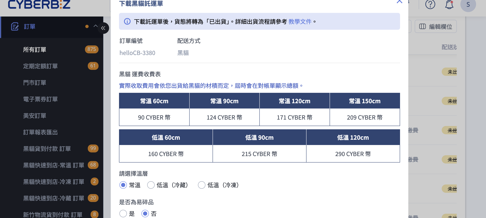

批次下載黑貓宅配託運單、扣除運費並將訂單貨態更新為已出貨。
{ .subtitle }

{ .hero-page }

## 黑貓宅配出貨說明

後台與黑貓宅急便系統整合，商家可從訂單列表批次產出黑貓宅配託運單、自動扣除運費(Cyber 幣)，並將訂單貨態同步更新為「已出貨」。本文聚焦於 **黑貓宅配(B2C 宅配到府)** 的出貨流程。

!!! info "其他黑貓服務"
    * 若顧客選擇超商取貨，請見 [使用黑貓快速到店出貨](使用黑貓快速到店出貨.md)。
    * 自動呼叫黑貓司機到府收件，請見 [自動呼叫黑貓司機取件](自動呼叫黑貓司機取件.md)。

## 計費與規則 { #tcat-home-pricing }

### 運費扣款方式(依方案) { #tcat-home-shipping-fee }

商家方案不同，黑貓運費的扣款方式也不同：

=== "一般版"
    需先儲值 **CYBER 幣** 。下載託運單時系統會即時從 Cyber 幣餘額扣除運費，餘額不足時下載會失敗。

=== "PLUS版 / 企業版"
    無須事先儲值。每筆運費將計入「對帳中心」，於每期對帳單一次結清。

??? quote "如何查詢扣款明細"
    一般版商家可至 **儲值中心 > 明細紀錄** [查詢扣款歷程][cyber-coin-transaction-history]{ data-preview }；PLUS / 企業版商家可至 **對帳中心** 查詢月結帳單。

---

### 託運單有效期 { #tcat-home-label-expiry }

下載託運單後即會扣除 Cyber 幣。如 **產出托運單後 14 天未實際出貨** ，系統會將該單號認列為失效並執行以下動作：

- 所扣的 Cyber 幣會自動退回帳戶。
- 訂單列表頁內，訂單的 **配送狀態** 保留在「已出貨」，不會更改。
- 訂單詳情頁內，狀態會保留在「[已出貨(待物流收件)][shipping-status-text-type]{ data-preview }」。
- 託運單單號狀態更改為「取消寄件」。

---

### 繁盛期加收 { #tcat-home-busy-season }

於三大節日（端午、中秋、春節）物流繁盛期間，每張託運單將額外加收 10 Cyber 幣 服務費。

- **加收期間**：各節日前一週（不含節日當日）。
- **紀錄查詢**：此費用將列入「對帳備註」中供後續對帳參考。

!!! info "動態調整說明"
    繁盛期定義與加收費用可能隨物流公司規範調整。請依 黑貓宅急便官網公告 或 CYBERBIZ 最新後台公告為準。

---

### 規格不符處理規範 { #tcat-home-specs-mismatch }

為確保物流作業順暢與帳務準確，下載託運單前請務必確認「系統選定規格」與「包裹實際狀況」一致。若規格不符，將依以下規範處理：

- **溫層混配處理費**  
若 **列印常溫託運單卻以低溫寄送** ，或 **列印低溫託運單卻以常溫寄送** ，每張託運單將額外加收 **50 Cyber 幣** 的處理費。

- **運費差額補收**  
若實際出貨時的包裹尺寸或配送溫層與系統下載時選擇的不符，導致產生較高運費，其運費差額將列入後續的對帳單中向商家收取。

## 操作步驟 { #operate-tcat-home }

### 出貨前準備 { #prerequisites-tcat-home }

執行黑貓宅配出貨前，請完成以下準備：

- [x] **領取黑貓三聯空白託運單貼紙**：致電黑貓宅急便 (02-412-8888) 領取「三聯空白託運單貼紙」(俗稱 A4 三模託運單)。若選擇 A4
一般列印，系統列印的內容必須印在這款貼紙上，司機才會收件。
- [x] **設定公司物流地址**：進入 管理中心 > 一般設定 > [公司物流地址][gp-logistics-address]{ data-preview }，完整填寫縣市、區域與地址。未設定或地址不完整時，下載託運單會出現「缺少相關資訊」的錯誤。
- [x] **確認餘額或對帳狀態**：一般版商家請至 [儲值中心查看 Cyber 幣餘額][cyber-coin-balance]{ data-preview }，確認足以支付運費；PLUS版 /
企業版商家無此限制。
- [x] **列印設備建議**：建議使用 **雷射印表機** 列印託運單，避免出貨條碼判讀異常。

---

### 批次下載黑貓宅配託運單 { #tcat-home-shipping-label-batch }

以下為最常見的批次出貨流程：

1. **進入訂單列表**：登入後台，前往 **訂單 > 所有訂單**。
2. **勾選訂單**：在列表中勾選欲出貨的訂單，需確認所選訂單的配送方式皆為「黑貓宅配」。
3. **點擊「更多操作」**：於列表上方點擊 **更多操作** ，在下拉選單中選擇 **下載黑貓託運單並將貨態改為'已出貨'**[^1]。

    

4. **設定彈出視窗內欄位**：在跳出的「下載黑貓託運單」視窗中依序設定
    * **請選擇溫層**：選擇 **常溫** 、 **低溫(冷藏)** 或 **低溫(冷凍)** 。請確保 [規格與實寄包裹一致][tcat-home-specs-mismatch]{ data-preview }
    * **是否為易碎品**：選擇 **是** 或 **否** 。
    * **寄件地址**：自動帶入 [公司物流地址][gp-logistics-address]{ data-preview }，需要時可點 **更改** 臨時調整(僅本次有效)。

    * **同意條款**：勾選 **我已閱讀並同意 CYBERBIZ 物流串接服務條款 與 黑貓合約規範** 。未勾選時下載按鈕無法點擊。

    ??? quote "需要自訂黑貓寄件資訊？"
        若你的黑貓寄件地址需要不同於公司物流地址(例如倉庫地址)，或需要自訂寄件人姓名、電話，請另到 **金物流 > 黑貓託運單** 於「[黑貓設定][configure-ezcat-shipping-note-sender-setup]{ data-preview }」區塊填寫並儲存。

    

    !!! plan "從彈出視窗直接呼叫黑貓司機"
        若你的店家已開通呼叫黑貓功能，視窗下方會出現「自動呼叫黑貓司機取件」區塊，可在下載託運單的同時預約司機到府收件。詳細操作請見 [如何自動呼叫黑貓司機取件](自動呼叫黑貓司機取件.md)。

5. **確認下載與扣費**：點擊 **確認** ，系統會自動下載[^2] [託運單 ZIP 壓縮檔][tcat-home-zip-contents]{ data-preview } 並 [扣除運費][tcat-home-shipping-fee]。

6. **貨態自動更新**：下載完成後，所選訂單的貨態自動變更為 **已出貨**。(詳見 [確認貨態變更](#tcat-home-verify-status))

    ??? warning "出貨後無法修改收貨資訊"
        標記為「已出貨」後，後台就無法再修改收件地址或聯絡資訊。地址有誤時的處理見 [地址錯誤排除](#tcat-home-address-error)。

[^1]: 若未出現選項，可能是因為訂單狀態不符或物流設定未完成。詳情參考 [常見問題：沒有下載托運單選項](#faq-tcat-home-missing-option)。 
[^2]: 若沒有正常下載，請確認瀏覽器是否阻擋了彈跳視窗或廣告，允許本站彈跳視窗後重新點擊下載。更多疑難排解參考 [常見問題：無法下載托運單](#faq-tcat-home-download-no-response)

---

### 呼叫黑貓司機取件 { #tcat-home-call-driver-pickup }

下載託運單後，需聯繫黑貓司機到貨取件:

* **電話呼叫**：撥打黑貓客服專線 (02-412-8888) 安排取件。
* **從後台直接呼叫**：若已開通 [呼叫黑貓功能](自動呼叫黑貓司機取件.md){ data-preview }，可在下載託運單時於彈出視窗內預約司機取件。

---

### 確認貨態變更 { #tcat-home-verify-status }

成功下載託運單後，可在兩個地方確認貨態：

- **訂單列表頁**：配送狀態欄位顯示 **已出貨**
- **訂單詳情頁**：狀態顯示為 [已出貨(待物流收件)][shipping-status-text-type]{ data-preview }，表示託運單已產生但黑貓尚未收件

若貨態未更新，請檢查：

* 是否實際完成下載(瀏覽器是否阻擋了下載對話框)
* 是否所有勾選的訂單配送方式都符合「黑貓宅配」(例如：不小心勾選了黑貓快速到店或其他物流商的訂單)

---

### 地址錯誤排除 { #tcat-home-address-error }

下載託運單時若出現「寄件人資訊不完整提示」，代表黑貓寄件地址未設定或不完整：

1. 前往 **金物流 > 黑貓託運單**，確認「黑貓設定」區塊內的 **寄件地址** 完整填寫(含縣市、區域)，儲存後系統會自動向黑貓查詢寄件人區碼。
2. 儲存後重新執行下載。

??? info "關於地址來源的優先順序"
    若您是首次使用，系統會自動帶入 管理中心 > 一般設定 > [公司物流地址][gp-logistics-address]{ data-preview } 的資訊。

    > **注意**：一旦「黑貓設定」頁面已有獨立地址資訊，修改「公司物流地址」將 **不會** 同步更新至黑貓設定。請務必在「黑貓託運單」頁面直接進行修改。

## 後續操作 { #tcat-home-next-steps }

  
- :lucide-package-check:{ .lg }  
  [__部分出貨__](設定訂單部分出貨.md){ data-preview }  
  若一筆訂單中只想先寄出部分商品，可改從訂單詳情頁勾選指定品項。

- :lucide-printer:{ .lg }  
  [__補印託運單__](../payments-and-logistics/補印與加印託運單.md){ data-preview }  
  若已下載過的託運單檔案遺失(例如貼紙印壞、檔案不見)，可在訂單列表批次補印。

- :lucide-copy-plus:{ .lg }  
  [__加印託運單__][ezcat-shipping-note-create]{ data-preview }  
  若一筆宅配訂單因商品多需拆分為多箱寄出，每箱需各自一張託運單。

- :lucide-receipt:{ .lg }  
  [__查看對帳明細__][ezcat-shipping-note-records]{ data-preview }  
  若訂單有運費調整（如補收差額或繁盛期加收），系統會將詳細資訊記錄於「[對帳備註][ezcat-shipping-note-usage-records]{ data-preview }」中。

## 常見問題 { #faq-tcat-home }

??? quote "下載沒反應 / 無法下載託運單" 
    { #faq-tcat-home-download-no-response }

    通常為以下原因之一：

    * **瀏覽器阻擋彈跳視窗**：請檢查瀏覽器是否阻擋了彈跳視窗或廣告，允許本站彈跳視窗後重新點擊下載。
    * **Cyber 幣不足(一般版商家)**：請至 [儲值中心][cyber-coin-balance]{ data-preview } 儲值。
    * **公司物流地址未設定**：至 管理中心 > 一般設定 > [公司物流地址][gp-logistics-address]{ data-preview } 完成設定。
    * **未勾選同意條款**：確認彈出視窗下方「我已閱讀並同意 CYBERBIZ 物流串接服務條款 與 黑貓合約規範」已勾選。

??? quote "沒有「下載黑貓託運單」選項"
    { #faq-tcat-home-missing-option }

    下拉選單會依訂單的配送方式自動篩選，可能原因:

    * 訂單配送方式不是黑貓宅配(可能是黑貓快速到店、宅配通、順豐、新竹物流或其他物流)。
    * 訂單付款狀態尚未到位(例如未付款、待轉帳)。
    * 訂單已是「已出貨」狀態，此時應改用 **補印託運單** 而非「下載」。

??? quote "託運單下載後可以修改地址嗎?"
    { #faq-tcat-home-edit-address }

    不可以。已下載的託運單地址無法在系統內修改，需在託運單上 **手寫更正** ，並於交件時告知司機。

??? quote "託運單下載後幾天內必須寄出?"
    { #faq-tcat-home-expiry }

    產出托運單後，**14 天內** 須完成實際出貨，否則單號會被認列為失效， Cyber 幣會自動退回。

??? quote "同一筆訂單可以同時用兩家物流出貨嗎?"
    { #faq-tcat-home-mixed-shipping }

    不可以。一筆訂單只能搭配一種物流商。若需拆分品項出貨，請參考 [部分出貨][tcat-home-scenario-partial-link]{ data-preview }
    流程，或聯繫業務團隊。

[tcat-home-scenario-partial-link]: #tcat-home-scenario-partial

??? quote "補印託運單會額外扣費嗎?"
    { #faq-tcat-home-reprint-fee }

    不會。補印使用原來的單號，系統不會再次扣除 Cyber 幣。若需要 **新單號** (例如同一筆訂單拆成多箱)，請使用「[加印託運單][ezcat-shipping-note-create]{ data-preview }」，加印會依張數扣費。

??? quote "我是峰潮物流商家，可以用這個流程嗎?"
    { #faq-tcat-home-honeycomb }

    不能。峰潮物流商家的出貨由峰潮代為處理，訂單會自動進入峰潮倉儲，由峰潮端產生黑貓託運單。商家無需自行下載託運單，

??? quote "出現「地址有誤，無法查詢區碼，請至訂單頁面修改」該如何解決?"
    { #faq-tcat-home-address-error }

    異常原因為黑貓系統不支援模糊搜尋地址，訂單地址須與黑貓系統內的地址資料一致（非 Google 地圖上的地址），否則無法提供寄送及託運單列印服務。

    !!! example "常見錯誤舉例"

        - 錯字：如新竹縣「**峨眉鄉**」誤填為「**峨嵋鄉**」
        - 地址不完整：缺少路名、街名或巷弄名，導致黑貓無法判讀

    依出貨狀態處理方式如下：

    - **尚未出貨**：可先向顧客確認正確地址，前往 **訂單 > 所有訂單** 點擊該筆訂單，於「聯絡資訊」區塊修改收貨地址後重新下載託運單。
    - **已出貨**：無法在系統上直接修改地址。請列印出託運單，**手寫** 將地址改為正確資訊，並於交貨時告知物流司機。

??? quote "宅配出貨運費 Cyber 幣如何計算？"
    { #faq-tcat-home-shipping-fee-calculation }

    具體運費標準請洽您的 CYBERBIZ 開店顧問 或 後台線上客服。

    **特殊加收與調整項目**  
    除基本運費外，若遇以下情境將產生額外費用或帳務調整：

    - **繁盛期加收**：於三大節日（除夕、端午、中秋）前一週，每張託運單額外加收 10 CYBER 幣 服務費。
    - **離島加價**：澎湖、金門、馬祖、綠島等地區，將依黑貓官方公告之運費計價。
    - **規格差異補收**：若實際包裹尺寸/溫層大於系統設定，將補收運費差額。

    若訂單有運費調整（如補收差額或繁盛期加收），系統會將詳細資訊記錄於「對帳備註」中（金物流 > 黑貓託運單 > 單號使用紀錄）。

    ??? example "帳務處理範例"

        | 情境 | 初始扣費 | 實際對帳結果 | 帳務調整方式 |
        | :--- | :--- | :--- | :--- |
        | **尺寸差異** | 常溫 60cm (90 點) | 常溫 90cm (124 點) | 於對帳單補收差額 **34 點** |
        | **繁盛期加成** | 常溫 120cm (171 點) | 加收服務費 10 點 | 於對帳單補收 **10 點** |
    
??? quote "如何查看對帳明細？"
    { #faq-tcat-home-view-account-details }

    若訂單有運費調整（如補收差額或繁盛期加收），系統會將詳細資訊記錄於「對帳備註」中。後台路徑：金物流 > 黑貓託運單 > 單號使用紀錄（此路徑亦適用於宅配通）。

## 參考資料 { #tcat-home-references }



### 託運單列印方式對照表 { #tcat-print-formats }

CYBERBIZ 黑貓託運單下載彈出視窗的「列印方式(尺寸)」提供三種選項，商家應依手邊的印表機與託運單貼紙挑選。

| 列印方式 | 適用印表機 | 託運單貼紙 / 紙張 | 建議用途 |
| :-- | :-- | :-- | :-- |
| 熱感列印(10cm x 10cm) | 熱感標籤印表機 | 10cm x 10cm 規格的熱感標籤紙 | 高出貨量、需要快速貼標的商家 |
| 一般列印(A4) | 一般雷射印表機 | 黑貓三聯空白託運單貼紙(A4 三模) | 多數小型至中型商家的標準選擇 |
| 熱感列印(A6) | 熱感標籤印表機 | A6 規格的熱感標籤紙 | 使用 A6 尺寸熱感標籤的出貨場景 |

!!! note "註釋"
    * **一般列印(A4)** 需搭配黑貓提供的 **三聯空白託運單貼紙** (A4 三模)，請先致電黑貓 (02-412-8888) 索取。
    * 熱感列印選項適合長期高量出貨的商家，需自備熱感印表機與對應規格的標籤紙。
    * 列印效果不佳可能造成黑貓掃描條碼判讀異常，建議定期檢查印表機碳粉/熱感頭狀態。
    * 列印方式選擇後 **不影響運費** ，運費僅依商品尺寸與溫層計算。



### 託運單 ZIP 內容物 { #reference-tcat-home-zip-contents }

下載完成後，zip 內包含四份 PDF，分別供不同流程使用：

| 檔案 | 用途 | 收件對象 |
|---|---|---|
| **託運單** | 黑貓收件、配送依據；以黑貓三聯空白託運單貼紙列印後黏貼於包裹表面 | 司機 |
| **出貨明細** | 出貨包裹內附的明細單，含品項與數量 | 消費者(隨包裹) |
| **揀貨單** | 倉庫揀貨用的清單，依品項彙整方便揀料 | 內部倉務人員 |
| **訂單明細** | 訂單完整資訊，含金額、付款方式、消費者資料 | 內部存檔 / 客服 |

