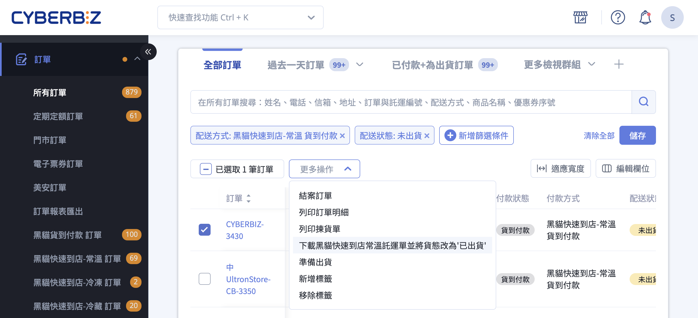
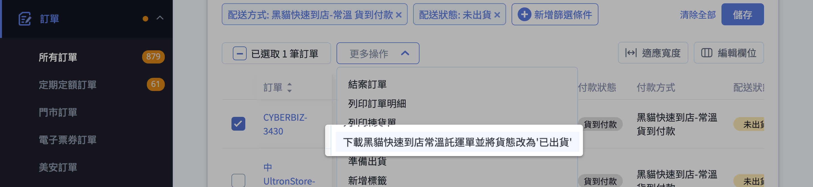
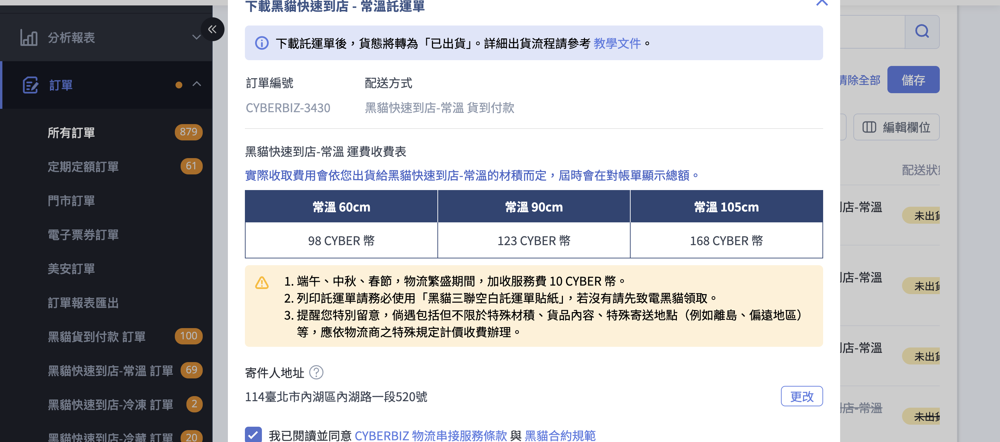
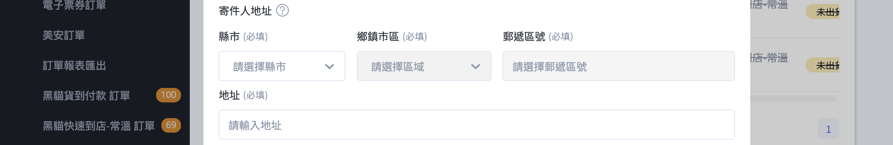

{ .subtitle }

{ .doc-badge }

{ .hero-page }

## 黑貓快速到店出貨說明 { #intro-tcat-cvs }

「黑貓快速到店」是商家將商品委由黑貓物流送至消費者指定的 7-11 門市進行取貨的服務，依商品溫層分為常溫、冷藏、冷凍三種。本文將引導您如何在新版訂單列表中批次處理訂單、下載託運單，並將貨態變更為「已出貨」。

!!! info "其他黑貓服務"
    * 若顧客選擇宅配，請見 [使用黑貓宅配出貨](使用黑貓宅配出貨.md)。
    * 自動呼叫黑貓司機到府收件，請見 [自動呼叫黑貓司機取件](自動呼叫黑貓司機取件.md)。

## 使用前提 { #prerequisites-tcat-cvs }

在執行黑貓快速到店出貨前，請確保您的系統設定、訂單狀態與硬體設備皆符合以下規範。

### 適用訂單狀態 { #prerequisites-tcat-cvs-order-status }

系統僅允許符合以下條件的訂單執行出貨：

- **配送方式**： 結帳選用對應的「黑貓快速到店」。
- **付款狀態**： 顯示為「已收到款項」或「貨到付款」。
- **配送狀態**： 顯示為「未出貨」、「部分出貨」或「準備出貨中」。

---

### 配送規範 { #prerequisites-tcat-cvs-shipping-rules }

下列為黑貓快速到店的物流規範，請於包裝與出貨前確認：

| 項目 | 內容 |
| :-- | :-- |
| 包裹重量上限 | 單件 10 公斤 |
| 包裹材積上限 | 長 ＋ 寬 ＋ 高 不超過 105 公分 |
| 配送區域 | 僅支援台灣本島，不支援離島 |
| 取貨期限 | 商品抵達超商後，常溫可放置 7 日；冷藏／冷凍僅可放置 4 日 |
| 託運單時效 | 產出託運單後須於 7 日內聯繫黑貓完成收貨，逾期單號將失效 |
| 逾期未取 | 包裹退回商家，黑貓將 **加收一次回程運費** |

!!! tip "冷藏／冷凍出貨的包裝建議"
    * **預冷時間** ：冷藏商品建議預冷 6 小時以上、冷凍商品建議預冷 12 小時以上，以維持溫層至門市取貨時。
    * **託運單防水** ：建議使用防水貼紙列印託運單，或將託運單放入透明防水袋後再黏貼於包裹外，避免因冷凝水使條碼模糊導致司機無法掃描。

---

### 系統限制 { #prerequisites-tcat-cvs-system-contraints }

- **溫層分流（不可混批）**： 常溫、冷藏、冷凍分屬不同託運單。批次勾選出貨時，不同溫層的訂單不可混合勾選處理。
- **功能開通限制**： 商店須開通對應溫層的功能。若要使用冷藏與冷凍服務，系統必須額外開通「商品綁溫層」功能。

## 操作步驟 { #tcat-cvs-operate }

### 出貨前準備 { #prerequisites-tcat-cvs-checklist }

執行黑貓快速到店出貨前，請完成以下準備：

- [x] **物流地址設定**： 務必至 管理中心 > 一般設定 完成 [公司物流地址][gp-logistics-address]{ data-preview } 設定，否則託運單上的寄件人資訊將不完整。
- [x] **耗材與設備**： 已備妥「黑貓三聯空白託運單貼紙」（可致電黑貓客服 02-412-8888 取得），並建議使用雷射印表機列印，以確保條碼清晰。
- [x] **商品預冷（低溫包裹）**： 冷藏商品須預冷 6 小時以上；冷凍商品須預冷 12 小時以上。
- [x] **確認餘額**：一般版商家請至 [儲值中心查看 CYBER 幣餘額][cyber-coin-balance]，確認足以支付運費；PLUS 版 / 企業版商家無此限制。

--- 

### 批次下載黑貓快速到店託運單 { #operate-tcat-csv-shipping-note }

以下以常溫託運單為例，冷藏與冷凍的操作步驟相同，僅在下拉選單步驟選擇對應的下拉項目即可。

1. **進入訂單列表**：前往後台「訂單」>「所有訂單」。
2. **勾選欲出貨的訂單**：在列表左側的核取方塊勾選一筆或多筆訂單。請確認所勾選的訂單為同一個黑貓快速到店類型（常溫、冷藏或冷凍其中之一），不可混選不同溫層。
3. **展開「更多操作」並選擇下載動作** ：點擊列表上方的 **更多操作** 下拉選單，依勾選的訂單溫層擇一：
    * 下載黑貓快速到店常溫 / 冷凍 / 冷層託運單並將貨態改為「已出貨」

    

4. **檢視託運資訊與運費**：系統將彈出「下載黑貓快速到店 - 常溫／冷凍／冷藏 託運單」視窗，視窗內會列出本次出貨的訂單清單與運費試算，請確認無誤。

    

    ??? warning "費用注意事項"
        * 端午、中秋、春節等物流繁盛期間，黑貓將加收服務費 10 CYBER 幣。
        * 若涉及特殊材積、特殊商品內容或特殊寄送地點（例如離島、偏遠地區），將依物流商之特殊規定另行計價。

5. **（選用）設定自動呼叫司機取件**：若商店已開通「[呼叫黑貓](自動呼叫黑貓司機取件.md){ data-preview }」加值功能，視窗中會出現「是否自動呼叫黑貓司機取件」選項，選擇 **是** 後會展開以下三個欄位：

    * **是否需在取件前事先電話聯絡**：選「是」時，司機抵達前會撥打「[黑貓寄取件設定頁][configure-ezcat-cvs-shipping-note-sender]{ data-preview }」中的聯絡電話與您確認。
    * **是否需黑貓司機準備推車**：若包裹數量較多，可請司機自備推車。
    * **備註**：可填寫特殊收件指示(例如門禁、樓層)，上限 **100 字**。

    ??? warning "呼叫截止時間"
        每日 **16:30** 為[呼叫截止時間][tcat-auto-call-driver-deadtime]{ data-preview }，超過後此選項將自動鎖定為「否」，當天無法再透過系統呼叫，需自行致電黑貓安排。

6. **確認寄件地址**：視窗下方會顯示後台已設定的公司物流地址；若需臨時調整，可點擊「更改」覆寫此次出貨寄件地址。

    

    ??? quote "需要自訂黑貓寄件資訊？"
        若你的黑貓寄件地址需要不同於公司物流地址(例如倉庫地址)，或需要自訂寄件人姓名、電話、託運單預設品名，請另到 **金物流 > 黑貓快速到店託運單** 於「[黑貓設定][configure-ezcat-cvs-shipping-note-sender]{ data-preview }」區塊填寫並儲存。

7. **勾選並同意服務條款** ：確認已勾選「我已閱讀並同意 CYBERBIZ 物流串接服務條款 與 黑貓合約規範」（預設為勾選狀態），按鈕「確認」才會啟用。
8. **確認下載與扣費**：點擊 **確認** ，系統會自動下載[^1] [託運單 ZIP 壓縮檔][tcat-cvs-zip-contents]{ data-preview } 並扣除運費。
9. **確認貨態已變更**：操作完成後，被勾選訂單的配送狀態會自動轉為 **已出貨** ，訂單詳情頁顯示「已出貨（待物流收件）」。(詳見 [確認貨態變更][tcat-cvs-verify-status]{ data-preview })

[^1]: 若沒有正常下載，請確認瀏覽器是否阻擋了彈跳視窗或廣告，允許本站彈跳視窗後重新點擊下載。更多疑難排解參考 [常見問題：無法下載托運單](#faq-tcat-cvs-download-no-response)

---

### 呼叫黑貓司機取件 { #tcat-cvs-call-driver-pickup }

下載託運單後，需聯繫黑貓司機到貨取件:

* **電話呼叫**：撥打黑貓客服專線 (02-412-8888) 安排取件。
* **從後台直接呼叫**：若已開通 [呼叫黑貓功能](自動呼叫黑貓司機取件.md){ data-preview }，可在下載託運單時於彈出視窗內預約司機取件。

---

### 確認貨態變更 { #tcat-cvs-verify-status }

成功下載託運單後，可在兩個地方確認貨態：

- **訂單列表頁**：配送狀態欄位顯示 **已出貨**
- **訂單詳情頁**：狀態顯示為 [已出貨(待物流收件)][shipping-status-text-type]{ data-preview }，表示託運單已產生但黑貓尚未收件

若貨態未更新，請檢查：

* 是否實際完成下載(瀏覽器是否阻擋了下載對話框)
* 是否所有勾選的訂單配送方式都符合「黑貓快速到店」

---

### 地址錯誤排除 { #tcat-cvs-address-error }

下載託運單時若出現「寄件人資訊不完整提示」，代表黑貓寄件地址未設定或不完整：

1. 前往 **金物流 > 黑貓快速到店託運單**，確認「黑貓快速到店設定」區塊內的 **寄件地址** 完整填寫(含縣市、區域)，儲存後系統會自動向黑貓查詢寄件人區碼。
2. 儲存後重新執行下載。

??? info "關於地址來源的優先順序"
    若您是首次使用，系統會自動帶入 管理中心 > 一般設定 > [公司物流地址][gp-logistics-address]{ data-preview } 的資訊。

    **注意**：一旦「黑貓快速到店設定」頁面已有獨立地址資訊，修改「公司物流地址」將 **不會** 同步更新至黑貓設定。請務必在「黑貓託運單」頁面直接進行修改。

## 後續操作 { #nextstep-tcat-cvs }

- :lucide-printer:{ .lg }  
  [__補印託運單__](../payments-and-logistics/補印與加印託運單.md){ data-preview }  
  若須重新列印（例如標籤受潮、列印不清），回到訂單列表勾選同筆訂單，於「更多操作」選擇補印託運單。

- :lucide-truck:{ .lg }  
  [__自動呼叫司機__](自動呼叫黑貓司機取件.md){ data-preview }  
  開通「呼叫黑貓」加值功能者可於列印託運單時自動呼叫司機。

## 常見問題 { #faq-tcat-cvs }

??? quote "下載沒反應 / 無法下載託運單" 
    #### 下載沒反應 / 無法下載託運單 { #faq-tcat-cvs-download-no-response } { .hidden-header }
    通常為以下原因之一：

    * **瀏覽器阻擋彈跳視窗**：請檢查瀏覽器是否阻擋了彈跳視窗或廣告，允許本站彈跳視窗後重新點擊下載。
    * **CYBER 幣不足(一般版商家)**：請至 [儲值中心][cyber-coin-balance]{ data-preview } 儲值。
    * **公司物流地址未設定**：至 管理中心 > 一般設定 > [公司物流地址][gp-logistics-address]{ data-preview } 完成設定。
    * **未勾選同意條款**：確認彈出視窗下方「我已閱讀並同意 CYBERBIZ 物流串接服務條款 與 黑貓合約規範」已勾選。

??? quote "「更多操作」下拉中找不到「下載黑貓快速到店⋯」選項？"
    #### 「更多操作」下拉中找不到「下載黑貓快速到店⋯」選項？ { #faq-tcat-cvs-action-missing } { .hidden-header }
    通常為以下原因之一：

    * 商店尚未開通對應的黑貓快速到店功能（常溫／冷藏／冷凍各為獨立功能），請至「方案管理」確認開通狀態。
    * 勾選的訂單在結帳時並未選擇黑貓快速到店配送，或混合勾選了不同溫層／不同物流的訂單。請確保本批訂單為同一種黑貓快速到店類型。
    * 訂單貨態不在「未出貨」、「部分出貨」、「準備出貨中」範圍內（例如已退款、已取消），無法執行出貨。

??? quote "「是否自動呼叫黑貓司機取件」的選項是灰色／無法勾選？"
    #### 「是否自動呼叫黑貓司機取件」的選項是灰色／無法勾選？ { #faq-tcat-cvs-call-disabled } { .hidden-header }
    可能為以下情況：

    * 目前時間已超過當日 **16:30** ，自動呼叫功能會自動關閉並停留在「否」，請於次日再使用，或自行致電黑貓安排當日取件。
    * 商店未開通「呼叫黑貓」加值功能，整個自動呼叫區塊不會顯示，請聯繫業務窗口或致電黑貓客服取件。

??? quote "付款狀態還是「等待付款」可以先下載託運單嗎？"
    #### 付款狀態還是「等待付款」可以先下載託運單嗎？ { #faq-tcat-cvs-payment-status } { .hidden-header }
    不行。出貨動作要求訂單付款狀態為「已收到款項」或「貨到付款」，且貨態為「未出貨」、「部分出貨」或「準備出貨中」。若付款尚未確認，請先處理收款後再執行出貨。

??? quote "託運單列印壞掉或遺失，可以重印嗎？"
    #### 託運單列印壞掉或遺失，可以重印嗎？ { #faq-tcat-cvs-redownload } { .hidden-header }
    可以。請在訂單列表勾選該筆訂單，於「更多操作」選擇 **補印託運單** ，系統會以原託運單號重新產出檔案，不會重複建立單號或扣費。

??? quote "同一批訂單可以混合常溫與冷凍一起出貨嗎？"
    #### 同一批訂單可以混合常溫與冷凍一起出貨嗎？ { #faq-tcat-cvs-mixed-temperature } { .hidden-header }
    不行。常溫、冷藏、冷凍為三個獨立的下載動作，且訂單在結帳時即已綁定溫層。請依溫層分批勾選與出貨，避免出貨後因溫層不符影響商品品質。

---

## 參考資料 { #tcat-cvs-reference }

* [CYBERBIZ 物流串接服務條款 :lucide-external-link:](https://www.cyberbiz.io/docs/logistics_cyberbiz_2023.pdf)
* [黑貓合約規範 :lucide-external-link:](https://cyberbiz.io/docs/logistics_ezcat.pdf)
* 黑貓宅急便客服專線：02-412-8888（領取三聯空白託運單貼紙、查詢取件狀態）

### 託運單 ZIP 內容物 { #tcat-cvs-zip-contents }

下載完成後，zip 內包含四份 PDF，分別供不同流程使用：

| 檔案 | 用途 | 收件對象 |
|---|---|---|
| **託運單** | 黑貓收件、配送依據；以黑貓三聯空白託運單貼紙列印後黏貼於包裹表面 | 司機 |
| **出貨明細** | 出貨包裹內附的明細單，含品項與數量 | 消費者(隨包裹) |
| **揀貨單** | 倉庫揀貨用的清單，依品項彙整方便揀料 | 內部倉務人員 |
| **訂單明細** | 訂單完整資訊，含金額、付款方式、消費者資料 | 內部存檔 / 客服 |

