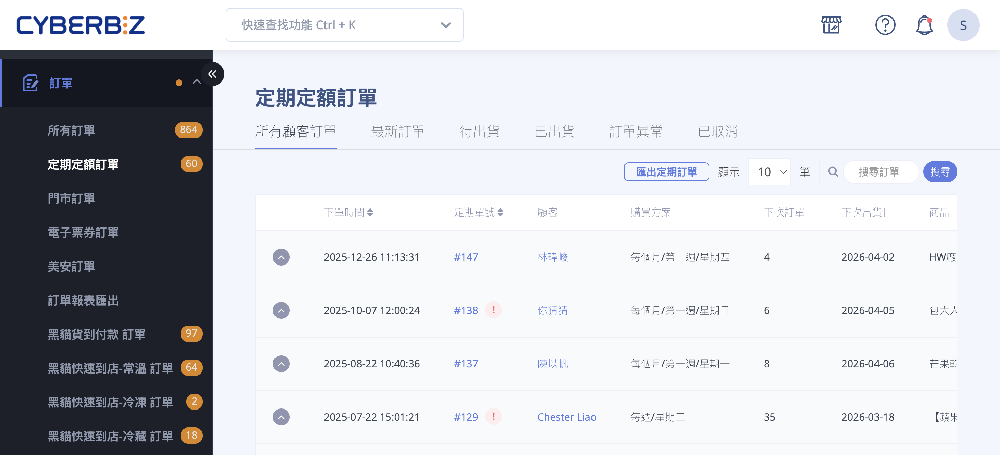
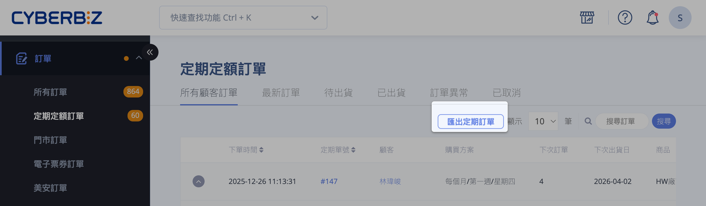
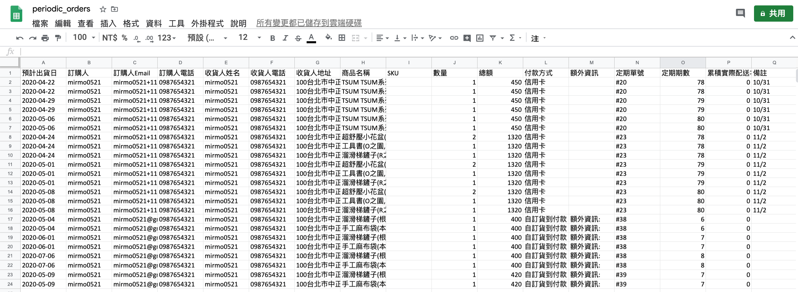

# 匯出定期定額子訂單預測報表

匯出定期定額子訂單預測報表，查核未來預計出貨的訂單資料，預測備貨量。
{ .subtitle }

[:lucide-tag:{ title="適用方案" }](../../../resources/conventions#適用方案) | 企業
{ .doc-badge }

{ .hero-page }

## 匯出定期定額子訂單報表說明

商家可以匯出 **定期定額訂單的子訂單報表**，這對於查核未來預計出貨的訂單資料、預測備貨量非常有幫助。

## 功能說明

*   **用途**：主要用於查核未來要出貨的訂單資料。
*   **預測資訊**：系統可匯出所有定期訂單中，**預計將成立的前 3 筆子訂單資訊**（指尚未正式成立訂單的預期資料）。
*   **檔案格式**：Excel 報表。

## 操作步驟

1.  **進入路徑**：登入 CYBERBIZ 管理後台，點選左側選單的 **訂單 > 定期定額訂單**。
2.  **執行匯出**：點擊頁面中的「**匯出定期訂單**」按鈕。
3.  **收取報表**：匯出完成後，系統會自動將 Excel 檔案發送至 **當前登入的管理者信箱** 中，請至信箱查收並下載。

## 報表欄位細節

下載後的報表將包含以下欄位，方便商家進行詳細核對：

*   **時間與期數**：預計出貨日、定期單號（母單號）、定期期數、累積實際配送次數。
*   **訂購人資訊**：訂購人姓名、Email、電話。
*   **收貨人資訊**：收貨人姓名、電話、收貨地址。
*   **商品細節**：商品名稱、SKU、數量、總額。
*   **其他資訊**：付款方式、額外資訊、備註、定期訂單管理員備註、是否為代客下單。

## 常見問題

??? quote "為什麼我匯出的報表只顯示前 3 筆子訂單？"
    為了確保系統效能與預測的準確性，系統目前預設僅匯出每筆母訂單「預計」成立的前 3 筆子訂單資訊。若該定期訂單已接近結束期數，則會依實際剩餘期數顯示。

??? quote "如果我想查詢已經成立的子訂單，也是從這裡匯出嗎？"
    不是的。此功能主要用於「預測未來備貨」。若要查詢已經成立（有實際訂單編號）的子訂單，請至 訂單 > 所有訂單，利用篩選條件中的「定期定額訂單」進行搜尋與匯出。

??? quote "點擊匯出後沒收到信件怎麼辦？"
    請先確認以下幾點：

    * 檢查垃圾信件匣：信件可能被郵件伺服器誤判為廣告。
    * 確認管理者帳號：報表會寄送到「目前登入該後台的帳號 Email」，請確認該信箱是否正常運作。
    * 等待時間：若資料量較大，系統處理需要 3-5 分鐘，請稍候再查看。

??? quote "預期出貨日與實際成立訂單的日子會一樣嗎？"
    原則上一致。但若該筆定期訂單因信用卡授權失敗、或是商家端有調整定期定額的週期間隔，系統將會依據最新的設定重新計算預期出貨日。
