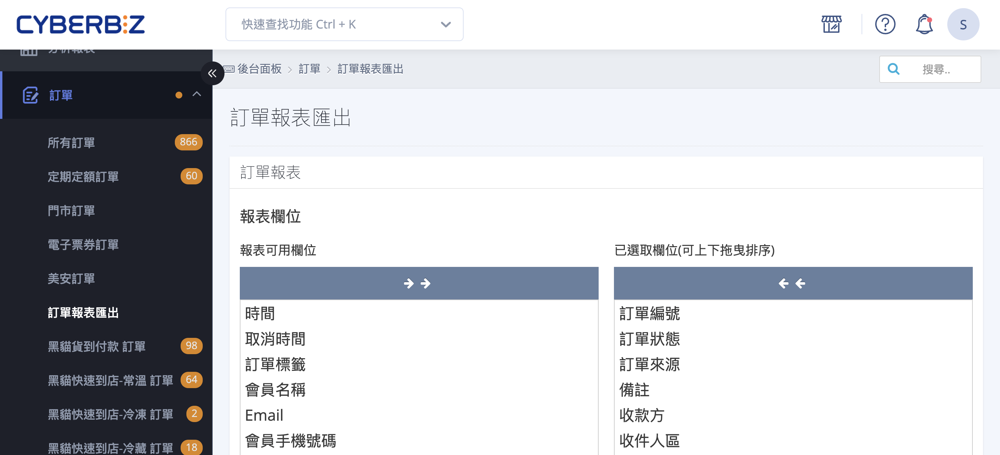
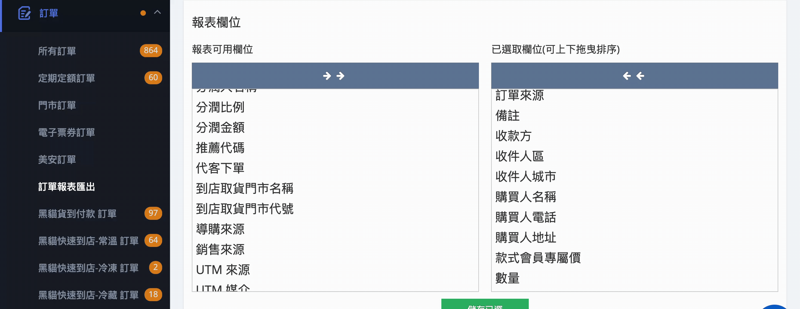
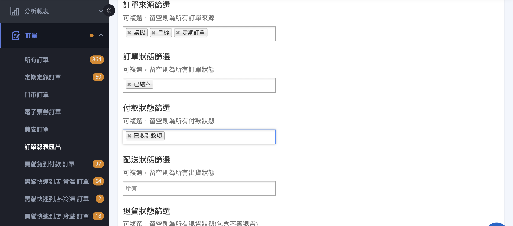
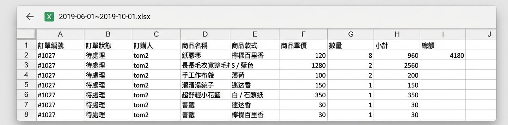
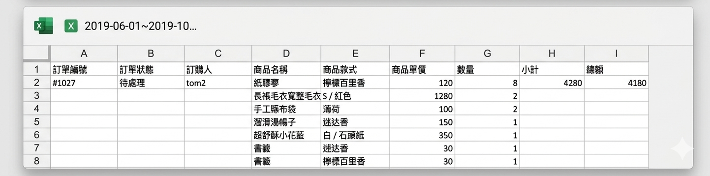

# 匯出訂單報表

匯出訂單報表並以 Excel 格式寄送至管理員信箱，方便查詢與分析訂單資料。
{ .subtitle }

{ .hero-page }

## 訂單報表匯出說明

**「訂單報表匯出」** 功能讓商家能詳細調閱並分析訂單明細，報表將以 Excel 格式寄送至操作者的管理員信箱。

## 進入路徑

登入 CYBERBIZ 管理後台，點選左側選單的 **訂單 > 訂單報表匯出**。

完成以下設定後，系統會將訂單報表匯出為 Excel 檔案並寄送至您的管理員信箱。

## 操作步驟

### 步驟一：選擇報表欄位

1.  **選取欄位**：點擊「可用欄位」中的項目，該項目會加入右側的「已選取欄位」；反之則移除。
2.  **調整排序**：您可以透過拖曳「已選取欄位」中的項目來調整報表列出的先後順序。
3.  **進階折扣拆分**：若選取「訂單各項折扣拆分」欄位，報表會細分[顯示各項折扣金額](references/訂單報表可用欄位.md#訂單各項折扣拆分){ data-preview }，例如：

    - 商品任選折扣
    - VIP 折扣
    - 優惠券折扣
    - 紅利折扣
    - 店長改價（POS）

4. **銷售來源**：可顯示該訂單是否為一頁式商店訂單。

    !!! info "一頁式商店資料顯示限制"

        * 版本相容性：僅支援 2025/07/02（含）之後建立的一頁式商店；若商店於此日期前建立，該欄位將無法顯示來源資訊。
        * 資料保留預警：若「刪除」該一頁式商店，系統將無法回溯顯示該來源資訊。建議在刪除商店前，先將相關報表匯出以保留訂單紀錄。

5.  **導購與 UTM 追蹤**：

    *   [**導購來源**](references/訂單報表可用欄位.md#導購來源){ data-preview }：可查看訂單是否來自 LINE 購物、美安、ShopBack 等導購平台。
    *   [**UTM 參數**](references/訂單報表可用欄位.md#UTM-參數){ data-preview }（企業版專用）：可匯出 UTM 來源、媒介、活動名稱等數據追蹤行銷成效（僅支援 2025/12/17 之後成立的訂單）。

    !!! info "每項工具所記錄之 UTM 數據方式與回溯期間均不盡相同，此功能為 CYBERBIZ 系統所記錄之數據，可能與 GA4 或其他工具有所落差。"

---

### 步驟二：篩選匯出範圍與設定 

1.  **篩選項目**：可針對特定的訂單來源、訂單狀態、付款狀態、配送狀態或退貨狀態進行篩選。

    

2. **收信 Email**：匯出資料寄送的信箱地址。

    
    
    !!! info "訂單明細匯出限制"
        由於訂單明細包含敏感個人資料，系統不提供直接下載。報表產出後將由系統自動寄送至操作者當前登入之電子信箱，以確保資訊安全。

3.  **同筆訂單呈現方式**：
    *   **勾選「重複顯示」**：同筆訂單若有多項商品，會分為多列顯示，並展示各別商品小計。

        

    *   **未勾選「重複顯示」**：同筆訂單僅顯示為一列，金額為該單之加總小計。

        

4. **組合商品拆解**：勾選「顯示組合商品資訊」，匯出報表將自動展開「組合商品」內含的子商品資訊。
5. **時間區間**：選擇欲匯出的日期範圍。系統新增了快捷選項，如「最近 7 天」、「最近 30 天」、「這個月」及「上個月」。

    

6.  **執行匯出**：確認設定後，按下匯出按鈕，系統會將 Excel 報表發送至您 **當前登入的帳號信箱**。

## 針對不同情境的報表

- :lucide-store:{ .lg }   
  [__POS 門市報表__](../../pos/orders/POS 報表列表與功能說明.md){ data-preview }     
  若有 POS 系統，可至「POS 商店列表」>「庫存管理」>「報表」下載「訂單匯總報表」或「每日出金報表」。

- :lucide-warehouse:{ .lg }     
  [__電商倉儲報表__](設定超商配送限制與物流排除.md)  
  若使用峰潮物流，可於 WMS 後台「訂單」>「列表」中依照篩選條件進行「報表匯出」。

- :lucide-hand-coins:{ .lg }   
  [__分潤報表__](../profit-sharing/匯出分潤報表.md#任務一匯出正式分潤報表){ data-preview }     
  若有設定推薦人或員工分潤，可至「分潤」>「分潤報表」匯出已結案的推薦分潤總表或個人報表。

- :lucide-calendar-range:{ .lg }   
  [__定期定額子訂單__](匯出定期定額子訂單預測報表.md){ data-preview }     
  可至「訂單」>「定期定額訂單」匯出「定期訂單的子訂單報表」，以查核未來預計出貨的資料。

## 重要注意事項

1.  **信箱檢查**：若未收到報表郵件，請檢查垃圾信件夾，或避免使用 Hinet 信箱，因其阻擋機制較強。
2.  **資料隱碼**：若後台有開啟「[會員個資部分隱碼](../website-management/設定網站安全性.md#會員個資部分隱碼){ data-preview }」，匯出的報表可能會對姓名、手機、地址等個資進行遮蓋處理，以保護會員資料安全。
3.  **匯出權限**：網站擁有者可於「網站權限」中[限制特定管理員執行「訂單匯出」的權限](../website-management/新增網站管理員並設定權限.md#權限分類與細節說明){ data-preview }，以降低資安風險。

## 常見問題

??? quote "為什麼我收不到報表郵件？"

    1. 請先檢查「垃圾信件夾」。
    2. 確認當前登入的帳號信箱是否正確。
    3. 若使用公司企業信箱，請確認防火牆是否阻擋來自 cyberbiz.io 的系統自動發信。

??? quote "可以匯出超過一年前的訂單嗎？"
    可以，只要訂單未被刪除，您都可以透過自定義時間區間進行匯出。但請注意，若資料量龐大（超過萬筆），系統處理時間會較長。

??? quote "為什麼報表裡的個資都是星號（*）？"
    這是因為您的後台開啟了「個資隱碼」功能。請聯繫網站最高權限擁有者，前往「網站安全性設定」檢查是否需暫時關閉此限制以取得完整資料。
