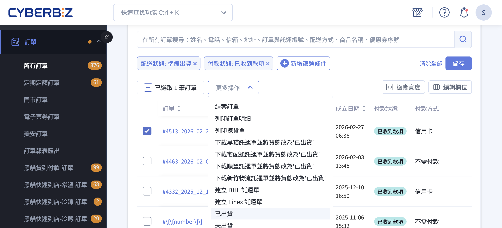
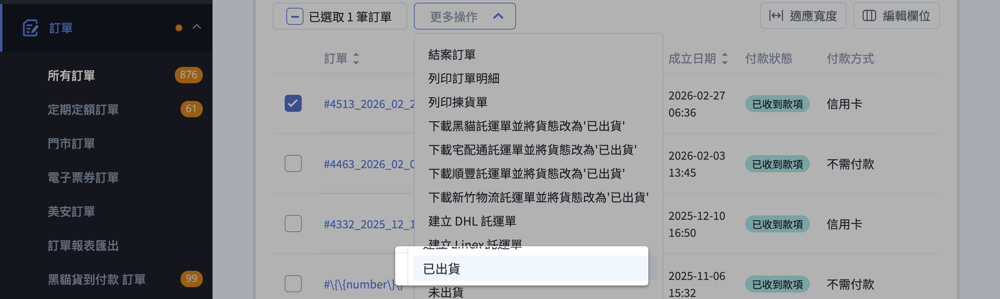
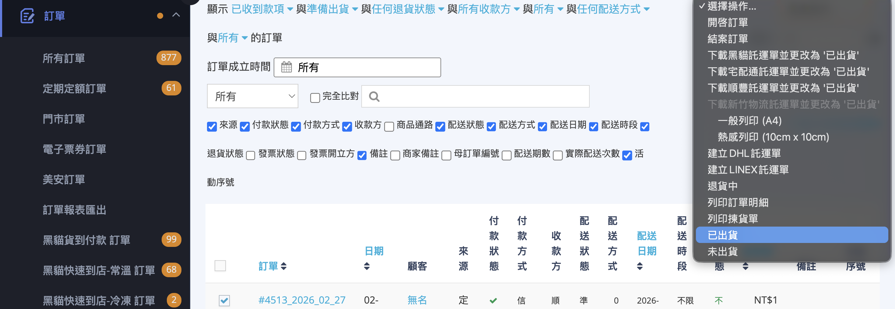
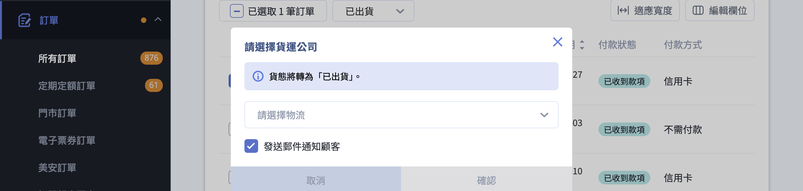
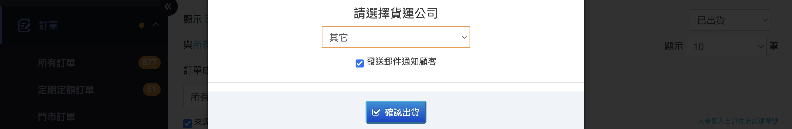
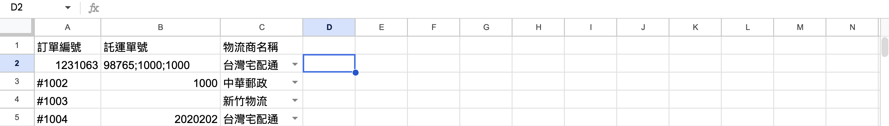
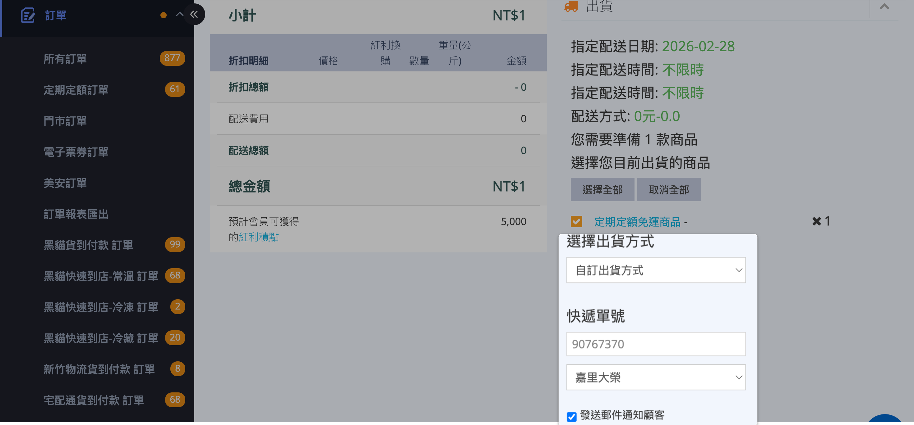

自訂物流的三種出貨方式：批次標記為已出貨、Excel 大量匯入託運單號、單筆訂單手動出貨，以及注意事項與後續操作。
{ .subtitle }

{ .hero-page }

## 自訂物流出貨說明 { #custom-logistics-shipping-intro }

「自訂物流」適用於非 CYBERBIZ 系統串接的物流情境，例如店家自行配合的貨運公司（大榮物流、嘉里大榮、第三方快遞）、商家自送、顧客自取等。商家可在訂單中手動指定貨運公司（可選填託運單號），系統會將訂單貨態切換為「已出貨」，並可選擇是否同步寄送通知信給顧客。

!!! info "與串接物流的差異"
    與系統串接物流（如黑貓宅急便、新竹物流、順豐速運、宅配通）不同，自訂物流：

    - 不會自動產生託運單
    - 不會同步配送進度
    - 不會更新物流軌跡

## 使用前提與限制 { #custom-logistics-shipping-prerequisites }

執行出貨前，訂單必須同時符合以下條件：

- [x] **配送狀態**： 為「未出貨」或「準備出貨」；已出貨、已收貨、退貨中、已退貨的訂單無法執行此操作。
- [x] **付款狀態**： 為「已收到款項」若為「自訂物流貨到付款」訂單，也可直接出貨。
- [x] **僅支援整單出貨**： 不支援部分品項出貨；若需分批出貨，請於訂單明細頁逐筆處理。
- [ ] **配送方式**：為「宅配」超商取貨（包含已付款與取貨付款）及宅配貨到付款訂單 **不適用** 此流程，請改用對應物流流程。

!!! warning "不可逆操作"

    訂單貨態一旦變更為「已出貨」，便無法回復為「未出貨」。若需取消，只能透過退貨或退款流程處理，請務必確認資料正確後再執行。

## 操作方式 { #custom-logistics-shipping-operate }

依出貨量與是否需要回填單號，共有三種操作方式：

-   :lucide-package-open:{ .lg }
    [批次快速出貨（不填單號）](#custom-logistics-shipping-batch)

-   :lucide-file-spreadsheet:{ .lg }
    [Excel 大量匯入託運單號](#excel-bulk-import)

-   :lucide-pencil:{ .lg }
    [單筆訂單手動出貨](#single-order-manual-ship)

---

### 批次標記為已出貨 { #custom-logistics-shipping-batch }

!!! info "適用情境"
    適合一次將多筆訂單快速改為「已出貨」，不需逐筆填寫託運單號的情境，例如：

    - 商家自送
    - 集中交由司機配送
    - 後續再補填單號

**操作步驟**

1. **進入訂單列表**：前往「訂單」 > 「所有訂單」。
2. **勾選訂單**：選取欲出貨的訂單，可一次勾選多筆進行批次處理。
3. **執行出貨**：點擊列表上方「更多操作」>「已出貨」。

    === "新版訂單列表"

        

    === "舊版訂單列表"

        

    !!! note "未通過條件的訂單"
          若所選訂單中包含不符合上述前提的項目，系統會提示「包含無需進一步操作的訂單，請重新選擇」，需先取消勾選不適用訂單再執行。

4. **選擇貨運公司**：於「請選擇貨運公司」視窗中選擇實際配合的物流商。

    === "新版訂單列表"

        

    === "舊版訂單列表"

        

    !!! info "貨運公司清單由系統統一提供，無法自行新增。若找不到實際合作物流商，建議選擇最接近項目，並於訂單備註補充說明。"

5. **設定通知信**：視需要開啟或關閉「發送郵件通知顧客」。
6. **完成出貨**：確認後訂單狀態即更新為「已出貨」。

---

### 大量匯入自訂物流託運單號（Excel） { #excel-bulk-import }

!!! info "適用情境"
    適合需要 **一次回填多筆不同託運單號** 的情境，例如：

    - 第三方物流整批出貨
    - 配送完成後統一補單號

**操作步驟**

1. **進入訂單列表**：登入管理後台，前往「訂單」 > 「所有訂單」。
2. **下載範本**：點擊「大量匯入自訂物流託運單號」，下載系統提供的 Excel 範本檔。

    

3. **填寫資料**：
    - 訂單編號（必填）：需與後台完全一致（含符號）。
    - 託運單號（選填）：填入物流商提供單號。
    - 物流商名稱（選填）：需為系統內既有名稱。

    

    ??? tip "Excel 填寫小技巧"

        - 同一筆訂單若拆成多個包裹，可於「託運單號」欄位使用半形分號 `;` 串接多組單號。例如：`1000;2561;333`
        - 單次匯入上限為 **10,000 筆訂單**。
        - 上傳後系統會以排程處理，完成後將寄送 Email 通知匯入結果。
        - 僅支援「宅配」訂單，且不支援部分出貨。

4. **上傳檔案**：上傳已填寫完成的 Excel。
5. **等待處理**：系統將進行批次處理並寄送匯入結果 Email。

    ??? success "匯入結果"

        匯入完成後，系統將執行以下動作：

        - **更新貨態**：訂單配送狀態將自動變更為「已出貨」。
        - **發送通知**：系統將同步寄送「出貨通知信」予消費者。

---

### 單筆訂單於詳情頁出貨 { #single-order-manual-ship }

!!! info "適用情境"
    - 逐筆精準填寫單號
    - 修改出貨備註
    - 個別處理特殊物流需求

**操作步驟**

1. **進入訂單詳情頁**：在訂單列表點擊訂單編號。
2. **選擇出貨方式**：在「出貨」區塊中的「出貨方式」下拉選單中，選擇「自訂出貨方式」。
3. **填寫物流資訊**：輸入「快遞公司」與「快遞單號」。
4. **設定通知信**：視需要勾選是否寄送出貨通知信。
5. **完成出貨**：確認後訂單狀態更新為「已出貨」。

## 特殊情境處理

- **顧客自取**： 仍使用「自訂物流」流程，「快遞單號」可填寫自取編號或「顧客自取」等文字。
- **商家自送**：可直接使用 [批次出貨][custom-logistics-shipping-batch]{ data-preview }，並於備註補充交付資訊。
- **手寫宅配單**：若使用手寫物流單，請回填實際手寫單號。

    !!! warning "請勿填寫 CYBERBIZ 系統客代，以免造成帳務異常。"

- **同單多包裹**：建議使用 Excel 匯入，並以半形分號 `;` 串接多組單號。

## 後續操作

由於自訂物流不會自動同步配送進度，商家需自行推進後續流程。

- :lucide-check-circle:{ .lg }  
  [__手動結案__](如何手動結案訂單.md){ data-preview }  
  顧客收貨後，可於訂單明細頁點擊「結案」，將訂單改為「已結案」。

- :lucide-clock:{ .lg }  
  [__啟用自動結案__](設定訂單自動結案.md){ data-preview }  
  可至「設定」＞「訂單設定」開啟「出貨後 N 天自動結案」功能。

- :lucide-rotate-ccw:{ .lg }  
  [__退貨 / 換貨__](訂單退貨流程.md){ data-preview }  
  若顧客需退換貨，請於訂單明細頁建立退貨單後進行處理。

## 常見問題

??? quote "為什麼下拉清單找不到我配合的物流商？"

    自訂物流的貨運公司清單由系統統一維護，目的是讓對帳與分類一致。若清單沒有對應選項，建議選擇最接近的一項並於訂單備註說明實際物流商；若有特定業者需求，可向 CYBERBIZ 反映評估加入。

??? quote "出貨後可以修改託運單號嗎？"

    可以。請進入該筆訂單的明細頁，於物流資訊區塊編輯「快遞單號」或「快遞公司」並儲存。修改不會再次寄送通知信，如需重新通知顧客請另行操作。

??? quote "標記為已出貨後，可以還原為「未出貨」嗎？"

    無法直接還原。若需作廢出貨紀錄，須透過退貨或退款流程處理。建議在執行前再次確認貨運公司與單號正確。

??? quote "沒有勾選「發送郵件通知顧客」，之後還能補寄通知信嗎？"

    系統不會自動再次寄發出貨通知信。若需通知顧客，建議透過訂單備註與顧客聯繫，或在後台針對該筆訂單寄送客製通知信。

??? quote "超商取貨的訂單可以走自訂物流嗎？"

    不行。超商取貨（包含已付款與取貨付款）必須使用對應的超商物流流程，系統會擋下不適用的訂單，並提示「包含無需進一步操作的訂單，請重新選擇」。

??? quote "Excel 匯入失敗的可能原因有哪些？"

    常見原因包括：

    - **訂單編號不符**：需與後台完全一致（含符號）。
    - **不支援超商取貨**：僅支援「宅配」配送方式的訂單。
    - **單次超過上限**：單次匯入上限為 10,000 筆訂單。

??? quote "行銷活動的紅利或折價券為什麼沒有發放？"

    若行銷活動設定了消費贈紅利、全館滿額贈折價券等優惠，發送條件是在訂單狀態為「已結案」時觸發。因自訂物流訂單狀態只會到「已出貨」，需手動結案才能觸發紅利與折價券發放。

??? quote "自訂物流出貨的訂單何時會認列到對帳單？"

    對帳認列的判斷標準如下：

    - **系統串接物流（黑貓、宅配通、超商取貨）**：系統可追蹤到最後貨態，在「已收貨」時列入對帳單。
    - **自訂物流**：因系統無法追蹤貨態，在「已出貨」即認列至對帳單。
