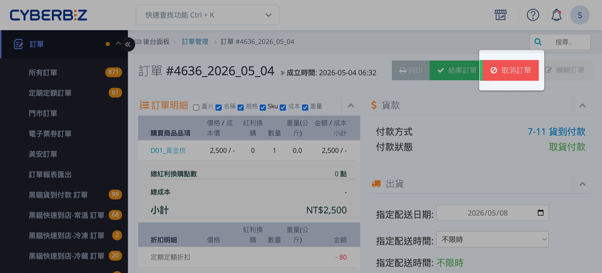
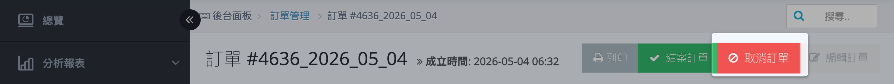
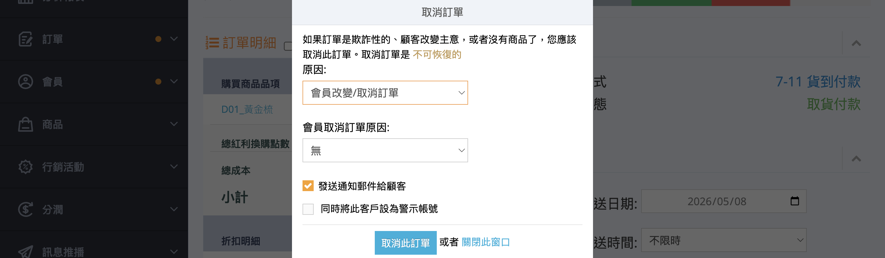
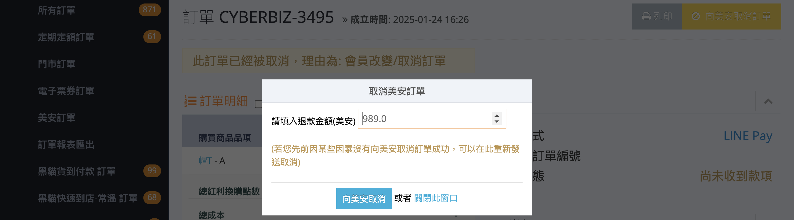
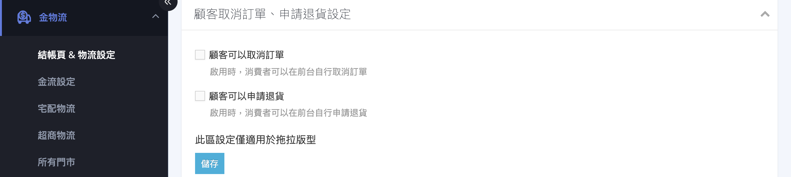
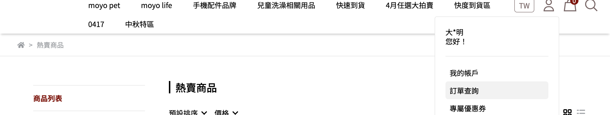
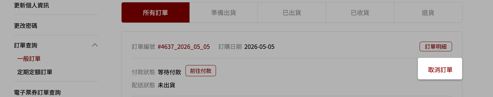
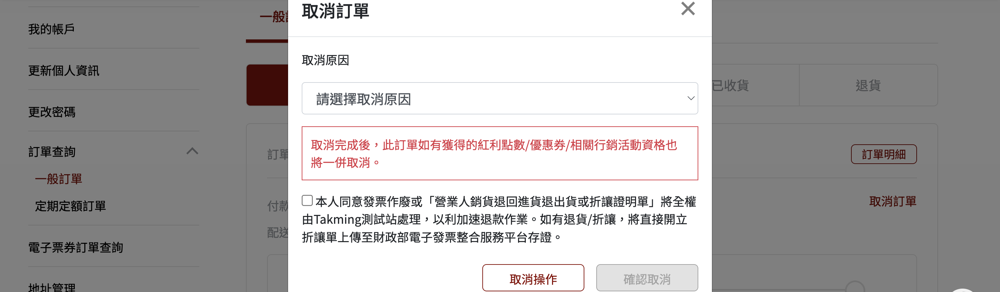
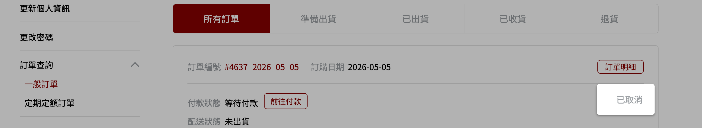
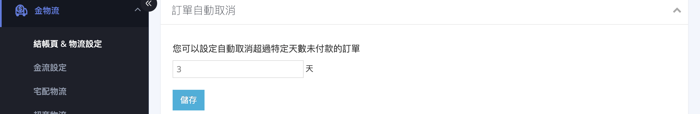

介紹商家手動取消、會員前台取消與系統自動取消（付款超時）三種訂單取消方式，包含取消條件、操作步驟與後續紅利優惠處理
{ .subtitle }

{ .hero-page }

## 取消訂單說明

「取消訂單」功能主要用於將已成立但尚未進入出貨流程的訂單終止，停止後續的金物流作業。

## 取消訂單前提條件

- [x] **配送狀態限制**：僅有配送狀態為「**未出貨**」的訂單可以執行取消。
    *   若訂單狀態為「準備出貨」，需先將其調整回「未出貨」方可取消。
    *   若訂單已處於「已出貨」狀態，則無法取消，必須改走 **[退貨](訂單退貨流程.md){ data-preview }[退款](訂單退款流程.md){ data-preview }** 流程。
- [x] **整筆取消**：系統僅支援 **整筆訂單取消**，不支援部分取消。
- [x] **不可逆性**：按下取消按鈕後，訂單狀態會變更為「已取消」，此狀態通常 **無法再還原**（除非是特定的付款失敗情境）。

## 取消訂單的三種情境與操作

### 商家手動取消訂單 { #orders-cancel-merchant }

=== ":lucide-receipt: 一般訂單"

    1.  **進入訂單詳情頁**：前往後台「**訂單**」>「**所有訂單**」，點擊欲取消訂單編號，進入該筆訂單的詳情頁面。
    2.  **點擊取消按鈕**：點擊頁面右上角的紅色「**取消訂單**」按鈕。

        

    3.  **設定取消選項**：於彈窗中進行以下設定：
        - **取消原因**：必填，從下拉選單中選擇符合的原因（如：缺貨、顧客要求、重複下單等）。
        - **發送通知郵件**：勾選後，系統將自動發送取消通知信給顧客。
        - **設為警示帳號**：勾選後，該顧客帳號將被標記為警示狀態，供後續營運參考。

        

     4.  **確認取消**：點擊「**取消此訂單**」按鈕，訂單狀態即變更為「已取消」。

    !!! success "取消完成後，系統將自動執行以下動作：歸還紅利點數、返還優惠券、加回商品庫存。"

=== ":simple-stryker: 美安訂單"

    美安訂單取消需同步通知美安系統，流程與一般訂單略有不同.
                                                                    
       1.  **進入訂單詳情頁**：前往後台「**訂單**」>「**所有訂單**」，點擊欲取消訂單編號，進入該筆訂單的詳情頁面.                   
       2.  **點擊取消按鈕**：點擊頁面右上角的紅色「**取消訂單**」按鈕.
       3.  **設定取消選項**：於彈窗中進行以下設定：                 
           - **取消原因**：必填，從下拉選單中選擇符合的原因。
           - **發送通知郵件**：勾選後，系統將自動發送取消通知信給顧客。       
           - **設為警示帳號**：勾選後，該顧客帳號將被標記為警示狀態。         
           - **向美安取消訂單**：勾選後，系統將同時向美安（SHOP.COM）發送取消請求。                                              
           - **退款金額**：填入欲退還給顧客的金額（贈品金額不計入）。
       4.  **確認取消**：點擊「**取消此訂單**」按鈕，訂單狀態即變更為「已取消」，美安同步狀態變為「取消處理中」。
                                                                   
    ??? info "美安同步狀態說明"
        取消請求送出後，系統會在背景與美安 API 進行同步：        
                                                          
        | 狀態 | 說明 |                                          
        |------|------|
        | 取消處理中 | 正在等待美安 API 回應 |                   
        | 取消成功 | 美安已確認取消 |         
        | 取消失敗 | API 呼叫失敗，系統將自動重試（最多 3 次，之後排隔天重試） |                                           
                                                                   
    ??? warning "手動補送美安取消通知"                                   
        若在取消訂單時未勾選「向美安取消訂單」，或因網路傳輸導致同步狀態顯示為「取消失敗」，可依照以下步驟手動補送資訊至美安系統：

        1. **進入訂單詳情頁**：前往後台「訂單」 > 「美安訂單」，點擊該筆已取消訂單的編號。
        2. **啟動補送程序**：在訂單詳情頁面右上角，點擊「向美安取消訂單」按鈕。
        3. **確認取消資訊**：於彈出的視窗中確認取消金額（系統會自動帶入不含運費的金額）。

        *條件：訂單須已為「已取消」狀態且美安同步狀態非「取消成功」。*

        

---

### 會員於前台取消訂單 { #orders-cancel-customer }

[:lucide-bolt:{ title="適用功能" }](../../resources/conventions#適用功能) | 拖拉版型
{ .doc-badge }

商家可設定是否開放顧客於官網前台自行取消未出貨訂單，若關閉設定，顧客僅能透過[商家申請取消][商家手動取消訂單]{ data-preview }。

**前置設定**

商家需先於後台啟用此功能：

1. **進入設定頁面**：前往管理後台「金物流」>「結帳頁 & 物流設定」。
2. **啟用功能**：找到並展開「顧客取消訂單設定」區塊，勾選「顧客可以取消訂單」。
3. **儲存設定**：點擊頁面底部「儲存」後立即生效。

---

**會員操作步驟**

功能啟用後，顧客可依以下步驟操作：

1. **找到訂單**：登入官網會員後，進入「我的帳戶」>「訂單查詢」。

    

2. **點擊取消**：於配送狀態為「未出貨」的訂單旁，點擊「取消訂單」按鈕。

    

    !!! info "限制條件"
        - 僅限配送狀態為「**未出貨**」之訂單可取消。
        - 若訂單已進入「準備出貨」或「已出貨」狀態，顧客將無法自行取消，需聯繫客服協助。

3. **確認取消**：於彈窗確認資訊後，點擊「確認取消」。

    

4. **完成變更**：訂單狀態即時變更為「已取消」，系統將自動執行後續處理（[點數/庫存返還][取消後的紅利與優惠處理]{ data-preview }），[訂單操作紀錄][order-history]{ data-preview }將同步標註由會員發起取消的原因資訊。

    

---

### 系統自動取消（付款超時）

為避免未付款訂單長期佔用庫存，商家可透過此功能設定「付款期限」。當訂單符合[特定條件][運作規則與條件]{ data-preview }且[逾期][系統執行機制]{ data-preview }未付款時，系統將自動將訂單狀態變更為「已取消」。

**操作步驟**：

1.  **進入設定頁面**：前往後台「**金物流**」>「**結帳頁 & 物流設定**」，找到「**訂單自動取消**」區塊。
2.  **設定付款期限**：於「**超過 X 天自動取消**」欄位輸入天數（1-29 天）。
    - 若設為 `0` 天，則視為關閉此功能。
    - 若未設定或超過 29 天，虛擬 ATM 帳號最長有效期固定為 29 天。
3.  **儲存設定**：點擊頁面下方的「**儲存**」按鈕，設定即生效。
    - 設定生效後，無論是設定前或設定後成立的未付款訂單，均會受到此規則影響。
4.  **查看操作紀錄**（選用）：取消後可於訂單詳情頁的「[操作紀錄][order-history]{ data-preview }」區塊中，查看系統自動留存的取消資訊，便於對帳與客服查詢。

---

#### 運作規則與條件

系統僅針對符合以下所有條件的訂單執行自動取消：

- **付款狀態**：等待付款
- **配送狀態**：未出貨 或 不須出貨
- **付款方式**：非「貨到付款」之訂單。
- **設定生效範圍**：儲存設定後，設定前已成立的未付款訂單亦會受此規則影響。

---

#### 系統執行機制

系統固定於每天 01:00 AM 進行批次掃描與取消作業。

!!! example "取消邏輯示例"
    若設定為 3 天自動取消：

    - **1 / 1 12:00 PM**：顧客下單，進入 3 天倒數。
    - **1 / 4 12:00 PM**：滿 72 小時（3 天），訂單達到可取消門檻。
    - **1 / 5 01:00 AM**：系統執行批次排查，正式取消該筆訂單。

---

#### 線上金流失效機制（虛擬 ATM / 超商代碼）

針對需取得代碼付款的機制，其「繳款截止日」會受後台設定天數影響，邏輯如下：

| 訂單成立時間 | 第一天計算基準 | 繳款截止時間範例 (設為 3 天) |
| :--- | :--- | :--- |
| **00:00 - 00:59** | 成立當日即為第一天 | 3/18 00:15 下單 → **3/20 23:59** 截止 |
| **01:00 後** | 成立隔日為第一天 | 3/18 01:15 下單 → **3/21 23:59** 截止 |

!!! warning "注意事項"

    - **上限限制**：若商家未設定取消天數或設定超過 29 天，虛擬 ATM 帳號的最長效期固定為 29 天（至 23:59）。
    - **手動取消例外**：若商家或會員「手動」取消訂單，已產生的代碼/帳號不會自動失效。顧客若於效期內完成繳費，該訂單將會重新變更為「進行中」狀態，商家可選擇繼續出貨或進行退款。

## 取消後的紅利與優惠處理

*   **紅利點數**：訂單取消後，顧客原先在該訂單中抵用的紅利點數，系統會 **自動歸還** 至顧客帳戶。
    *   *注意*：若訂單已結案且紅利已發送，取消後系統不會自動扣除已領取的紅利回饋，需商家手動刪除。
*   **優惠券**：訂單中使用的優惠券亦會 **自動返還** 給顧客。
*   **庫存**：取消後，商品庫存會 **自動加回** 原本的庫存量。

## 特殊情境說明

- :lucide-barcode:{ .lg }  
  [__虛擬 ATM 與超商代碼__][線上金流失效機制虛擬-atm--超商代碼]{ data-preview }  
  若會員或商家手動取消訂單後，顧客仍在代碼效期內完成付款，訂單狀態將自動從「已取消」變回「進行中」，商家可選擇繼續出貨或辦理退款。

- :simple-stryker:{ .lg }  
  [__美安 (Shop.com) 訂單__](#美安訂單)  
  取消時需勾選「**向美安取消此訂單**」選項，系統會自動帶入不含運費的訂單金額作為取消金額。

- :lucide-repeat:{ .lg }  
  __定期定額訂單__  
  可取消整筆「母訂單」或單一期「子訂單」。取消母訂單將停止後續所有週期配送。

- :material-point-of-sale:{ .lg }  
  __POS 訂單__  
  若於實體門市操作，可於 POS 前台找到該筆訂單並執行「[取消訂單](../../pos/orders_ann/index.md#取消訂單)」。若有開立發票，系統會根據取消時間自動作廢或產出折讓單。

## 後續操作

- :lucide-receipt:{ .lg }   
  [__訂單退款流程__](訂單退款流程.md){ data-preview }       
  若訂單涉及付款，取消後可參考退款流程將款項退還顧客。

- :lucide-package-minus:{ .lg }   
  [__訂單退貨流程__](訂單退貨流程.md){ data-preview }       
  若訂單已出貨無法取消，需改走退貨流程處理商品回收與退款。

- :lucide-file-text:{ .lg }   
  [__訂單操作紀錄__][order-history]{ data-preview }  
  查看訂單狀態變更歷程與操作人員紀錄，便於對帳與客服查詢。

## 常見問題

??? quote "為什麼會員在前台看不到取消訂單的按鈕？"

    可能原因包括：

    - 商家尚未於後台「金物流」>「結帳頁 & 物流設定」啟用「顧客取消訂單設定」
    - 該筆訂單的配送狀態非「未出貨」
    - 官網使用非「拖拉版型」，此功能僅適用於拖拉版型

??? quote "系統自動取消訂單後，虛擬 ATM 帳號還會有效嗎？"

    若商家「手動」取消訂單，已產生的代碼/帳號不會自動失效。顧客若於效期內完成繳費，該訂單將會自動從「已取消」變回「進行中」狀態，商家可選擇繼續出貨或進行退款。

??? quote "美安訂單取消後，如何確認美安系統已同步？"

    取消請求送出後，可在訂單詳情頁查看美安同步狀態：

    - **取消處理中**：正在等待美安 API 回應
    - **取消成功**：美安已確認取消
    - **取消失敗**：API 呼叫失敗，系統將自動重試（最多 3 次，之後排隔天重試）

