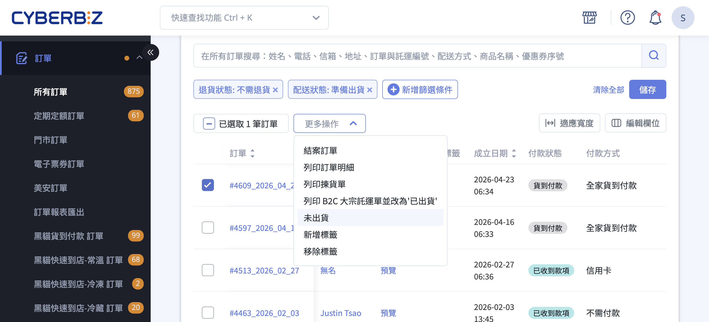
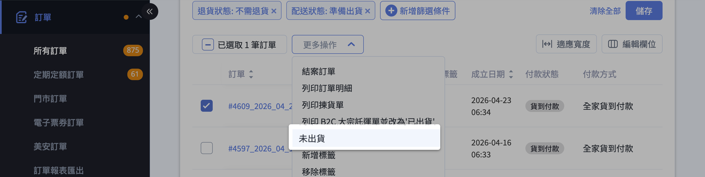
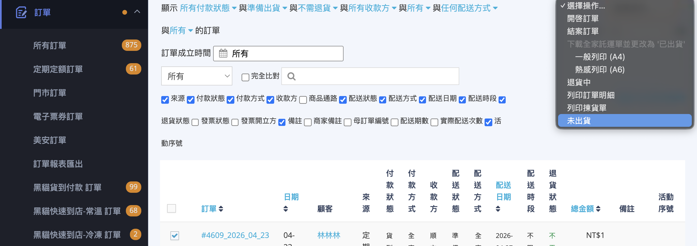

將訂單從「準備出貨」調整回「未出貨」狀態，讓消費者可以重新取得取消訂單的權限。
{ .subtitle }

{ .hero-page }

## 訂單調回未出貨說明

當訂單已被標記為「準備出貨」後，代表商家已開始處理出貨流程，此時消費者在前台將 **無法自行取消訂單**。

若訂單實際上尚未交付物流（例如客戶臨時要求修改訂單、商品缺貨，或付款發生問題），商家可以透過「未出貨」操作，將訂單退回上一階段，讓訂單恢復成 **可調整、可取消** 的狀態。

??? example "適用情境"

    * 消費者來電要求 **取消訂單**，但訂單已點過「準備出貨」。
    * 需要更換商品或調整數量，而後台不允許在「準備出貨」狀態下異動訂購內容。
    * 配送資料（收件人、地址、配送日期）需大幅變更，且目前狀態無法直接編輯。
    * 想暫緩出貨，等待消費者確認後，再重新進入準備流程。

!!! note "相關功能提示"

    *   **消費者端影響**：當配送狀態為「準備出貨」時，消費者通常不被允許取消訂單；一旦調回「未出貨」，權限即會恢復。
    *   **商家備註**：若您只是要修改收貨人資訊或配送日期，在「未出貨」狀態下亦可直接於訂單明細頁面進行修改。

## 設定前注意事項

在執行狀態調整前，請務必確認訂單的「退貨狀態」，否則將無法變更：

*   [x] **支援的情境**：退貨狀態必須為 **「不需退貨」** 或 **「拒絕退貨」**。
*   [ ] **不支援的情境**：若訂單已進入「退貨中」、「退貨審查」或「已退貨」等狀態，則無法將配送狀態改回未出貨。

## 操作步驟教學

1.  **進入操作介面**：登入 CYBERBIZ 管理後台，前往 **「訂單」 > 「所有訂單」**。
2.  **勾選訂單**：在訂單列表中，找到配送狀態（[快速篩選商品][orders-filter]{ data-preview }）為 **「準備出貨」** 的訂單並勾選。
3.  **選擇操作**：點擊列表右上方的 **「更多操作」** 或 **「選擇操作」** 下拉選單。
4.  **執行變更**：在選單中點選 **「未出貨」** 選項。
5.  **完成調整**：點選後，該筆訂單的配送狀態即會變更為「未出貨」，此時消費者即可在官網前台看到取消訂單的按鈕（若商家有開啟 [顧客取消訂單功能][orders-cancel-customer]{ data-preview }  ）。

=== "新版訂單列表"

    

=== "舊版訂單列表"

    

## 後續操作

- :lucide-package:{ .lg }  
  [__訂單出貨流程__](訂單出貨流程.md){ data-preview }  
  了解完整的訂單出貨流程，包含準備出貨、出貨中、已送達等各階段操作。

- :lucide-ban:{ .lg }  
  [__如何取消訂單__](如何取消訂單.md){ data-preview }  
  掌握商家手動取消、會員前台取消與系統自動取消三種訂單取消方式。

## 常見問題

??? quote "為什麼無法將訂單調整回「未出貨」狀態？"

    請確認訂單的退貨狀態。僅有退貨狀態為 **「不需退貨」** 或 **「拒絕退貨」** 的訂單才能調整配送狀態；若訂單已進入「退貨中」、「退貨審查」或「已退貨」，則無法變更。

??? quote "將訂單調回「未出貨」後，消費者可以取消訂單嗎？"

    可以。當配送狀態恢復為「未出貨」後，消費者即可在官網前台看到取消訂單的按鈕並執行取消操作（前提是商家已開啟 [顧客取消訂單功能](orders-cancel-customer){ data-preview }）。

??? quote "訂單在「未出貨」狀態下可以直接修改收貨人資訊嗎？"

    可以。在「未出貨」狀態下，商家可直接於訂單詳情頁面修改收貨人資訊或配送日期，無需將訂單退回更早的狀態。

---

<!--
## 功能介紹

  當訂單已被標記為「準備出貨」後,代表商家已開始處理出貨流程,此時消
  費者在前台 **無法自行取消訂單**。若實際上尚未交付物流(例如客戶臨
  時要求修改、商品缺貨、付款發生問題),商家可以透過「未出貨」這個動
  作 **將訂單退回上一階段**,讓訂單恢復成可調整、可取消的狀態。

  !!! info "什麼情況會用到這個功能?"

      *   消費者來電要求 **取消訂單**,但訂單已點過「準備出貨」。
      *   要更換商品、調整數量,而後台不允許在「準備出貨」狀態下異動
  訂購內容。
      *   
  配送資料(收件人、地址、配送日期)需大幅變更,且現有狀態無法編輯。
      *   想暫緩出貨,等待消費者確認後再重新進入準備流程。

  ## 操作前必讀:可調整與不可調整的情境

  「未出貨」這個動作 
  **不是任何狀態都能執行**,系統會依以下三項條件判斷是否顯示此選項。
  若條件不符,「未出貨」按鈕不會出現在下拉選單中。

  ### 必須符合的條件

  | 條件項目 | 必要值 | 說明 |
  | :-- | :-- | :-- |
  | 配送狀態 | 準備出貨 | 
  僅準備出貨可退回;其餘狀態(已出貨、運送中等)無法回轉 |
  | 退貨狀態 | 不需退貨 **或** 拒絕退貨 | 
  訂單尚未進入退貨流程,或退貨已被拒絕 |
  | 付款狀態 | 已付款 **或** 貨到付款 | 確保訂單已建立有效付款憑證 
  |
  | 訂單狀態 | 進行中(未結案、未取消) | 已結案 / 
  已取消的訂單無法退回 |

  ### 不支援的情境

  *   訂單已進入 
  **退貨中**、**退貨審查**(收貨檢查中)、**待退款**、**已退貨** 
  等退貨流程狀態。
  *   訂單配送方式為 **急速配**(例如 Pandago、Uber Direct 
  等即時配送服務),因外部物流系統已介入,無法由商家後台直接退回。
  *   訂單已結案或已取消。
  *   勾選多筆訂單時,只要其中一筆不符合上述條件,「未出貨」選項就不
  會出現,請拆開操作。

  !!! tip "為什麼有些訂單看不到「未出貨」選項?"

      系統會把所勾選的訂單一起檢查,只要有一筆訂單條件不符,選單就會
  隱藏此動作。建議單筆勾選測試,即可確認是哪一筆訂單卡住。

  ## 操作步驟教學

  === "新版訂單列表"

      1.  **進入操作介面**:登入 CYBERBIZ 管理後台,點選左側選單的 
  **「訂單」**,再進入 **「所有訂單」**。
      2.  **找出待調整的訂單**:在訂單列表中,可透過 
  **配送狀態快速篩選** (請參考 [訂單篩選器對照表][orders-filter]{
  data-preview })將清單縮小到「準備出貨」的訂單。
      3.  **勾選訂單**:在訂單列勾選一筆或多筆要退回的訂單。
      4.  **開啟操作選單**:點擊列表上方的 **「更多操作」** 
  下拉選單。
      5.  **點選「未出貨」**:在選單中選擇 **「未出貨」** 選項。
      6.  **確認動作**:系統會跳出確認視窗 
  **「確認要『未出貨』嗎?」**,點選 **「確認」** 即完成。

      

      !!! note "選項顯示條件"

          若你勾選訂單後,「更多操作」下拉選單沒有 **「未出貨」** 
  這個項目,代表至少有一筆所勾選的訂單不符合 
  [操作前必讀](#操作前必讀可調整與不可調整的情境) 
  的條件,請逐一檢查訂單狀態。

  === "舊版訂單列表"

      1.  **進入操作介面**:登入 CYBERBIZ 管理後台,點選 **「訂單」 >
   「所有訂單」**。
      2.  **找出待調整的訂單**:利用上方的 **配送狀態** 
  篩選條件,將列表縮小到「準備出貨」的訂單。
      3.  **勾選訂單**:在訂單列表中勾選一筆或多筆要退回的訂單。
      4.  **開啟操作選單**:勾選後,列表右上方的 **「選擇操作」** 
  下拉選單會自動顯示,點開它。
      5.  **點選「未出貨」**:在選單中選擇 **「未出貨」**。
      6.  **完成調整**:點選後系統會立即更新,訂單的配送狀態即會變回
  「未出貨」。

      !!! note "選項顯示條件"

          
  舊版列表的「選擇操作」選單會依勾選的訂單動態產生選項。若沒有看到 
  **「未出貨」**,代表勾選的訂單中至少一筆不符合條件(配送狀態非準備
  出貨、退貨流程已啟動、或為急速配等)。

  ## 完成後可以做什麼

  訂單退回「未出貨」之後,等同回到付款完成、尚未開始備貨的狀態,商家
  可接續進行以下操作:

  *   **編輯訂單內容**:在訂單明細頁修改 
  **收件人、收件地址、配送日期、配送時段** 等資訊。
  *   
  **取消訂單**:若決定不繼續出貨,可直接在訂單明細頁點選取消訂單。
  *   **由消費者自行取消**:若商家已開啟 
  [顧客取消訂單功能][orders-cancel-customer]{ data-preview
  },消費者可在前台「我的訂單」自行取消。
  *   **重新標記為準備出貨**:商品 / 
  資料調整完成後,於「更多操作」中重新選擇 
  **「準備出貨」**,即可再次進入備貨流程。

  !!! tip "歷史紀錄會被保留"

      每一次配送狀態的變更,系統都會在 **訂單明細的歷史紀錄區** 
  留下「{操作者姓名}更新配送狀態為未出貨」的軌跡,方便客服與管理者後
  續追查。

  ## 常見問題

      不會。「未出貨」只是把 **配送狀態** 退回上一階段,並 **不會** 
  觸發退款或變更付款狀態。若需要退款,請另外於訂單明細執行退款流程。
  
  ??? question "Q2. 訂單已經印好物流單,可以再退回未出貨嗎?"

      只要訂單的配送狀態仍是「準備出貨」(尚未進入「已出貨」),且不是
  急速配,就可以退回未出貨。但 **物流單一旦列印,實體出貨流程上需自行
  作廢處理**,請務必於物流端同步取消,避免重複出貨。
  
  ??? question "Q3. 
  退回「未出貨」之後,消費者一定看得到取消訂單按鈕嗎?"
  
      不一定。前台是否顯示「取消訂單」按鈕,還需店家在後台開啟 
  [顧客取消訂單功能][orders-cancel-customer]{ data-preview
  };若未開啟,消費者仍需聯繫客服協助取消。
  
  ??? question "Q4. 為什麼急速配(Pandago / Uber 
  Direct)的訂單不能退回未出貨?"
  
      急速配是透過外部即時配送平台派遣車手,訂單一旦進入準備出貨,即
  代表已通知外部物流取件,系統流程上 **無法由 CYBERBIZ 
  後台單方面退回**。如需取消,請聯繫客服或於物流平台端處理。
  
  ??? question "Q5. 已進入退貨流程的訂單可以退回未出貨嗎?"

      不可以。只要訂單的退貨狀態不是「不需退貨」或「拒絕退貨」(也就
  是已進入退貨中、退貨審查、待退款、已退貨等流程),系統 **不會** 
  顯示「未出貨」選項。若需要,請先處理退貨流程再評估。
  
  ## 相關連結

  *   [訂單篩選器對照表][orders-filter]{ data-preview }
  *   [顧客取消訂單功能][orders-cancel-customer]{ data-preview }

  ---
  設計重點:
  
  1. 補全舊版操作步驟 — 原文舊版區塊是空的,依 index.html.haml:240
  與 index.js.coffee:905
  流程),系統 **不會** 顯示「未出貨」選項。若需要,請先處理退貨流程再評估。

  ## 相關連結 

  *   [訂單篩選器對照表][orders-filter]{ data-preview }
  *   [顧客取消訂單功能][orders-cancel-customer]{ data-preview }

  ---
  設計重點:

  1. 補全舊版操作步驟 — 原文舊版區塊是空的,依 index.html.haml:240 與 index.js.coffee:905
  補完,並明確指出舊版下拉選單名為「選擇操作」(動態產生)。
  2. 重寫前置條件 — 原文只提退貨狀態,實際 code (FulfillmentUnshippedHandler.ts + index.js.coffee:903-906)
  還有付款狀態、訂單狀態、配送方式三項限制,合併成一張完整對照表,並把「選項看不到」的常見困擾點獨立提示。
  3. 加上「完成後可以做什麼」 — 銜接消費者取消、編輯訂單、重新出貨等後續動作,避免商家做完這步不知道下一步。
  4. 新增 FAQ 五題 — 涵蓋退款、物流單、消費者前台、急速配、退貨中等真實情境問題。
  5. 語體統一 — 全文使用全形 ,。「」():;!?,粗體前後加空格,列表項目寫成單行,符合 §B / §C 規則。
  6. 未洩漏內部術語 — 沒有出現 manual_unshipped、preparing_can_transfer_to_unshipped、pandago 等
  code,只用商家視角描述。

  與既有文件整合建議:

  - 檔名建議放在 docs/orders/revert-to-unshipped.md(對應 wp_url 中的 helpcenter/?p=7803)。
  - [orders-filter] 與 [orders-cancel-customer] 兩個 anchor 應位於 docs/orders/references/
  下既有對照表;這篇文章不需新增對照表檔。
  - 本文與「修改訂單收件資訊」、「取消訂單」、「準備出貨設定」等文章互為前後流程,可在側欄 related 串連。

  未新增對照表 — 此功能僅單一動作,所有可選值都在主文表格中說明完畢,不需額外的 references/ 檔案。
-->
