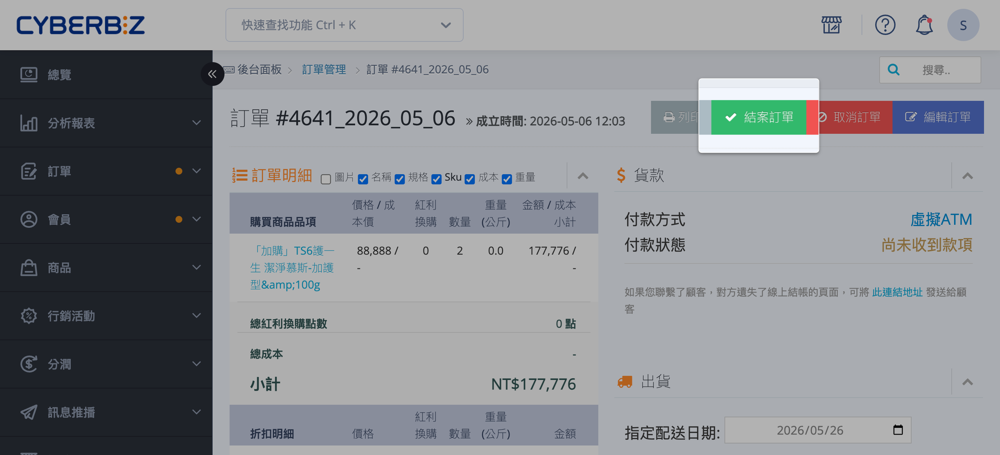
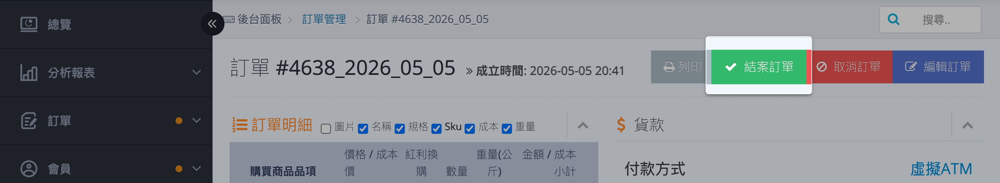
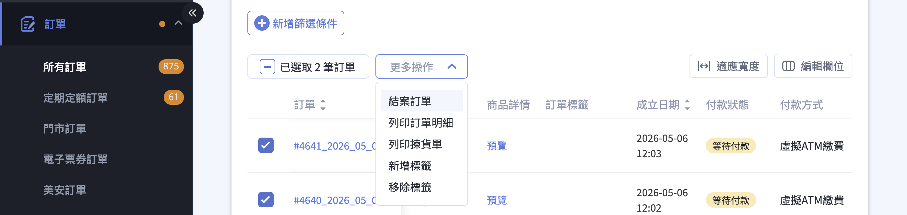
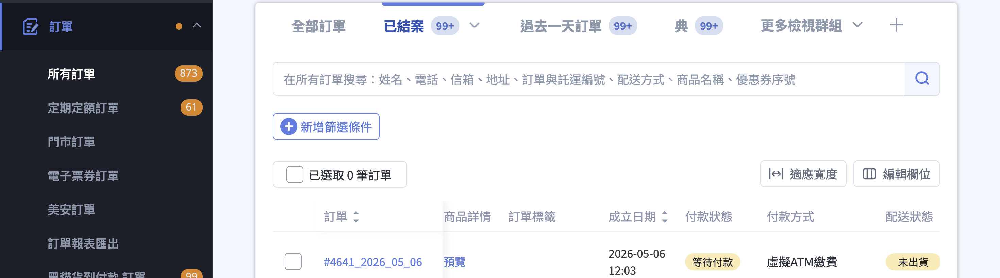

手動結案訂單，包含單筆與批次操作方式，以及結案後對紅利、優惠券、分潤的影響。
{ .subtitle }

{ .hero-page }

## 手動結案訂單說明

**「手動結案訂單」** 是指將訂單狀態正式關閉的操作。結案不僅代表訂單處理流程的終結，更會觸發多項行銷獎勵與分潤計算。

### 結案的定義與影響

訂單一旦執行「結案」，系統會自動執行以下程序，且 **後續即使取消訂單或退貨，亦不會自動追回或改變結果**：

*   **發送購物紅利**：將該筆訂單消費獲得的紅利點數正式匯入會員帳戶，顧客方可開始使用。
*   **生效優惠券**：若活動包含「滿額贈送優惠券」，結案後顧客才可領取並使用該券。
*   **計算分潤**：若該訂單涉及第三方分潤（如推薦人），系統將於結案時計算分潤金額。
*   **清理後台提醒**：結案後會清除後台左側「未結案訂單」的數字提醒訊息。

!!! warning "注意：手動調整紅利"
    若結案後需回扣或刪除點數，系統不會自動追回。請依以下路徑手動操作：會員 > 所有會員> 進入該顧客明細頁進行扣除。

## 操作前提條件

- [x] **訂單狀態**：除了「已取消」以外的任何訂單皆可進行結案。
- [x] **配送狀態建議**：建議於訂單過退換貨期間、確定無退貨需求後再按下結案。若訂單處於「部分出貨」，則無法自動結案，需由商家手動調整。
- [x] **與對帳之關係**：手動結案狀態與財務對帳無直接相關。對帳主要根據配送狀態（如「已出貨」或「已收貨」）進行認列。

## 手動結案操作步驟 { #close-order-manual }

商家可透過以下兩種方式執行手動結案：

=== ":lucide-mouse-pointer-click: 單筆操作"

    從訂單詳情頁面結案

    1.  **進入訂單**：登入 CYBERBIZ 後台，前往 **訂單 > 所有訂單**，在訂單列表中點擊該筆訂單的「訂單編號」。
    2.  **執行結案**：進入詳情頁後，點選右上角的 **「結案訂單」** 按鈕。

    

=== ":lucide-check-square: 批次操作"

    從訂單列表批次結案

    1.  **後台路徑**：登入 CYBERBIZ 後台，前往 **「訂單」>「所有訂單」**。
    2.  **勾選訂單**：勾選欲結案的一筆或多筆訂單。
    3.  **選擇操作**：點擊列表上方的 **「更多操作」** ，在下拉選單中選擇 **「結案訂單」** 並確認結案。

    

## 完成後之狀態確認

### 已結案訂單列表

訂單完成結案後，可以透過訂單列表的篩選器建立「已結案」[訂單檢視群組][order-filter-group]{ data-preview }，以便確認已結案之訂單。

---

### 訂單結案操作紀錄

訂單詳情頁下方的[操作紀錄][order-history]{ data-preview }會出現「訂單被關閉」的訊息，並顯示操作該結案動作的管理員名稱。

## 後續操作

- :lucide-calendar-check:{ .lg }  
  [__自動結案設定__](設定訂單自動結案.md){ data-preview }  
  設定當訂單配送狀態變更為「已收貨」或「已出貨」達特定天數（如 N 天）後，由系統自動執行結案。

## 常見問題

??? quote "結案後如果顧客退貨，紅利點數會被追回嗎？"

    不會。訂單一旦執行「結案」，系統會立即發送紅利點數、生效優惠券與計算分潤，且 **後續即使取消訂單或退貨，亦不會自動追回或改變結果**。如需刪除個人紅利點數，請至 會員 > 所有會員 > 點進顧客個人頁面進行刪除

??? quote "所有訂單都可以手動結案嗎？"

    不是。除了「已取消」狀態的訂單之外，其他任何狀態的訂單皆可進行結案操作。

??? quote "可以一次結案多筆訂單嗎？"

    可以。商家可透過訂單列表的批次操作功能，一次勾選多筆訂單後，點擊「更多操作」並選擇「結案訂單」進行批次結案。

