使用關鍵字搜尋、條件篩選、檢視群組與訂單標籤等功能，快速找出目標訂單。
{ .subtitle }

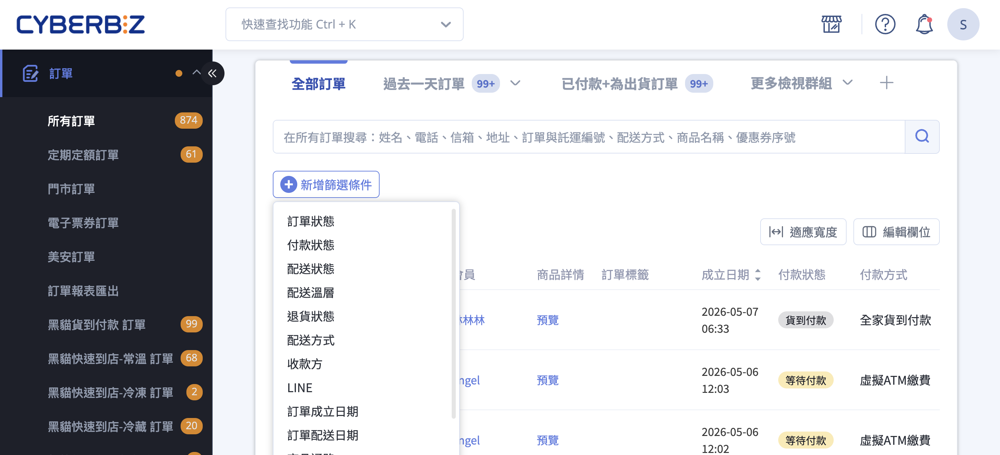{ .hero-page }

## 訂單搜尋與篩選說明

**「訂單搜尋與篩選」** 功能主要集中在後台的訂單管理頁面，旨在協助商家從大量訂單中快速找出目標，並透過自定義檢視來提升管理效率。

## 進入訂單管理 { #orders-path }

登入 CYBERBIZ 管理後台，點選左側選單 **「訂單」** > **「所有訂單」**。

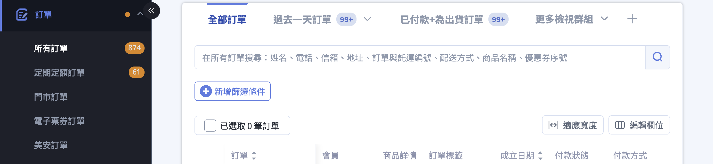

## 關鍵字搜尋 { #orders-search }

搜尋欄位支援多種關鍵字，但需注意搜尋的 [匹配規則][orders-match-mode]{ data-preview }：

=== "新版訂單列表"

    1. **輸入關鍵字**：於搜尋框輸入搜尋條件（如訂單編號、姓名或手機），並按下 ++enter++。
    2. **檢視結果**：符合條件的訂單將即時顯示於列表中。
    3. **調整分頁筆數**：透過列表下方的下拉選單，可切換每頁顯示筆數（10 / 25 / 50 / 100 / 200 筆）。

    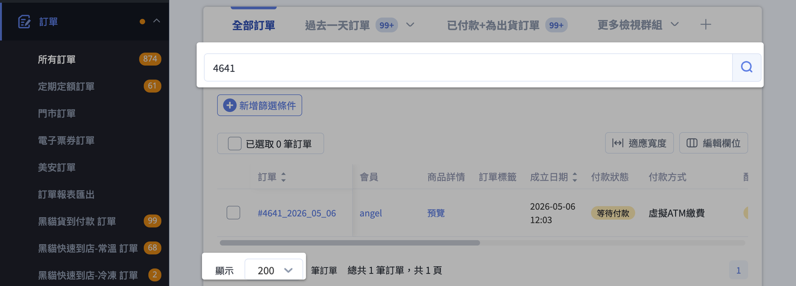

=== "舊版訂單列表"

    1. **輸入關鍵字**：於搜尋框輸入搜尋條件，並按下 ++enter++。
    2. **檢視結果**：符合條件的訂單將顯示於下方列表中。
    3. **調整分頁筆數**：透過列表 **右上角** 的下拉選單，可調整單頁顯示訂單數量。

    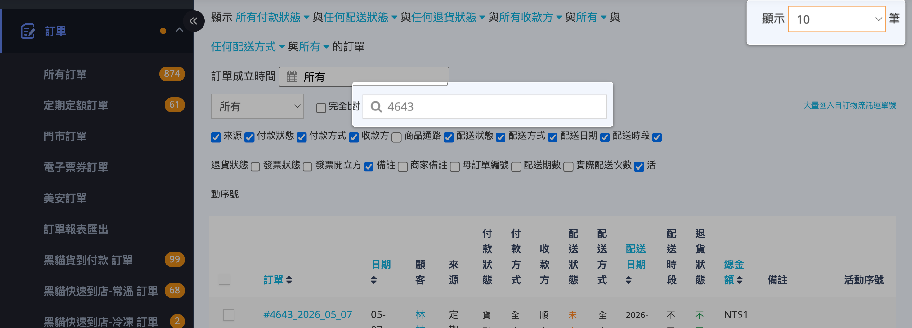

## 條件篩選 { #orders-filter }

商家可疊加多個條件，並可搭配 [關鍵字搜尋][orders-search]{ data-preview } 再縮小範圍。

=== "新版訂單列表" 

    篩選條件以 **可疊加的篩選條件** 呈現，透過 **「+新增篩選條件」** 加入。   

    1.  **新增篩選條件**：點選列表上方 **「+新增篩選條件」**，從下拉中挑選欲 [套用的欄位][orders-v2-filters]{ data-preview }。已新增的條件將以標籤形式顯示。

        

    2.  **設定篩選值**：點擊篩選條件標籤展開下拉選單，可選擇多個值。同一篩選條件內的多選結果為「任一符合即可顯示」。

        

    3.  **設定時間區間**：**訂單成立日期** 與 **訂單配送日期** 支援兩種模式：                              
      
        - **介於**：指定明確的起訖日期                                                                     
        - **過去**：指定「過去 N 天」的滾動式區間（適合存成檢視群組）
                                                                                    
        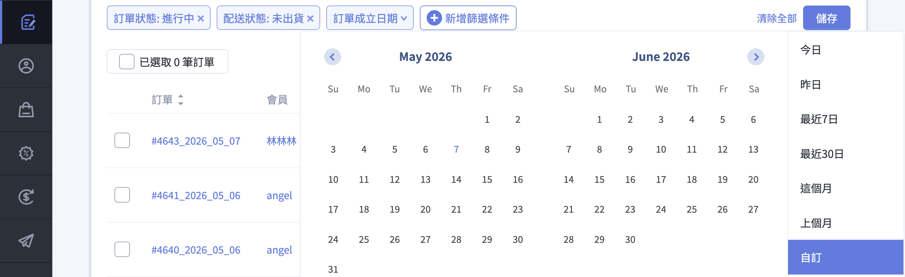{ .screenshot }    
                                                                                                                
    4.  **清除條件**：移除單一條件 > 點條件標籤旁的 ✕；一次清空所有條件 > 點 **「清除全部」**。              
    5.  **儲存篩選結果**：若此篩選組合會頻繁使用，點擊 「儲存」 即可將其建立為 [訂單檢視群組][orders-groups-tabs]{ data-preview }，方便日後一鍵切換。
                                                                                                          

    ??? plan "篩選器的開通條件"
          看不到下列篩選器代表方案尚未開通對應功能；於 **「+新增篩選條件」** 中也不會出現：                  
                                                                                                             
          | 篩選器 | 需要開通 |
          | :-- | :-- |                                                                                      
          | 線上 / 線下門市（依 POS 門市篩選） | POS 系統 |
          | 配送方式（含店取選項） | 門市取貨 |                                                              
          | 商品通路 | 商品通路設定 |                                                                        
          | 配送溫層 | 商品綁定溫層 |                                                                        
          | 退貨狀態（部分選項） | 物流系統 |                                                                
          | LINE 團購 | LINE 團購 |                                                                          
          | 商家來源 / 收款方 | 企業版 / PLUS 版 方案，或未啟用「自有金流」 |

=== "舊版訂單列表"

    篩選條件以 **固定下拉選單** 呈現，每個篩選條件僅能選擇一個值；不同篩選條件之間需同時符合。

    1.  **狀態條件**：提供 **「[付款狀態][orders-financial-status]{ data-preview }」**、**「[配送狀態][orders-fulfillment-status]{ data-preview }」**、**「[退貨狀態][orders-return-status]{ data-preview }」** 及 **「[訂單狀態][orders-status]{ data-preview }」** 四個下拉選單。                                                                       
                  
        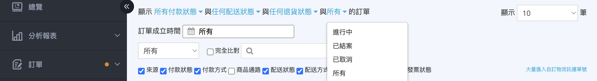                         
   
    2.  **時間篩選**：可依 **「訂單成立時間」** 設定起訖區間。
        
        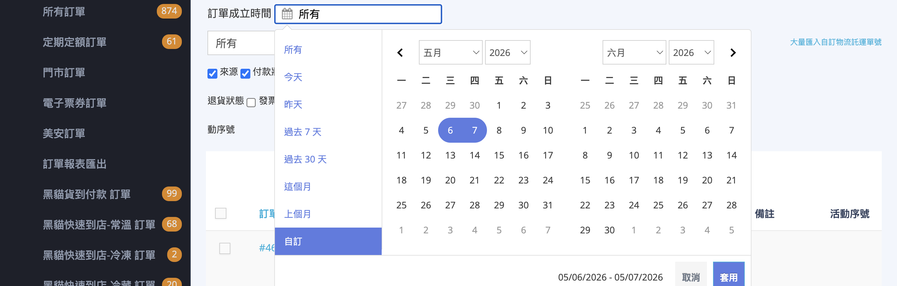                         
       
        !!! info "若已開通 POS 系統，會額外出現 **「確認時間」** 篩選器，可依店員結帳／確認的時間點查詢 POS 訂單。                                                       "
    3.  **來源與配送條件**：依您開通的加值功能而定，可能出現以下篩選器:
                                                                                                          
        - **「[訂單來源][orders-store]{ data-preview }」**：在 EC 主站與各 POS 門市之間切換             
        - **「[配送方式][orders-shipping-name]{ data-preview }」**：篩選店取、超商、宅配等配送管道      
        - **「[訂單類型][orders-line-group-buy]{ data-preview }」**：單獨抓出 LINE 團購訂單             
        - **「[商家來源/收款方][orders-merchant-from]{ data-preview }」**：依金流收款方篩選                    
        - **「[倉庫類型][orders-warehouse-type]{ data-preview }」**：開通多倉庫的店家可依出貨倉切換
                                                                                                          
    4.  **進階搜尋**（需開通「進階訂單搜尋」加值功能）：搜尋框上方會出現                                
                                                                                                          
        - **搜尋類型下拉**：指定只在訂單編號、客戶 Email、商品 SKU 等特定欄位內搜尋                     
        - **「完全符合」勾選框**：勾選後改為精確比對，預設為模糊匹配                                    

    

    ??? plan "功能可用性對照"

        看不到對應篩選器代表您的方案尚未開通相關功能。

        | 看到這個篩選器需要 | 需要開通 |                                                               
        | :-- | :-- |                                                                                   
        | 訂單來源（POS 門市）、確認時間 | POS 系統 |                                                   
        | 配送方式（含店取選項） | 門市取貨 |                                                           
        | 訂單類型（LINE 團購） | LINE 團購 |                                                           
        | 倉庫類型 | 多倉庫 |                                                                           
        | 進階搜尋（搜尋類型下拉、完全符合） | 進階訂單搜尋 |                                           
        | 商家來源 | 企業版／PLUS 版，或未啟用「自有金流」 |                                          

    

### 篩選條件組合邏輯 { #orders-filter-logic }                                                                
                 
| 情境 | 邏輯 | 範例 |
|---|---|---|
| **同一篩選器內選多個值** | 任一條件符合即可 | 訂單狀態勾選 `進行中` + `已結案` >   兩種狀態的訂單都會出現 |
| **不同篩選器疊加** | 所有條件皆需成立 | 付款狀態 = `已收到款項` + 配送狀態 = `未出貨` >   只列出已收款且尚未出貨的訂單 |
| **關鍵字搜尋 + 篩選條件** | 先縮小範圍再比對關鍵字 | 篩選 `未出貨` 後再搜尋 `0912` >   只會在未出貨訂單中比對手機號碼 |
                  
??? example "常見組合範例"                                                                                     
    - **找今天要出貨的訂單** → 配送狀態 = `未出貨` + 訂單成立日期 = `過去 7 天`
    - **找待退款的爭議訂單** → 付款狀態 = `待退款` + `客服處理中`                                          
    - **特定門市的當月業績** → 訂單來源 = `某 POS 門市` + 訂單成立日期 = `介於 2026/05/01 ~ 05/31`         
    - **冷凍商品的物流異常** → 配送溫層 = `冷凍` + 配送狀態 = `運送異常`

??? tip "篩選效能最佳化"

    當資料量較大時，建議先設定 **日期區間**（例如最近 7 天）大幅縮小範圍，再疊加 **付款狀態** 與 **配送狀態** 等條件，可有效提升查詢速度。

## 訂單檢視群組 { #orders-groups-tabs }

「檢視群組」能將複雜的 [篩選條件][orders-v2-filters]{ data-preview } 組合（如：特定物流 + 已收款 + 未出貨）儲存為頁面頂端的快捷標籤，實現一鍵切換，大幅提升批次處理訂單的效率。

**操作步驟**

1. **[設定篩選條件][orders-filter]**：點擊 「+ 新增篩選條件」，勾選欲組合的欄位與數值。
2. **點擊儲存**：設定完成後，點擊搜尋列右側的 儲存 按鈕。
3. **選擇儲存模式**：在彈出視窗中根據需求選擇：
    - **建立新檢視群組**：輸入新名稱（如：今日待出貨），建立後將產生新頁籤。
    - **更新檢視群組**：將目前的條件覆寫至既有頁籤（此選項僅在調整現有群組時出現）。

    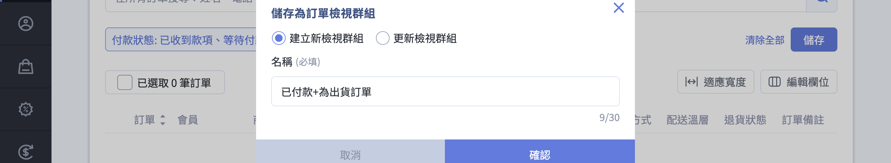

4. **管理頁籤**：將滑鼠移至自定義頁籤，點擊文字旁的 :lucide-chevron-down: 圖示，可進行 刪除。
5. **搜尋與快速跳轉**：若建立的群組較多，可點擊頁籤末端的 「更多檢視群組」：
    - **關鍵字搜尋**：在下拉選單的搜尋框中輸入名稱，快速定位特定群組。
    - **一鍵跳轉**：點選搜尋結果即可直接切換至該群組的訂單列表。

    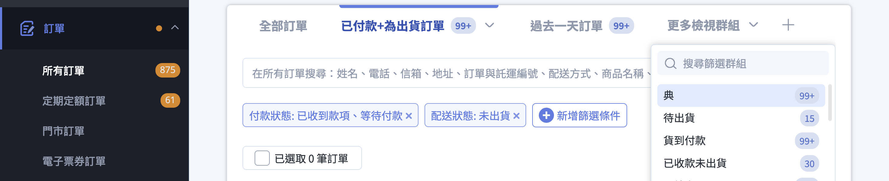

??? example "常用檢視群組範例"

    | 檢視群組名稱 | 建議篩選條件設定 |
    | :--- | :--- |
    | **需出貨訂單** | **配送狀態**：`未出貨`、`準備出貨` **付款狀態**：`貨到付款`、`已收到款項` |
    | **指定物流訂單** | **配送方式**：勾選指定物流商（如：黑貓、全家） |
    | **退貨處理中** | **訂單狀態**：`進行中` **退貨狀態**：`退貨申請`、`退貨中`、`退貨審查` |

## 編輯列表欄位 { #orders-edit-columns }

您可依據作業需求，**[自訂顯示哪些欄位][orders-columns-configure]**、**[調整欄位順序][orders-list-adjust-width]**，或在欄位過多時切換為 **適應寬度** 模式，將表格壓縮在畫面內檢視。

### 自訂顯示欄位與排序 { #orders-columns-configure }
  
1. **開啟設定**：點選列表右上方的 **編輯欄位** 按鈕，畫面右側將展開設定面板。
2. **勾選欄位**：於面板中勾選欲顯示的[欄位][orders-columns]{ data-preview }；取消勾選即從列表中隱藏。                         
    - **訂單編號** 欄位為主要識別欄，固定顯示無法取消。
    - 點選面板底部的 **全選 / 取消全選** 可一次切換所有欄位。    
3. **調整順序**：長按欄位左側的 :lucide-grip-vertical: 圖示，上下拖曳即可變更欄位在列表中的左右順序。                   
4. **儲存或重置**：                                              
    - 點擊 **儲存** 套用變更，列表立即依新配置呈現。             
    - 點擊 **重置** 還原為系統預設配置。                         
    - 若直接關閉面板而未儲存，所有變更將被取消。

!!! tip "優化定期購追蹤"
    若經營定期購業務，建議開啟 **母訂單編號** 與 **已成立期數** 欄位，以便在列表中快速掌握子訂單的計畫歸屬與週期進度。   

---

### 切換適應寬度 { #orders-list-adjust-width }

當您開啟的欄位較多、列表出現左右捲軸時，可使用 **適應寬度** 將所有欄位壓縮在一個畫面內。
                                                                  
1. 點選列表右上方的 :lucide-unfold-horizontal: **適應寬度** 按鈕。      
2. 表頭文字會轉為 **直書**、欄位寬度自動縮窄，整張表格不需橫向捲動即可全覽。                                                       
3. 再次點選按鈕（此時顯示為 **取消適應寬度** ）即可還原為預設寬度。                           

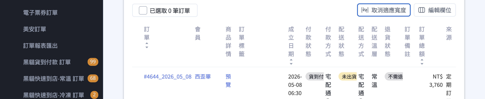

!!! tip "快速比對多個欄位"                                                   
    需要比對多個狀態欄位（例如同時看「付款狀態」「配送狀態」「退貨狀態」「發票狀態」），開啟適應寬度可避免左右捲動、加速作業判讀。

## 訂單標籤註記 { #orders-tag-annotation }
                                                                   
「訂單標籤」是您可以 **手動** 貼附在訂單上的分類註記，用來補足系統狀態無法表達的內部資訊，例如「需手寫卡片」「VIP 客戶」「待客服回覆」等。標籤可在訂單列表中作為篩選條件使用，也可與 [檢視群組][orders-groups-tabs]{ data-preview } 搭配儲存常用組合。

!!! example "標籤的使用情境"

    * **流程備註**：標記訂單目前的處理階段，例如「已撥電話確認」「等待補件」。
    * **客戶特性**：標記顧客類型，例如「企業客戶」「常客」「黑名單觀察」。                                                           
    * **活動歸屬**：標記訂單所屬的行銷活動或通路，例如「雙十一檔期」「百貨快閃」。                                                   
    * **內部分工**：標記負責的同仁或部門,讓不同角色快速找到自己負責的訂單。                                                           
                
**操作方式**

1. 在 **訂單** > **所有訂單** 列表中，勾選欲加註標籤的訂單(可單筆或多筆)。
2. 點選列表上方的 **更多操作** > **新增標籤**，開啟標籤設定視窗。                                              
3. 在輸入框中:
    * 從下拉選單選用 **既有標籤** ；或                            
    * 直接輸入新名稱，點選 **新增** 即可建立並套用新標籤。        
4. 確認後送出，所選訂單將同時套上所選標籤。                       
                                                                  
若需移除標籤，同樣於 **更多操作** 中選擇 **移除標籤**，於彈窗選擇要移除的標籤即可。                                    
                                                                 
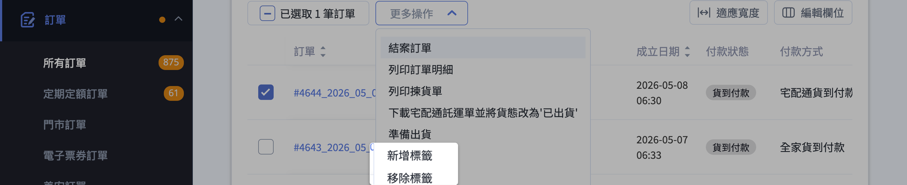

## 其他特定搜尋路徑

- :lucide-repeat:{ .lg }  
  [__定期定額訂單__](匯出定期定額子訂單預測報表.md){ data-preview }  
  需至「訂單」>「定期定額訂單」中搜尋，支援定期單號、收貨資訊或備註搜尋。

- :material-point-of-sale:{ .lg }  
  [__POS 訂單__](../../pos/orders_ann/index.md){ data-preview }  
  在 POS 前台可透過輸入訂單號碼、掃描發票或進階篩選（如成立時間、認單時間）來查找。

- :lucide-user:{ .lg }  
  [__會員專屬搜尋__](../members/管理會員檔案.md){ data-preview }  
  進入特定會員頁面後，點選其「訂單」分頁，可查看該會員在 EC 與 POS 的所有有效消費紀錄。

## 後續操作

- :lucide-package:{ .lg }  
  [__批次出貨__](訂單出貨流程.md){ data-preview }  
  勾選多筆訂單，透過上方「批次操作」選擇對應物流（黑貓、全家、7-11、宅配通等）進行出貨。

- :lucide-printer:{ .lg }  
  [__列印揀貨單／出貨單／發票__]()  
  批次操作中選擇列印，一次產出多筆訂單的揀貨單、出貨單或發票。

- :lucide-edit:{ .lg }  
  [__修改訂單狀態__](編輯訂單內容.md){ data-preview }  
  個別點入訂單編輯，或透過批次操作關閉／開啟訂單（需「手動訂單」權限）。

- :lucide-download:{ .lg }  
  [__匯出報表__](匯出訂單報表.md){ data-preview }  
  點擊頁面右上方的「匯出」，將目前查詢結果下載為 Excel／CSV 檔，便於財會或客服進一步處理。

## 常見問題

??? quote "我用商品名稱搜尋但找不到訂單？"

    可能原因：

    1. 訂單成立時商品名稱與您現在輸入的不一致（例如後來改名）。系統紀錄的是 **下單當下** 的品項名稱。
    2. 該商品被列為「贈品」或「加購」，且設定不納入搜尋。
    3. 已開啟「完全符合」但關鍵字非完整名稱，取消勾選再試一次。
    4. 訂單已被刪除（非關閉），列表只顯示未刪除的訂單。

??? quote "如何儲存常用的篩選條件組合？"

    請依序操作：

    1. 在訂單列表中設定好篩選條件（如：付款狀態 = 已收款 + 配送狀態 = 未出貨）。
    2. 點擊搜尋列右側的「儲存」按鈕。
    3. 選擇「**建立新檢視群組**」，輸入名稱（如：今日待出貨）即可建立頁籤。
    4. 之後點擊該頁籤即可一鍵切換至該篩選組合的訂單列表。

??? quote "篩選結果太多或查詢太慢怎麼辦？"

    建議依序調整：

    1. 先用日期區間（例如最近 7 天）大幅縮小範圍。
    2. 加上付款／配送狀態條件，例如只看「已付款 + 未出貨」。

