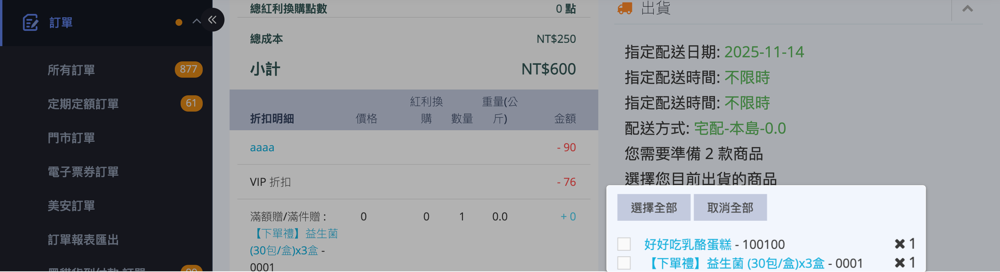
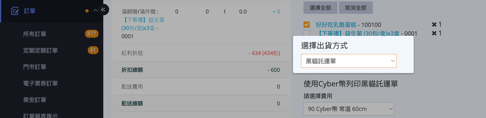
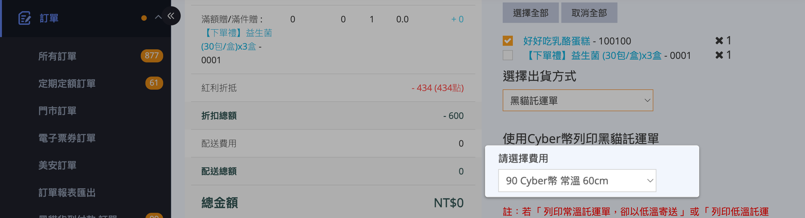
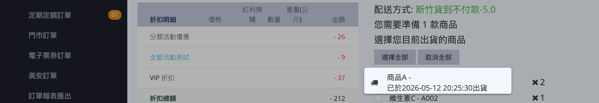
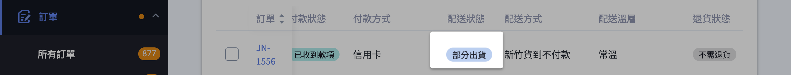

{ .subtitle }

{ .doc-badge }

{ .hero-page }

## 部分出貨說明

當一筆訂單中只有部分商品有現貨可寄出時，「部分出貨」讓您先將可出貨的商品寄給顧客，剩餘的商品稍後再以同一筆訂單繼續出貨，以縮短顧客的等待時間。

您只需要在訂單詳情頁的「出貨」區塊勾選 **本次要出貨的商品** ，而非全部商品，系統就會自動將訂單的配送狀態改為「部分出貨」，並保留尚未出貨的品項供您後續處理。

!!! info "提示"
    每執行一次出貨，系統都會 **依照您的勾選** 寄送一封出貨通知 Email 給顧客（預設勾選），請留意顧客可能收到多封通知。

---

## 適用條件與限制

執行部分出貨前，請確認以下條件。任一項不符合，「出貨」區塊將不會出現可勾選的商品或可選的出貨方式。

### 訂單條件

| 條件 | 允許的狀態 |
| :-- | :-- |
| 訂單狀態 | 開啟 |
| 付款狀態 | 已付款、貨到付款、待部分退款、部分退款，或自訂付款方式的「待付款」 |
| 配送狀態 | 未出貨、部分出貨、準備出貨、運送異常 |

### 不支援部分出貨的情境

* **大宗寄倉 B2C 訂單** (透過綠界 B2C 大宗寄倉物流的超商訂單)
* **萊爾富超商 B2C 訂單** (萊爾富一般取貨 / 取貨付款，非店到店)
* **全家冷鏈託運單** (請一次勾選全部商品)
* **快速到貨 CYBERBIZ NOW 訂單** ，且狀態已超過「準備出貨」 (詳見後段「特殊情境」)
* **已退貨的門市自取訂單**
* **Amazon FBA 串倉訂單**
* **完全來自串倉倉庫的訂單** ，且商家尚未加購「[部分串倉](../../wms/啟用部分串倉與拆單.md){ data-preview }」功能

!!! note "註釋"
    這些情境下「出貨」區塊會直接隱藏，或下拉選單不會列出對應的物流選項。



### 加值功能對照

以下加值功能皆需另行加購，並非預設方案內建:

| 功能名稱 | 適用情境 |
| :-- | :-- |
| 部分串倉 | 訂單同時包含自行出貨商品與倉庫出貨商品時，允許就「自行出貨」的部分先行出貨 |
| API 超商部分出貨 | 透過 API 對 7-11、全家、萊爾富等超商訂單進行多次出貨 |
| API 快速到貨部分出貨 | 透過 API 對 Uber Direct、foodpanda pandago 等快速到貨訂單進行多次出貨 |

!!! plan "方案/加值功能"
    如不確定您的店家是否已開通上述功能，請聯繫您的 CYBERBIZ 業務窗口確認。一般宅配(黑貓、宅配通、新竹、順豐、自訂出貨方式)的部分出貨 **不需** 額外加購任何功能，可直接使用。



## 操作步驟教學 { #fuilfillment-partial-operate }

以下以「黑貓託運單」為例，其他物流商（如宅配通、順豐、新竹物流或自訂出貨）的操作步驟大致相同。

1. **進入訂單詳情頁：** 前往後台「訂單」>「所有訂單」，點選欲執行部分出貨的「訂單編號」。
2. **勾選本次出貨商品：** 在「出貨」區塊中，勾選本次要優先寄送的商品。如需一次選取全部商品，可點擊「選擇全部」；若需重新選擇，則可點擊「取消全部」。

    

3. **選擇出貨方式：** 在下方「選擇出貨方式」的下拉選單中，選擇本次要使用的物流(例如「黑貓託運單」)。

    

    !!! info "下拉選單僅會顯示 已開通的物流方式 及 該訂單可使用的物流選項。"

4. **選擇運費規格：** 在「請選擇費用」下拉選單中，挑選對應的託運單規格(如重量、尺寸區間)。

    

    !!! info "建立託運單後，系統會自動扣除對應的物流點數。"

5. **確認出貨：** 點擊 **「確認出貨」** 按鈕。系統會建立託運單、扣除運費點數，並將該批商品標記為已出貨。
6. **檢視出貨紀錄：** 操作完成後，已出貨的商品下方會顯示「已於 YYYY-MM-DD HH:MM 出貨」與「快遞單號」，訂單上方的配送狀態會更新為「部分出貨」。

    

    

    !!! tip "若您打錯物流或勾錯商品，可以聯絡 CYBERBIZ 客服協助取消該筆託運單。商家後台無法自行刪除已建立的託運單。"

## 完成剩餘商品出貨

當剩餘缺貨商品補齊後，請依照下列步驟完成後續配送作業：

1. **進入訂單**：前往「訂單」>「所有訂單」，點選狀態為 `部分出貨` 的訂單編號。
2. **選取品項**：勾選本次欲寄出的剩餘商品。
3. **執行出貨**：選擇出貨方式與運費後，點擊 **[確認出貨]**。

!!! info "重要規範"

    | 類別 | 說明 | 
    | :--- | :--- |
    | **狀態更新** | 最後一筆商品出貨前，狀態恆為 `部分出貨`；完成後轉為 `已出貨`。 |
    | **自動化限制** | 部分出貨訂單**不會自動結案**，需於全數出貨後手動結案。 |
    | **顧客通知** | 每次出貨均視為獨立事件，系統將根據勾選狀況重複發送出貨通知。 |

## 後續繼續出貨

當剩餘商品也到貨後，只需要回到同一筆訂單，**[重複上述步驟][fuilfillment-partial-operate]{ data-preview }** 即可：勾選下一批要出貨的商品 > 選擇出貨方式 > 選擇運費規格 > 確認出貨。

* 訂單會持續維持「部分出貨」狀態，直到 **所有商品都完成出貨** ，才會轉為「已出貨」。
* 「部分出貨」狀態下，訂單 **不會自動結案** 。所有商品完成出貨並轉為「已出貨」後，需結案請至訂單詳情頁手動操作。
* 每執行一次出貨，系統會視「發送郵件通知顧客」的勾選狀況，寄送一封獨立的出貨通知給顧客。

## 不同物流的特殊情境

### 一般宅配 (黑貓、宅配通、新竹、順豐)

操作流程同上。下拉選單會自動顯示您已開通的物流選項。

!!! note "註釋"
    若該訂單為 **貨到付款** 且需要分箱寄送，系統會在出貨區塊顯示提示「貨到付款訂單如需分箱出貨，請使用加印託運單功能」。這是因為貨到付款訂單需要將代收款金額綁定在託運單上，以「加印託運單」功能產生多組單號才能正確分配代收款。

### 自訂出貨方式

當您使用合作的第三方物流或自行配送時:

1. 於「選擇出貨方式」下拉選單選擇「自訂出貨方式」。
2. 系統會跳出「快遞單號」欄位與物流公司選單。
3. 自行填入該批商品的「快遞單號」並選擇對應的物流公司。
4. 點擊「確認出貨」即可。

### 快速到貨 CYBERBIZ NOW (門市出單)

* 快速到貨訂單的出貨入口位於 **「門市訂單」** ，而非「所有訂單」列表。
* 若門市現場遇到缺貨，可在門市訂單詳情頁勾選實際可出貨的品項後出貨。
* **重要限制:** 預設情況下，快速到貨訂單 **每筆僅能執行一次出貨** 。一旦勾選並確認出貨後，該訂單就無法再對剩餘商品繼續出貨，剩餘部分需走 **退貨退款** 流程。
* 操作前建議先與消費者聯繫並達成共識，避免訂單反覆退款影響顧客體驗。

!!! plan "方案/加值功能"
    若您需要對快速到貨訂單進行 **多次** 部分出貨(例如同一筆訂單分多次寄出)，請聯繫業務窗口加購 **「API 快速到貨部分出貨」** 功能。

### 部分串倉訂單

當訂單同時包含「自行出貨商品」與「倉庫商品」時，在已加購「部分串倉」功能的情況下，**自行出貨** 的部分可依照上述操作步驟先行出貨。倉庫出貨的部分則由倉庫端進行，不在本流程內。

---

## 何時建議改用「加印託運單」

若您 **不是因為缺貨** 而要分批出，而是「所有商品都要一次寄出，但需要拆成多個包裹」，建議改用 **「加印託運單」** 功能:

* 在同一筆訂單內輸入訂單編號，即可產生多組託運單號，方便分箱追蹤。
* 貨到付款訂單需要分箱寄送時，**必須** 使用加印託運單而非部分出貨。

---

## 常見問題 FAQ

??? question "Q1. 為什麼我在訂單詳情頁看不到「出貨」區塊?"
    請依以下順序檢查:

    * 訂單狀態是否為「開啟」(已取消的訂單無法出貨)
    * 付款狀態是否為「已付款」、「貨到付款」或「部分退款」等
    * 配送狀態是否為「未出貨」、「部分出貨」、「準備出貨」或「運送異常」
    * 是否為大宗寄倉 B2C、萊爾富 B2C、Amazon FBA 等不支援的物流類型
    * 若為串倉訂單，商家是否已加購「部分串倉」功能

??? question "Q2. 出貨後可以取消嗎?"
    商家後台 **無法自行取消** 已建立的託運單。如有勾錯商品、選錯物流或運費點數扣錯，請聯繫 CYBERBIZ 客服協助處理。

??? question "Q3. 部分出貨後，訂單會自動轉成「已出貨」嗎?"
    不會。訂單只有在 **所有商品都完成出貨** 之後才會自動轉為「已出貨」。在此之前，訂單狀態會一直停留在「部分出貨」。

??? question "Q4. 顧客會收到幾次出貨通知?"
    預設每執行一次出貨就會寄送一次通知 Email。若您不希望顧客收到多封通知，可在「確認出貨」前，**取消勾選** 「發送郵件通知顧客」。

??? question "Q5. 貨到付款訂單可以部分出貨嗎?"
    系統允許貨到付款訂單執行部分出貨，但 **不建議** 。因為代收款金額是綁定在託運單上的，分多次寄送會讓代收款分散在多張託運單，結帳對帳較複雜。建議改用 **「加印託運單」** 功能，於同一筆訂單產生多組單號統一管理。

---

## 參考資料

* [各物流類型部分出貨支援對照表][shipping-types-partial-support]{ data-preview }

[shipping-types-partial-support]: references/shipping-types-partial-support.md#shipping-types-partial-support

## 後續操作

- :lucide-import:{ .lg }
  [____]()
  。

- :lucide-ban:{ .lg }
  [____]()
  。

## 常見問題

??? quote ""

