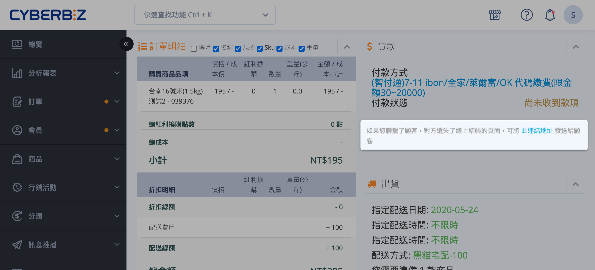
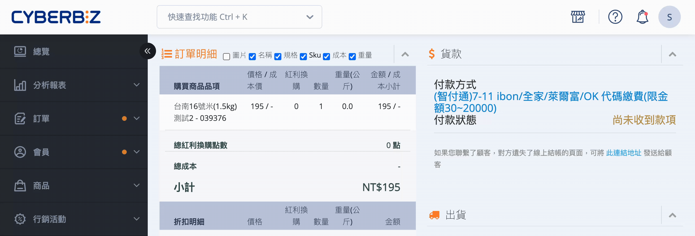

# 提供顧客付款連結

訂單尚未完成付款時，商家可透過付款連結引導顧客重新進行線上結帳，無需取消訂單重建流程。
{ .subtitle }

{ .hero-page }

## 付款連結說明

當顧客在下單時未即時完成付款，或因信用卡授權失敗等因素導致付款失敗時，商家可以主動提供「付款連結」引導顧客重新支付，無需取消訂單重新下單。

###  適用情境

- **付款失敗處理**：當訂單狀態顯示「付款失敗」時，商家可透過此連結請顧客再次嘗試付款。

- **超商條碼失效**：若訂單因「逾時未付款」被自動取消，或條碼因每 3 小時的自動更新而失效，商家可重新提供連結供顧客取得新條碼。

### 注意事項

- **訂單編輯限制**：

	- 針對「非貨到付款」訂單，若商家在顧客付款前 **編輯了訂單商品或金額**，前台的付款連結仍會以 **編輯前的原始金額** 進行扣款。

	- 若編輯後產生差額，商家需自行與顧客協議補款或退款方式，系統不會自動透過連結處理差額。

- **連結時效性**：若商家設定了「訂單自動取消」天數（如 3 天內未付款則取消），則付款連結在訂單被系統自動取消後將失去效用。

## 付款連結取得路徑

1. 登入 CYBERBIZ 後台，由左側選單進入 **訂單 > 所有訂單**。

2. 點擊該筆訂單編號，進入 **訂單明細頁**。

3. 在頁面中的 **貨款** 區塊，找到 **付款連結** 欄位。

4. 複製該連結地址，並透過 Email、簡訊或社群通訊軟體提供給消費者。ㄛ

## 付款連結支援的支付方式

此連結會導向該訂單的專屬結帳頁面，顧客可於該頁面選用以下方式完成支付：

- **信用卡**（一次付清）。

- **電子錢包**：如 LINE Pay、街口支付。

- **超商條碼繳費**：若商家有開啟此功能，顧客可於連結頁面取得即時條碼至 7-11 或全家繳費。

## 相關操作

- :lucide-bell:{ .lg }   
  [__未付款提醒通知__](設定未付款提醒.md)     
  配置自動化訊息通知，依設定週期定時推播未付款提醒，引導顧客透過訊息內的連結完成結帳。

- :lucide-ban:{ .lg }     
  [__物流限制與排除選項__](設定超商配送限制與物流排除.md)  
  設定商品的配送物流條件，限制特定物流方式於結帳流程中的顯示與使用。

## 常見問題

??? quote "付款連結可以重複使用嗎"

	可以。在訂單尚未完成付款、且未被系統自動取消前，付款連結可重複提供給顧客使用，不限次數。

??? quote "付款連結有使用期限嗎"

	付款連結本身沒有固定期限，但會受以下條件影響而失效：

	- 訂單被系統自動取消（例如設定 3 天未付款即取消）。
    
	- 商家手動取消該筆訂單。
    

	一旦訂單狀態變為「已取消」，付款連結即無法再使用。

??? quote "顧客已付款成功後，付款連結還能再使用嗎"

	不能。當訂單完成付款後，該付款連結即失效，無法再次進行扣款。

??? quote "可以透過付款連結更改付款方式嗎"

	可以，但僅限該訂單原本可支援的付款方式。顧客進入付款連結頁面後，可在系統允許的範圍內重新選擇付款方式（例如信用卡改為電子錢包）。
	
??? quote "付款連結支援分期或其他特殊付款方式嗎"

	付款連結僅支援該站點原本開啟的線上付款方式，是否支援信用卡分期、特定電子錢包或其他支付方式，取決於商家後台的金流設定。

??? quote "如果商家修改了訂單金額，付款連結會自動更新嗎"

	不會。對於非貨到付款訂單：

	- 若商家在顧客付款前編輯訂單金額或商品內容，
    
	- 付款連結仍會以「編輯前的原始金額」進行扣款。
    
	系統不會自動同步金額變動，差額需由商家自行與顧客處理。

??? quote "為什麼超商條碼透過付款連結重新產生後不一樣"

	因超商條碼具有時效性，系統會定期更新（例如每 3 小時）。當顧客重新透過付款連結進入結帳頁面時，系統會重新產生一組有效條碼供繳費使用。

??? quote "付款連結是否適用於所有訂單狀態"

	否。付款連結僅適用於以下狀態的訂單：

	- 尚未完成付款
    
	- 未被取消
    

	若訂單已付款、已取消或已關閉，付款連結將無法使用。