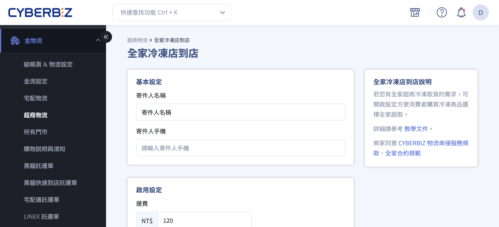

# 操作全家冷凍店到店 C2C 出貨

操作全家冷凍店到店 C2C 出貨，包括設定流程、訂單出貨、包裝規範、寄件時效及異常處理。
{ .subtitle }

{ .hero-page }

## 全家冷凍店到店 C2C 出貨說明

全家冷凍店到店 (C2C) 讓商家可輕鬆管理冷凍商品銷售與庫存，透過後台操作完成訂單接收與寄件，快速配送至消費者指定門市，提升業績與顧客滿意度。

全家冷凍店到店 (C2C) 服務讓商家能：

- 管理冷凍商品庫存與訂單
- 快速完成店到店配送
- 提供消費者更多取貨選擇
- 擴大冷凍商品銷售、提升業績

> ⚠️ 注意：使用本服務寄送冷凍包裹，最高貨損賠償金額為 **TWD 5,000**。

## 後台設定流程

在開始出貨前，必須先於系統啟用相關服務。

1. **進入設定頁面**：登入 CYBERBIZ 管理後台，前往 **金物流 > 超商物流**，點擊 **全家冷凍店到店**。
2. **同意服務條款**：閱讀並勾選同意「CYBERBIZ 物流串接服務條款」與「全家合約規範」。
3. **填寫寄件資訊**：填寫正確的 **寄件人真實姓名與手機**，因為若包裹退回，門市人員會核對身分證件才可領取。
4. **設定費用與金流**：輸入運費、免運門檻，並依需求開啟「貨到付款」（僅限開通 CYBERBIZ PAYMENTS 商家）或「取貨不付款」。

## 訂單出貨操作步驟

1. **選取訂單**：至 **訂單 > 所有訂單**，勾選欲處理的冷凍訂單。
2. **取號與下載託運單**：點選右上角 **選擇操作**，根據商品材積選擇 **下載全家冷凍材積 60 / 材積 105 託運單**。
    - **s60**：單邊長 ≤ 45cm，總重量 ≤ 5kg。
    - **s105**：單邊長 ≤ 45cm，總重量 ≤ 10kg。
3. **更新貨態**：下載託運單的同時，訂單配送狀態會變更為 **已出貨**，顧客會收到通知。

## 包裝與溫度規範

冷凍包裹有嚴格的物理與溫度限制，若不符合規範，門市司機得拒收：

- **溫度要求**：僅支援 **冷凍食品**，溫度需低於 **-18℃**，且寄件前必須 **預冷 12 小時以上** 並確保完全冷凍。
- **紙箱規範**：
    - **2025/06/09 起**，全家已 **取消** 必須使用專用紙箱的規定，商家可自備紙箱。
    - 紙箱厚度建議為 **0.5 公分**，不可使用束繩、保麗龍、破壞袋或併箱，包裝封口需黏緊不可裸露。
- **標籤張貼**：將託運單印出後放入 **防水透明袋**  中，平貼於紙箱寬面，不得凹折或縮放條碼。

## 寄件與時效限制

- **寄件方法**：商家可自行列印託運單貼上，或[記下託運單號至全家門市 **FamiPort** 機台列印](操作超商店到店 C2C 出貨#famiport)服務單（繳費單）。
- **期限**：產出託運單後，必須在 **6 日內** 完成寄件，否則單號將自動失效。

## 異常與特殊情境

- **門市關轉**：若遇取件門市閉店，商家須在收到通知的 **6 日內** 聯繫消費者並於後台重選門市。
- **逾期未取**：若消費者 4 日內未取件，包裹會退回「原寄件門市」，商家須於  **4 日內** 取回且不需額外運費。若 4 日後未取，則會送回物流中心並改以 **宅配到付** 寄回商家地址。
- **禁運物品**：包含現金、有價證券、易碎品、3C 產品（電腦、手機等）、活體動植物或價值超過 5,000 元之商品。
- **運送異常**：若有運送異常之情況請先透過[超商連結查詢貨物狀態 :lucide-external-link:](https://fmec.famiport.com.tw/FP_Entrance/QueryBox)，若仍有疑問可至 CYBERBIZ 後台客服系統詢問。  

!!! info "**重要提醒：** 冷凍店到店包裹遺失或損壞的 **最高賠償金額為 TWD 5,000 元**。"

## 常見問題

??? quote "消費者逾期未取，包裹會怎麼處理？"  
	- 包裹會退回至原寄件門市，商家須於 **4 日內** 取回，無需額外支付運費。  
	- 若 4 日後仍未取回，包裹將送回物流中心，並以 **宅配到付** 寄回商家地址。  
	- 消費者將收到系統通知，提醒取件或退件。

??? quote "寄送冷凍商品有尺寸或重量限制嗎？"  
	- **S60 材積**：單邊長 ≤ 45 cm，總重量 ≤ 5 kg。  
	- **S105 材積**：單邊長 ≤ 45 cm，總重量 ≤ 10 kg。  
	- 寄件前請確認商品完全冷凍並使用合適紙箱。

??? quote "可以寄送哪些商品？有禁運物品嗎？"  
	僅限 **冷凍食品**。禁運物品包括：現金、有價證券、易碎品、3C 產品（電腦、手機等）、活體動植物、單件價值超過 **TWD 5,000** 的商品。

??? quote "若寄送冷凍包裹遺失或損壞，賠償如何計算？"  
	**最高賠償金額為 TWD 5,000 元**。若超過此金額，商家需自行承擔損失。

??? quote "如何重新選擇取件門市？"  
	若門市關閉或無法取件，商家需在收到通知後 **6 日內** 登入後台重新選擇可取件門市。

??? quote "如果託運單號失效或寄件異常，該怎麼處理？"  
	使用[全家 FamiPort 查詢貨物狀態](https://fmec.famiport.com.tw/FP_Entrance/QueryBox)。若仍有問題，聯繫 CYBERBIZ 後台客服處理。