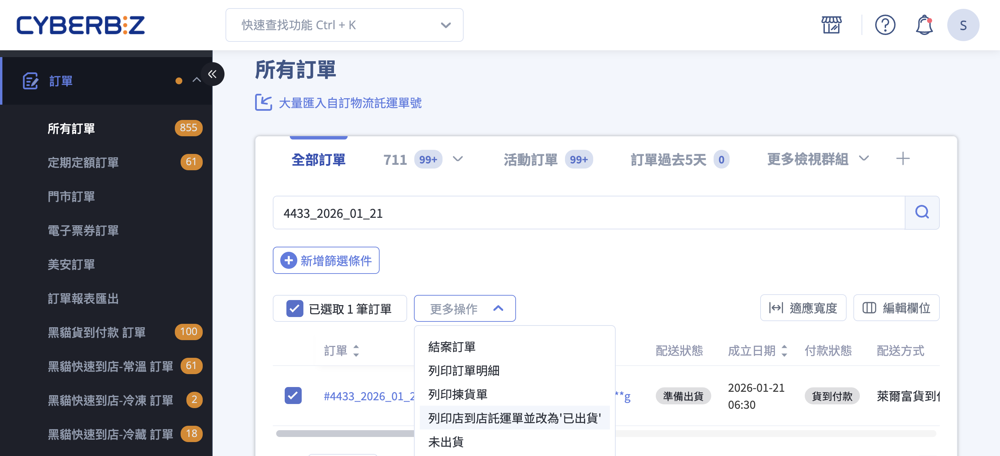
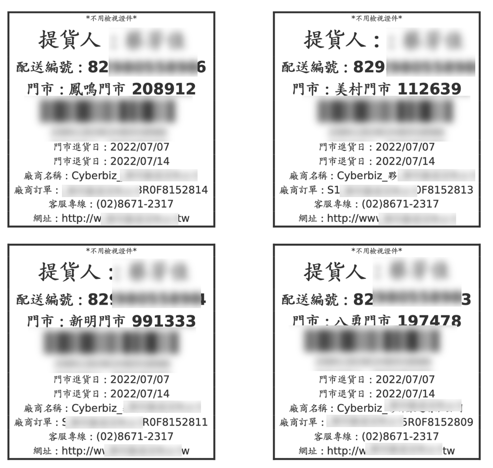
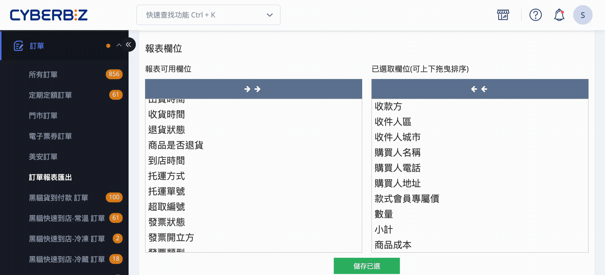
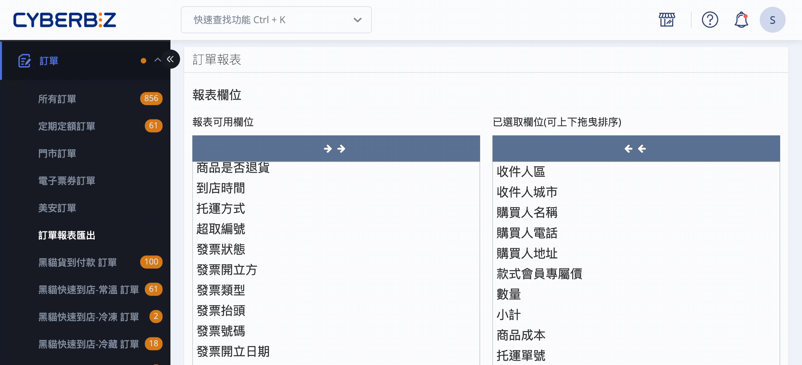
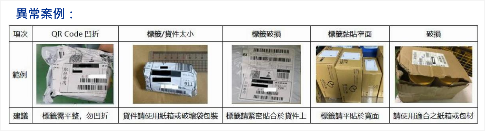
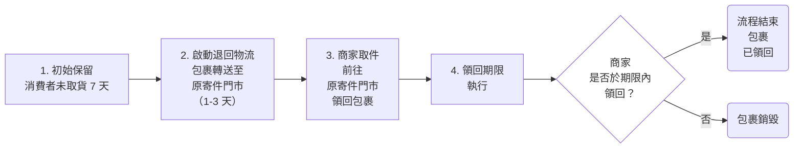

# 操作超商店到店 C2C 出貨

包裝商品並透過超商店到店（C2C）寄件至消費者指定門市，包括完整操作流程與注意事項。
{ .subtitle }

{ .hero-page }

## 超商店到店（C2C）出貨說明

商家完成包裝後，可將包裹寄至消費者指定門市，支持的超商物流服務包括：

- **7-ELEVEN（交貨便）**
- **全家（店到店）**
- **萊爾富（超商取貨）**    

> **提示**：貨到付款（COD）功能僅限開通 **CYBERBIZ PAYMENTS** 的商家使用。

## 出貨操作流程

### 步驟一：確認出貨條件

- **付款狀態確認**：
    - **取貨不付款（先付款）**：訂單的付款狀態必須顯示為「**已收到款項**」才可操作出貨。
    - **取貨付款（COD）**：訂單配送狀態顯示為「**貨到付款**」時即可操作。
    - _註：貨到付款功能僅限開通 CYBERBIZ PAYMENTS 的商家使用。_
- **寄件人資訊**：請務必在後台設定正確的 **公司寄件人姓名（真實姓名）與手機**。若發生消費者逾期未取退貨，門市人員須核對寄件人身分證件才可領回包裹。

---

### 步驟二：後台取號與下載託運單

!!! info "請先儲值 Cyber 幣"
	
	- 一般版 商家請先 [儲值 Cyber 幣](#) (管理中心 > 儲值中心)，若儲值金額不足將無法列印託運單。
	- PLUS版 / 企業版 商家無需手動儲值，系統將依每期對帳單收取 CYBERB 幣。

1. 登入 CYBERBIZ 管理後台，前往 **訂單 > 所有訂單**。
2. 勾選相同配送方式（如萊爾富貨到付款）的訂單。
3. 點選右上方 **更多操作** > **下載店到店託運單並更改為已出貨**。  
> :lucide-triangle-alert: 配送狀態一旦為「已出貨」，則無法修改收貨資訊以及任何訂單狀態。 
	- **批次操作建議**：單次最多勾選 **20 筆**，避免超商端取號失敗。  

	
4. 系統將生成壓縮檔，內含：
    
    - 託運單（寄件資料）
    - 出貨明細
    - 訂單明細
    - 揀貨單

     > :lucide-flame: 壓縮檔若無法下載請檢查，瀏覽器是否阻擋彈跳視窗。

---

### 步驟三：列印與貼單

> 提示：建議使用雷射印表機，較不影響標籤判讀。"

#### 一般列印

- 使用 A4 紙或標籤貼紙，一頁最多 4 筆（2X2 格式）。
- [市售 A4 尺寸標籤貼紙範例 :lucide-external-link:](https://shopee.tw/%E3%80%90A4%E3%80%91A4%E7%A9%BA%E7%99%BD%E8%B2%BC%E7%B4%99-2%C3%972-%E8%B2%BC%E7%B4%99-A6%E8%87%AA%E9%BB%8F%E6%A8%99%E7%B1%A4%E8%B2%BC%E7%B4%99-A4%E6%A8%A1%E9%80%A0%E8%B2%BC%E7%B4%99-%E9%9B%BB%E8%85%A6%E6%A8%99%E7%B1%A4%E8%B2%BC%E7%B4%99-%E5%8F%AF%E9%9B%B7%E5%B0%84-%E5%99%B4%E5%A2%A8-1%E5%8C%85100%E5%BC%B5-10%E5%8C%85%E5%85%8D%E9%81%8B-i.24728499.2550119685)，僅供參考。

??? note "圖示範例"
	

#### 熱感列印（A6）
    
- 支援 7-ELEVEN 與全家 C2C，僅可使用「新版訂單列表」下載。瞭解 [如何熱感列印超商托運單](熱感列印超商托運單)。
- _註：熱感列印功能僅限 PLUS 與 企業版 的商家使用。_ 
        
#### 超商列印
    
- 可至門市多媒體機台（ibon/FamiPort）列印服務單。
- 需記下託運單號（交貨便代碼）。

=== "ibon"
	
	1. **查詢托運單號**
	
		- 登入 CYBERBIZ 管理後台，前往 **訂單 > 訂單報表匯出**。
		- 點擊 **托運單號** 將其加入已選取欄位。
		- 點擊 **儲存** 套用變更，並匯出。
		- 打開匯出的檔案，可在 **托運單號** 欄位查詢到相關商品的托運單號（交貨便代碼）。
	
		
	1. **ibon機台操作：**
	    - 點選ibon首頁 **服務** > **交貨便** > **寄件**。
	    - 選擇「自行輸入」交貨便代碼。
	    - 確認寄件者與取件者資料。
	2. **列印單據：** 確認資料後，等待機台列印出繳費單（小白單）。
	3. **寄出包裹：**
	    - 憑單據至櫃檯領取「交貨便塑膠套袋」，將單據放入並貼在包裹上。
	    - 若為賣貨便賣家，多筆訂單可使用APP批次產生QR Code進行快速列印。 

	!!! info "注意事項"
	
		- 取號後需在四天內至 7-11 寄出，逾期訂單會取消。

=== "FamiPort"

	1. **查詢超取編號**

		- 登入 CYBERBIZ 管理後台，前往 **訂單 > 訂單報表匯出**。
		- 點擊 **超取編號** 將其加入已選取欄位。
		- 點擊 **儲存** 套用變更，並匯出。
		- 打開匯出的檔案，可在 **超取編號** 欄位查詢到相關商品的寄件單號。

		
		
	2. **操作 FamiPort 機台**：
	    - 點選首頁 **服務/寄件 > 店到店 > 全家平台寄件 > 寄件**。
	    - 輸入平台提供的「寄件代碼/編號」。
	    - 輸入訂單金額：
		    - 貨到付款：超商有代收費用，就要輸入訂單金額。  
		    - 貨到不付款：純取貨，超商無代收費用，訂單金額就輸入 0。
	    - 輸入「寄件人手機末三碼」驗證。
	    - 確認寄件資訊無誤後，按下「確認」並列印繳費單。
	3. **繳費與貼單**：持「小白單」與包裹至櫃檯，完成繳費並將托運單黏貼於包裹上。 

	!!! info "建議事項"

		- 確認寄件人與收件人資訊（地址/姓名）無誤，避免列印後無法修改。
		- 列印出的標籤請貼在包裹最顯眼處。

---

### 步驟四：前往門市寄件

商家當日寄件，若該店物流車當日尚未取件，則通常消費者可於後天（寄件日+2天）取貨。  
部分門市除外，查看 [7-11 排外門市名單 :lucide-external-link:](https://www.7-11.com.tw/form/store.pdf)、全家不限。

- **寄件時效**：託運單產出後，建議 **5 日內** 完成寄件，逾期單號將失效。

---

### 步驟五：到店簡訊通知

- 商品抵達門市後，CYBERBIZ 貨態轉為「已到店」，將發出取貨通知簡訊給「消費者」。
- CYBERBIZ 取貨通知簡訊：
  
	- 7-11 / 到店第一天、第四天各發一封。
	- 全家 / 到店第一天、第三天各發一封。
	- 萊爾富 / 到店第一天、第三天各發一封。
  
- 若消費者未前往取貨，商品退回原寄件店時，會發簡訊通知「寄件者」。

!!! note "超商貨態查詢系統"

	- 7-11 貨態查詢[連結 :lucide-external-link:](https://eservice.7-11.com.tw/e-tracking/search.aspx)。
	- 全家貨態查詢[連結 :lucide-external-link:](https://fmec.famiport.com.tw/FP_Entrance/QueryBox)
	- 萊爾富貨態查詢[連結 :lucide-external-link:](https://www.hilife.com.tw/serviceInfo_search.aspx)

## 貨物限制與包裝規範

> :lucide-info: 7-ELEVEN 與全家提供官方寄件流程及包材販售服務，請參考官方網站說明

### 尺寸與重量

- 包裹三邊總和 ≤ 105cm，最長邊 ≤ 45cm。
    
- 重量限制：
    
    - 一般：≤ 5kg
    - 7-ELEVEN C2C：≤ 10kg
        
- 超過限制時，結帳頁面將自動隱藏超商選項。

### 包裝規範

- 商品須完整包裝，不可裸露。
- 禁用 PP 袋、束繩或保麗龍包裝。
- 條碼標籤須平貼於寬面，**不可凹折或縮放**，避免掃描失敗。
- 易碎品請勿交寄，破損將由商家自行負責，若因該商品導致其他商家商品受損、沾汙，亦由商家負擔全部賠償責任。

### 禁止托運商品

- 危險或違禁物品（槍械、炸藥、刀具、有毒物） 
- 現金、票據、貴重金屬、珠寶、古董
- 信用卡、提款卡、證件類
- 活體動植物、寵物
- 血液、尿液、檢體
- 易碎或 3C 產品（電腦、手機、相機）
- 榴槤、鹹魚等特殊氣味物品

## 異常情境處理

### 消費者逾期未取

- 包裹將退回原寄件門市，商家無需額外費用。
- 系統會發送簡訊通知寄件人領回。
    
- 領回時需出示寄件人身分證件，**公司寄件人姓名務必正確**。
    
- 若 7 日內未領回，包裹送至物流中心，並以「**宅配到付**」寄回商家地址。
    
#### 顧客未取件處理流程

### 門市關轉（閉店）

- 系統收到門市關轉通知後，商家需 **2 日內**（7-ELEVEN 當下起算）連繫消費者，並於後台重新選擇門市。
    

### 部分出貨

- 若訂單需分批出貨，**第二次出貨無法再使用超商配送**，需改以宅配方式。
    
- 貨到付款訂單，消費者於收到第一筆包裹時須支付 **整筆訂單全額**。

## 相關操作

- :lucide-printer:{ .lg }   
  [__超商熱感列印__](熱感列印超商托運單)     
  使用熱感列印，列印超商托運單。

- :lucide-snowflake:{ .lg }     
  [__全家冷凍店到店__](操作全家冷凍店到店 C2C 出貨)  
  設定商品的配送物流條件，限制特定物流方式於結帳流程中的顯示與使用。

## 常見問題

??? quote "消費者逾期未取，包裹會怎麼處理？"
	若消費者未在指定時間內取件，系統會自動處理包裹流程：
	
	1. 包裹退回原寄件門市，商家無需額外支付費用。
	2. 系統會發簡訊通知寄件人領回。
	3. 領回時需出示寄件人身分證件，**公司寄件人姓名務必正確**。
	4. 若 7 日內未領回，包裹將送至物流中心，再以「**宅配到付**」寄回商家。
    
??? quote "若訂單需分批出貨，可以繼續使用超商配送嗎？"
	若訂單需分批出貨，需要注意超商配送的限制：

	- 第二次出貨無法再使用超商配送，必須改用宅配寄送。
	- 貨到付款訂單，消費者必須在收到第一批包裹時支付**整筆訂單全額**。
    

??? quote "列印託運單失敗怎麼辦？"

	若遇到列印託運單失敗，請依照以下方式檢查與處理：

	1. 確認瀏覽器是否阻擋彈跳視窗。
	2. 一般版商家請確認帳戶是否已儲值 Cyber 幣。
	3. 若仍無法下載或列印，可嘗試更換瀏覽器，或聯繫客服協助。    
	
    > 建議使用 Chrome 或 Edge 最新版本，通常能減少列印問題。