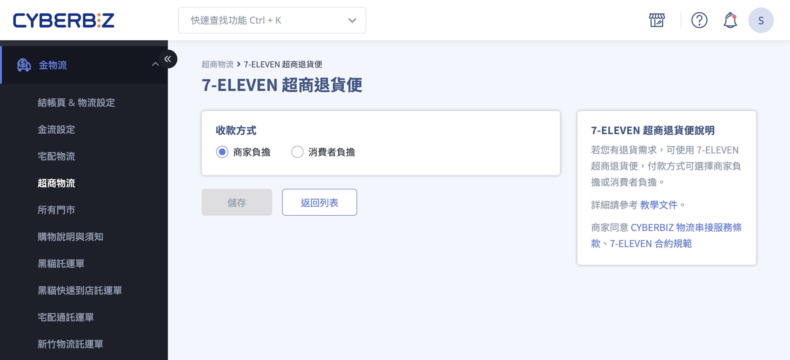
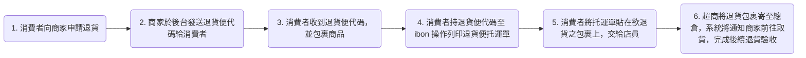
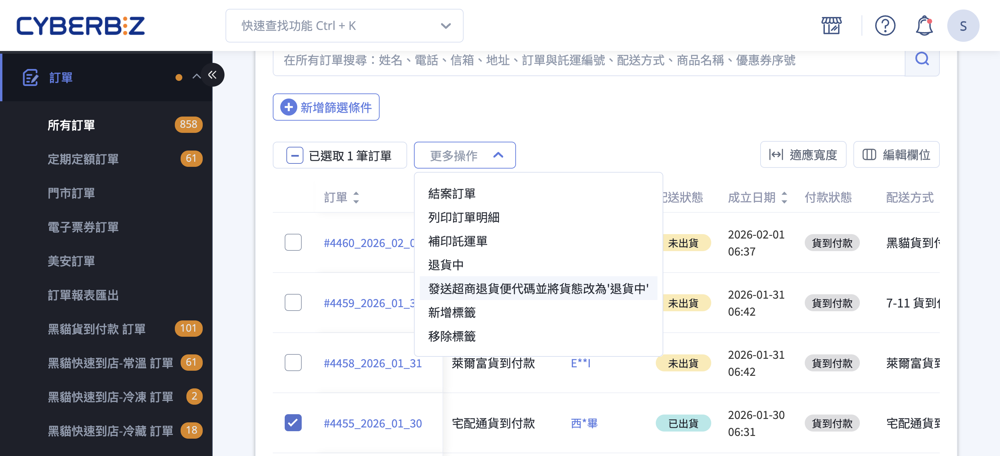

# 操作超商退貨便 C2B

設定及操作 7-11 超商退貨便 (C2B)
{ .subtitle }

[:lucide-tag:{ title="適用方案" }](../../resources/conventions#適用方案) | 高手 PLUS / 企業
{ .doc-badge }

{ .hero-page }

## 超商取貨退貨便 C2B 說明

**超取退貨便 (C2B)** 是讓消費者能透過 **7-11 門市** 將欲退貨的包裹寄回給商家的服務

### 退貨便流程概覽

## 使用前提與費用

• **版本限制：** 此功能主要供 **企業版** 或 **高手 PLUS 版** 商家使用。

• **開通條件：** 若要使用 7-11 C2B 退貨便，商家必須 **[先申請開通「超商大宗寄倉 (B2C)」](../payments-and-logistics/設定超商大宗寄倉 B2C)服務**。

• **原訂單限制：** 使用退貨便收回包裹的 **原訂單不一定要使用超商出貨**；不論原配送方式為何，皆可使用超商退貨逆物流。

• **服務費用：** 目前退貨便價格固定為 **$40**（不論由商家或消費者負擔）。若選擇以簡訊發送代碼，會額外產生每封 $1 的簡訊費用。

• **代碼時效：** 退貨便代碼有效期限為 **申請當日加六天（共七天）**，逾期將失效。

## 步驟一：後台設定收款方式

商家需先決定退貨運費由誰支付，設定路徑如下：

1. 登入 CYBERBIZ 管理後台，前往後台 **金物流 > 超商物流**。

2. 在 **7-ELEVEN 超商退貨便** 區塊，點擊編輯 :material-file-document-edit-outline:按鈕，進入編輯頁面。 

3. 選擇 **商家負擔** 或 **消費者負擔**：
	- **商家負擔：** 商家產出代碼時，系統會自動從 **CYBER 幣** 中扣除。若代碼超過 14 天未使用，點數會自動返還。
	- **消費者負擔：** 消費者在 7-11 門市寄件時，直接將 $40 運費支付給店員。

## 步驟二：後台操作與發送代碼流程

當顧客提出退貨申請後，商家可依以下步驟產出代碼：

1. 進入後台 **訂單 > 所有訂單**，找到該筆訂單。

2. 確認訂單貨態為 **已收貨**（串接物流）或 **已出貨**（自訂物流）。

3. 勾選訂單後，點擊右上方 **更多操作**，選擇 **發送超商退貨便代碼並將貨態改為退貨中**。

4. 在彈跳視窗中選擇是否要透過 **簡訊** 或 **Email** 將代碼寄送給消費者，然後點擊 **確認**。

5. 商家可在 **訂單備註** 中查看已產出的退貨便代碼。

## 步驟三：消費者端寄件流程

1. 消費者收到退貨便代碼後，自行包裝商品。

2. 前往 7-11 門市使用 **ibon 機台**，輸入代碼列印出「退貨便服務單（託運單）」。

3. 將託運單貼在包裹上，交給門市店員完成交寄作業。

> :lucide-info: 詳情請參閱[退貨便官方操作說明 :lucide-external-link:](https://www.7-11.com.tw/service/return.aspx)。

## 步驟四：後續驗收與退款

• **包裹返回：** 超商會將退貨包裹寄至總倉，系統會發送 **CYBERBIZ 7-11 超商退貨便到貨通知** 信件通知商家領取包裹。

• **驗收流程：** 商家收到包裹後，應將訂單貨態改為 **退貨審查** 進行檢查。

• **完成退貨：** 若檢查無誤，將狀態改為 **已退貨**，系統即會觸發後續的自動或人工退款流程。

> :lucide-info: 變更訂單貨態操作，請參閱 [退貨退款相關流程](一般退貨退款#處理退貨退款訂單)。

## 後續步驟

- :lucide-megaphone:{ .lg }   
  [__退貨款說明__]()     
  設定退貨款的政策說明，讓顧客了解相關操作與費用。

- :lucide-package-x:{ .lg }     
  [__退貨退款流程__](一般退貨退款)  
  操作訂單退貨退款的流程。

## 常見問題

??? quote "消費者如何申請超商退貨便？"  
	消費者向商家提出退貨申請後，商家於後台產生退貨便代碼並通知消費者。

??? quote "退貨便代碼有效期限多久？"  
	退貨便代碼自產生當日起計 7 天有效，逾期失效。

??? quote "退貨運費由誰支付？"  
	商家可選擇 **商家負擔** 或 **消費者負擔**，在後台設定即可。

??? quote "包裹返回後，商家應如何處理？"  
	商家收到包裹 > 改訂單貨態為 **退貨審查** > 驗收無誤後改為 **已退貨** > 系統觸發退款。

??? quote "原訂單未使用超商物流，也能使用退貨便嗎？"  
	可以。退貨便不限制原配送方式，皆可收回包裹。