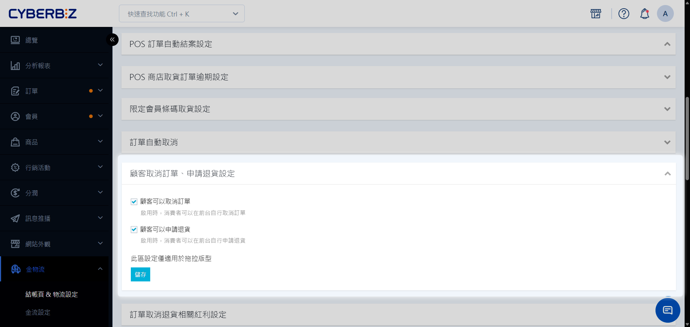
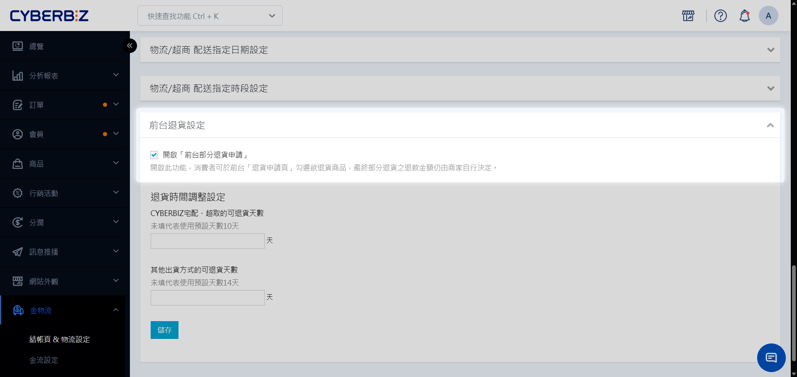
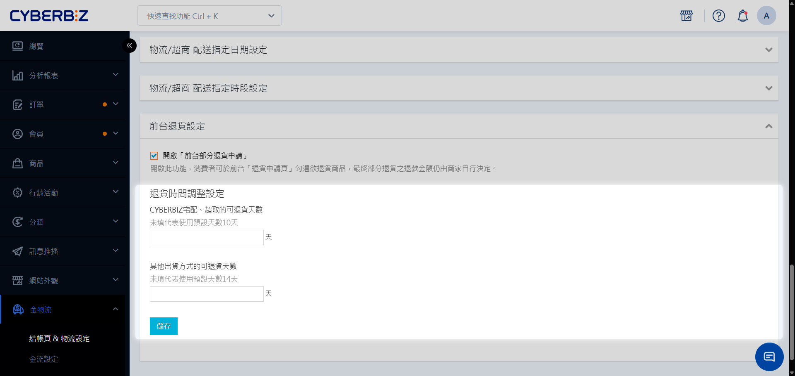
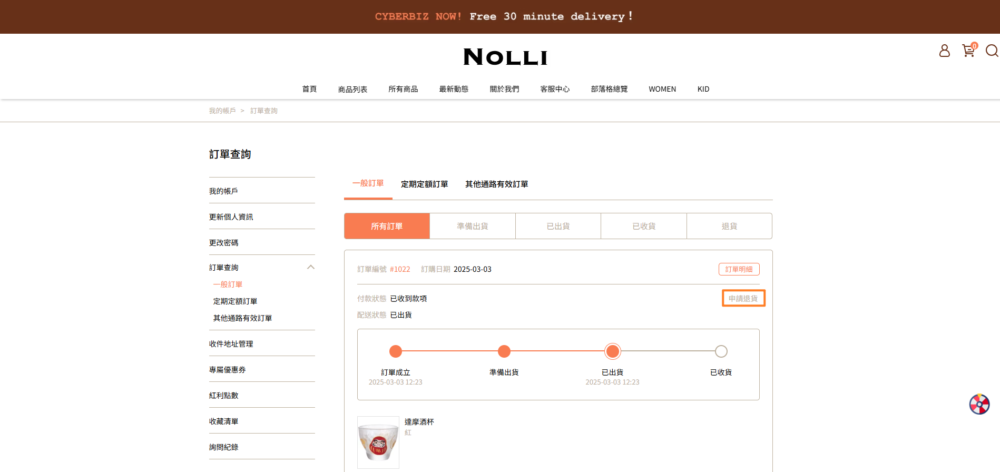
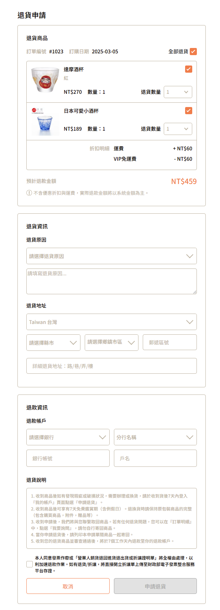
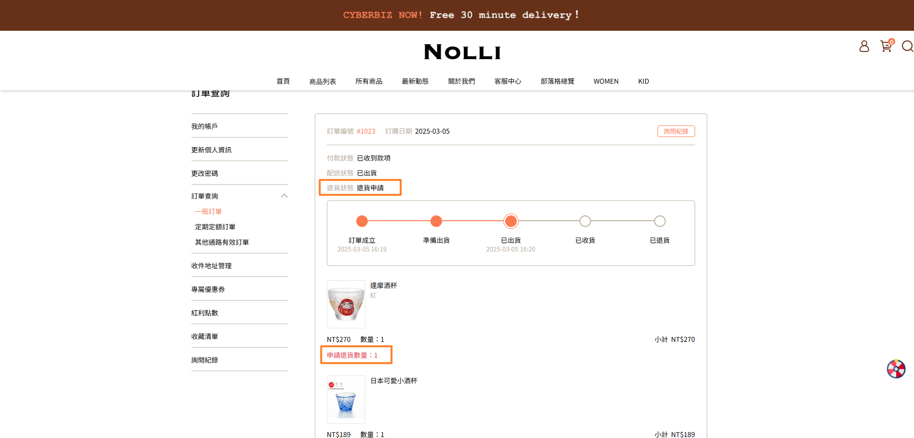
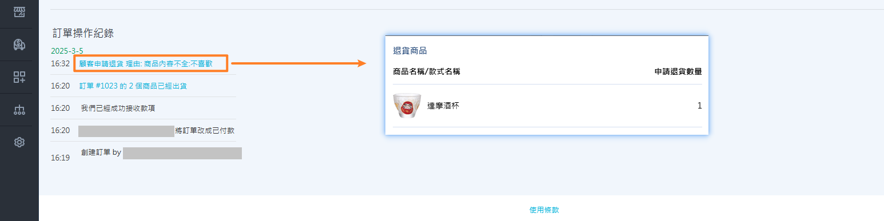
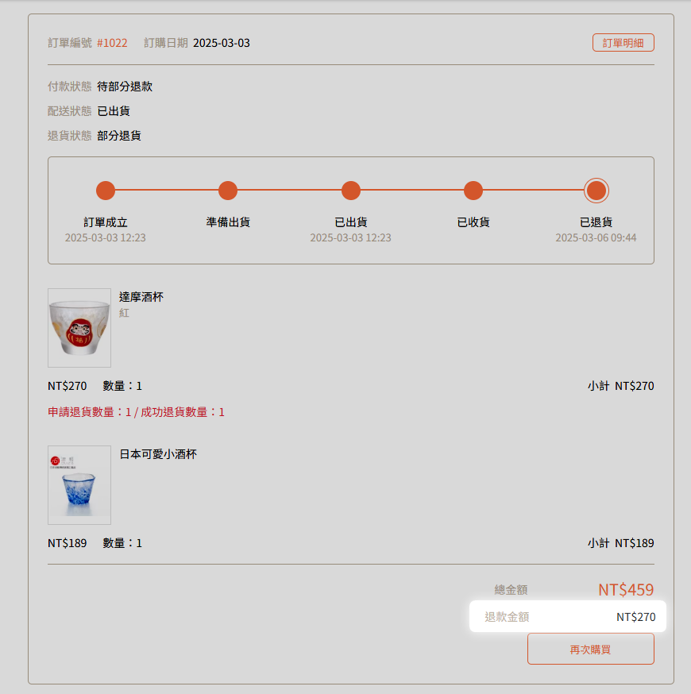

# 會員退貨申請功能

學習如何開啟前台退貨申請功能，包含全單退貨與部分退貨設定、退貨期限控管。
{ .subtitle }

{ .hero-page }

!!! info "適用範圍與限制"
    - **訂單類型**：支援一般訂單與定期定額訂單。
    - **退貨路徑**：超出系統設定的退貨天數後，會員將無法自行申請，需聯繫商家由後台手動處理。

## 任務一：後台功能配置

商家需先於後台開啟開關，會員才能在前台訂單中心看到申請按鈕。

### 1. 開啟申請開關
前往 **金物流 > 結帳頁 & 物流設定**：

=== "全單退貨"

    若僅允許會員 **整筆訂單** 一次性退貨：

    1. 捲動至 **訂單相關設定** 區塊。
    2. 展開 **顧客取消訂單、申請退貨設定** 下拉式選單。
    3. 開啟 **顧客可以申請退貨** 選項。

    

=== "部分退貨"

    若允許會員選擇訂單內 **部分商品** 退貨：

    1. **完成全單退貨設定。**
    2. 捲動至 **物流相關設定** 區塊
    3. 展開 **前台退貨設定** 下拉式選單。
    4. 開啟 **前台部分退貨申請** 選項。

    !!! info "適用版本限制"
        - **方案限制**：前台部分退貨申請功能目前僅限 **企業版** 方案使用。

    

### 2. 設定退貨期限

您可以依據物流方式，設定訂單完成後幾天內開放會員申請：

- **系統託運訂單**：使用 CYBERBIZ 系統產出託運單之訂單，退貨期限請設定於 **10 天** 內。
- **自訂物流訂單**：自行出貨之訂單，退貨期限請設定於 **14 天** 內。

## 任務二：前後台退貨操作

### 1. 退貨申請與受理作業

=== "會員申請流程"

    1. 會員登入官網，前往 **訂單查詢 > 一般訂單**。
    2. 在符合天數規範的訂單旁，點擊 **申請退貨**。
        
    3. 填寫退貨原因與退款資訊。
        
    4. 點擊 **送出申請**。
    5. 申請成功後，會員可於訂單明細中查看 **退貨狀態**。
        

    !!! 部分品項彈性退貨
        若商家開放 **前台部分退貨**，會員可勾選欲退貨的商品項目與數量。

=== "商家受理流程"

    1. 登入 CYBERBIZ 後台，前往 **訂單 > 所有訂單**。
    2. 尋找退貨狀態標記為 **退貨申請** 的訂單。
    3. 點擊進入訂單明細，在 **訂單操作紀錄** 區塊點選 **顧客申請退貨**，即可查看會員填寫的明細與原因。

    !!! 部分品項彈性退貨
        若商家開放 **前台部分退貨**，會員勾選欲退貨的商品項目與數量後，商家可查看會員申請的退貨品項與數量。

     

### 2. 退貨審核與結果確認

=== "會員查看結果"

    商家收到包裹並完成審核後，會員可查看 **退款金額**。

    !!! 部分品項彈性退貨
        若商家開放 **前台部分退貨**，待商家完成退貨審查後，會員可同步查看各品項 **成功退貨數量**。

    
    

=== "商家審核流程"

    - 當訂單為全部退貨訂單，系統會自動退款全部金額。
    - 當訂單為部分退貨訂單，商家可於部分退款時，依商店政策決定退貨數量與退款金額。

    !!! 部分品項彈性退貨
        若商家開放 **前台部分退貨**，可於退貨審查時時，查看會員申請退貨的品項與數量。

## 任務三：退貨狀態通知

=== "通知會員"

    需手動前往 **訊息推播 > EMAIL 通知樣板**，開啟 **訂單申請退貨提醒** 開關。

=== "通知商家"

    系統預設會寄送 EMAIL 給商家。

## 系統運作邏輯說明

### 1. 部分退貨勾選規則

針對不同類型的商品，系統有不同的勾選限制：

| 商品類型 | 勾選規則 |
| :--- | :--- |
| **一般商品** | 可單獨勾選並指定數量 |
| **組合商品** | 視為單一品項，必須整組退回，無法拆開勾選 |
| **加價購/贈品** | 可單獨勾選退貨 |

!!! tip "退貨作業小提醒"
    本功能旨在提供彈性的退貨選擇，但因每間商店的退款規則（如：贈品回收、組合折扣計算）各有不同，建議您於購物須知中明確標註相關規範，並主動與消費者聯繫確認。

### 2. 退款金額計算方式

系統會依據會員選取的商品 **原始價格** 進行加總；商家可於後台實際執行退款時，依據實際情況調整最終退款總額。

- **不包含**：行銷活動（如優惠券、滿額折抵）的自動折讓。

## 常見問題

??? quote "為什麼會員反映在訂單中心找不到 **申請退貨** 按鈕？"
    請檢查以下設定：

    1. 訂單是否已超出後台設定的 **可退貨天數**。
    2. 商家是否已開啟 **顧客可以申請退貨** 開關。

??? quote "會員申請了部分退貨後，我可以修改嗎？"
    可以。商家在後台處理退貨流程時，仍擁有最終的品項與金額修改權限。會員申請內容僅作為意向參考。

## 後續步驟

- :lucide-package-check:{ .lg }   
  [__商家操作退貨流程__](訂單退貨流程.md)       
  了解收到會員申請後，如何在後台執行實際的退貨與退款作業。

- :lucide-mail:{ .lg }     
  [__編輯 EMAIL 通知樣板__](../../communications/郵件樣板自訂)  
  調整退貨通知內容，提供更詳盡的寄回說明。

