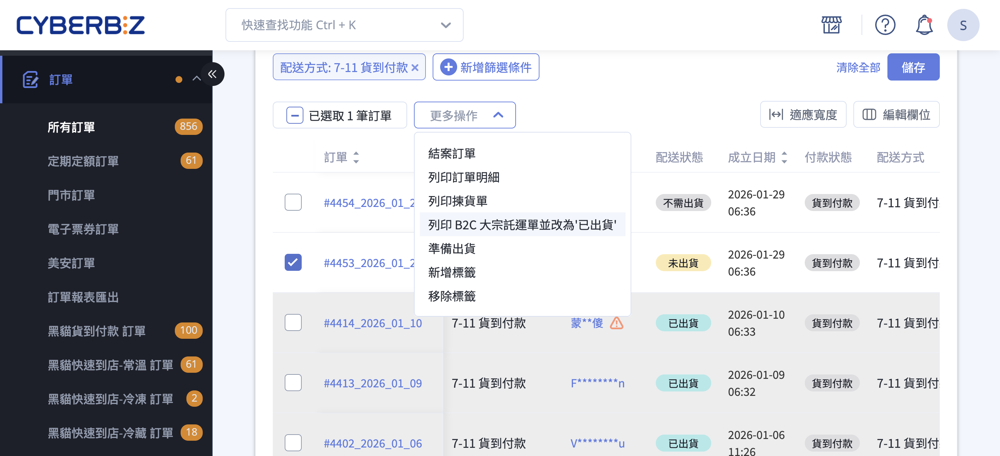
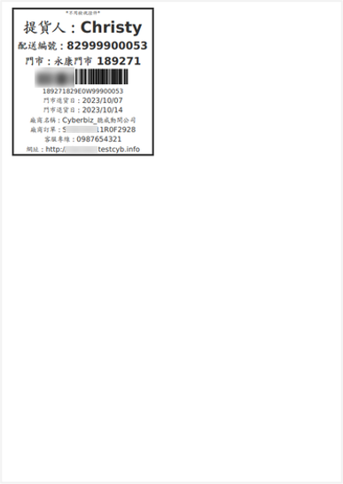
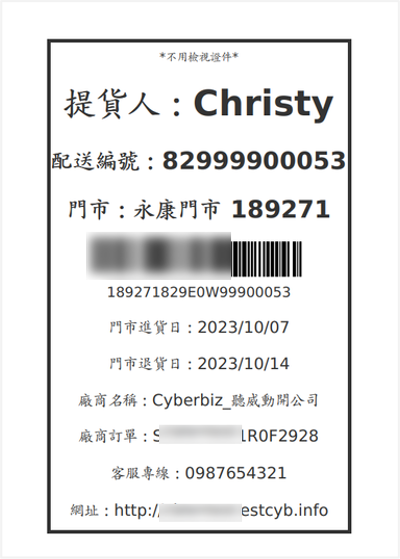

# 熱感列印超商托運單

使用超商熱感列印功能列印 A6 託運單
{ .subtitle }

[:lucide-lock:{ title="適用方案" }](../../resources/conventions#適用方案) | 專業PLUS / 進階PLUS / 高手PLUS / 企業
{ .doc-badge }

{ .hero-page }

## 熱感列印超商托運單說明

超商熱感列印功能可將託運單輸出為 **A6 尺寸（100mm × 150mm ~ 105mm × 150mm）**，適用於 **7-11 與全家** 物流服務，支援商家以熱感應標籤紙直接列印並貼附於包裹上。

系統同時提供兩種格式：

- **一般列印（A4）**
- **熱感列印（A6）**

### 支援物流與系統限制

#### 適用物流

- **7-11**：B2C 大宗寄倉 / C2C 店到店
    
- **全家**：B2C 大宗寄倉 / C2C 店到店
    

#### 系統版本限制

- **B2C 訂單**：可於「舊版」或「新版訂單列表」下載熱感列印託運單。
    
- **C2C 訂單**：僅支援「新版訂單列表」下載熱感列印託運單。
    

#### 其他支援

- **黑貓快速到店**：支援熱感列印，建議使用防水標籤或透明袋覆蓋，避免受潮影響條碼辨識。
    

## 託運單格式差異

/// caption
一般列印-A4
///

/// caption
熱感列印-A6
///

## 操作流程

!!! info "注意事項"
	- **瀏覽器設定提示：** 若無法下載檔案，請確認未啟用「阻擋彈出視窗」。
	- **時效限制（7-11）：** 託運單產出後需於 **5 日內完成交寄**，逾期單號失效。

### 單張列印（單筆訂單）

1. 登入 CYBERBIZ 管理後台，前往 **訂單 > 所有訂單**。
2. 勾選欲出貨的訂單（配送方式需為 7-11 或全家）。
3. 點選右上角 **選擇操作**。
4. 選擇 **熱感列印(A6)**，系統即會產出 A6 尺寸的託運單檔案。    

> 說明：若訂單非超商物流，系統不會顯示熱感列印選項。

### 多筆列印（連續列印）

1. 登入 CYBERBIZ 管理後台，前往 **訂單 > 所有訂單**。
2. 勾選多筆訂單，且 **配送方式必須完全相同**。
3. 點選右上角 **下載 XX 託運單並更改為已出貨**。
4. 下載壓縮檔後，選擇其中 **A6 託運單檔案** 進行列印。
    

> 注意：若同時勾選不同物流商（例如 7-11 + 全家），系統將不顯示下載選項。

---

## 硬體與耗材建議

### 列印設備需求

- 需支援 **獨立 A6 尺寸** 的熱感應標籤機。
    

### 建議機型（僅供參考）

- TSC TTP-225
    
- TSC TTP-323
    

### 標籤規範

- 條碼須 **平貼於包裹寬面**。
    
- 不可凹折、裁切或縮放，避免超商門市無法掃描驗收。
    

## 補印託運單

- 可於訂單列表重新補印託運單，流程與首次列印相同。
    
- 補印時可自由選擇：
    
    - 一般列印（A4）  
    - 熱感列印（A6）
        
- 補印期限：託運單產出後 **5 日內** 可補印。

## 常見問題

??? quote "為什麼找不到「熱感列印（A6）」選項？"  
	通常是因為以下原因之一：

	- 訂單配送方式非 7-11 或全家。 
	- 使用 **C2C 訂單但仍在舊版訂單列表**。 
	- 同時勾選了不同物流商的訂單進行批次操作。  請確認訂單物流類型正確，且 C2C 訂單已切換至新版訂單列表。

??? quote "為什麼批次列印時沒有出現下載託運單選項？"  
	批次列印僅支援 **相同物流商與相同配送方式** 的訂單。若同時勾選不同物流（例如 7-11 + 全家），系統將不顯示下載選項。

??? quote "熱感列印一定要使用 A6 尺寸嗎？"  
	是。超商熱感列印僅支援 **A6（100mm × 150mm ~ 105mm × 150mm）** 規格。若使用非 A6 標籤紙或進行縮放列印，可能導致條碼無法被超商設備辨識。

??? quote "可以用一般印表機列印熱感託運單嗎？"  
	不建議。熱感列印需使用支援 **熱感應標籤紙的專用列印機**。一般雷射或噴墨印表機僅適用於 A4 格式託運單。

??? quote "託運單產出後多久內一定要交寄？"  
	- **7-11：** 託運單需於 **5 日內完成交寄**，逾期單號將失效。  
	- 其他物流依各物流商實際規範為準。

??? quote "託運單遺失或印壞可以補印嗎？"  
	可以。託運單產出後 **5 日內可補印**，且補印時可重新選擇：

	- 一般列印（A4） 
	- 熱感列印（A6）

??? quote "為什麼下載託運單時瀏覽器沒有反應？"  
	可能是瀏覽器啟用了「阻擋彈出視窗」或下載被攔截。

	請確認：  
	
	- 已允許本站彈出視窗  
	- 瀏覽器未封鎖下載行為