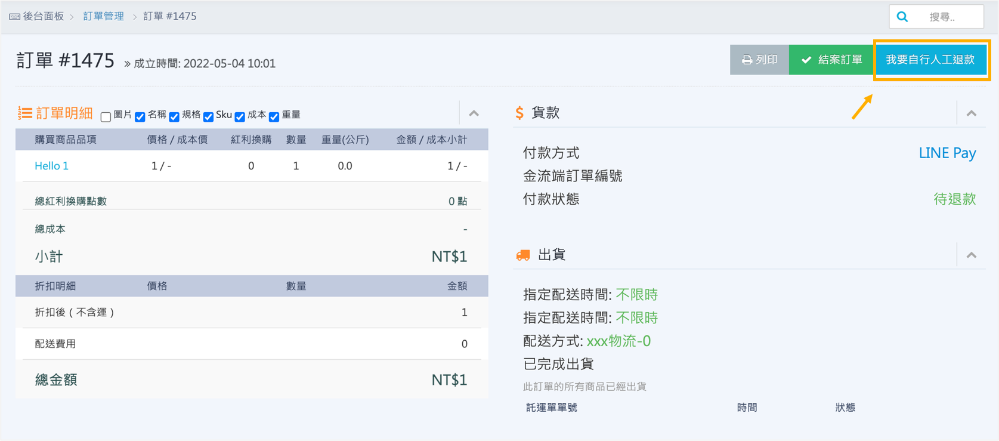

# 第三方支付訂單人工退款
當 LINE Pay、街口支付或 PayPal 訂單因商家金流帳戶餘額不足，導致系統無法完成自動退款時，您可以使用「人工退款」機制。
{ .subtitle }

[:lucide-toggle-right:{ title="適用功能" }](../../resources/conventions#適用功能) | CYBERBIZ PAYMENTS
{ .doc-badge }

!!! tip "應用情境"
    - **餘額不足**：金流代收帳戶內餘額不足以支付退款金額，導致系統自動退款排程重複失敗。
    - **即時退款需求**：顧客急需收到款項，不願等待系統每日深夜（約 23:00）的自動退款排程。
    - **線下結案**：已透過臨櫃匯款或現金方式退還款項，需將後台訂單狀態同步為「已退款」。

## 使用須知

- **自動退款時間**：CYBERBIZ 預設的自動退款時間約為每日晚上 11 點。
- **實際款項處理**：此功能僅用於變更後台訂單狀態。點選按鈕後，商家必須自行透過線下管道（如匯款、轉帳）將款項退還給顧客。
- **操作不可逆**：一旦點選 **我要自行人工退款** 按鈕，系統將 **停止** 該筆訂單的自動退款排程。請務必先與顧客達成共識並確認退款管道後再執行。

---

## 操作流程

1. 登入 CYBERBIZ 管理後台，前往 **訂單 > 所有訂單**。
2. 點擊進入欲退款的訂單明細頁。
3. 點選頁面右上角的 **我要自行人工退款**。
4. 完成線下退款（如匯款）後，回到訂單頁面。
5. 手動將訂單狀態切換為 **已退款**。

## 常見問題

??? quote "為什麼我看不到「我要自行人工退款」按鈕？"
    該按鈕僅出現在 **第三方支付** 且 **已退貨** 的訂單。若訂單使用非支援的支付方式或尚未完成退貨流程，則不會顯示。

??? quote "如果點了按鈕但忘記匯款給顧客怎麼辦？"
    點選按鈕後，系統便不再介入金流處理。請商家務必建立內部核對機制，確保每一筆執行 **人工退款** 的訂單皆有對應的匯款紀錄，以免產生客訴爭議。

