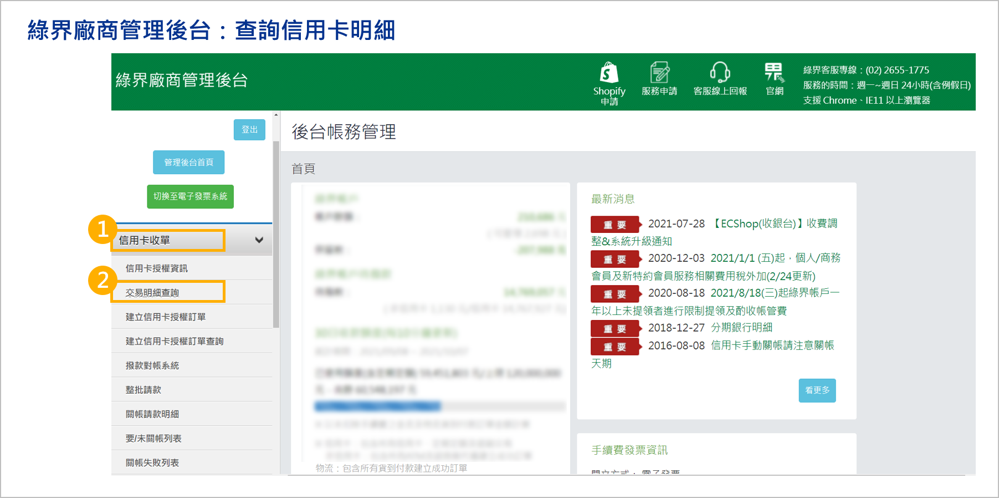
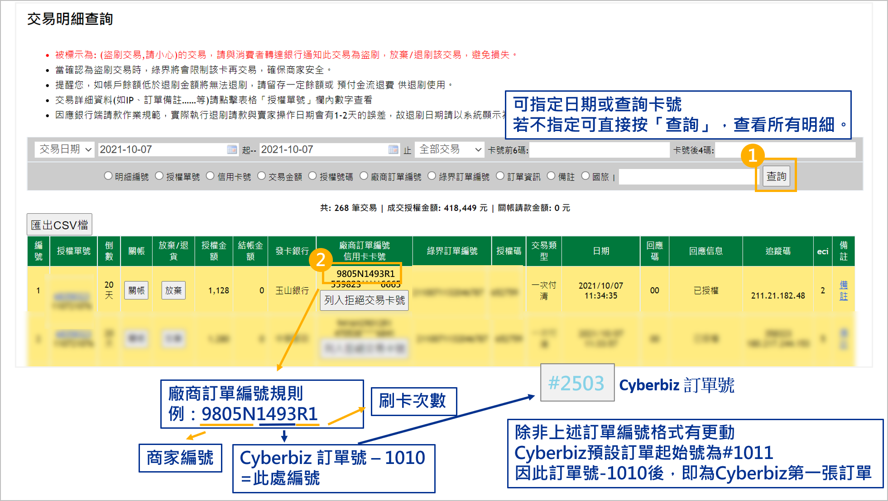
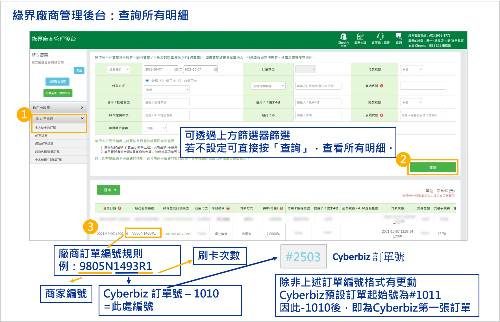
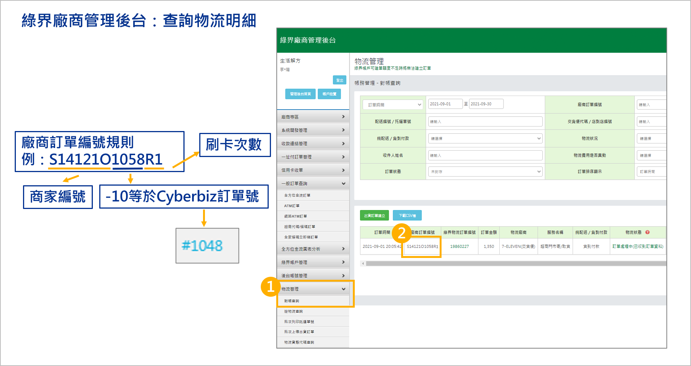

# 綠界後台查詢教學

當商家需要進行深度財務對帳、確認支付失敗原因或核對物流狀態時，除了在 CYBERBIZ 後台查看外，亦可直接登入綠界科技（ECPay）後台獲取交易明細。
{ .subtitle }

[:lucide-tag:{ title="適用方案" }](../../resources/conventions#適用方案) | 專業 / 進階 / 高手
{ .doc-badge }

{ .hero-page }

!!! info "適用版本說明"
    綠界串接服務僅支援 **專業、進階、高手版** 商家，且限 **未啟用 CYBERBIZ PAYMENTS** 之用戶使用；若您已使用 CYBERBIZ PAYMENTS，其系統已內建完整的訂單功能，無需另行串接綠界服務。

## 使用須知

### 編號換算邏輯

由於系統限制，CYBERBIZ 的訂單編號與綠界端的交易編號並非完全一致。若您在綠界後台找不到對應的編號，請參考以下換算規則：

- **編號結構**：`[廠商代碼][N]_[換算後的編號]_R[刷卡次數]`
- **換算公式**：綠界訂單編號尾碼 = **（CYBERBIZ 訂單號碼 - 1010）**
- **刷卡次數**：R1 代表第一次刷卡，若扣款失敗後重新操作，則會變為 R2、R3，以此類推。
- **範例說明**：
    - 預設您的廠商代碼為：9805。
    - CYBERBIZ 訂單編號為 `#2503`。
    - 換算：2503 - 1010 = 1493。
    - 綠界後台顯示的編號為：`9805N1493R1`。

## 任務一：查詢金流交易明細

綠界後台提供兩種查詢方式，分別針對信用卡與全通路金流。

### 1. 查詢信用卡明細

專用於核對信用卡請款、退款狀態。

1. 登入 [綠界管理後台](https://vendor.ecpay.com.tw/)。
2. 前往 **信用卡收單 > 交易明細查詢**。
    
3. 設定查詢區間或輸入卡號。
4. 點擊 **查詢** 即可查看授權狀態、請款日期等詳細資訊。
    

### 2. 查詢全方位金流明細

若您的訂單包含 ATM、網路 ATM、超商代碼等，請使用此方式。

1. 前往 **一般訂單查詢 > 全方位金流訂單**。
2. 設定搜尋條件（如：交易日期、支付方式）。
3. 點擊 **查詢**，系統將列出包含所有支付工具的訂單明細。

## 任務二：查詢物流對帳明細

若您使用綠界提供的超商取貨服務，可透過物流管理介面查詢包裹狀態與代收金額。

1. 登入綠界後台，前往 **物流管理 > 對帳查詢**。
2. 設定對帳日期或輸入訂單編號。
3. 點擊 **查詢**，可確認包裹是否已抵達門市、買家是否已取貨付款，以及預計撥款日期。

## 常見問題

??? quote "為什麼我在綠界後台輸入 CYBERBIZ 的訂單編號搜尋不到？"
    因為搜尋時需使用「特店訂單編號」，請務必先依照本頁上方的換算邏輯進行換算。此外，請確認查詢的「時間區間」是否正確，跨日的訂單需調整搜尋起訖日。

??? quote "綠界後台顯示「授權成功」，但 CYBERBIZ 顯示「付款失敗」？"
    這種情況通常發生在網路傳輸延遲（斷線），導致綠界端的回傳訊號未成功抵達 CYBERBIZ。此時請以綠界後台資料為準。

