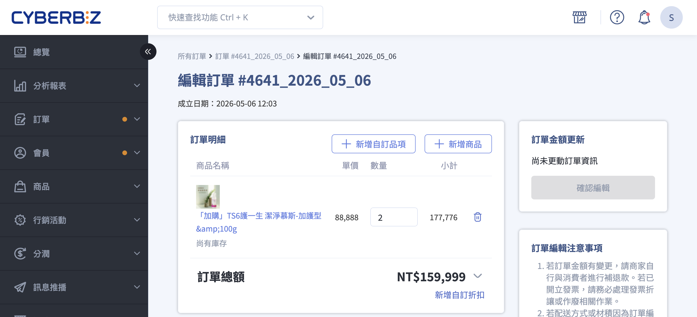
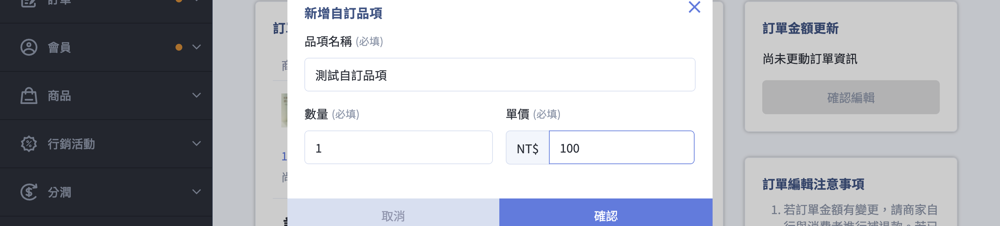
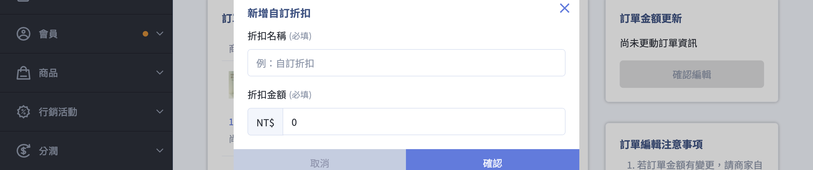
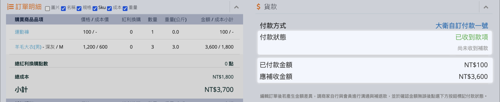
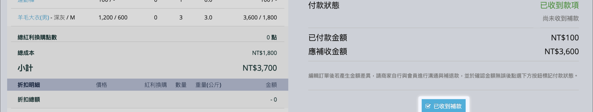
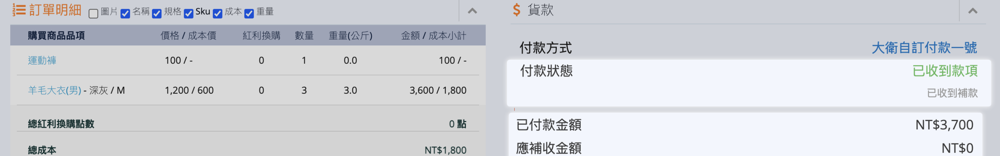

使用編輯訂單功能，包含增減商品、新增自訂品項/折扣、商家備註等操作步驟。
{ .subtitle }

{ .hero-page }

## 編輯訂單說明

**編輯訂單** 功能允許商家在訂單尚未出貨前，直接修改訂單內的商品數量與款式，無須要求顧客取消並重新下單，能有效提升處理效率。

## 功能使用前提與限制

在執行編輯前，請務必確認訂單符合以下條件，否則系統將不支援編輯：

- [x] **訂單狀態**：僅限「進行中」的訂單；「已取消」或「已結案」訂單不可編輯（若為已結案，需先手動重開訂單）。
- [x] **配送狀態**：僅支援「未出貨」或「準備出貨」，且退貨狀態需為「不需退貨」。  
- [x] **ERP 整合**：支援編輯，但請確保 ERP 擷取時間晚於編輯操作，以同步最新資訊。
- [ ] **排除情況**：
    *   **發票串接**：若您的站台由 **CYBERBIZ 代開發票**，恕不支援編輯訂單功能。
    *   **倉庫出貨**：由 **CYBERBIZ 倉儲 (WMS)** 出貨的訂單無法編輯。
    *   **訂單種類**：不支援定期定額、快速到貨、門市取貨、美安導購、第三方分潤及套用「多張折價型」優惠券的訂單。

    !!! note "優惠券套用規則"

        - 不支援：同時使用多張「折價型」優惠券。
        - 支援：同時使用多張「免運券」或「贈品券」之訂單仍可編輯。

- [ ] **商品限制**：組合品、贈品、紅利商城、LINE 團購商品、加價購、電子票券、POS 商品及串倉商品 **無法** 進行編輯或新增。

## 如何操作編輯訂單

### 進入編輯訂單頁 { #edit-order-page }

1.  **進入訂單**：前往後台 **訂單 > 所有訂單**，選擇欲編輯的訂單並點擊「訂單編號」，進入訂單詳情頁。
2.  **啟動編輯**：點擊頁面右上角的 **「編輯訂單」** 按鈕。

    

3.  **執行修改**：在訂單編輯頁中，你可以執行以下操作：

    

    - :lucide-minus-circle:{ .lg .middle }
      [增減或移除商品](#edit-order-adjust-remove){ data-preview }

    - :lucide-plus-circle:{ .lg .middle }
      [新增商品](#edit-order-add-product){ data-preview }

    - :lucide-settings:{ .lg .middle }
      [自訂品項/折扣](#edit-order-custom){ data-preview }

    - :lucide-sticky-note:{ .lg .middle }
      [商家備註](#edit-order-note){ data-preview }

    

---

### 增減或移除商品 { #edit-order-adjust-remove }

在「[編輯訂單頁][edit-order-page]{ data-preview }」中，您可以調整訂單內既有商品的數量，或將商品從訂單中移除。

1. 直接從數量欄位中調整商品數量或點擊刪除 :lucide-trash-2: 將商品移除。
2. 操作完成後點擊「確認編輯」，並在二次彈窗中點選「確認並送出」即可套用變更。

---

### 新增商品 { #edit-order-add-product }

在「[編輯訂單頁][edit-order-page]{ data-preview }」中，您可以將新商品加入至訂單。

1. 點選「新增商品」，從彈窗中搜尋（[搜尋機制][product-filter-backend]{ data-preview }）後勾選點擊 **確認新增** 加入品項（僅限溫層與通路相同的商品）。

    

2. 新增商品會以「已新增」標籤註記，以利辨識區分。

    

3. 操作完成後點擊「確認編輯」，並在二次彈窗中點選「確認並送出」即可套用變更。

---

### 新增自訂品項/折扣 { #edit-order-custom }

在「[編輯訂單頁][edit-order-page]{ data-preview }」中，您可以透過自訂品項或折扣，補收運費或提供額外優惠來調整訂單金額。

=== "自訂品項"

    1. 點選「新增自訂品項」按鈕，開啟設定彈窗。
    2. 填寫以下必填欄位：
        - **品項名稱**：輸入自訂品項名稱（例：補收運費、包裝費）。
        - **數量**：設定品項數量（預設為 1）。
        - **單價**：輸入品項單價（NT$）。
    3. 點選「確認」將品項加入訂單。
    4. 操作完成後點擊「確認編輯」，並在二次彈窗中點選「確認並送出」即可套用變更。

    

=== "自訂折扣"

    1. 點選「新增自訂折扣」連結，開啟設定彈窗。
    2. 填寫以下必填欄位：
        - **折扣名稱**：輸入自訂折扣名稱（例：會員優惠、清倉折扣）。
        - **折扣金額**：輸入折扣金額（NT$）。
    3. 點選「確認」將折扣套用至訂單。
    4. 操作完成後點擊「確認編輯」，並在二次彈窗中點選「確認並送出」即可套用變更。

    

---

### 商家備註 {#edit-order-note}

在「[編輯訂單頁][edit-order-page]{ data-preview }」中，您可以新增內部備註（最多 1000 字），供商家作業參考。

1. 於編輯頁面下方的「商家備註」文字框中輸入備註內容。
2. 需同時修改至少一項商品內容（新增、刪除或調整數量）。
3. 操作完成後點擊「確認編輯」，並在二次彈窗中點選「確認並送出」即可套用變更。

!!! warning "重要限制"
    編輯訂單模式 **不支援單獨儲存備註異動**。僅修改備註請於「訂單明細頁」操作；編輯模式須伴隨商品異動方可儲存。

## 金額計算與差額處理 { #edit-order-payment-adjsutment }

編輯後的金額異動邏輯如下：

* **計價規則**：原訂單商品保留下單時售價；新加入商品則以編輯當下之最新售價計算。
* **行銷活動**：變更數量或移除商品時，系統 **不會重新計算** 全館折扣或滿額優惠。

### 付款與差額處理 {: #handling-methods }

| 付款類型 | 系統收款金額 | 差額處理說明 |
| :--- | :--- | :--- |
| **貨到付款** | 編輯後金額 | 系統自動以新金額收取。 |
| **非貨到付款** | **原始金額** | 不論是否已付款，系統連結皆維持原價。商家須與顧客協調自行補退款與[追蹤處理][非貨到付款訂單差額處理]{ data-preview }。 |

!!! warning "重要限制：退款與發票"
    * **退款限制**：若編輯後金額有變動，系統將 **不支援自動退款** 功能。請於取消訂單或退貨後，自行線下退款並手動將狀態改為「已退款」。
    * **發票作業**：商家需依實際異動，自行選擇開立折讓單或重新開發票。
    * **對帳資訊**：有啟用 CYBERBIZ PAYMENTS 商家，原訂單金額入帳流程照舊，可於對帳單中查閱編輯前後的金額差額。

---

### 非貨到付款訂單差額處理

若「非貨到付款」訂單編輯後產生金額變動，系統連結不會自動更新金額。商家需與顧客協調完成線下補退款後，手動於後台更新狀態。

1. **核對金額狀態**：前往訂單詳情頁的「付款狀態」欄位，確認以下資訊：
    - **已付款金額**：顧客原先支付的總額。
    - **應補收 / 應退還金額**：編輯訂單後產生的差額數值。

    

2. **執行註記作業**：待您與顧客私下完成補款或退款作業後，點擊對應按鈕進行註記：
    - 若為補收：點選 「已收到補款」。
    - 若為退款：點選 「已退還款項」。

    

3. **確認更新結果**：點選後，「付款狀態」將更新為 已收到補款 或 已退還款項，即代表該筆訂單的差額處理流程已完結。

    

## 常見問題

??? quote "為什麼我移除某個商品款式後，訂單的折扣金額會變？"
	當您將「整個商品款式」從訂單中移除時，原本攤提在該商品上的折扣金額也會一併被移除，因此整體折扣金額會減少。

	但若您僅「調整商品數量」（未完全移除該款式），則原本攤提的折扣金額不會改變。

??? quote "編輯訂單時，商品庫存會即時更新嗎？"
	會的。系統會在您送出編輯前進行一次即時庫存檢查，並更新為目前最新的庫存數量。

??? quote "若商品庫存不足，系統會如何處理既有商品與新增商品？"
	系統會依商品來源採取不同處理方式：

	1. **既有商品：**
	   原訂單中的商品數量會被保留。若您增加數量超過可用庫存，系統會顯示「超過庫存上限」提示，並自動調整回原訂單數量。

	2. **新增商品：**
	   若商品已售完或超過庫存上限，系統會顯示提示，您需手動移除或調整至可用數量。系統不會自動保留庫存。

??? quote "為什麼編輯後的訂單會出現在不同期的對帳單中？"
	若您在訂單成立後進行編輯，且產生金額差額，而該編輯時間已超過原訂單的入帳週期，則差額會於後續對帳期入帳。

	因此，您可能會在不同期的對帳單中看到「原訂單金額」與「差額金額」。

??? quote "編輯訂單後，系統會重新套用優惠活動嗎？"
	不會。編輯訂單時，系統不會重新計算或套用任何新的優惠活動（如滿額折扣、會員優惠、紅利點數等）。

	僅在「移除已套用折扣的商品」時，對應的折扣金額才會一併移除。

??? quote "編輯訂單後，系統會自動通知消費者嗎？"
	不會。系統不會寄送任何 Email 通知給消費者。

	若訂單內容有異動，建議您主動聯繫顧客說明變更內容，以避免爭議。

??? quote "若編輯後訂單材積改變，系統會自動調整物流設定嗎？"
	不會。系統不會重新計算或調整物流配送設定。

	您需自行處理出貨作業，例如：

	- 於 EC 後台重新加印托運單
	- 或至物流業者後台進行相關操作

??? quote "為什麼折扣項目加總後，與訂單顯示的折扣總金額不同？"
	當折扣金額超過商品小計時（例如商品 100 元，但折扣為 120 元），系統仍會顯示各折扣項目的原始金額。

	但訂單總額會被限制為不低於 0 元，以避免出現負數金額。

??? quote "可以只修改商家備註，而不變更商品內容嗎？"
	不行。使用「編輯訂單」功能時，必須至少包含一項商品相關異動（如新增商品、調整數量或移除商品）才能儲存。

	若您僅需修改「商家備註」，請直接於「訂單詳情頁」進行操作。

