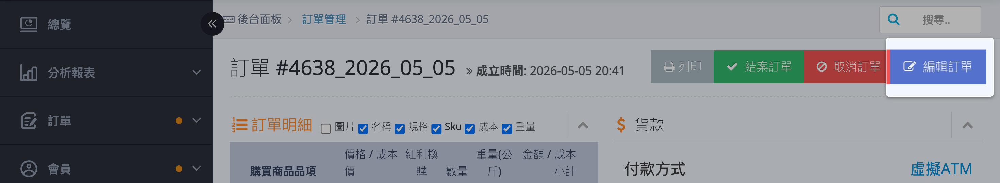
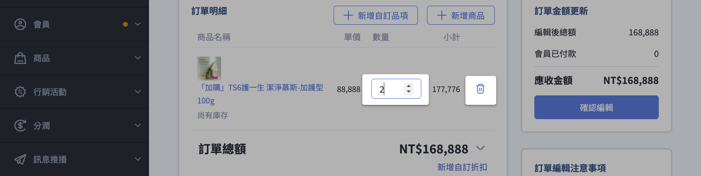
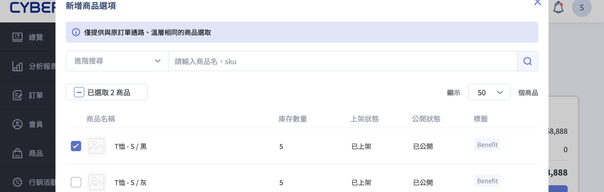
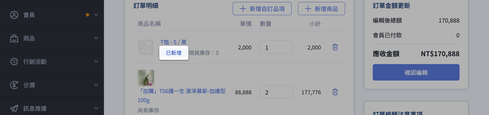

{ .subtitle }

{ .doc-badge }

{ .hero-page }

## 編輯訂單說明

**編輯訂單** 功能允許商家在訂單尚未出貨前，直接修改訂單內的商品數量與款式，無須要求顧客取消並重新下單，能有效提升處理效率。

## 功能使用前提與限制

在執行編輯前，請務必確認訂單符合以下條件，否則系統將不支援編輯：

- [x] **訂單狀態**：僅限「進行中」的訂單；「已取消」或「已結案」訂單不可編輯（若為已結案，需先手動重開訂單）。
- [x] **配送狀態**：僅支援「未出貨」或「準備出貨」，且退貨狀態需為「不需退貨」。  
- [x] **ERP 整合**：支援編輯，但請確保 ERP 擷取時間晚於編輯操作，以同步最新資訊。
- [ ] **排除情況**：
    *   **發票串接**：若您的站台由 **CYBERBIZ 代開發票**，恕不支援編輯訂單功能。
    *   **倉庫出貨**：由 **CYBERBIZ 倉儲 (WMS)** 出貨的訂單無法編輯。
    *   **訂單種類**：不支援定期定額、快速到貨、門市取貨、美安導購、第三方分潤及套用「多張折價型」優惠券的訂單。

    !!! note "優惠券套用規則"

        - 不支援：同時使用多張「折價型」優惠券。
        - 支援：同時使用多張「免運券」或「贈品券」之訂單仍可編輯。

- [ ] **商品限制**：組合品、贈品、紅利商城、LINE 團購商品、加價購、電子票券、POS 商品及串倉商品 **無法** 進行編輯或新增。

## 如何操作編輯訂單

1.  **進入訂單**：前往後台 **訂單 > 所有訂單**，選擇欲編輯的訂單並點擊「訂單編號」，進入訂單詳情頁。
2.  **啟動編輯**：點擊頁面右上角的 **「編輯訂單」** 按鈕。

    

3.  **執行修改**：在訂單編輯頁中，你可以執行以下操作：

    

    - :lucide-minus-circle:{ .lg .middle }
      [增減或移除商品](#edit-order-adjust-remove){ data-preview }

    - :lucide-plus-circle:{ .lg .middle }
      [新增商品](#edit-order-add-product){ data-preview }

    - :lucide-settings:{ .lg .middle }
      [自訂品項/折扣](#edit-order-custom){ data-preview }

    

4.  **確認儲存**：操作完成後點擊「確認編輯」，並在二次彈窗中點選「確認並送出」即可完成。

---
    
### 增減或移除商品 {#edit-order-adjust-remove}

可直接調整原有商品的數量或將其移除。

---

### 新增商品 {#edit-order-add-product}

點選「新增商品」，從彈窗中搜尋（[搜尋機制][product-filter-backend]{ data-preview }）並加入品項（僅限溫層與通路相同的商品）。

??? tip "已新增商品標籤"
    新增商品會以「已新增」標籤註記，以利辨識區分。

    

---

### 自訂品項/折扣 {#edit-order-custom}

若需補收運費或提供額外優惠，可點選「新增自訂品項」或「新增自訂折扣」手動輸入名稱與金額。

## 金額計算與差額處理

編輯後的金額異動邏輯如下：

*   **計價規則**：原訂單商品保留下單時售價；新加入商品則以編輯當下的最新售價計算。
*   **行銷活動**：變更數量或移除商品時，系統 **不會重新計算** 全館折扣或滿額優惠。
*   **付款處理**：
    *   **貨到付款**：系統會自動以「編輯後」的總額收款。
    *   **非貨到付款 (刷卡/匯款)**：系統收款連結 **仍會維持原始金額**。若產生差額，商家需與顧客協調自行補退款。完成後可在後台勾選「已收到補款」或「已退還款項」做註記。

### 四、 常見問題提醒
*   **庫存檢查**：送出編輯前，系統會進行即時庫存檢查。若商品已被買走或庫存不足，系統會顯示提示並自動調整回可用數量。
*   **顧客通知**：編輯完成後，系統 **不會主動發送 Email 通知** 給消費者，商家需自行連繫顧客告知異動內容。
*   **商家備註**：不可單獨進入「編輯訂單」畫面只修改備註，必須伴隨至少一項商品內容的異動才能儲存。若僅需修改備註，請直接在「訂單明細頁」操作即可。

## 後續操作

- :lucide-import:{ .lg }
  [____]()
  。

- :lucide-ban:{ .lg }
  [____]()
  。

## 常見問題

??? quote ""

