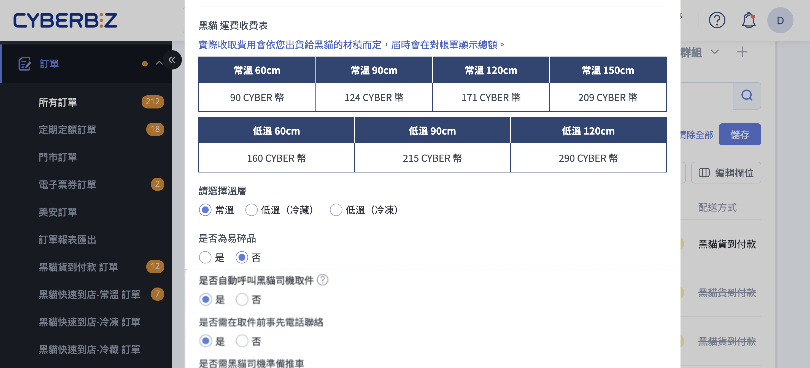
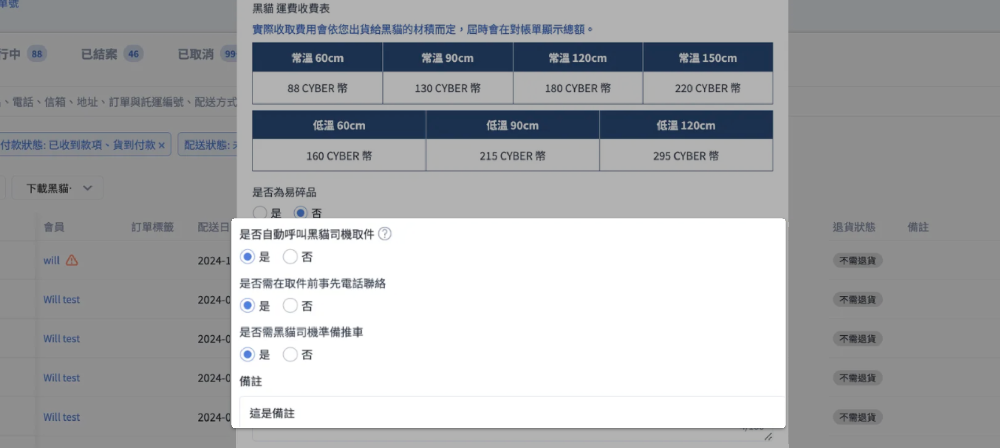

在批次下載黑貓託運單時，同步自動通知黑貓派車取件，省去人工聯絡時間。
{ .subtitle }

[:lucide-tag:{ title="適用方案" }](../../../resources/conventions#適用方案) | 專業 PLUS / 進階 PLUS / 高手 PLUS / 企業
{ .doc-badge }

{ .hero-page }

## 自動呼叫黑貓司機說明 { #intro-tcat-auto-call-driver }

過去商家在後台列印完黑貓託運單後，須自行致電黑貓客服安排司機收件。「自動呼叫司機取件」功能讓商家在下載黑貓託運單時，**同步** 勾選由系統自動通知黑貓派車前往指定地點收件，省去人工聯絡的時間。

此功能僅出現在「下載黑貓託運單」彈窗的下半部，搭配 [批次出貨流程][tcat-home-shipping-label-batch]{ data-preview } 使用。

## 使用前提與限制 { #prerequisites-tact-auto-call-driver }

### 開通條件 { #prerequisites-tcat-auto-call-driver-dependencies }

| 條件 | 說明 |
| :-- | :-- |
| 後台版型 | 必須使用 **新版訂單列表**，舊版訂單列表不支援此功能 |
| 加值功能 | 「自動呼叫黑貓司機」屬加值功能，請聯繫 **CYBERBIZ 客服** 申請開通 |
| 寄件人資訊 | 必須先至 **[黑貓寄取件設定頁][]{ data-preview }**(金物流 > 黑貓託運單 > 黑貓設定)完整填寫寄件人姓名、地址與聯絡電話，系統才會接受呼叫請求 |

!!! info "若彈窗下半部未出現「是否自動呼叫黑貓司機取件」的選項區塊，代表此商店尚未開通該加值功能。"

---

### 適用物流 { #tcat-auto-call-driver-applicable-logistics }

下載託運單彈窗會根據訂單使用的黑貓物流類型自動套用，以下任一物流皆可在下載時搭配呼叫司機：

| 物流類型 | 說明 |
| :-- | :-- |
| 黑貓宅配(常溫 / 冷藏 / 冷凍) | 包含貨到付款與貨到不付款 |
| 黑貓快速到店(常溫 / 冷藏 / 冷凍) | 顧客至超商門市取貨 |

---

### 訂單條件 { #tcat-auto-call-driver-order-conditions }

被勾選的訂單必須符合「能下載黑貓託運單」的標準條件，系統才會一併產生託運單並向黑貓送出取件請求。常見需符合的狀態如下：

* 訂單狀態為 **進行中**
* 配送狀態為 **未出貨** 或 **準備出貨**
* 付款狀態為 **已收到款項** 或屬於 **貨到付款** 訂單
* 訂單中至少有一項使用黑貓相關物流

若批次中混入不符合條件的訂單，將無法產生託運單，請先回到訂單列表逐筆確認。

---

## 操作步驟教學 { #operate-tcat-auto-call-driver }

1. **進入訂單列表**：登入 CYBERBIZ 管理後台，前往「**訂單 > 所有訂單**」(新版訂單列表)。
2. **勾選訂單**：在訂單列表中勾選欲一次出貨的黑貓物流訂單，確認皆符合上方訂單條件。
3. **開啟下載彈窗**：點擊列表右上角的 **更多操作**，從下拉選單選擇 **下載黑貓託運單並更改為已出貨**。
4. **確認託運單設定**：在 **下載黑貓託運單** 彈窗中，依序檢查溫層(常溫 / 冷藏 / 冷凍)、是否為易碎品、寄件地址等預設值。
5. **設定自動呼叫司機**：捲動至 **是否自動呼叫黑貓司機取件** 區塊，在「是 / 否」中選擇 **是**[^1]。
6. **回答取件細節**：選「是」後會展開以下三個欄位：
    * **是否需在取件前事先電話聯絡**：選「是」時，司機抵達前會撥打「[黑貓寄取件設定頁][configure-ezcat-shipping-note-sender-setup]{ data-preview }」中填寫的聯絡電話與您確認。
    * **是否需黑貓司機準備推車**：若包裹數量較多，可請司機自備推車。
    * **備註**：可填寫特殊收件指示(例如門禁、樓層)，上限 **100 字**。

    

7. **確認同意條款並送出**：勾選頁面下方的物流契約同意項目，點擊 **確認**。系統會同步列印託運單 PDF、將該批訂單貨態改為「已出貨」，並向黑貓送出司機取件通知（[如何避免重複呼叫][tcat-auto-call-driver-multiple-calls]{ data-preview }）。

!!! tip "已記住上次設定"
    彈窗會自動記住您前一次勾選的呼叫司機設定(是否呼叫、是否電聯、是否需推車)，下次開啟時直接套用，減少重複操作。

[^1]: 超過 **每日 16:30** 後「是」選項會自動變為無法選擇。請務必在時限前完成設定，詳見 [呼叫截止時間](#tcat-auto-call-driver-deadtime)。

---

## 取件時間與重要提醒 { #tcat-auto-call-driver-pickup-timing }

### 呼叫截止時間 { #tcat-auto-call-driver-deadtime }

* 系統會於 **每日 16:30** 截止當日的自動呼叫司機請求。
* **超過 16:30** 後開啟彈窗，「是否自動呼叫黑貓司機取件」的「是」選項會自動 **變為無法選擇**，此時若需當日或隔日取件，請改為直接聯繫黑貓客服安排。

!!! warning "系統不會將超過截止時間的請求自動延至次日。請務必在 16:30 前完成設定，避免漏單。"

---

### 避免重複呼叫 { #tcat-auto-call-driver-multiple-calls }

* 同一天若會分批多次列印黑貓託運單，**請於最後一批列印時才勾選自動呼叫司機**。
* 過早呼叫可能導致司機抵達時貨件尚未包裝完成，或產生重複派車造成物流端困擾。

---

### 確認門市資訊已填寫

* 系統會以 **黑貓寄取件設定頁** 中的寄件人姓名、地址、電話送出呼叫請求。
* 若上述任一欄位為空，呼叫請求會被拒絕，但託運單仍會產生。

## 後續操作 { #after-action }

- :lucide-search:{ .lg }  
  [__追蹤出貨狀態__][tcat-home-verify-status]{ data-preview }  
  回到訂單列表查看該批訂單貨態是否已標記為「已出貨」，並核對託運單號是否寫入訂單。

- :lucide-printer:{ .lg }  
  __印出託運單貼紙__
  使用黑貓三聯空白託運單貼紙列印，若沒有請先致電黑貓領取。

- :lucide-package:{ .lg }  
  __送出包裹__  
  依約定時間將已貼好託運單的包裹備妥於指定地點，等候司機收件。

---

## 常見問題 { #faq-tcat-auto-call-driver }

??? quote "彈窗中找不到「是否自動呼叫黑貓司機取件」這個區塊?"
    #### 彈窗中找不到「是否自動呼叫黑貓司機取件」這個區塊? { #faq-tcat-auto-call-driver-cannot-find-option } { .hidden-header }
    此功能為加值申請項目。請確認：

    1. 您使用的是 **新版訂單列表**。
    2. 商店已向 CYBERBIZ 客服申請開通「**自動呼叫黑貓司機**」。

??? quote "已勾選「是」並送出，但司機沒有來?"
    #### 已勾選「是」並送出，但司機沒有來? { #faq-tcat-auto-call-driver-driver-not-arrive } { .hidden-header }
    請依序檢查：

    1. 是否在 **16:30 [截止時間][tcat-auto-call-driver-deadtime]{ data-preview } 前** 完成送出。
    2. [黑貓寄取件設定頁][]{ data-preview } 中的姓名、地址、電話是否完整填寫。
    3. 若仍無法處理，請聯繫黑貓客服 **02-412-8888** 直接安排。

??? quote "可以設定呼叫司機在指定時間取件嗎?"
    #### 可以設定呼叫司機在指定時間取件嗎? { #faq-tcat-auto-call-driver-schedule-pickup-time } { .hidden-header }
    系統不開放指定取件時間。取件時段由黑貓物流端依當日排程安排，商家無法在後台指定。

??? quote "如果同一天要多次列印託運單，要怎麼處理?"
    #### 如果同一天要多次列印託運單，要怎麼處理? { #faq-tcat-auto-call-driver-multiple-batches } { .hidden-header }
    請僅在 **最後一次列印** 時勾選 **是否自動呼叫黑貓司機取件 = 是**，前幾次列印選「否」即可。如此可避免司機提早抵達或重複派車。

??? quote "勾選「自動呼叫司機」會額外收費嗎?"
    #### 勾選「自動呼叫司機」會額外收費嗎? { #faq-tcat-auto-call-driver-extra-fee } { .hidden-header }
    本功能本身不額外收取系統使用費，但實際物流費用(含黑貓繁盛期服務費、低溫費用差額等)仍依黑貓物流規定計算。

