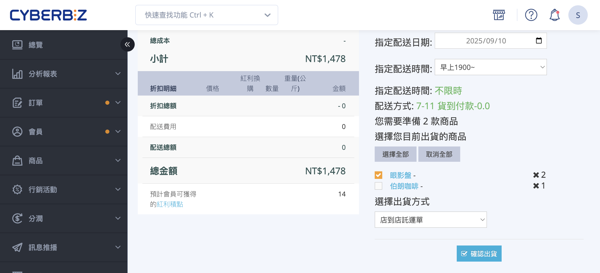
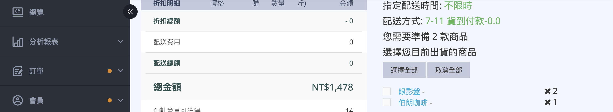
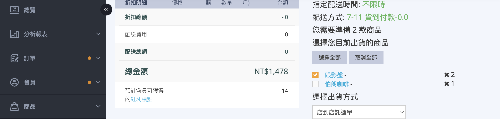
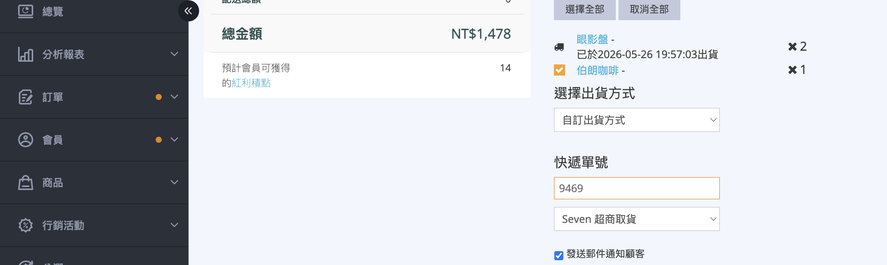

處理超商訂單（7-11、全家、萊爾富）的部分出貨流程，包含第一筆超商系統出貨與剩餘商品自訂物流出貨的完整操作步驟。
{ .subtitle }

{ .hero-page }

## 超商物流部分出貨說明

當顧客選擇 **7-11**、**全家**、**萊爾富**
等超商取貨，但訂單中有商品需要分批寄送（例如有部分商品需要等補貨、商品體積超過超商限制、需臨時改寄宅配等）時，可使用「超商部分出貨」功能，分批將商品寄出。


由於超商系統一張訂單只能對應一組託運單號，**第一筆貨件透過超商系統出貨後，剩餘品項必須改用「自訂出貨方式」（自行填入物流商與快遞單號）寄送**。本頁說明完整流程、限制與注意事項。


## 功能介紹 { #intro-cvs-partial-shipment }

超商部分出貨適用於 **訂單來源為超商取貨（7-11、全家、萊爾富）** 的訂單。流程上會分成兩個階段：

- **第一筆貨件**：透過原本的超商配送系統索取託運單，由超商物流網寄送。
- **剩餘貨件**：受限於超商每筆訂單只支援一組單號，必須改用 **自訂出貨方式**，由商家自行洽談的物流寄出（例如黑貓宅急便、新竹物流等）。

!!! info "提示"
    部分出貨在系統內並非獨立功能模組，而是在 **訂單詳情頁的出貨區塊** 內，透過勾選「部分商品 + 確認出貨」自然完成。所有方案皆內建此功能，無需額外開通。

## 使用前提與限制 { #prerequisites-cvs-partial-shipment }

### 支援的超商物流 { #prerequisites-cvs-partial-shipment-supported }

以下超商物流支援部分出貨。詳細對應請見 [超商物流部分出貨支援對照表](references/超商物流部分出貨支援對照表.md)。

- [x] **7-11**：交貨便、超商取貨（含貨到付款）
- [x] **全家**：店到店、超商取貨（含貨到付款）
- [x] **萊爾富**：店到店、超商取貨、冷凍取貨（含貨到付款）

??? info "黑貓快速到店適用不同流程"
      **黑貓快速到店(常溫／冷藏／冷凍)** 同樣支援部分出貨，但 **不需要第二筆改用自訂出貨**。
      從訂單詳情頁勾選部分商品 > 選「黑貓快速到店託運單」> 確認出貨，系統會自動向黑貓索取新的託運單(同一張訂單最多 8 張)。下次回來再對剩餘商品操作即可，流程跟一般宅配的部分出貨一致。

!!! warning "不支援部分出貨的物流"
    以下物流類型 **不支援** 部分出貨，必須一次將全部商品出貨：

    - **全家冷鏈**：系統會跳出「全家冷鏈不支援部分出貨，請勾選全部商品！」提示。
    - **全家冷凍店到店**：同上提示。

---

### 訂單狀態前提 { #prerequisites-cvs-partial-shipment-status }

訂單必須處於以下狀態之一，才會出現出貨勾選與「確認出貨」按鈕：

- [x] **未出貨**：訂單尚未進行任何出貨動作。
- [x] **準備出貨**：訂單已完成付款／確認，等待寄出。
- [x] **部分出貨**：訂單中已有部分商品出貨，剩餘商品等待寄送。

## 操作步驟 { #operate-cvs-partial-shipment }

### 進入訂單詳情頁 { #operate-cvs-partial-shipment-enter }

1. 進入後台 **「訂單」>「所有訂單」** 列表。
2. 找到該筆超商取貨訂單，點選 **訂單編號** 進入訂單詳情頁。
3. 頁面右下方會顯示 **「選擇您目前出貨的商品」** 區塊，列出本筆訂單所有待出貨商品。

---

### 第一筆貨件：超商系統出貨 { #operate-cvs-partial-shipment-first }

1. 在商品清單中 **勾選本次要先寄出的商品**[^select-all]。
2. 勾選後，下方會展開 **「選擇出貨方式」** 區塊，下拉選單顯示對應的超商託運單選項，例如「店到店託運單」。
3. 確認下拉選單選擇為 **該超商的託運單**。
4. 點擊 **「確認出貨」** 按鈕，系統會跳出確認對話框「確定出貨已勾選的 N 項商品？」，按 **「確認」** 後：
    * 系統向超商索取配送單號並產生託運單 PDF
    * 訂單狀態依出貨商品數量自動轉為 **「已出貨」** 或 **「部分出貨」**[^status-rule]
    * 已出貨的商品旁會顯示 **「已於 {日期時間} 出貨」**
5. 取得託運單後，將商品交給對應的超商物流寄出。

[^select-all]: 點擊區塊右上方的 **「選擇全部」** 可一次勾選所有商品，**「取消全部」** 則取消勾選。
[^status-rule]: 若勾選並出貨的數量等於全部商品，狀態為「已出貨」；若仍有未出貨商品，狀態為「部分出貨」。

---

### 剩餘貨件：自訂出貨方式 { #operate-cvs-partial-shipment-rest }

完成第一筆貨件後，再次進入該訂單詳情頁進行剩餘商品出貨。**此時超商選項會自動隱藏**，僅剩 **「自訂出貨方式」** 可選[^why-custom]。

1. 重新進入訂單詳情頁，於商品清單 **勾選剩餘要出貨的商品**。
2. **「選擇出貨方式」** 下拉選單會自動切換為 **「自訂出貨方式」**。
3. 在展開的欄位中填入：
    * **快遞單號**：實際委託物流商給的單號。
    * **物流商**：從下拉選單選擇對應的物流商（例如黑貓宅急便、新竹物流等）。
4. 依需求勾選 **「發送郵件通知顧客」**。
5. 點擊 **「確認出貨」** 完成剩餘商品出貨。商品旁同樣會顯示 **「已於 {日期時間} 出貨」**，整筆訂單轉為 **「已出貨」**。

[^why-custom]: 超商配送 API 每筆訂單只支援一組託運單號，第一筆貨件已佔用該單號後，系統會自動隱藏超商選項，僅保留「自訂出貨方式」供商家手動填入第二段物流資訊。

## 重要規範與限制 { #specs-cvs-partial-shipment }

### 貨到付款（COD）的收款規則 { #specs-cvs-partial-shipment-cod }

若訂單為 **超商貨到付款**，請特別注意：

- 顧客 **領取第一批超商包裹時，需一次支付整筆訂單的全額款項**，並非僅支付該批商品的金額。
- 第二批以自訂物流寄出時，無法再透過超商代收款項。
- **強烈建議在出貨前先聯繫顧客**，說明分批出貨與一次性收款的流程，避免顧客拒收或退貨爭議。

---

### 配送追蹤 { #specs-cvs-partial-shipment-tracking }

顧客可於官網會員專區的 **「訂單查詢/訂單明細」>「配送資訊」** 看到 **兩組單號**，分別追蹤超商與自訂物流的配送進度。

---

### 退貨流程 { #specs-cvs-partial-shipment-return }

部分出貨完成後若顧客需退貨：

- **無法透過超商系統部分退貨**：超商系統的退貨流程是針對整筆訂單，不接受拆單退貨。
- 顧客需聯繫商家，由商家依實際情況與顧客協調退款金額、退貨方式（例如：請顧客自行寄回、商家派物流取件等）。

## 後續操作 { #next-steps-cvs-partial-shipment }

- :lucide-package:{ .lg }  
  [__自訂物流出貨設定__](../orders/如何使用自訂物流出貨.md){ title="如何使用自訂物流出貨" }  
  設定自訂物流商列表與快遞單號欄位，方便第二筆貨件出貨時快速選擇。

- :lucide-truck:{ .lg }  
  [__託運單列印與重印__](../payments-and-logistics/補印與加印託運單.md){ title="補印與加印託運單" }  
  若需重新列印第一筆超商託運單，請參考此頁說明。

<!-- - :lucide-receipt:{ .lg }  
  [__貨到付款認款規則__](./cod-settlement.md)  
  了解 COD 訂單的認款時機與對帳邏輯。 -->

## 常見問題 { #faq-cvs-partial-shipment }

??? quote "為什麼第二次出貨找不到超商配送選項？"
    { #faq-cvs-partial-shipment-no-cvs-option }
    超商配送 API 每筆訂單只支援一組託運單號，第一筆貨件已索取過單號後，系統會自動隱藏超商選項。此為 **超商物流的限制**，並非系統故障。剩餘商品請改用「自訂出貨方式」搭配宅配等物流寄出。

??? quote "全家冷鏈訂單為什麼無法部分出貨？"
    { #faq-cvs-partial-shipment-family-cold }
    **全家冷鏈** 與 **全家冷凍店到店** 因冷鏈物流的特性，系統限制必須一次將全部商品出貨。若勾選部分商品按「確認出貨」，系統會跳出提示「全家冷鏈不支援部分出貨，請勾選全部商品！」並擋下操作。

??? quote "顧客貨到付款，第一批送達時是付全額還是部分？"
    { #faq-cvs-partial-shipment-cod-amount }
    顧客 **領取第一批超商包裹時就需支付整筆訂單的全額款項**，不會只收第一批的金額。建議出貨前先與顧客聯繫達成共識，避免顧客誤以為是分批付款而拒收。

??? quote "兩批貨件的單號顧客在哪裡查得到？"
    { #faq-cvs-partial-shipment-tracking-where }
    顧客可登入官網會員中心，在 **「訂單查詢」>「訂單明細」>「配送資訊」** 頁面看到兩組單號，分別點擊即可查詢對應物流商的配送進度。

??? quote "顧客領取第一批後不要第二批，怎麼處理？"
    { #faq-cvs-partial-shipment-partial-refund }
    請依照一般退貨流程處理：

    - 與顧客確認要退的商品與金額。
    - 由商家在後台對該訂單執行退款動作。
    - 第二批已寄出可請顧客拒收或自行寄回。

    無法透過超商系統做單一商品的退回，需由商家自行協調。

??? quote "黑貓快速到店部分出貨與一般超商部分出貨流程有什麼不同？"
    { #faq-cvs-partial-shipment-blackcat-diff }

    主要差異在於 **第二筆貨件的出貨方式**：

    - **一般超商（7-11／全家／萊爾富）**：第一筆透過超商系統出貨後，剩餘商品必須改用 **自訂出貨方式**，自行填入物流商與快遞單號。
    - **黑貓快速到店**：不需切換為自訂出貨，每次回來勾選剩餘商品、選擇「黑貓快速到店託運單」即可再次向黑貓索取新託運單，同一筆訂單最多可索取 8 張。

??? quote "訂單需要什麼條件才能進行部分出貨？"
    { #faq-cvs-partial-shipment-status-required }

    訂單必須符合以下所有條件：

    - 配送方式為 **超商取貨（7-11、全家、萊爾富）** 或 **黑貓快速到店**
    - 訂單狀態為 **未出貨**、**準備出貨** 或 **部分出貨**
    - 不屬於 **全家冷鏈** 或 **全家冷凍店到店**（這兩種物流不支援部分出貨）

??? quote "部分出貨後配送狀態與貨到付款認款時機如何決定？"
    { #faq-cvs-partial-shipment-status-cod-timing }

    取決於 **第二筆自訂物流出貨** 與 **消費者領取第一批超商包裹** 的先後順序：

    - **情境一（先取貨、後出貨）**：消費者先至超商領取第一批包裹 → 商家後續才出貨第二筆 → 配送狀態為 **「已出貨」**，CYBERBIZ 於第二筆出貨後進行認款。
    - **情境二（先出貨、後取貨）**：商家出貨第一筆後立即出貨第二筆 → 消費者之後才去超商領取第一批 → 配送狀態為 **「已收貨」**，CYBERBIZ 於消費者領取第一批包裹後進行認款。

## 參考資料 { #reference-cvs-partial-shipment }

- [超商物流部分出貨支援對照表](./references/超商物流部分出貨支援對照表.md)
- [訂單篩選條件與狀態對照表](./references/訂單篩選條件與狀態對照表.md)
<!-- - [自訂出貨物流商列表](../payments-and-logistics/references/custom-shipping-companies.md) -->

