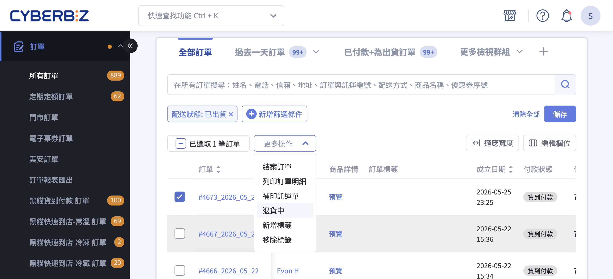
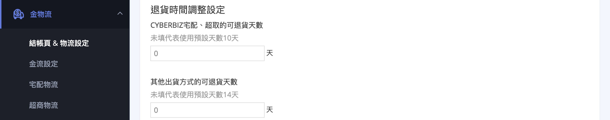
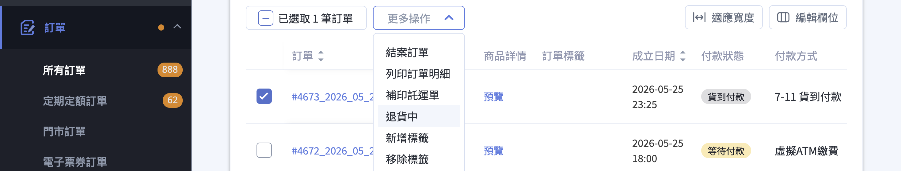
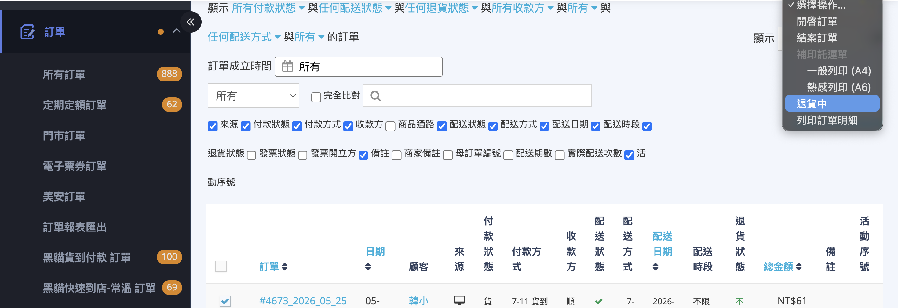
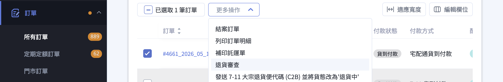

訂單超過退貨期限時，商家可從後台手動發起退貨流程。
{ .subtitle }

{ .hero-page }

## 處理超過退貨期限訂單說明 { #intro-overdue-returns }

當顧客的訂單已超過系統設定的退貨期限，前台「申請退貨」按鈕將不再顯示，此時必須由商家從後台手動發起退貨流程。本頁說明退貨期限的設定方式，以及超過期限後商家在後台逐步處理退貨的完整
操作。

## 使用前提與限制 { #prerequisites-overdue-returns }

- [x] **後台手動退貨流程**：所有方案皆可使用。
- [x] **退貨時間調整設定**：PLUS版 以上方案才能調整可退貨天數，一般版 維持預設值。詳見 [方案對照表][reference-overdue-returns-plans]{ data-preview }。
- [x] **部分退款**：PLUS版 以上方案才可使用。
- [x] **系統逆物流(黑貓 C2B、宅配通退貨便、7-11 C2B 退貨便)**：需另行申請開通，並非方案內預設功能。

!!! note "退款方式的限制"
    超過一定天數後，部分金流無法自動退刷，須改走人工退款。各金流的可自動退刷期限請見 [自動退刷時效對照表][reference-overdue-returns-refund-deadlines]{ data-preview }。

---

## 操作步驟 { #operate-overdue-returns }

??? info "峰潮串倉商家"
      若該筆訂單由峰潮倉庫履行，下列步驟中的「發起退貨」與「進入退貨審查」會由系統自動串接峰潮倉庫處理：

      - 點擊 **「退貨中」** 時，系統會自動通知峰潮倉庫與物流公司，不需自行聯絡。
      - 當包裹送達峰潮倉庫，訂單狀態會自動更新為 **「退貨審查」**，不需手動操作。
      - 您仍須在最後一步手動執行 **「已退貨」** 完成退款。

      例外情況仍依一般流程操作：**POS 訂單**、**合併出貨訂單**，以及部分串倉商家中 **未由峰潮履行** 的訂單。

### 一、設定前台可退貨天數 { #operate-overdue-returns-set-days }

設定「顧客可在前台自行申請退貨的天數」，超過天數後即只能由商家發起退貨。

1. **進入設定頁**：後台路徑 **「金物流/結帳頁 & 物流設定」** > **「退貨時間調整設定」**。
2. **設定可退貨天數**：依出貨方式分別設定。
    * **CYBERBIZ宅配、超取的可退貨天數**：適用黑貓、超取等串接物流。未填寫時預設為 **10 天**[^1]。
    * **其他出貨方式的可退貨天數**：適用自訂物流。未填寫時預設為 **14 天**[^2]。
3. **儲存**：點擊 **「儲存」** 套用設定。

!!! tip "完全停用顧客自助申請"
    將天數填寫為 **0** 代表完全不開放顧客自行申請退貨，所有退貨皆須由商家從後台發起。

[^1]: 從貨態變更為「已收貨」當日起算。
[^2]: 從貨態變更為「已出貨」當日起算。

---

### 二、後台手動發起退貨 { #operate-overdue-returns-initiate }

當訂單已過退貨期限，顧客無法自行申請時，改由商家在訂單列表頁手動啟動退貨流程。

=== "新版訂單列表"
    1. **找到訂單**：前往 **「訂單」** > **「所有訂單」**，搜尋並勾選該筆訂單。
    2. **更新為退貨中**：於上方點開 **「更多操作」** 下拉選單，選擇 **「退貨中」**。
    3. **同步確認**：訂單的「退貨狀態」會更新為 **「退貨中」**，顧客前台訂單頁也會同步顯示。

    

=== "舊版訂單列表"

    1. **找到訂單**：前往 **「訂單」** > **「所有訂單」**，搜尋並勾選該筆訂單。
    2. **更新為退貨中**：勾選訂單後，頁面右上方會出現 **「選擇操作」** 下拉，選擇 **「退貨中」**。
    3. **同步確認**：訂單的「退貨狀態」會更新為 **「退貨中」**，顧客前台訂單頁也會同步顯示。

    

!!! note "峰潮串倉訂單的自動流程"
      若該筆訂單符合峰潮自動退貨條件[^3]，點擊「退貨中」後系統會改為呼叫峰潮倉庫建立逆物流單，訂單狀態不會立即變更，待倉庫處理完成後同步更新。

  [^3]: 條件為：商店已開通峰潮串倉與預設退貨倉庫功能；若商店為部分串倉，該筆訂單需由峰潮履行；且該訂單非合併出貨、非 POS 訂單。

---

### 三、收回退貨商品 { #operate-overdue-returns-receive-goods }

請依現場狀況選擇下列任一種方式收回商品，本步驟與系統操作無關，屬於商家與顧客之間的協調作業。

| 收貨方式 | 適用情境 | 備註 |
| :-- | :-- | :-- |
| 系統逆物流 | 已開通黑貓 C2B、宅配通退貨便、7-11 C2B 退貨便等服務 | 透過後台建立逆物流單寄回 |
| 自行派車 | 商家自行聯絡物流上門取貨 | 系統無單據，需自行記錄 |
| 顧客自行寄回 | 顧客寄回至商家指定地址 | 系統無單據，需自行記錄 |

!!! info "峰潮串倉訂單"
      符合峰潮自動退貨條件的訂單，本步驟由系統自動建立逆物流並通知物流公司，商家不需自行處理收貨方式。商品將由物流公司寄回峰潮倉庫。

---

### 四、進入退貨審查 { #operate-overdue-returns-review }

確認已收到商品並完成檢查後，將訂單推進至 **「退貨審查」** 狀態，代表進入確認退款金額與品項的階段。

1. **取得商品**：依步驟三方式收回商品並完成檢查。
2. **更新狀態**：於訂單列表勾選該筆訂單，從 **「更多操作」** 下拉選擇 **「退貨審查」**。

!!! note "系統自動推進的情況"
    * **峰潮串倉訂單**：當包裹送達峰潮倉庫，系統會自動將狀態更新為 **「退貨審查」** 並寫入訂單歷史紀錄，無需手動操作。
    * **其他系統串接逆物流**：若使用後台串接的逆物流收貨，系統可能依物流商回拋的事件自動更新狀態。實際自動化範圍依逆物流商而異，如未自動更新請手動操作。

---

### 五、執行退款 { #operate-overdue-returns-refund }

依退款範圍選擇 **全額退款** 或 **部分退款**。本步驟峰潮商家與一般商家相同，皆須手動執行。

=== "全額退款"
    1. **發起退款**：於訂單列表勾選該筆訂單，從 **「更多操作」** 下拉選擇 **「已退貨」**。
    2. **判斷退款方式**：系統會依該筆訂單的付款金流與付款日期，自動判斷可否走自動退刷。詳見 [自動退刷時效對照表][reference-overdue-returns-refund-deadlines]{ data-preview }。
        * **可自動退刷**：系統直接向金流商發起退刷，顧客將於各金流的作業時間後收到退款。
        * **須人工退款**：畫面會彈出視窗，需要填寫顧客提供的銀行帳戶資訊。
    3. **填寫銀行資訊(僅人工退款)**：於彈出視窗填寫 **戶名**、**銀行**、**分行**、**銀行帳號**，完成後送出。

=== "部分退款"
    1. **進入訂單詳情**：點擊訂單編號進入詳情頁。
    2. **找到部分退款區塊**：於訂單詳情頁找到「部分退款」區塊。
    3. **輸入退款內容**：勾選欲退款的品項，並輸入退款金額。
    4. **確認退款**：點擊 **「確認退款」** 完成。

!!! plan "部分退款方案限制"
    部分退款功能僅 PLUS版 以上方案內建。一般版 若需此功能請洽 CYBERBIZ 客服。

## 重要規範與限制 { #specs-overdue-returns }

### 自動退刷的天數限制 { #specs-overdue-returns-refund-window }

訂單付款後若超過該金流商允許的自動退刷期限，系統將無法直接退刷，須改走人工退款流程。完整對照請見 [自動退刷時效對照表](references/自動退刷時效對照表.md)。

---

### 人工退款的後續處理 { #specs-overdue-returns-manual-refund }

人工退款須由商家提供顧客銀行帳戶資訊，並由 CYBERBIZ 代為匯款。實際到帳時間、是否收取帳務處理費，以及單筆費用，皆依當時的契約條款為準，請洽 CYBERBIZ 客服確認最新規定。

---

### 行銷獎勵的處理 { #specs-overdue-returns-rewards }

訂單退貨對紅利點數、優惠券、分潤的影響，依商店設定與訂單狀態而異，建議在執行退款前先確認以下事項，必要時請洽 CYBERBIZ 客服：

- 該訂單已發送的紅利點數、優惠券是否需要調整。
- 若該訂單涉及分潤計算，退貨是否需要連帶處理。

## 後續操作

- :lucide-package-check:{ .lg }  
  [__操作超商退貨便 C2B__](操作超商退貨便 C2B.md){ data-preview }  
  設定 7-11 C2B 退貨便逆物流服務，讓顧客可至超商門市寄回退貨商品。

- :lucide-credit-card:{ .lg }  
  [__訂單退款流程__](訂單退款流程.md){ data-preview }  
  了解訂單退款的完整流程，包含自動退刷與人工退款的判斷方式與操作步驟。

## 常見問題 { #faq-overdue-returns }

??? quote "顧客超過退貨期限，前台還是看得到「申請退貨」按鈕？"
    { #faq-overdue-returns-button-still-visible }
     請確認 **「退貨時間調整設定」** 的天數是否符合預期，並確認該筆訂單的貨態是否已進入起算的狀態(系統物流從「已收貨」起算、自訂物流從「已出貨」起算)。若仍有問題，請洽 CYBERBIZ 客服。

??? quote "訂單還在「準備出貨」階段就想取消，需要走退貨流程嗎？"
    { #faq-overdue-returns-cancel-before-shipped }
    不需要。若訂單尚未出貨，可先將出貨狀態調整為 **「未出貨」** 再進行取消，不必走退貨流程。

??? quote "操作「已退貨」後，系統說無法自動退刷怎麼辦？"
    { #faq-overdue-returns-cannot-auto-refund }
    代表此筆訂單已超過該金流商允許的自動退刷天數，須走人工退款。請在彈出視窗中填寫顧客提供的銀行帳戶資訊，後續由 CYBERBIZ 代為匯款。

??? quote "可以對同一筆訂單分多次部分退款嗎?"
    { #faq-overdue-returns-multiple-partial-refunds }
    可以。於訂單詳情頁的「部分退款」區塊，每次勾選欲退款的品項與金額後確認即可。

??? quote "我是峰潮串倉商家，點了「退貨中」卻沒看到狀態變更？"
    { #faq-overdue-returns-honeycomb-status-delay }
     若該筆訂單符合峰潮自動退貨條件，點擊「退貨中」時系統會先呼叫峰潮倉庫建立逆物流單，訂單狀態不會立即變更，需待倉庫處理完成後同步。請稍候並重新整理頁面查看，若長時間未更新請洽 CYBERBIZ 客服。

??? quote "部分串倉的商家，自出訂單也會走自動流程嗎？"
    { #faq-overdue-returns-honeycomb-partial }
    不會。系統會逐筆判斷，只有由峰潮履行的訂單才走自動流程，其他自出訂單仍須依一般步驟手動操作。

??? quote "退貨天數填寫 0 會怎樣？"
    { #faq-overdue-returns-set-to-zero }

    將天數填寫為 **0** 代表完全不開放顧客自行申請退貨，所有退貨皆須由商家從後台手動發起。

??? quote "系統物流和自訂物流的退貨天數起算日有什麼不同？"
    { #faq-overdue-returns-calculation-diff }

    - **CYBERBIZ 宅配、超取**：從貨態變更為「已收貨」當日起算。
    - **其他出貨方式（自訂物流）**：從貨態變更為「已出貨」當日起算。

---

## 參考資料 { #reference-overdue-returns }

- [自動退刷時效對照表](references/overdue-returns-refund-deadlines.md)
- [方案功能對照表](references/overdue-returns-plans.md)

