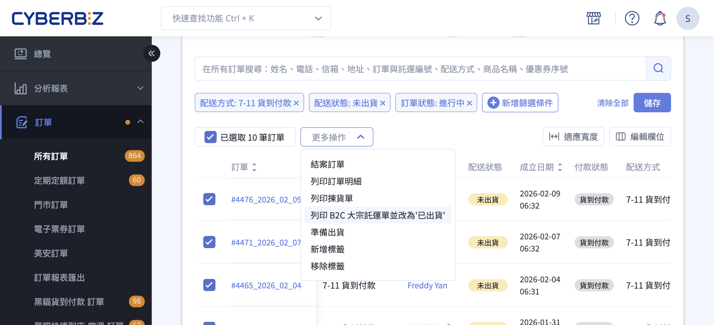
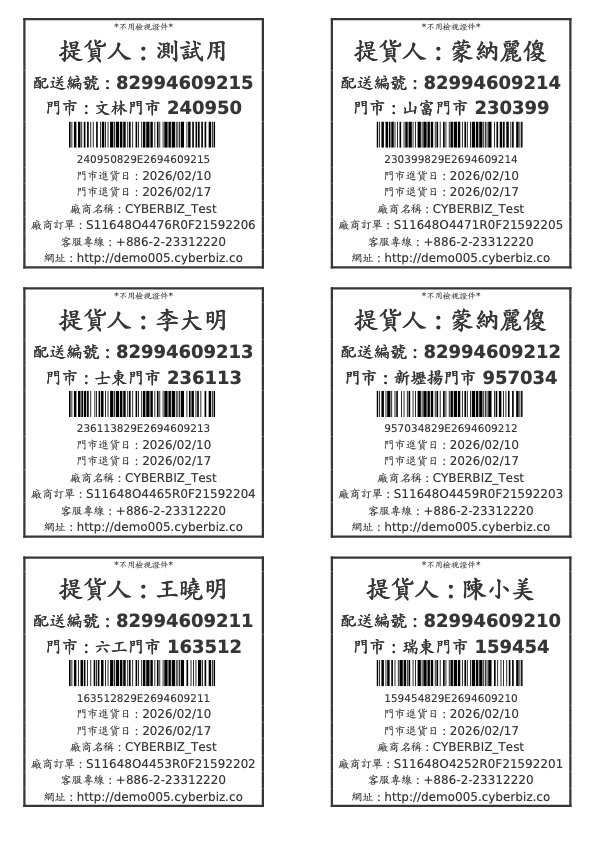
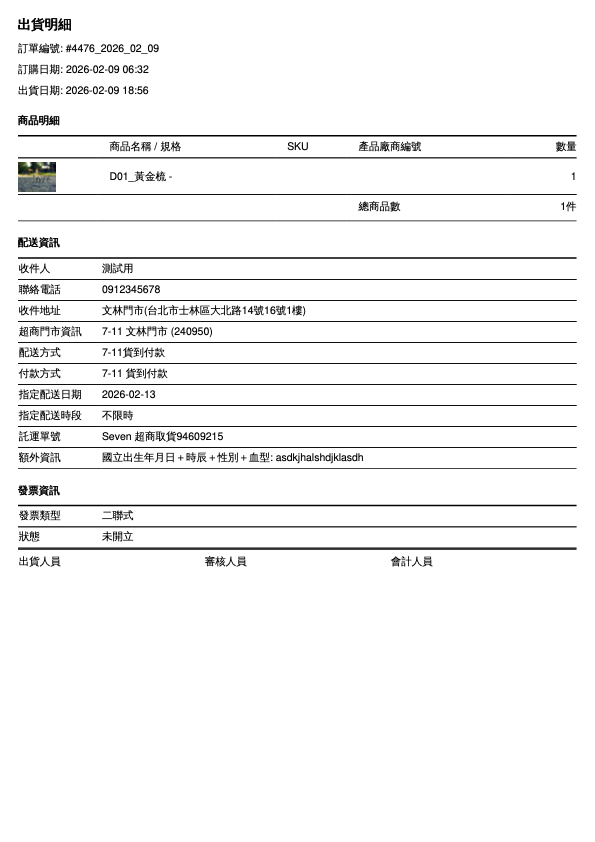
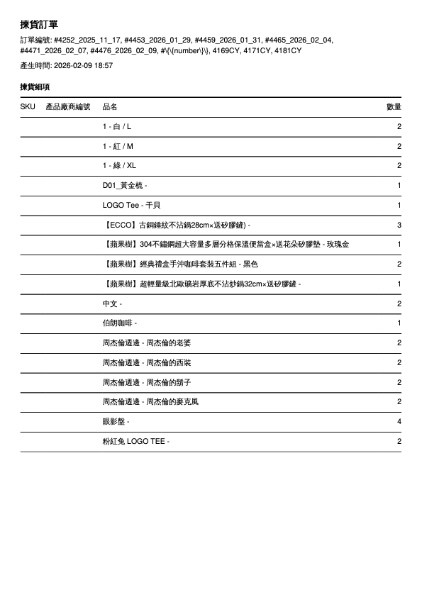
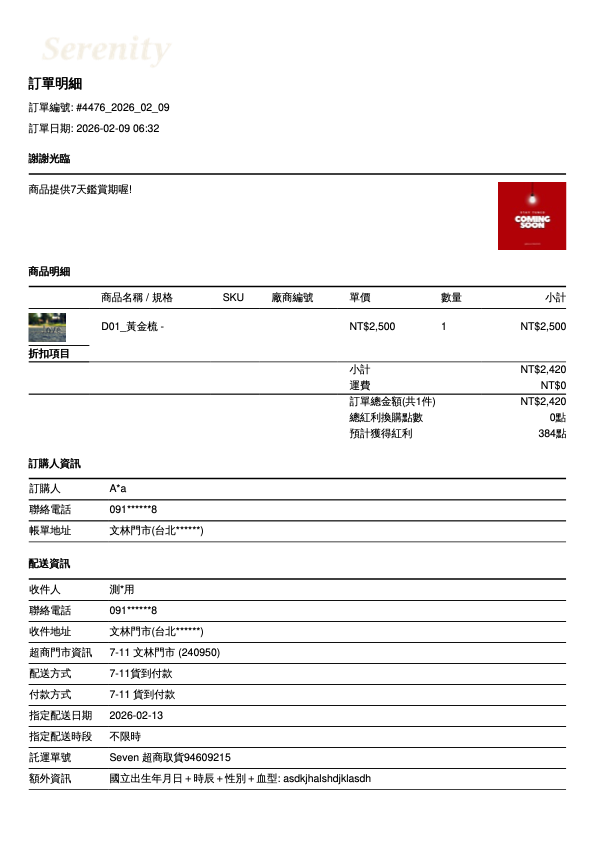

# 訂單出貨流程

{ .hero-page }

{ .subtitle }

## 訂單出貨流程說明

訂單出貨流程分為「[單筆訂單處理](#單筆訂單出貨流程)」與「[多筆訂單批次處理](#批次訂單出貨流程)」，商家可依據物流方式（如[宅配](#宅配物流)、[超商](#超商取貨)或[自訂物流](#自訂物流)）進行操作。

### 訂單出貨流程總覽

<!---

### 訂單處理與出貨流程

#### 宅配訂單出貨流程

1. 聯繫與整備

	- **聯繫站所：** 請致電在地配送站所（[黑貓宅急便](https://www.t-cat.com.tw/) / [台灣宅配通](https://www.e-can.com.tw/)）。
    
	- **申請三模單：** 告知客服人員您的 **「宅配客代編號」**，要求提供 **電腦列印專用三模單**。
    
    > **注意：** 嚴禁使用手寫託運單。客代編號請參閱系統產出之託運單明細。
    
2. 系統儲值與發票設定

	- **帳戶儲值：** 
		- **一般版商家**：須先於後台「儲值中心」存入 CYBER 幣，系統產單時會扣除預估運費。
		- **PLUS版 / 企業版 商家**：無須預先儲值，系統會於每期對帳單中收取該期使用的費用。
	- **發票設定：** 若需開立公司統編，請務必於儲值前完成設定。
    > **路徑：** `帳號與方案` > `帳號設定` > `發票類型` > `會員載具 (公司)`。
        
3. 執行出貨

	- **單據列印：** 於系統後台勾選訂單，列印託運單並黏貼於包裹外箱。
    
	- **預約取件：** 聯繫站所預約司機取件（每日截止時間依各站所規定為準）。

#### 超取出貨流程

1. **資金整備：** 於系統後台完成 **CYBER 幣** 儲值。 
2. **單據列印：** 產生並列印 **C2C 託運單**。 
3. **門市寄件：** 將託運單黏貼於包裹後，至指定便利商店辦理寄貨。 
> _建議使用：_ 系統提供專用標籤貼紙，可提升列印速度與黏貼品質。

### 注意事項與貨態辨識

- **託運單時效：** 託運單產出後應儘速寄出，通常建議於 **5 日內** 完成，若超過 14 日未使用單號將會失效。

- **物流提示文字：** 訂單更改為「已出貨」後，系統會根據物流商回傳的進度，在訂單明細顯示補充文字：

	- **已出貨 (待物流收件)：** 已印單但物流尚未攬收或未回傳貨態。
	- **已出貨 (配送中)：** 物流商已收到包裹並正式進入配送階段。

- **不可修改資訊：** 一旦訂單狀態更改為「已出貨」，系統將**無法修改收貨地址與聯絡資訊**。

- **補印與加印：** 若託運單檔案遺失，可於產出後 **5 日內** 操作「補印」；若一箱裝不下需分兩箱寄送，則需使用「加印」功能。

-->

## 出貨前置準備

- [x] **設備與資材：** 準備雷射印表機、A4 紙或物流專用標籤貼紙（如黑貓三模單）、出貨紙箱及封箱膠帶。

- [x] **費用確認：** 

	- **一般版 商家：** 需預先於後台「儲值中心」存入 CYBER 幣，系統在產出託運單時會預扣運費。

	- **PLUS版 / 企業版 商家：** 無須預先儲值，系統會於每期對帳單中收取該期使用的 CYBER 幣。

- [x] **後台資訊**：務必先至「管理中心」>「一般設定」填寫完整的「公司物流地址」，否則將導致寄件人資訊不完整而無法產單。

## 單筆訂單出貨流程

適用於訂單量較少或需要處理 **部分出貨** 的情境。

1. **進入訂單：** 前往後台「訂單」>「所有訂單」，點選欲處理的訂單編號進入明細頁。

2. **確認收款：** 檢查付款狀態是否為「已收到款項」或「貨到付款」。

3. **選擇出貨方式：**

	- 在右側出貨欄位勾選欲出貨商品。
	- 商家可選擇「**全部出貨**」或「**部分出貨**」。
	- 選擇物流方式（如黑貓、宅配通或自訂出貨）並設定運費級距。

4. **確認出貨：** 點擊「確認出貨」，系統會自動產生一組託運單號，並跳出壓縮檔下載視窗。

5. **下載文件：** 壓縮檔內含 **託運單、出貨明細、訂單明細及揀貨訂單** 四份 PDF 檔案。

## 批次訂單出貨流程

適用於大量相同配送方式的訂單，可提升作業效率。

1. **篩選訂單：** 先[使用篩選器](訂單管理介面說明#檢視群組篩選器模組){ data-preview }  選取「相同配送方式」且配送狀態為「未出貨」或「準備出貨」的訂單。

2. **勾選與操作：**

	- 勾選欲批次處理的訂單（**建議單次處理不超過 20 筆**，以免取號失敗）。
	- 點選右上方「選擇操作」>「下載 XX 託運單並更改為已出貨」。

3. **確認條件：** 選擇統一的運費計算標準（如宅配尺寸），勾選同意條款後點選確認。

4. **產出壓縮檔：** 系統會合併所有選中訂單的託運單與清單，產出單一壓縮檔供下載列印。

## 訂單出貨壓縮檔說明

當商家執行「出貨」動作後，系統將自動產生一個包含所有必要作業文件的壓縮檔（.zip），內含：

- **託運單**：黏貼於包裹外箱。支援超商或宅配通路，供收貨與物流人員掃描條碼。

	??? note "托運單範例"
		
		=== "B2C 托運單"
			
		=== "C2C 托運單"
		=== "宅配托運單"
        
- **出貨明細**：放置於包裹內部。供收件人核對購買品項與數量。

	??? note "出貨明細範例"
		
		
- **揀貨單**：倉庫作業使用。彙整所有訂單之商品需求，方便出貨人員一次性集中揀取所需商品。

	??? note "揀貨單範例"
		

- **訂單明細**：行政備查。記錄該筆交易的完整原始資訊，包含金額與顧客備註。

	??? note "訂單明細範例"
		

## 各類物流寄件方式說明

### 宅配物流（黑貓、宅配通、新竹物流）

- 下載託運單後，需自行聯繫物流商預約取件（如黑貓 02-412-8888）。

- 使用新版訂單列表時，部分物流支援勾選「**自動呼叫司機**」功能。

-   :lucide-cat:{ .lg .middle } __黑貓__

    ---

    - [__黑貓宅配__]() 
    - [__黑貓快速到店__]()

-   :lucide-bird:{ .lg .middle } __宅配通__

    ---

    - [____]
    - [____]
    
-   :lucide-zap:{ .lg } __新竹物流__

	---

	- []
	- []

-   :lucide-box:{ .lg } __順豐__

	---

	- []
	- []

### 超商取貨

- **超商取貨 (C2C 店到店)**：商家將包裹貼上託運單後，於 **5 日內** 送至鄰近超商門市交寄，，或持代碼至門市機台（ibon/FamiPort）列印並交寄。

- **超商取貨 (B2C 大宗寄倉)**：商家需自行聯繫貨運，將整箱貨件送至超商指定的「物流中心」（如 7-11 的大智通、全家的日翊）。

- :lucide-store:{ .lg }   
  [__超商取貨 (C2C 店到店)__](操作超商店到店 C2C 出貨.md){ data-preview }       
  匯入編輯過的商品 Excel 檔案，同步更新多筆商品的商品描述與配送相關設定。

- :lucide-factory:{ .lg }  
  [__超商取貨 (B2C 大宗寄倉)__](操作超商大宗寄倉 B2C 出貨.md){ data-preview }  

- :lucide-snowflake:{ .lg }     
  [__全家冷凍店到店__](操作全家冷凍店到店 C2C 出貨.md){ data-preview }    
  設定商品的配送物流條件，限制特定物流方式於結帳流程中的顯示與使用。

### 自訂物流

商家使用非系統串接的貨運。系統僅將狀態改為「已出貨」，不提供託運單下載，商家需 **自行回填快遞單號** 供會員查詢。

---

- **宅配物流：**

	- **預約取件：** 下載託運單後，需自行撥打電話聯絡物流商（黑貓 02-412-8888 / 宅配通 02-6618-1818）到府收貨。
	- **自動呼叫司機：** 若使用黑貓串接物流，可在操作出貨時勾選「自動呼叫黑貓司機取件」，系統會代為通知。
	- **自訂物流：** 商家使用非串接的物流商。系統**僅修改狀態為「已出貨」，不提供託運單下載**，商家需手動回填快遞單號供會員查詢。

## 相關操作

- :lucide-file-clock:{ .lg }   
  [__訂單自動結案__](設定訂單自動結案)     
  設定天數，透過系統批次機制自動將符合條件的訂單更新為已結案。

- :lucide-link:{ .lg }     
  [__付款連結__](提供顧客付款連結)  
  提供訂單尚未付款的顧客，專屬的付款連結完成後續結帳。

## 常見問題