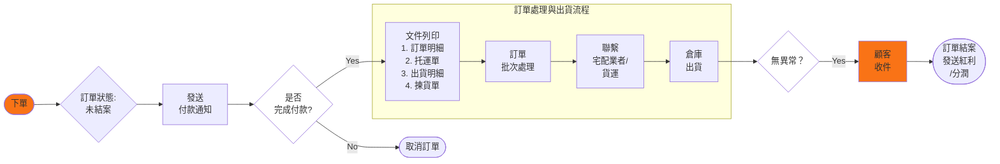
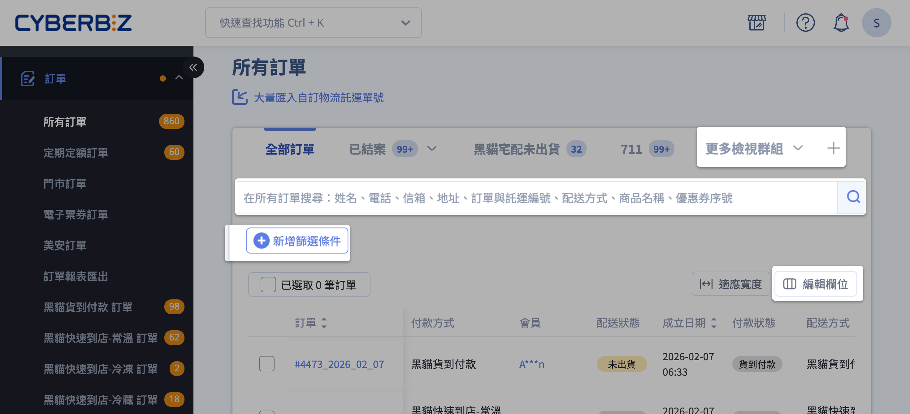

# 訂單出貨流程

{ .hero-page }

{ .subtitle }

## 訂單出貨流程說明

訂單出貨流程分為「[單筆訂單處理](#單筆訂單出貨流程)」與「[多筆訂單批次處理](#批次訂單出貨流程)」，商家可依據物流方式（如[宅配](#宅配物流)、[超商](#超商取貨)或[自訂物流](#自訂物流)）進行操作。

### 訂單出貨流程總覽

<!---

### 訂單處理與出貨流程

#### 宅配訂單出貨流程

1. 聯繫與整備

	- **聯繫站所：** 請致電在地配送站所（[黑貓宅急便](https://www.t-cat.com.tw/) / [台灣宅配通](https://www.e-can.com.tw/)）。
    
	- **申請三模單：** 告知客服人員您的 **「宅配客代編號」**，要求提供 **電腦列印專用三模單**。
    
    > **注意：** 嚴禁使用手寫託運單。客代編號請參閱系統產出之託運單明細。
    
2. 系統儲值與發票設定

	- **帳戶儲值：** 
		- **一般版商家**：須先於後台「儲值中心」存入 CYBER 幣，系統產單時會扣除預估運費。
		- **PLUS版 / 企業版 商家**：無須預先儲值，系統會於每期對帳單中收取該期使用的費用。
	- **發票設定：** 若需開立公司統編，請務必於儲值前完成設定。
    > **路徑：** `帳號與方案` > `帳號設定` > `發票類型` > `會員載具 (公司)`。
        
3. 執行出貨

	- **單據列印：** 於系統後台勾選訂單，列印託運單並黏貼於包裹外箱。
    
	- **預約取件：** 聯繫站所預約司機取件（每日截止時間依各站所規定為準）。

#### 超取出貨流程

1. **資金整備：** 於系統後台完成 **CYBER 幣** 儲值。 
2. **單據列印：** 產生並列印 **C2C 託運單**。 
3. **門市寄件：** 將託運單黏貼於包裹後，至指定便利商店辦理寄貨。 
> _建議使用：_ 系統提供專用標籤貼紙，可提升列印速度與黏貼品質。

### 注意事項與貨態辨識

- **託運單時效：** 託運單產出後應儘速寄出，通常建議於 **5 日內** 完成，若超過 14 日未使用單號將會失效。

- **物流提示文字：** 訂單更改為「已出貨」後，系統會根據物流商回傳的進度，在訂單明細顯示補充文字：

	- **已出貨 (待物流收件)：** 已印單但物流尚未攬收或未回傳貨態。
	- **已出貨 (配送中)：** 物流商已收到包裹並正式進入配送階段。

- **不可修改資訊：** 一旦訂單狀態更改為「已出貨」，系統將**無法修改收貨地址與聯絡資訊**。

- **補印與加印：** 若託運單檔案遺失，可於產出後 **5 日內** 操作「補印」；若一箱裝不下需分兩箱寄送，則需使用「加印」功能。

-->

## 出貨前置準備

- [x] **設備與資材：** 準備雷射印表機、A4 紙或物流專用標籤貼紙（如黑貓三模單）、出貨紙箱及封箱膠帶。

- [x] **費用確認：** 

	- **一般版 商家：** 需預先於後台「儲值中心」存入 CYBER 幣，系統在產出託運單時會預扣運費。

	- **PLUS版 / 企業版 商家：** 無須預先儲值，系統會於每期對帳單中收取該期使用的 CYBER 幣。

- [x] **後台資訊**：務必先至「管理中心」→「一般設定」填寫完整的「公司物流地址」，否則將導致寄件人資訊不完整而無法產單。

## 訂單介面說明

**所有訂單** 頁面是商家管理銷售紀錄、處理出貨作業及追蹤貨態的核心介面。以下為訂單介面的功能說明與教學：

### 訂單列表頁面功能

商家可透過後台左側選單進入：

> :lucide-navigation: 路徑：**訂單 > 所有訂單**。

=== "編輯欄位與排序"
	
	- 點選 **編輯欄位**，自由勾選欲顯示的項目（如：會員、商品詳情、訂單標籤、成立日期、付款方式、配送日期等）。
	- 透過拖曳 :lucide-grip-vertical: 圖示調整先後順序，建立符合使用習慣的清單。

	> :lucide-book-open: 查看[所有編輯欄位選項](references/訂單列表欄位參考表.md){ data-preview }。

	

=== "檢視群組（篩選器模組）"
	
	- 點擊 **新增篩選條件** 可根據訂單、付款、配送、退貨等狀態設定條件。
	
	- 設定後可點擊 **儲存** 成 **檢視群組** 頁籤並命名（例如：「需出貨訂單」或「退貨處理中」），以便日後一鍵切換查看。
	- 點擊檢視群組旁的 :lucide-chevron-down: 可以進行刪除。

	

=== "搜尋與關鍵字"
	
	- 支援透過姓名、電話、信箱、地址、訂單編號、託運單號、商品名稱、配送方式或優惠券序號進行查找。
	- 其中，顧客 Email、託運單號等特定欄位需輸入 **完全一致** 的關鍵字方可搜得。

	> :lucide-book-open: 瞭解 [訂單搜尋規範](references/訂單搜尋欄位規範.md){ data-preview }。  

=== "訂單明細預覽"

	將滑鼠 **懸停** 於訂單編號，即可開啟 **預覽視窗**，快速檢視商品明細與收件人資訊。
	
	
	
=== "顯示筆數"

	點選列表下方的顯示數量選單，可切換單頁呈現的訂單筆數（如：10、25、50、100 筆），系統將依據選擇自動調整分頁。

	

### 單筆訂單明細頁面

點擊列表中的「訂單編號」即可進入訂單明細頁，進行細部操作與資訊查看：

#### 核心操作按鈕

- **列印：** 列印訂單明細資訊。

- **結案訂單：** 將訂單關閉。結案後系統會正式發送紅利點數、使優惠券生效並計算推薦分潤。

- **取消訂單：** 僅限配送狀態為「未出貨」的訂單。取消後系統會自動歸還紅利與優惠券。

- **編輯訂單：** 在訂單尚未出貨前，可修改商品數量或款式。但若您的站台是由 **CYBERBIZ 代開發票，則不支援此編輯功能**。

---

- **核心操作按鈕：**

	- **列印：** 列印訂單明細頁資訊。
	- **結案訂單：** 將訂單關閉。結案後系統會正式發送紅利點數、使優惠券生效並計算推薦分潤。

	- **取消訂單：** 僅限配送狀態為「未出貨」的訂單。取消後系統會自動歸還紅利與優惠券。

	- **編輯訂單：** 在訂單尚未出貨前，可修改商品數量或款式。但若您的站台是由 **CYBERBIZ 代開發票，則不支援此編輯功能**。

- **資訊區塊說明：**

	- **貨款與出貨：** 查看付款狀態（如：等待付款、已收到款項、貨到付款）與配送狀態。若消費者尚未付款，商家可在此複製「付款連結」供其重新付款。

	- **收貨人資訊（聯絡資訊）：** 僅在訂單**「未出貨」**狀態下可以修改收件地址或電話。

	- **訂單對話：** 包含顧客留言、店家管理員留言，以及僅限內部查看的「管理員備註」。

	- **訂單操作紀錄：** 位於頁面最下方，詳細記錄訂單建立、付款完成、商家出貨、物流變動等所有事件的時間點與操作人員，是排查問題的重要參考。

### 批次操作功能

在訂單列表勾選多筆訂單後，可點選**「更多操作」**進行批量處理：

1. **更改訂單/配送狀態：** 例如批次將訂單改為準備出貨，或執行「下載託運單並改為已出貨」。

2. **物流提示文字：** 針對串接物流（黑貓、宅配通等），「已出貨」欄位會顯示補充文字，如**「待物流收件」**或**「配送中」**，讓商家更精確掌握包裹進度。

3. **列印資訊：** 可批次列印訂單明細或揀貨單，協助倉庫作業。

4. **綁定標籤：** 替特定訂單手動增加或移除標籤，以便分類管理。

**四、 注意事項**

- **不可逆性：** 訂單一旦結案或取消，部分狀態將無法再回溯，執行前請務必確認。

- **出貨限制：** 當訂單配送狀態更改為「已出貨」後，系統將無法再修改收貨位置資訊。

- **定期定額訂單：** 若為定期定額訂單，可在列表勾選顯示「母訂單編號」及「配送期數」，方便對照該單為第幾期的子訂單。

---

**所有訂單** 頁面是商家進行訂單管理、貨態追蹤及日常出貨作業的核心介面。

**一、 進入路徑與介面概觀**

- **進入路徑**：進入管理後台，由左側選單點選「**訂單**」→「**所有訂單**」。

- **介面特點**：

	- **編輯欄位**：商家可點選「編輯欄位」彈性選擇欲顯示的項目（如：會員、商品詳情、訂單標籤、成立日期、付款狀態等）並進行**拖曳排序**，建立符合使用習慣的畫面。

	- **檢視群組（篩選器模組）**：可將常用的篩選條件（如：需出貨訂單、退貨處理中）儲存並命名為檢視群組，以便後續一鍵切換查看。

	- **狀態顏色顯示**：系統透過不同顏色標註狀態，幫助商家直觀判讀訂單現況。

**二、 搜尋與篩選功能**

商家可利用多樣化的條件快速定位特定訂單：

- **關鍵字搜尋**：支援搜尋姓名、電話、信箱、地址、訂單編號、託運單編號、配送方式、商品名稱、優惠券序號等。

    - _注意：部分欄位如會員 Email、託運單號需輸入完全一致的關鍵字方可搜到__。_

- **進階篩選**：可依據訂單狀態（進行中、已結案、已取消）、付款狀態（已收到款項、貨到付款）、配送狀態（未出貨、已出貨、已收貨）及退貨狀態進行過濾。

**三、 訂單操作選項**

在列表頁勾選單筆或多筆訂單後，可點選「**更多操作**」進行以下動作：

- **更改訂單狀態**：

    - **結案訂單**：將訂單關閉，系統會自動發送紅利點數並計算分潤。

    - **取消訂單**：僅限「未出貨」訂單，系統會自動歸還該單使用的紅利與優惠券。

- **更改配送狀態**：包含修改為「準備出貨」、「已出貨」，或點選「下載託運單並改為已出貨」以產出託運單。

- **更改退貨狀態**：處理退貨申請、設定為「退貨中」、「退貨審查」或「已退貨」。

- **列印訂單資訊**：批次列印「訂單明細」或「揀貨單」。

- **綁定標籤**：手動替訂單新增或移除標籤，以便分類管理。

**四、 訂單明細與編輯 (進階功能)**

- **查看明細**：點擊「訂單編號」可進入明細頁，查看詳細的商品內容、收件人資訊及**訂單操作紀錄**（包含款項接收與物流變動時間點）。

- **編輯訂單**：在訂單尚未出貨（配送狀態為未出貨或準備出貨）且非「代開發票」之商家，可直接修改商品數量或款式，無須取消重下。

- **再次購買**：提供按鈕讓會員於前台一鍵將舊訂單商品重新加入購物車。

**五、 報表匯出**

商家可透過「**訂單報表匯出**」功能（位於列表頁上方或左側選單），選取特定時間區間與所需欄位（如：商品通路、折扣拆分、UTM 來源等），系統將產出 Excel 檔並寄送至管理者的登入信箱。

**注意事項**

1. **結案後不可逆性**：訂單一旦點選「結案」，所發出的紅利與優惠券、計算的分潤即便後續再取消訂單，系統亦不會自動收回。

2. **出貨限制**：一旦配送狀態更改為「已出貨」，將無法再修改收貨資訊。

3. **退貨期限**：系統設有可申請退貨天數（預設 10-14 天），超過期限需由商家於後台手動操作。

## 單筆訂單出貨流程

適用於訂單量較少或需要處理 **部分出貨** 的情境。

1. **進入訂單：** 前往後台「訂單」→「所有訂單」，點選欲處理的訂單編號進入明細頁。

2. **確認收款：** 檢查付款狀態是否為「已收到款項」或「貨到付款」。

3. **選擇出貨方式：**

	- 在右側出貨欄位勾選欲出貨商品。
	- 商家可選擇「**全部出貨**」或「**部分出貨**」。
	- 選擇物流方式（如黑貓、宅配通或自訂出貨）並設定運費級距。

4. **確認出貨：** 點擊「確認出貨」，系統會自動產生一組託運單號，並跳出壓縮檔下載視窗。

5. **下載文件：** 壓縮檔內含 **託運單、出貨明細、訂單明細及揀貨訂單** 四份 PDF 檔案。

## 批次訂單出貨流程

適用於大量相同配送方式的訂單，可提升作業效率。

1. **篩選訂單：** 先使用篩選器選取「相同配送方式」且配送狀態為「未出貨」或「準備出貨」的訂單。

2. **勾選與操作：**

	- 勾選欲批次處理的訂單（**建議單次處理不超過 20 筆**，以免取號失敗）。
	- 點選右上方「選擇操作」→「下載 XX 託運單並更改為已出貨」。

3. **確認條件：** 選擇統一的運費計算標準（如宅配尺寸），勾選同意條款後點選確認。

4. **產出壓縮檔：** 系統會合併所有選中訂單的託運單與清單，產出單一壓縮檔供下載列印。

## 各類物流寄件方式說明

### 宅配物流（黑貓、宅配通、新竹物流）

    - 下載託運單後，需自行聯繫物流商預約取件（如黑貓 02-412-8888）。

    - 使用新版訂單列表時，部分物流支援勾選「**自動呼叫司機**」功能。

### 超商取貨

	- **超商取貨 (C2C 店到店)**：商家將包裹貼上託運單後，於 **5 日內**送至鄰近超商門市交寄。

	- **超商取貨 (B2C 大宗寄倉)**：商家需自行聯繫貨運，將整箱貨件送至超商指定的「物流中心」（如 7-11 的大智通、全家的日翊）。

### 自訂物流

商家使用非系統串接的貨運。系統僅將狀態改為「已出貨」，不提供託運單下載，商家需**自行回填快遞單號**供會員查詢。

---

- **店到店 (C2C)：** 商家將貼好託運單的包裹送至鄰近超商門市寄件，或持代碼至門市機台（ibon/FamiPort）列印。

- **大宗寄倉 (B2C)：** 商家需自行聯繫貨運（如新竹、黑貓）將貨件集中送往超商的「物流中心」。

- **宅配物流：**

	- **預約取件：** 下載託運單後，需自行撥打電話聯絡物流商（黑貓 02-412-8888 / 宅配通 02-6618-1818）到府收貨。
	- **自動呼叫司機：** 若使用黑貓串接物流，可在操作出貨時勾選「自動呼叫黑貓司機取件」，系統會代為通知。
	- **自訂物流：** 商家使用非串接的物流商。系統**僅修改狀態為「已出貨」，不提供託運單下載**，商家需手動回填快遞單號供會員查詢。

## 相關操作

- :lucide-file-clock:{ .lg }   
  [__訂單自動結案__](設定訂單自動結案)     
  設定天數，透過系統批次機制自動將符合條件的訂單更新為已結案。

- :lucide-link:{ .lg }     
  [__付款連結__](提供顧客付款連結)  
  提供訂單尚未付款的顧客，專屬的付款連結完成後續結帳。

## 常見問題