# 訂單管理介面說明

說明「所有訂單」介面的各項管理功能，協助商家執行從訂單篩選、貨態追蹤到明細編輯的核心營運作業。
{ .subtitle }

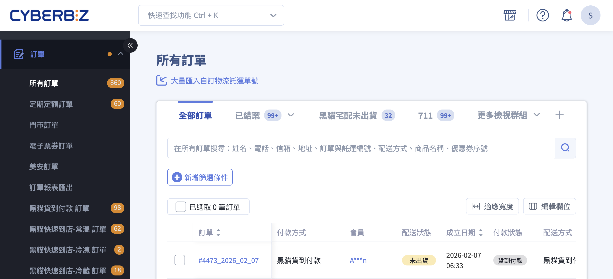{ .hero-page }

## 訂單介面說明

**所有訂單** 頁面是商家管理銷售紀錄、處理出貨作業及追蹤貨態的核心介面。以下為訂單介面的功能說明與教學：

## 注意事項

- **不可逆性：** 訂單一旦結案或取消，部分狀態將無法再回溯，執行前請務必確認。

- **出貨限制：** 當訂單配送狀態更改為「已出貨」後，系統將無法再修改收貨位置資訊。

- **定期定額訂單：** 若為定期定額訂單，可在列表勾選顯示「母訂單編號」及「配送期數」，方便對照該單為第幾期的子訂單。

## 訂單列表頁面功能

> :lucide-navigation: 後台路徑：**訂單 > 所有訂單**。

### 編輯欄位與排序
	
- 點選 **編輯欄位**，自由勾選欲顯示的 [訂單列表欄位項目](references/訂單列表欄位參考表.md){ data-preview }（如：會員、商品詳情、訂單標籤、成立日期、付款方式、配送日期等）。
- 透過拖曳 :lucide-grip-vertical: 圖示調整先後順序，建立符合使用習慣的清單。

??? tip "優化定期購追蹤" 
	若經營定期購業務，建議開啟 `母訂單編號` 與 `配送期數` 欄位，以便在列表中快速掌握子訂單的計畫歸屬。

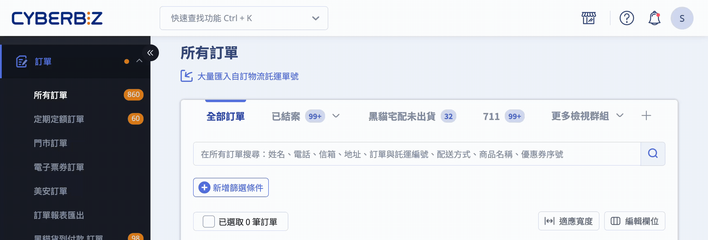

---

### 檢視群組（篩選器模組）

透過「檢視群組」功能，商家可將常用的 [篩選條件](references/訂單篩選條件欄位定義.md){ data-preview }  （如：指定物流、付款或配送狀態）儲存為自定義頁籤，實現一鍵切換，提升批次處理訂單的效率。

#### 操作步驟

1. **設定篩選條件：** 點擊 **新增篩選條件**，根據訂單、付款、配送或退貨狀態勾選所需條件。
    
2. **儲存群組：** 設定完成後，點擊 **儲存** 並命名該群組（如：「需出貨」）。系統將於頁面頂端建立對應的頁籤。
    
3. **管理群組：** 點擊頁籤旁的 :lucide-chevron-down: 圖示，可針對現有群組進行「編輯名稱」或「刪除」。

??? tip "常用篩選設定範例"

    | 檢視群組名稱 | 建議篩選條件設定 |
    | :--- | :--- |
    | **需出貨訂單** | **配送狀態**：`未出貨`、`準備出貨` **付款狀態**：`貨到付款`、`已收到款項` |
    | **指定物流訂單** | **配送方式**：勾選指定物流商（如：黑貓、全家） |
    | **退貨處理中** | **訂單狀態**：`進行中` **退貨狀態**：`退貨申請`、`退貨中`、`退貨審查` |

---

### 搜尋與關鍵字
	
- 支援透過姓名、電話、信箱、地址、訂單編號、託運單號、商品名稱、配送方式或優惠券序號進行查找。
- 其中，顧客 Email、託運單號等特定欄位需輸入 **完全一致** 的關鍵字方可搜得。

> :lucide-book-open: 瞭解 [訂單搜尋規範](references/訂單搜尋欄位規範.md){ data-preview }。  

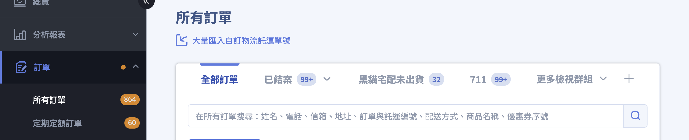

---

### 訂單明細預覽

將滑鼠 **懸停** 於訂單編號，即可開啟 **預覽視窗**，快速檢視商品明細與收件人資訊。

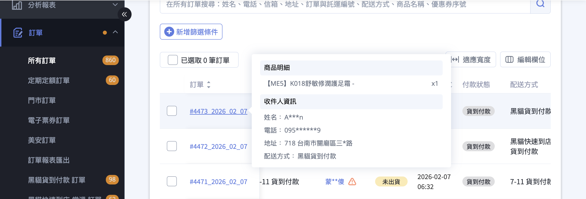

---

### 商品詳情預覽

- **快速預覽：** 在「商品詳情」欄位中，點擊 **預覽** ，即可彈出視窗查看該筆訂單的商品清單。
    
- **連續檢視：** 於預覽視窗內，點擊左、右箭頭按鈕，可直接切換並檢視前後筆訂單的商品內容，無需關閉視窗。

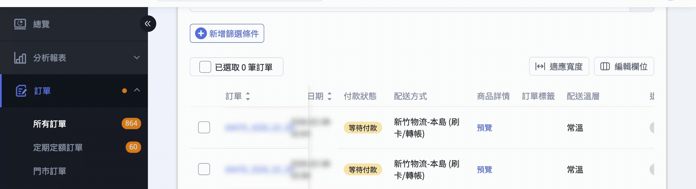

---

### 調整顯示筆數

點選列表下方的顯示數量選單，可切換單頁呈現的訂單筆數（如：10、25、50、100 筆），系統將依據選擇自動調整分頁。

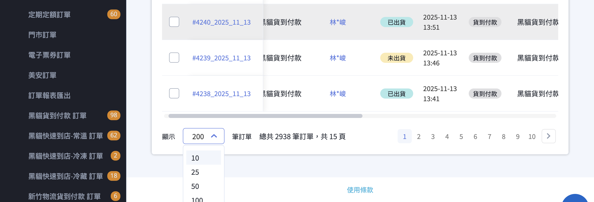

---

## 訂單明細頁面

**「訂單明細頁」** 是處理單筆訂單、查看交易紀錄與聯繫顧客的核心介面。您可以透過後台 **訂單 > 所有訂單** 點擊特定的 **訂單編號** 進入該頁面。以下為訂單明細頁的詳細功能說明與操作教學：

### 核心操作按鈕

位於頁面右上方或顯眼位置，用於變更訂單生命週期：

- **列印：** 列印訂單明細資訊。

- **結案訂單：** 將訂單關閉。結案後系統會正式發送紅利點數、使優惠券生效並計算推薦分潤。

- **取消訂單：** 僅限配送狀態為「未出貨」的訂單。取消後系統會自動歸還紅利與優惠券。

- **編輯訂單：** 在訂單尚未出貨前，可修改商品數量或款式。但若您的站台是由 **CYBERBIZ 代開發票，則不支援此編輯功能**。

<!--
- **重開訂單：** 可將已結案的訂單重新開啟為「進行中」狀態。
-->

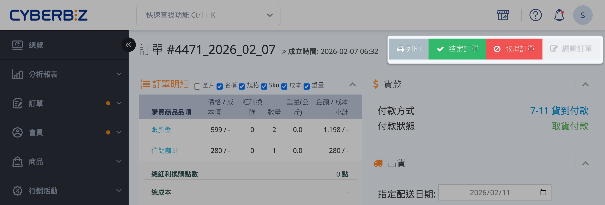

---

### 貨款與出貨管理區塊

- **貨款資訊：** 顯示付款方式與狀態（如：等待付款、已收到款項）。
	
	- 若顧客尚未付款，商家可在此複製[ **「付款連結」** ](提供顧客付款連結.md){ data-preview }  提供給顧客重新支付。
	- 若會員使用 **銀行轉帳** 付款（ 企業版 不支援匯款），當商家確認已收到款項，請按下「確認收款」，將付款狀態變更成已收到款項。

- **出貨操作：**

	- **指定配送日期：** 顧客指定的配送日期，未出貨前可調整預計出貨時間（不適用 串倉 商家）。
	- **指定配送時間：** 顧客指定的配送時間。
	- **配送方式：** 顧客選擇的出貨方式（不可改）。
	- **選擇出貨商品：** 可勾選欲出貨的商品品項（支援 **全部出貨** 或 **部分出貨**）。
	
	- **選擇出貨方式：** 系統串接物流（可直接產單）或自訂出貨方式（需手動回填單號）。
	
	- **物流提示文字：** 針對串接物流，出貨後會顯示「**待物流收件**」或「**配送中**」等細節資訊。詳情請參閱 [物流提示文字說明](出貨狀態物流提示文字說明.md){ data-preview }  

=== "未出貨"

	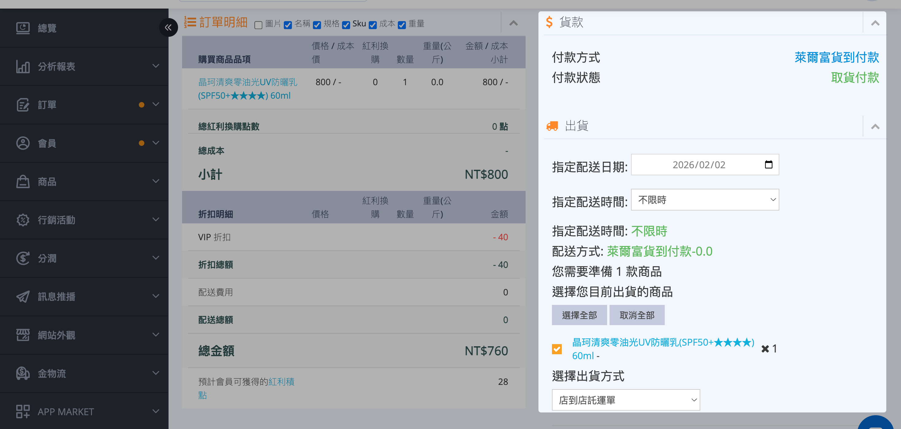

=== "已出貨"

	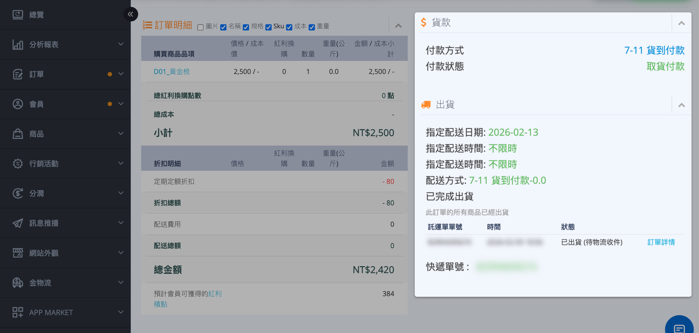

---

### 訂購人與收貨人資訊

- **帳單資訊：** 即訂購人資訊，訂單成立後 **不可修改**。

- **聯絡資訊：** 即收貨人資訊。僅在訂單 **「未出貨」** 狀態下可以編輯姓名、電話與地址。

	- **一般版：** 若為超商取貨，需跳轉至綠界後台修改。
        
	- **企業版：** 若為全家取貨，不支援直接修改，需 **重新下單**。
	
- **發票：** 連接至綠界。

- **個資隱碼：** 若後台開啟了[安全性設定](設定網站安全性.md#會員個資部分隱碼)，列印明細時系統會自動遮蓋會員姓名、手機及地址的部分字元以保護隱私。

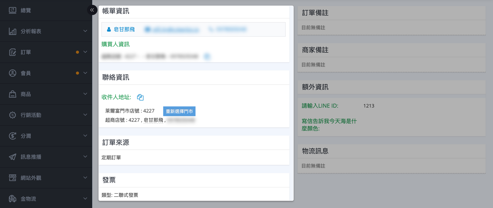

---

### 備註與其他資訊

- **訂單備註：** 這是由 **顧客在結帳頁面填寫的備註資訊** ，用於告知特殊的收貨需求或包裝要求

- **商家備註：** 此處內容 **僅供店家管理員內部紀錄使用，顧客完全看不到**。

- **額外資訊：** 商家在結帳頁面自訂詢問顧客的欄位，用於蒐集特定活動所需的資料，如「贈品款式確認」或「是否需要統編」等。

- **物流訊息：** 物流單位系統訊息。

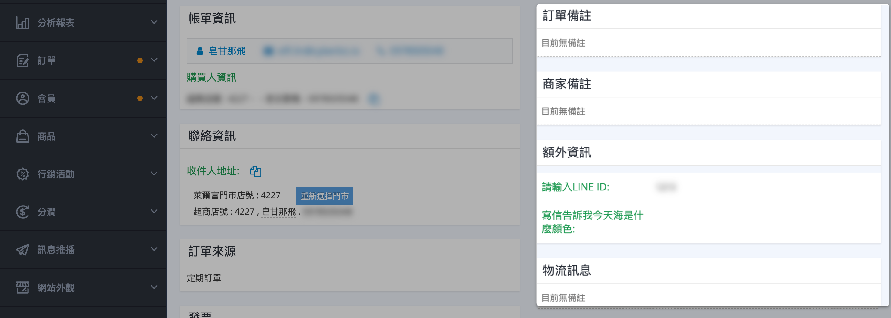

---

### 訂單對話與備註

- **顧客留言：** 顯示顧客從前台「訂單查詢」發起的提問。

- **店家留言：** 商家回覆內容，訊息送出後 **無法收回**。

- **管理員備註（黃底區域）：** 僅限後台管理員查看的備註紀錄，**消費者看不到此處內容**。

- **顧客其他未結案訂單** 該顧客其他尚未結案的訂單，可幫助商家判斷是否出貨。

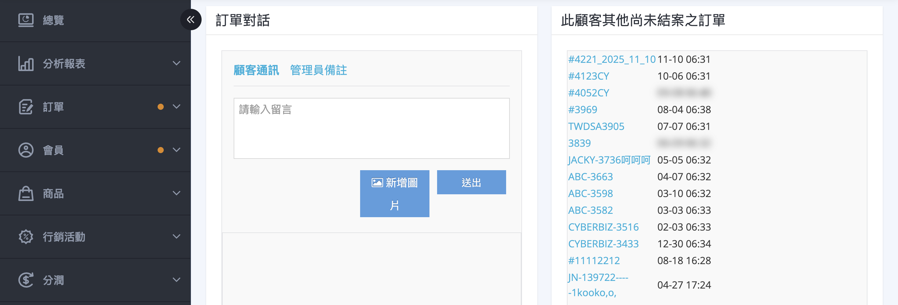

---

### 訂單操作紀錄 (重要歷史紀錄)

位於頁面最下方，是排查訂單問題的最重要工具，詳細記錄以下事件的時間與操作人：

> :lucide-flame: 向客服反應訂單問題時，可截取此區塊圖片以利溝通。

- **訂單創建** 時間。

- **成功接收款項** 的時間與金流反饋。

- **商家點選出貨** 與物流商回傳貨態的時間。

- **訂單結案或取消** 的歷史。

- 若有 **退貨申請**， 點擊操作紀錄中的「顧客申請退貨」字樣，可查看會員申請退貨的具體品項與數量。

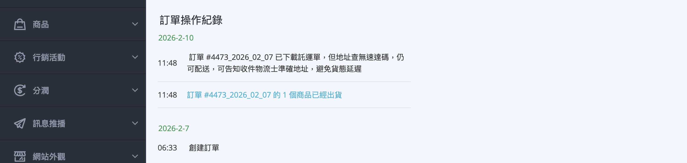

### 退貨審查區塊 (特定狀態下出現)

當訂單進入「退貨審查」狀態後，明細頁會出現 **「部分退款」** 欄位。商家可在此勾選要退貨的商品、輸入退款金額，並點擊「確認退款」來完成流程。

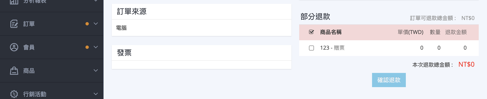

## 批次操作功能

在訂單列表勾選多筆訂單後，可透過 **「更多操作」** 選單進行批次處理（各項功能定義請參考 [訂單列表操作功能說明](references/訂單列表操作功能說明.md){ data-preview }）。

- **更改訂單/狀態：** 批次變更訂單、配送或退貨狀態。例如將訂單轉為「準備出貨」，或執行「下載託運單並改為已出貨」。
    
- **列印文件：** 批量產出訂單明細或揀貨單，提升倉庫揀貨與打包效率。
    
- **管理標籤：** 為選定訂單批次增加或移除自定義標籤。
    
    > :lucide-flame: 可搭配「[檢視群組](#檢視群組篩選器模組)」功能，將篩選出的特定客群或異常訂單一鍵「綁定標籤」進行分類標記。

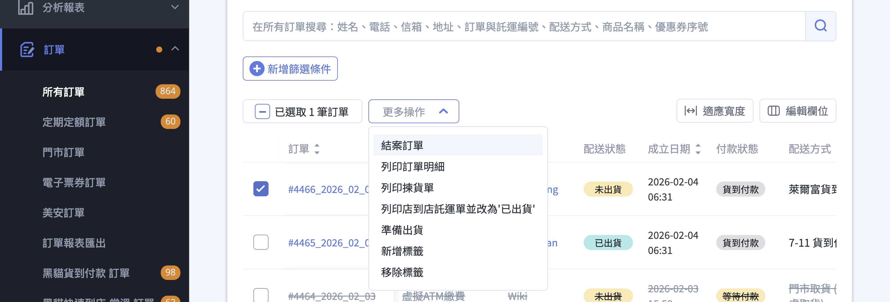

## 相關操作

- :lucide-settings-2:{ .lg }   
  [__結帳頁與物流設定__](結帳頁與物流設定說明)     
  。

- :lucide-ban:{ .lg }     
  [____]()  
  。

## 常見問題

??? quote "為什麼我無法點擊「編輯訂單」來修改商品品項" 
	有兩種主要原因： 
	
	1. **發票開立限制：** 若您的商店是由 CYBERBIZ 代開發票，為了確保發票金額與訂單內容完全一致，系統會鎖定編輯功能。 
	2. **配送狀態：** 若訂單已進入「準備出貨」或「已出貨」狀態，則無法再修改商品內容。 
	
	**建議做法：** 若需更動內容，請取消原訂單並請顧客重新下單，或聯繫客服確認手動調整的可能性。

??? quote "已經結案的訂單可以退貨嗎" 
	可以。結案僅代表交易完成與點數發送，不影響退貨流程。若顧客在鑑賞期內提出需求，商家仍可於後台該筆訂單發起「退貨流程」。請注意，退貨完成後，系統會自動扣回該筆訂單產生的紅利點數。

??? quote "為什麼在搜尋框輸入顧客 Email 或託運單號卻找不到訂單" 
	這通常是因為「比對方式」的限制。為了系統效能與精準度： 
	
	- **Email、收件人地址、託運單號：** 必須輸入 **完整且完全一致** 的資訊（包含大小寫）。 
	- **姓名、訂單編號：** 則支援模糊搜尋（輸入部分文字即可）。 建議您確認關鍵字後方是否有不小心多複製到的「空格」。

??? quote "「商家備註」與「顧客留言」有什麼差別？" 
	
	- **商家備註：** 位於訂單明細中間，僅供內部人員紀錄（如：已電話確認款式），**顧客完全看不到**。 
	- **店家留言：** 位於頁面下方的對話區，發送後會同步顯示在顧客前台的「訂單查詢」中，**顧客會收到通知並看見內容**。