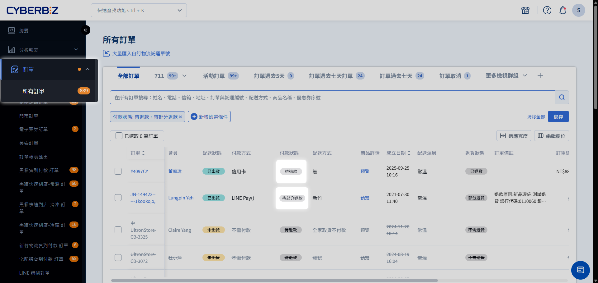
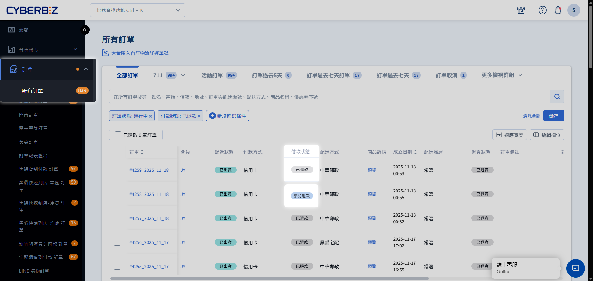
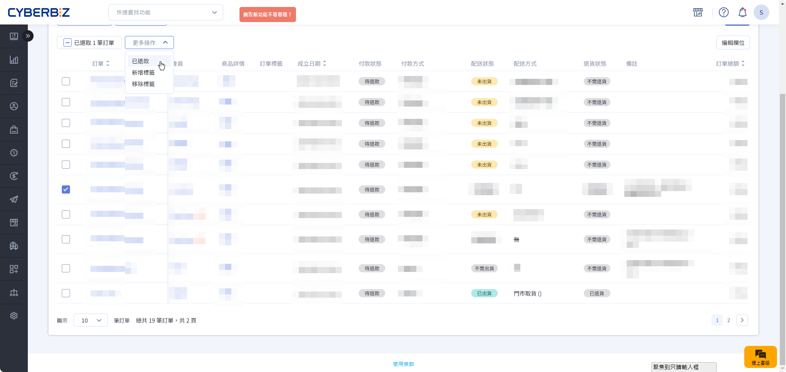

# 訂單退款流程

當訂單完成退貨流程後，最終步驟即是將款項退還給消費者。系統會依據您的金流服務（是否啟用 CYBERBIZ PAYMENTS）與消費者的支付方式，自動或手動觸發退款流程。
{ .subtitle }

{ .hero-page }

!!! info "退款核心規則"
    - **次數限制**：每筆訂單僅接受 **一次** 退款申請。
    - **金流時限**：
        - **綠界信用卡**：當日付款之訂單無法立即退款，需 **隔日** 系統結算後方可操作。
        - **LINE Pay**：付款超過 **60 天** 後，無法透過金流平台處理，需由商家自行匯款。
        - **街口支付**：付款超過 **180 天** 後，無法透過金流平台處理，需由商家自行匯款。
    - **發票處理**：
        - **CYBERBIZ 代開**：當退款完成後，系統會自動產生發票折讓單。
        - **其他（綠界/星益欣）**：依退款日期，當月 5 號前執行發票 **作廢** ，5 號後執行發票 **折讓**。

## 步驟 1：判定退款方式

退款方式取決於您的站台是否啟用 **CYBERBIZ PAYMENTS**。

=== "啟用 CYBERBIZ PAYMENTS"

    系統將依據支付工具，決定採取 **系統自動退款** 或 **系統人工退款**：

    | 支付方式 | 系統自動退款 | 系統人工退款 | 備註 |
    | ------- | ----------- | ----------- | -----|
    | **信用卡** | ✓ | 付款超過 180 天時 | |
    | **Apple Pay / Google Pay / 銀聯卡** | ✓ | ✕ | |
    | **AFTEE** | ✓ | ✕ | 自動刷退至AFTEE帳戶 |
    | **虛擬 ATM / 超商代碼 / 貨到付款** | ✕ | ✓ | 若會員並未提供帳戶資訊，需先行向會員索取 |
    | **LINE Pay** | ✓ | ✕ | 付款超過 **60 天** 後，需由商家 **自行匯款** |
    | **PayPal** | ✓ | 付款超過 180 天時 | |
    | **街口支付** | ✓ | ✕ | 付款超過 **180 天** 後，需由商家 **自行匯款**  街口聯名卡：直接刷退 銀行帳戶扣款：退至街口帳戶 | 
    | **紅陽支付** | ✓ | ✕ |  |

=== "未啟用 CYBERBIZ PAYMENTS"

    訂單退款全數由 **商家自行處理**，請依訂單的支付方式，前往 **金流商後台** 退款或 **自行匯款**：

    | 支付方式 | 金流商後台 | 自行匯款 | 備註 |
    | ------- | ---------- | ------- | --- |
    | **信用卡/Apple Pay / Google Pay / 銀聯卡 / AFTEE** | ✓ | ✕ | |
    | **虛擬 ATM / 超商代碼 / 貨到付款** | ✕ | ✓ | 
    | **LINE Pay** | ✓ | 付款超過 60 天時 | |
    | **PayPal** | ✓ | ✕ |  |
    | **街口支付** | ✓ | 付款超過 180 天時 | | 
    | **紅陽支付** | ✓ | ✕ |  |

## 步驟 2：操作退款步驟

系統會在確認退貨完成後，隨即進入退款流程。請您依照該筆訂單的退款方式，遵循後續指示逐步完成退款作業。

=== "系統自動退款"

    1. 商家將訂單 `退貨狀態` 改為 **已退貨** 或 **部分退貨**。
    2. 系統自動將 `付款狀態` 更新為 **待退款** 或 **待部分退貨**。
        
    3. 系統即刻觸發金流退刷請求。
    4. 退刷成功後，`付款狀態`自動更新為 **已退款** 或 **已部分退款**。
        
    

=== "系統人工退款"

    1. 商家將訂單 `退貨狀態` 改為 **已退貨** 或 **部分退貨**。
    2. 系統自動將 `付款狀態` 更新為 **待退款** 或 **待部分退貨**。
        
    3. 商家需確認會員已提供正確的銀行帳戶資料（可在退貨審查時填入）。
    4. CYBERBIZ 財務團隊將於 **7 個工作日** 內完成撥款。
    5. 撥款完成後，`付款狀態`自動更新為 **已退款** 或 **已部分退款**。
        

    !!! warning "人工退款處理費"
        若選擇由 CYBERBIZ 人工代退，系統將索取每筆 **30 元** 的帳務處理費。

=== "金流商後台"

    1. 商家將訂單 `退貨狀態` 改為 **已退貨** 或 **部分退貨**。
    2. 系統自動將 `付款狀態` 更新為 **待退款** 或 **待部分退貨**。
    2. 前往金流商平台後台完成退款。
    3. 返回後台，勾選該筆訂單。
    4. 點擊右上方 **選擇操作** > 將付款狀態改為 **已退款** 或 **部分退款**。

    

=== "自行匯款"

    1. 商家將訂單 `退貨狀態` 改為 **已退貨** 或 **部分退貨**。
    2. 系統自動將 `付款狀態` 更新為 **待退款** 或 **待部分退貨**。
    2. 商家與消費者聯繫並完成線下匯款。
    3. 返回後台，勾選該筆訂單。
    4. 點擊右上方 **選擇操作** > 將付款狀態改為 **已退款** 或 **部分退款**。

    

## 常見問題

??? quote "為什麼信用卡退款後，消費者說沒收到錢？"
    信用卡退款（退刷）通常需要 **7-14 個工作天** 才會反映在消費者的信用卡帳單上。若剛好跨過帳單結帳日，消費者可能需等下個月帳單才能看到正負抵銷。

??? quote "如果商家金流帳戶餘額不足，會發生什麼事？"
    若綠界或第三方金流帳戶餘額不足以支付退款金額，退款請求將會失敗。此時商家需先至金流商後台儲值餘額，或改用 **商家自行匯款** 並手動更新狀態。

??? quote "退貨時的退款金額如何計算？"
    依退貨類型而定：全部退貨將退還整筆訂單金額；部分退貨則退還商家於 **退貨審查** 時手動填寫的核准金額。

